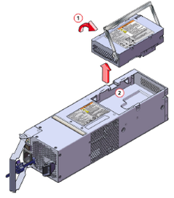

# Replace the backup battery module on your StorSimple device

## Overview
The primary enclosure Power and Cooling Module (PCM) on your Microsoft Azure StorSimple device has an additional battery pack. This pack provides power so that the StorSimple device can save data if there is loss of AC power to the primary enclosure. This battery pack is referred to as the *backup battery module*. The backup battery module exists only for the primary enclosure in your StorSimple device (the EBOD enclosure does not contain a backup battery module).

This tutorial explains how to:

* Remove the backup battery module
* Install a new backup battery module
* Maintain the backup battery module

> [!IMPORTANT]
> Before removing and replacing a backup battery module, review the safety information in the [Introduction to StorSimple hardware component replacement](storsimple-8000-hardware-component-replacement.md).

## Remove the backup battery module
The backup battery module for your StorSimple device is a field-replaceable unit. Before it is installed in the PCM, the battery module should be stored in its original packaging. Perform the following steps to remove the backup battery.

#### To remove the backup battery module
1. In the Azure portal, go to your StorSimple Device Manager service blade. Go to **Devices** and then select your device from the list of devices. Navigate to **Monitor** > **Hardware health**. Under **Shared Components**, look at the status of the battery.
2. Identify the PCM in which the battery has failed. Figure 1 shows the back of the StorSimple device.
   
    
   
    **Figure 1** Back of primary device showing PCM and controller modules
   
   | Label | Description |
   |:--- |:--- |
   | 1 |PCM 0 |
   | 2 |PCM 1 |
   | 3 |Controller 0 |
   | 4 |Controller 1 |
   
    As shown by number 3 in the Figure 2, the monitoring indicator LED on PCM 0 that corresponds to **Battery Fault** should be lit.
   
    
   
    **Figure 2** Back of PCM showing the monitoring indicator LEDs
   
   | Label | Description |
   |:--- |:--- |
   | 1 |AC power failure |
   | 2 |Fan failure |
   | 3 |Battery fault |
   | 4 |PCM OK |
   | 5 |DC power failure |
   | 6 |Battery healthy |
3. To remove the PCM with a failed battery, follow the steps in [Remove a PCM](storsimple-8000-power-cooling-module-replacement.md#remove-a-pcm).
4. With the PCM removed, lift and rotate the battery module handle upward as indicated in the following figure, and pull it up to remove the battery.
   
    
   
    **Figure 3** Removing the battery from the PCM
5. Place the module in the field-replaceable unit packaging.
6. Return the defective unit to Microsoft for proper servicing and handling.

## Install a new backup battery module
Perform the following steps to install the replacement battery module in the PCM in the primary enclosure of your StorSimple device.

#### To install the battery module
1. Place the backup battery module in the proper orientation in the PCM.
2. Press down the battery module handle all the way to seat the connector.
3. Replace the PCM in the primary enclosure by following the guidelines in [Replace a Power and Cooling Module on your StorSimple device](storsimple-8000-power-cooling-module-replacement.md).
4. After the replacement is complete, go to your device and then go to **Monitor** > **Hardware health** in the Azure portal. Verify the status of the battery to make sure that the installation was successful. A green status indicates that the battery is healthy.

## Maintain the backup battery module
In your StorSimple device, the backup battery module provides power to the controller during a power loss event. It allows the StorSimple device to save critical data prior to shutting down in a controlled manner. With two fully charged batteries in the PCMs, the system can handle two consecutive loss events.

In the Azure portal, the **Hardware health** under the **Monitor** blade indicates whether the battery is malfunctioning or the end-of-life is approaching. The battery status is indicated by **Battery in PCM 0** or **Battery in PCM 1** under **Shared Components**. This blade will show a **DEGRADED** state for end-of-life approaching, and **FAILED** for end-of-life reached.

> [!NOTE]
> The battery can report **FAILED** when it simply needs to be charged.

If the **DEGRADED** state appears, we recommend the following course of action:

* The system may have experienced a recent power loss or the batteries may be undergoing periodic maintenance. Observe the system for 12 hours before proceeding.
  
  * If the state is still **DEGRADED** after 12 hours of continuous connection to AC power with the controllers and PCMs running, then the battery needs to be replaced. Please [contact Microsoft Support](storsimple-8000-contact-microsoft-support.md) for a replacement backup battery module.
  * If the state becomes OK after 12 hours, the battery is operational, and it only needed a maintenance charge.
* If there has not been an associated loss of AC power and the PCM is turned on and connected to AC power, the battery needs to be replaced. [Contact Microsoft Support](storsimple-8000-contact-microsoft-support.md) to order a replacement backup battery module.

> [!IMPORTANT]
> Dispose of the failed battery according to national and regional regulations.

## Next steps
Learn more about [StorSimple hardware component replacement](storsimple-8000-hardware-component-replacement.md).

