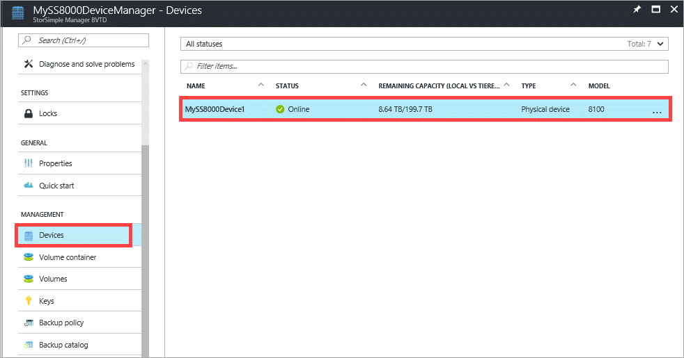
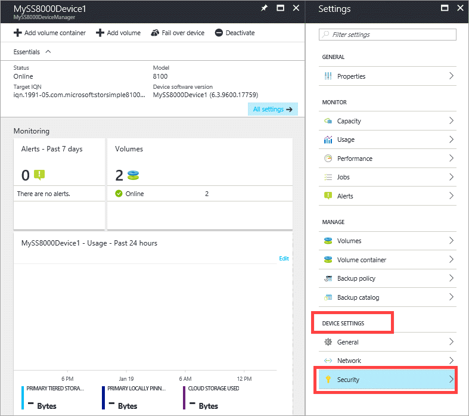
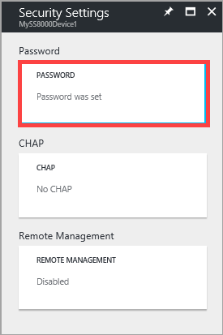
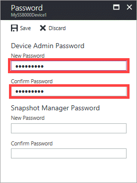
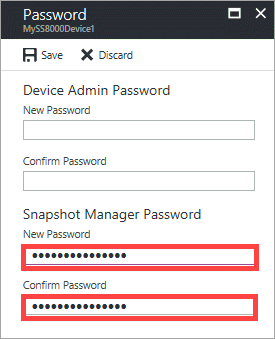

# Use the StorSimple Device Manager service to change your StorSimple passwords

## Overview
The Azure portal **Device settings** option contains all the device parameters that you can reconfigure on a StorSimple device that is managed by a StorSimple Device Manager service. This tutorial explains how you can use the **Security** option under **Device settings** to change your device administrator or StorSimple Snapshot Manager password.

## Change the device administrator password
When you use Windows PowerShell interface to access the StorSimple device, you are required to enter a device administrator password. When the first StorSimple device is registered with a service, the default password for this interface is *Password1*. For the security of your data, you are required to change this password at the end of the registration process. You cannot exit from the registration process without changing this password. For more information, see [Step 3: Configure and register the device through Windows PowerShell for StorSimple](storsimple-8000-deployment-walkthrough-u2.md#step-3-configure-and-register-the-device-through-windows-powershell-for-storsimple).

The password that was first set through the Windows PowerShell interface during registration can be changed later via the Azure portal. Perform the following steps to change the device administrator password.

#### To change the device administrator password
1. Go to your StorSimple Device Manager service and click **Devices**.

2. From the tabular listing of devices, select and click the device whose password you intend to change.

    

3. In the **Settings** blade, go to **Device settings > Security**.

    

4. In the **Security settings** blade, click **Password** to change the device administrator password.

    

5. In the **Password** blade, provide an administrator password that contains from 8 to 15 characters. The password must be a combination of 3 or more of uppercase, lowercase, numeric, and special characters.

6. Confirm the password.

    

7. Click **Save** and when prompted for confirmation, click **Yes**.

    

The device administrator password should now be updated. You can use this modified password to access the Windows PowerShell interface.

## Set the StorSimple Snapshot Manager password
StorSimple Snapshot Manager software resides on your Windows host and allows administrators to manage backups of your StorSimple device in the form of local and cloud snapshots.

When configuring a device in StorSimple Snapshot Manager, you will be prompted to provide the device IP address and password to authenticate your storage device.

You can set or change the password for StorSimple Snapshot Manager via the Azure portal. Perform the following steps to set or change the StorSimple Snapshot Manager password.

#### To set the StorSimple Snapshot Manager password
1. Go to your StorSimple Device Manager service and click **Devices**.

2. From the tabular listing of devices, select and click the device whose StorSimple Snapshot Manager password you intend to set or change.

     

3. In the **Settings** blade, go to **Device settings > Security**.

     

4. In the **Security settings** blade, click **Password** to set or change the StorSimple Snapshot Manager password.

      

5. In the **Password** blade, enter a password that is 14 or 15 characters. Make sure that the password contains a combination of 3 or more of uppercase, lowercase, numeric, and special characters.

6. Confirm the password.

     

7. Click **Save** and when prompted for confirmation, click **Yes**.

     

The StorSimple Snapshot Manager password should now be updated.

## Next steps
* Learn more about [StorSimple security](storsimple-8000-security.md).
* Learn more about [modifying your device configuration](storsimple-8000-modify-device-config.md).
* Learn more about [using the StorSimple Device Manager service to administer your StorSimple device](storsimple-8000-manager-service-administration.md).

