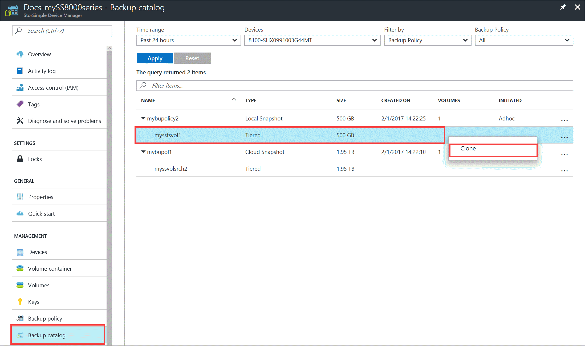
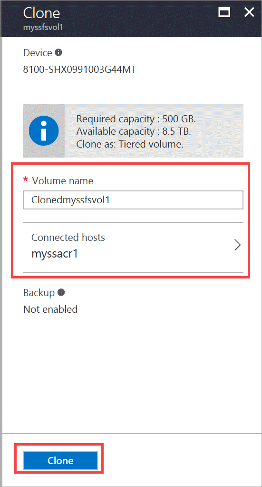
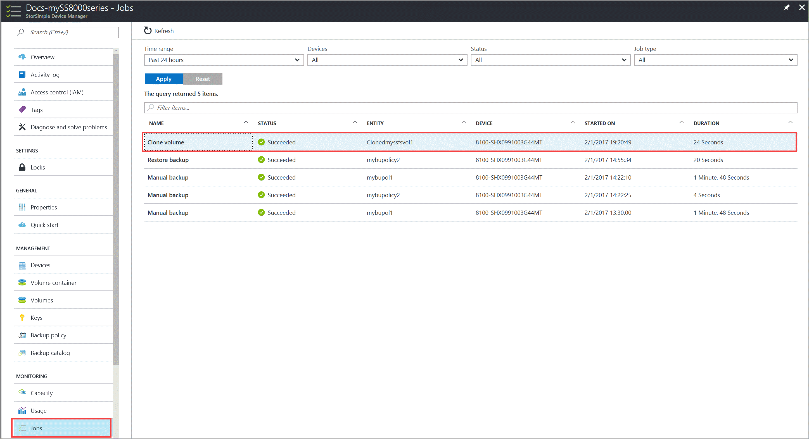
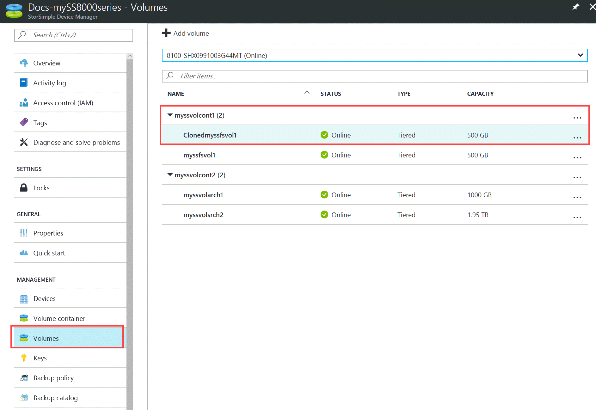

# Use the StorSimple Device Manager service in Azure portal to clone a volume

## Overview

This tutorial describes how you can use a backup set to clone an individual volume via the **Backup catalog** blade. It also explains the difference between *transient* and *permanent* clones. The guidance in this tutorial applies to all the StorSimple 8000 series device running Update 3 or later.

The StorSimple Device Manager service **Backup catalog** blade displays all the backup sets that are created when manual or automated backups are taken. You can then select a volume in a backup set to clone.

 

## Considerations for cloning a volume

Consider the following information when cloning a volume.

- A clone behaves in the same way as a regular volume. Any operation that is possible on a volume is available for the clone.

- Monitoring and default backup are automatically disabled on a cloned volume. You would need to configure a cloned volume for any backups.

- A locally pinned volume is cloned as a tiered volume. If you need the cloned volume to be locally pinned, you can convert the clone to a locally pinned volume after the clone operation is successfully completed. For information about converting a tiered volume to a locally pinned volume, go to [Change the volume type](storsimple-8000-manage-volumes-u2.md#change-the-volume-type).

- If you try to convert a cloned volume from tiered to locally pinned immediately after cloning (when it is still a transient clone), the conversion fails with the following error message:

    `Unable to modify the usage type for volume {0}. This can happen if the volume being modified is a transient clone and hasn’t been made permanent. Take a cloud snapshot of this volume and then retry the modify operation.`

    This error is received only if you are cloning on to a different device. You can successfully convert the volume to locally pinned if you first convert the transient clone to a permanent clone. Take a cloud snapshot of the transient clone to convert it to a permanent clone.

## Create a clone of a volume

You can create a clone on the same device, another device, or even a cloud appliance by using a local or cloud snapshot.

The procedure below describes how to create a clone from the backup catalog.  An alternative method to initiate clone is to go to **Volumes**, select a volume, then right-click to invoke the context menu and select **Clone**.

Perform the following steps to create a clone of your volume from the backup catalog.

#### To clone a volume

1. Go to your StorSimple Device Manager service and then click **Backup catalog**.

2. Select a backup set as follows:
   
   1. Select the appropriate device.
   2. In the drop-down list, choose the volume or backup policy for the backup that you wish to select.
   3. Specify the time range.
   4. Click **Apply** to execute this query.

      The backups associated with the selected volume or backup policy should appear in the list of backup sets.
   
      
     
3. Expand the backup set to view the associated volume and select a volume in a backup set. Right-click and then from the context menu, select **Clone**.

    

3. In the **Clone** blade, do the following steps:
   
   1. Identify a target device. This is the location where the clone will be created. You can choose the same device or specify another device.

      > [!NOTE]
      > Make sure that the capacity required for the clone is lower than the capacity available on the target device.
       
   2. Specify a unique volume name for your clone. The name must contain between 3 and 127 characters.
      
       > [!NOTE]
       > The **Clone Volume As** field will be **Tiered** even if you are cloning a locally pinned volume. You cannot change this setting; however, if you need the cloned volume to be locally pinned as well, you can convert the clone to a locally pinned volume after you successfully create the clone. For information about converting a tiered volume to a locally pinned volume, go to [Change the volume type](storsimple-8000-manage-volumes-u2.md#change-the-volume-type).
          
   3. Under **Connected hosts**, specify an access control record (ACR) for the clone. You can add a new ACR or choose from the existing list. The ACR will determine which hosts can access this clone.
      
        

   4. Click **Clone** to complete the operation.

4. A clone job is initiated and you are notified when the clone is successfully created. Click the job notification or go to **Jobs** blade to monitor the clone job.

    

7. After the clone job is complete, go to your device and then click **Volumes**. In the list of volumes, you should see the clone that was just created in the same volume container that has the source volume.

    

A clone that is created this way is a transient clone. For more information about clone types, see [Transient vs. permanent clones](#transient-vs-permanent-clones).

## Transient vs. permanent clones
Transient clones are created only when you clone to another device. You can clone a specific volume from a backup set to a different device managed by the StorSimple Device Manager. The transient clone has references to the data in the original volume and uses that data to read and write locally on the target device.

After you take a cloud snapshot of a transient clone, the resulting clone is a *permanent* clone. During this process, a copy of the data is created on the cloud and the time to copy this data is determined by the size of the data and the Azure latencies (this is an Azure-to-Azure copy). This process can take days to weeks. The transient clone becomes a permanent clone and doesn’t have any references to the original volume data that it was cloned from.

## Scenarios for transient and permanent clones
The following sections describe example situations in which transient and permanent clones can be used.

### Item-level recovery with a transient clone
You need to recover a one-year-old Microsoft PowerPoint presentation file. Your IT administrator identifies the specific backup from that time, and then filters the volume. The administrator then clones the volume, locates the file that you are looking for, and provides it to you. In this scenario, a transient clone is used.

### Testing in the production environment with a permanent clone
You need to verify a testing bug in the production environment. You create a clone of the volume in the production environment and then take a cloud snapshot of this clone to create an independent cloned volume. In this scenario, a permanent clone is used.

## Next steps
* Learn how to [restore a StorSimple volume from a backup set](storsimple-8000-restore-from-backup-set-u2.md).
* Learn how to [use the StorSimple Device Manager service to administer your StorSimple device](storsimple-8000-manager-service-administration.md).

