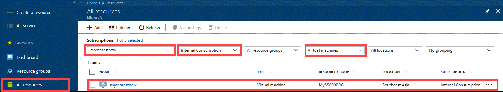
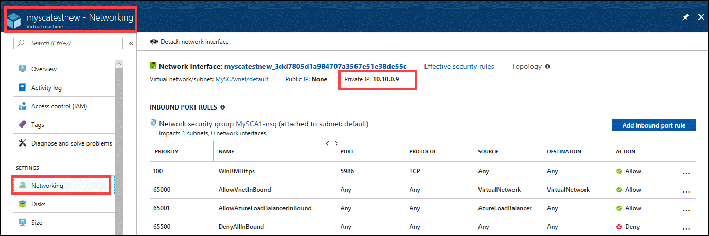

# Deploy and manage a StorSimple Cloud Appliance in Azure (Update 3 and later)

## Overview

The StorSimple 8000 Series Cloud Appliance is an additional capability that comes with your Microsoft Azure StorSimple solution. The StorSimple Cloud Appliance runs on a virtual machine in a Microsoft Azure virtual network, and you can use it to back up and clone data from your hosts.

This article describes the step-by-step process to deploy and manage a StorSimple Cloud Appliance in Azure. After reading this article, you will:

* Understand how the cloud appliance differs from the physical device.
* Be able to create and configure the cloud appliance.
* Connect to the cloud appliance.
* Learn how to work with the cloud appliance.

This tutorial applies to all the StorSimple Cloud Appliances running Update 3 and later.

#### Cloud appliance model comparison

The StorSimple Cloud Appliance is available in two models, a standard 8010 (formerly known as the 1100) and a premium 8020 (introduced in Update 2). The following table presents a comparison of the two models.

| Device model | 80101 | 8020 |
| --- | --- | --- |
| **Maximum capacity** |30 TB |64 TB |
| **Azure VM** |Standard_A3 (4 cores, 7 GB memory)| Standard_DS3 (4 cores, 14 GB memory)|
| **Region availability** |All Azure regions |Azure regions that support Premium Storage and DS3 Azure VMs  Use [this list](https://azure.microsoft.com/regions/services/) to see if both **Virtual Machines > DS-series** and **Storage > Disk storage** are available in your region. |
| **Storage type** |Uses Azure Standard Storage for local disks   Learn how to [create a Standard Storage account](../storage/common/storage-create-storage-account.md) |Uses Azure Premium Storage for local disks2    |
| **Workload guidance** |Item level retrieval of files from backups |Cloud dev and test scenarios   Low latency and higher performance workloads  Secondary device for disaster recovery |

1 *Formerly known as the 1100*.

2 *Both the 8010 and 8020 use Azure Standard Storage for the cloud tier. The difference only exists in the local tier within the device*.

## How the cloud appliance differs from the physical device

The StorSimple Cloud Appliance is a software-only version of StorSimple that runs on a single node in a Microsoft Azure Virtual Machine. The cloud appliance supports disaster recovery scenarios in which your physical device is not available. The cloud appliance is appropriate for use in item-level retrieval from backups, on-premises disaster recovery, and cloud dev and test scenarios.

#### Differences from the physical device

The following table shows some key differences between the StorSimple Cloud Appliance and the StorSimple physical device.

|  | Physical device | Cloud appliance |
| --- | --- | --- |
| **Location** |Resides in the datacenter. |Runs in Azure. |
| **Network interfaces** |Has six network interfaces: DATA 0 through DATA 5. |Has only one network interface: DATA 0. |
| **Registration** |Registered during the initial configuration step. |Registration is a separate task. |
| **Service data encryption key** |Regenerate on the physical device and then update the cloud appliance with the new key. |Cannot regenerate from the cloud appliance. |
| **Supported volume types** |Supports both locally pinned and tiered volumes. |Supports only tiered volumes. |

## Prerequisites for the cloud appliance

The following sections explain the configuration prerequisites for your StorSimple Cloud Appliance. Before you deploy a cloud appliance, review the security considerations for using a cloud appliance.

[!INCLUDE [StorSimple Cloud Appliance security](../../includes/storsimple-8000-cloud-appliance-security.md)]

#### Azure requirements

Before you provision the cloud appliance, you need to make the following preparations in your Azure environment:

* Ensure that you have a StorSimple 8000 series physical device (model 8100 or 8600) deployed and running in your datacenter. Register this device with the same StorSimple Device Manager service that you intend to create a StorSimple Cloud Appliance for.
* For the cloud appliance, [configure a virtual network on Azure](../virtual-network/manage-virtual-network.md#create-a-virtual-network). If using Premium Storage, you must create a virtual network in an Azure region that supports Premium Storage. The Premium Storage regions are regions that correspond to the row for Disk storage in the [list of Azure Services by Region](https://azure.microsoft.com/regions/services/).
* We recommend that you use the default DNS server provided by Azure instead of specifying your own DNS server name. If your DNS server name is not valid or if the DNS server is not able to resolve IP addresses correctly, the creation of the cloud appliance fails.
* Point-to-site and site-to-site are optional, but not required. If you wish, you can configure these options for more advanced scenarios.
* You can create [Azure Virtual Machines](../virtual-machines/virtual-machines-windows-quick-create-portal.md) (host servers) in the virtual network that can use the volumes exposed by the cloud appliance. These servers must meet the following requirements:

  * Be Windows or Linux VMs with iSCSI Initiator software installed.
  * Be running in the same virtual network as the cloud appliance.
  * Be able to connect to the iSCSI target of the cloud appliance through the internal IP address of the cloud appliance.
  * Make sure you have configured support for iSCSI and cloud traffic on the same virtual network.

#### StorSimple requirements

Make the following updates to your StorSimple Device Manager service before you create a cloud appliance:

* Add [access control records](storsimple-8000-manage-acrs.md) for the VMs that are going to be the host servers for your cloud appliance.
* Use a [storage account](storsimple-8000-manage-storage-accounts.md#add-a-storage-account) in the same region as the cloud appliance. Storage accounts in different regions may result in poor performance. You can use a Standard or Premium Storage account with the cloud appliance. More information on how to create a [Standard Storage account](../storage/common/storage-create-storage-account.md).
* Use a different storage account for cloud appliance creation from the one used for your data. Using the same storage account may result in poor performance.

Make sure that you have the following information before you begin:

* Your Azure portal account with access credentials.
* A copy of the service data encryption key from your physical device registered to the StorSimple Device Manager service.

## Create and configure the cloud appliance

Before performing these procedures, make sure that you have met the [Prerequisites for the cloud appliance](#prerequisites-for-the-cloud-appliance).

Perform the following steps to create a StorSimple Cloud Appliance.

### Step 1: Create a cloud appliance

Perform the following steps to create the StorSimple Cloud Appliance.

[!INCLUDE [Create a cloud appliance](../../includes/storsimple-8000-create-cloud-appliance-u2.md)]

If the creation of the cloud appliance fails in this step, you may not have connectivity to the Internet. For more information, go to [troubleshoot Internet connectivity failures](#troubleshoot-internet-connectivity-errors) when creating a cloud appliance.

### Step 2: Configure and register the cloud appliance

Before you start this procedure, make sure that you have a copy of the service data encryption key. The service data encryption key is created when you registered your first StorSimple physical device with the StorSimple Device Manager service. You were instructed to save it in a secure location. If you do not have a copy of the service data encryption key, you must contact Microsoft Support for assistance.

Perform the following steps to configure and register your StorSimple Cloud Appliance.

[!INCLUDE [Configure and register a cloud appliance](../../includes/storsimple-8000-configure-register-cloud-appliance.md)]

### Step 3: (Optional) Modify the device configuration settings

The following section describes the device configuration settings needed for the StorSimple Cloud Appliance if you want to use CHAP, StorSimple Snapshot Manager or change the device administrator password.

#### Configure the CHAP initiator

This parameter contains the credentials that your cloud appliance (target) expects from the initiators (servers) that are attempting to access the volumes. The initiators provide a CHAP user name and a CHAP password to identify themselves to your device during this authentication. For detailed steps, go to [Configure CHAP for your device](storsimple-8000-configure-chap.md#unidirectional-or-one-way-authentication).

#### Configure the CHAP target

This parameter contains the credentials that your cloud appliance uses when a CHAP-enabled initiator requests mutual or bi-directional authentication. Your cloud appliance uses a Reverse CHAP user name and Reverse CHAP password to identify itself to the initiator during this authentication process.

> [!NOTE]
> CHAP target settings are global settings. When these settings are applied, all the volumes connected to the cloud appliance use CHAP authentication.

For detailed steps, go to [Configure CHAP for your device](storsimple-8000-configure-chap.md#bidirectional-or-mutual-authentication).

#### Configure the StorSimple Snapshot Manager password

StorSimple Snapshot Manager software resides on your Windows host and allows administrators to manage backups of your StorSimple device in the form of local and cloud snapshots.

> [!NOTE]
> For the cloud appliance, your Windows host is an Azure virtual machine.

When configuring a device in the StorSimple Snapshot Manager, you are prompted to provide the StorSimple device IP address and password to authenticate your storage device. For detailed steps, go to [Configure StorSimple Snapshot Manager password](storsimple-8000-change-passwords.md#set-the-storsimple-snapshot-manager-password).

#### Change the device administrator password

When you use the Windows PowerShell interface to access the cloud appliance, you are required to enter a device administrator password. For the security of your data, you must change this password before the cloud appliance can be used. For detailed steps, go to [Configure device administrator password](../storsimple/storsimple-8000-change-passwords.md#change-the-device-administrator-password).

## Connect remotely to the cloud appliance

Remote access to your cloud appliance via the Windows PowerShell interface is not enabled by default. You must enable remote management on the cloud appliance first, and then on the client used to access the cloud appliance.

The following two-step procedure describes how to connect remotely to your cloud appliance.

### Step 1: Configure remote management

Perform the following steps to configure remote management for your StorSimple Cloud Appliance.

[!INCLUDE [Configure remote management via HTTP for cloud appliance](../../includes/storsimple-8000-configure-remote-management-http-device.md)]

### Step 2: Remotely access the cloud appliance

After you enable remote management on the cloud appliance, use Windows PowerShell remoting to connect to the appliance from another virtual machine inside the same virtual network. For example, you can connect from the host VM that you configured and used to connect iSCSI. In most deployments, you will open a public endpoint to access your host VM that you can use for accessing the cloud appliance.

> [!WARNING]
> **For enhanced security, we strongly recommend that you use HTTPS when connecting to the endpoints and then delete the endpoints after you have completed your PowerShell remote session.**

You must follow the procedures in [Connecting remotely to your StorSimple device](storsimple-8000-remote-connect.md) to set up remoting for your cloud appliance.

## Connect directly to the cloud appliance

You can also connect directly to the cloud appliance. To connect directly to the cloud appliance from another computer outside the virtual network or outside the Microsoft Azure environment, you must create additional endpoints.

Perform the following steps to create a public endpoint on the cloud appliance.

[!INCLUDE [Create public endpoints on a cloud appliance](../../includes/storsimple-8000-create-public-endpoints-cloud-appliance.md)]

We recommend that you connect from another virtual machine inside the same virtual network because this practice minimizes the number of public endpoints on your virtual network. In this case, connect to the virtual machine through a Remote Desktop session and then configure that virtual machine for use as you would any other Windows client on a local network. You do not need to append the public port number because the port is already known.

## Get private IP for the cloud appliance

For the cloud appliance to connect to the host server in the same virtual network, you need the internal or the private IP address of the cloud appliance. Perform the following steps to get the private IP address of the cloud appliance

1. Go to the underlying virtual machine for your cloud appliance. The virtual machine has the same name as your cloud appliance. Go to **All resources**, provide the name of cloud appliance and subscription, and select type as virtual machines. In the list of virtual machines presented, select and click the virtual machine corresponding to the cloud appliance.

     

2. Go to **Settings > Networking**. In the right pane, you see the private IP address of the cloud appliance. Make a note of it.

    

## Work with the StorSimple Cloud Appliance

Now that you have created and configured the StorSimple Cloud Appliance, you are ready to start working with it. You can work with volume containers, volumes, and backup policies on a cloud appliance just as you would on a physical StorSimple device. The only difference is that you need to make sure that you select the cloud appliance from your device list. Refer to [use the StorSimple Device Manager service to manage a cloud appliance](storsimple-8000-manager-service-administration.md) for step-by-step procedures of the various management tasks for the cloud appliance.

The following sections discuss some of the differences you encounter when working with the cloud appliance.

### Maintain a StorSimple Cloud Appliance

Because it is a software-only device, maintenance for the cloud appliance is minimal when compared to maintenance for the physical device.

You cannot update a cloud appliance. Use the latest version of software to create a new cloud appliance.

### Storage accounts for a cloud appliance

Storage accounts are created for use by the StorSimple Device Manager service, by the cloud appliance, and by the physical device. When you create your storage accounts, we recommend that you use a region identifier in the friendly name. This helps ensure that the region is consistent throughout all of the system components. For a cloud appliance, it is important that all the components are in the same region to prevent performance issues.

For a step-by-step procedure, go to [add a storage account](storsimple-8000-manage-storage-accounts.md#add-a-storage-account).

### Deactivate a StorSimple Cloud Appliance

When you deactivate a cloud appliance, the action deletes the VM and the resources created when it was provisioned. After the cloud appliance is deactivated, it cannot be restored to its previous state. Before you deactivate the cloud appliance, make sure to stop or delete clients and hosts that depend on it.

Deactivating a cloud appliance results in the following actions:

* The cloud appliance is removed.
* The OS disk and data disks created for the cloud appliance are removed.
* The hosted service and virtual network created during provisioning are retained. If you are not using them, you should delete them manually.
* Cloud snapshots created for the cloud appliance are retained.

For a step-by-step procedure, go to [Deactivate and delete your StorSimple device](storsimple-8000-deactivate-and-delete-device.md).

As soon as the cloud appliance is shown as deactivated on the StorSimple Device Manager service blade, you can delete the cloud appliance from device list on the **Devices** blade.

### Start, stop, and restart a cloud appliance
Unlike the StorSimple physical device, there is no power on or power off button to push on a StorSimple Cloud Appliance. However, there may be occasions where you need to stop and restart the cloud appliance.

The easiest way for you to start, stop, and restart a cloud appliance is via the Virtual Machines service blade. Go the Virtual machine service. From the list of VMs, identify the VM corresponding to your cloud appliance (same name), and click the VM name. When you look at your virtual machine blade, the cloud appliance status is **Running** because it is started by default after it is created. You can start, stop, and restart a virtual machine at any time.

[!INCLUDE [Stop and restart cloud appliance](../../includes/storsimple-8000-stop-restart-cloud-appliance.md)]

### Reset to factory defaults
If you decide that you want to start over with your cloud appliance, deactivate and delete it and then create a new one.

## Fail over to the cloud appliance
Disaster recovery (DR) is one of the key scenarios that the StorSimple Cloud Appliance was designed for. In this scenario, the physical StorSimple device or entire datacenter may not be available. Fortunately, you can use a cloud appliance to restore operations in an alternate location. During DR, the volume containers from the source device change ownership and are transferred to the cloud appliance.

The prerequisites for DR are:

* The cloud appliance is created and configured.
* All the volumes within the volume container are offline.
* The volume container that you fail over, has an associated cloud snapshot.

> [!NOTE]
> * When using a cloud appliance as the secondary device for DR, keep in mind that the 8010 has 30 TB of Standard Storage and 8020 has 64 TB of Premium Storage. The higher capacity 8020 cloud appliance may be more suited for a DR scenario.

For a step-by-step procedure, go to [fail over to a cloud appliance](storsimple-8000-device-failover-cloud-appliance.md).

## Delete the cloud appliance
If you previously configured and used a StorSimple Cloud Appliance but now want to stop accruing compute charges for its use, you must stop the cloud appliance. Stopping the cloud appliance deallocates the VM. This action will stop from charges accruing on your subscription. The storage charges for the OS and data disks will however continue.

To stop all the charges, you must delete the cloud appliance. To delete the backups created by the cloud appliance, you can deactivate or delete the device. For more information, see [Deactivate and delete a StorSimple device](storsimple-8000-deactivate-and-delete-device.md).

[!INCLUDE [Delete a cloud appliance](../../includes/storsimple-8000-delete-cloud-appliance.md)]

## Troubleshoot Internet connectivity errors
During the creation of a cloud appliance, if there is no connectivity to the Internet, the creation step fails. To troubleshoot Internet connectivity failures, perform the following steps in the Azure portal:

1. [Create a Windows virtual machine in the Azure portal](https://docs.microsoft.com/azure/virtual-machines/windows/quick-create-portal). This virtual machine should use the same storage account, VNet, and subnet as used by your cloud appliance. If there is an existing Windows Server host in Azure using the same storage account, VNet, and subnet, you can also use it to troubleshoot the Internet connectivity.
2. Remote log into the virtual machine created in the preceding step.
3. Open a command window inside the virtual machine (Win + R and then type `cmd`).
4. Run the following cmd at the prompt.

    `nslookup windows.net`
5. If `nslookup` fails, then Internet connectivity failure is preventing the cloud appliance from registering to the StorSimple Device Manager service.
6. Make the required changes to your virtual network to ensure that the cloud appliance is able to access Azure sites such as _windows.net_.

## Next steps
* Learn how to [use the StorSimple Device Manager service to manage a cloud appliance](storsimple-8000-manager-service-administration.md).
* Understand how to [restore a StorSimple volume from a backup set](storsimple-8000-restore-from-backup-set-u2.md).
