# Configure CHAP for your StorSimple device

This tutorial explains how to configure CHAP for your StorSimple device. The procedure detailed in this article applies to StorSimple 8000 series devices.

CHAP stands for Challenge Handshake Authentication Protocol. It is an authentication scheme used by servers to validate the identity of remote clients. The verification is based on a shared password or secret. CHAP can be one way (unidirectional) or mutual (bidirectional). One way CHAP is when the target authenticates an initiator. In mutual or reverse CHAP, the target authenticates the initiator and then the initiator authenticates the target. Initiator authentication can be implemented without target authentication. However, target authentication can be implemented only if initiator authentication is also implemented.

As a best practice, we recommend that you use CHAP to enhance iSCSI security.

> [!NOTE]
> Keep in mind that IPSEC is not currently supported on StorSimple devices.

The CHAP settings on the StorSimple device can be configured in the following ways:

* Unidirectional or one-way authentication
* Bidirectional or mutual or reverse authentication

In each of these cases, the portal for the device and the server iSCSI initiator software needs to be configured. The detailed steps for this configuration are described in the following tutorial.

## Unidirectional or one-way authentication

In unidirectional authentication, the target authenticates the initiator. This authentication requires that you configure the CHAP initiator settings on the StorSimple device and the iSCSI Initiator software on the host. The detailed procedures for your StorSimple device and Windows host are described next.

#### To configure your device for one-way authentication

1. In the Azure portal, go to your StorSimple Device Manager service. Click **Devices** and select and click a device you wish to configure CHAP for. Go to **Device settings > Security**. In the **Security settings** blade, click **CHAP**.
   
    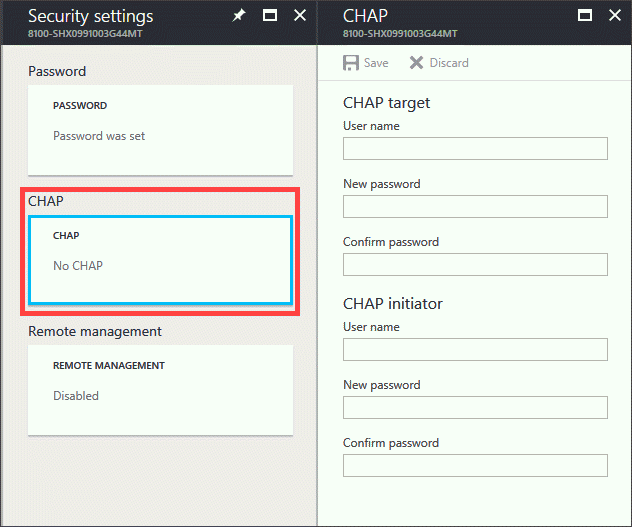
2. In the **CHAP** blade, and in the **CHAP Initiator** section:
   
   1. Provide a user name for your CHAP initiator.
   2. Supply a password for your CHAP initiator.
      
      > [!IMPORTANT]
      > The CHAP user name must contain fewer than 233 characters. The CHAP password must be between 12 and 16 characters. A longer user name or password results in an authentication failure on the Windows host.
   
   3. Confirm the password.

       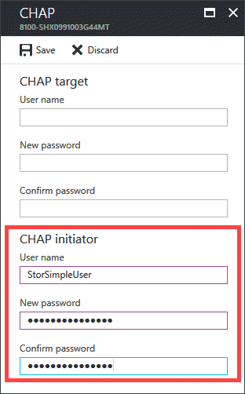
3. Click **Save**. A confirmation message is displayed. Click **OK** to save the changes.

#### To configure one-way authentication on the Windows host server
1. On the Windows host server, start the iSCSI Initiator.
2. In the **iSCSI Initiator Properties** window, perform the following steps:
   
   1. Click the **Discovery** tab.
      
       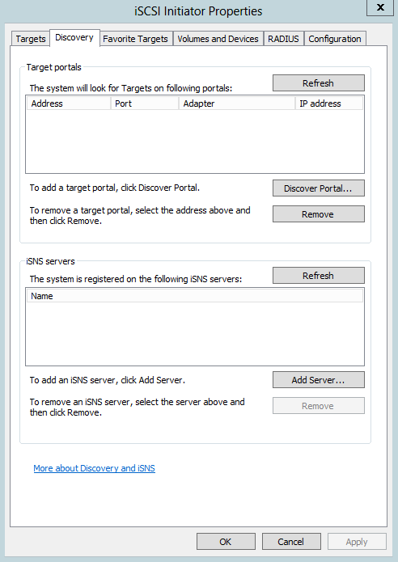
   2. Click **Discover Portal**.
3. In the **Discover Target Portal** dialog box:
   
   1. Specify the IP address of your device.
   2. Click **Advanced**.
      
       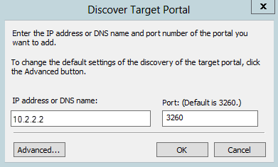
4. In the **Advanced Settings** dialog box:
   
   1. Select the **Enable CHAP log on** check box.
   2. In the **Name** field, supply the user name that you specified for the CHAP Initiator in the Azure portal.
   3. In the **Target secret** field, supply the password that you specified for the CHAP Initiator in the Azure portal.
   4. Click **OK**.
      
       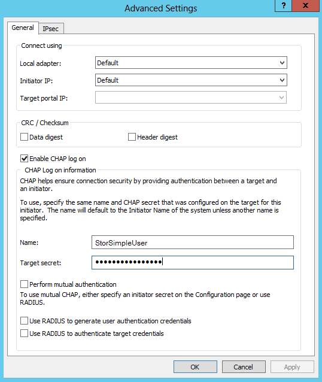
5. On the **Targets** tab of the **iSCSI Initiator Properties** window, the device status should appear as **Connected**. If you are using a StorSimple 1200 device, then each volume is mounted as an iSCSI target. Hence, steps 3-4 will need to be repeated for each volume.
   
    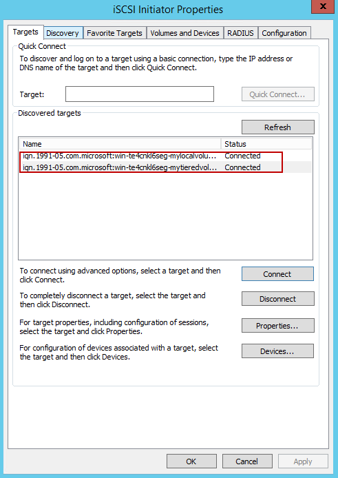
   
   > [!IMPORTANT]
   > If you change the iSCSI name, the new name is used for new iSCSI sessions. New settings are not used for existing sessions until you log off and log on again.

For more information about configuring CHAP on the Windows host server, go to [Additional considerations](#additional-considerations).

## Bidirectional or mutual authentication

In bidirectional authentication, the target authenticates the initiator and then the initiator authenticates the target. This procedure requires the user to configure the CHAP initiator settings, reverse CHAP settings on the device, and iSCSI Initiator software on the host. The following procedures describe the steps to configure mutual authentication on the device and on the Windows host.

#### To configure your device for mutual authentication

1. In the Azure portal, go to your StorSimple Device Manager service. Click **Devices** and select and click a device you wish to configure CHAP for. Go to **Device settings > Security**. In the **Security settings** blade, click **CHAP**.
   
    
2. Scroll down on this page, and in the **CHAP Target** section:
   
   1. Provide a **Reverse CHAP user name** for your device.
   2. Supply a **Reverse CHAP password** for your device.
   3. Confirm the password.
3. In the **CHAP Initiator** section:
   
   1. Provide a **user name** for your device.
   2. Provide a **password** for your device.
   3. Confirm the password.

       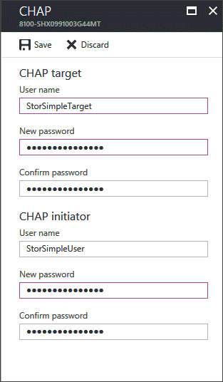
4. Click **Save**. A confirmation message is displayed. Click **OK** to save the changes.

#### To configure bidirectional authentication on the Windows host server

1. On the Windows host server, start the iSCSI Initiator.
2. In the **iSCSI Initiator Properties** window, click the **Configuration** tab.
3. Click **CHAP**.
4. In the **iSCSI Initiator Mutual CHAP Secret** dialog box:
   
   1. Type the **Reverse CHAP Password** that you configured in the Azure portal.
   2. Click **OK**.
      
       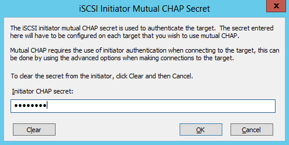
5. Click the **Targets** tab.
6. Click the **Connect** button. 
7. In the **Connect To Target** dialog box, click **Advanced**.
8. In the **Advanced Properties** dialog box:
   
   1. Select the **Enable CHAP log on** check box.
   2. In the **Name** field, supply the user name that you specified for the CHAP Initiator in the Azure portal.
   3. In the **Target secret** field, supply the password that you specified for the CHAP Initiator in the Azure portal.
   4. Select the **Perform mutual authentication** check box.
      
       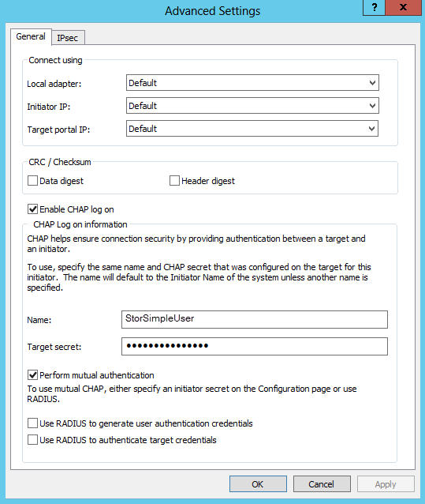
   5. Click **OK** to complete the CHAP configuration

For more information about configuring CHAP on the Windows host server, go to [Additional considerations](#additional-considerations).

## Additional considerations

The **Quick Connect** feature does not support connections that have CHAP enabled. When CHAP is enabled, make sure that you use the **Connect** button that is available on the **Targets** tab to connect to a target.

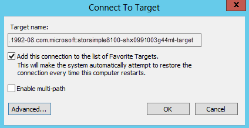

In the **Connect to Target** dialog box that is presented, select the **Add this connection to the list of Favorite Targets** check box. This selection ensures that every time the computer restarts, an attempt is made to restore the connection to the iSCSI favorite targets.

## Errors during configuration

If your CHAP configuration is incorrect, then you are likely to see an **Authentication failure** error message.

## Verification of CHAP configuration

You can verify that CHAP is being used by completing the following steps.

#### To verify your CHAP configuration
1. Click **Favorite Targets**.
2. Select the target for which you enabled authentication.
3. Click **Details**.
   
    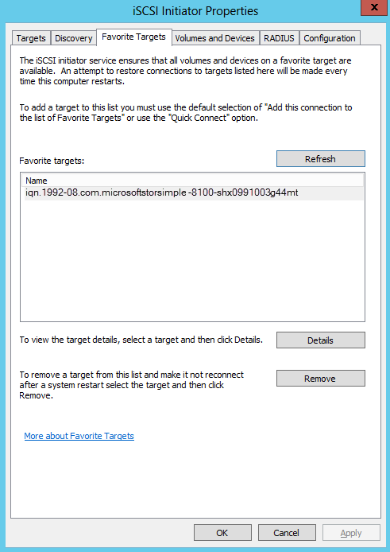
4. In the **Favorite Target Details** dialog box, note the entry in the **Authentication** field. If the configuration was successful, it should say **CHAP**.
   
    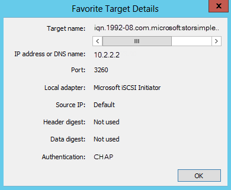

## Next steps

* Learn more about [StorSimple security](storsimple-8000-security.md).
* Learn more about [using the StorSimple Device Manager service to administer your StorSimple device](storsimple-8000-manager-service-administration.md).

