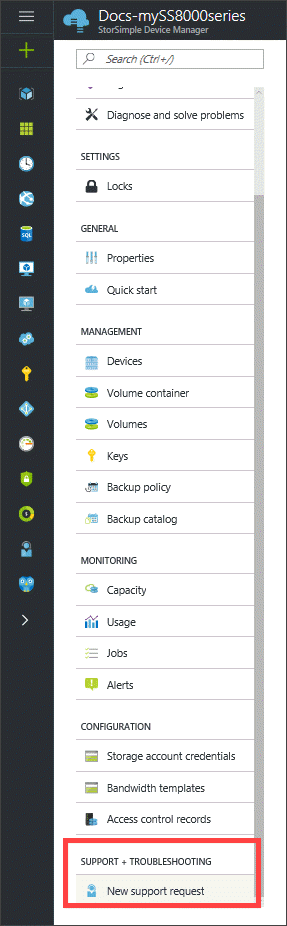
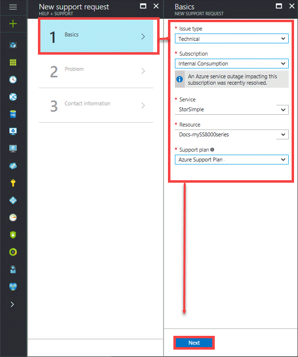
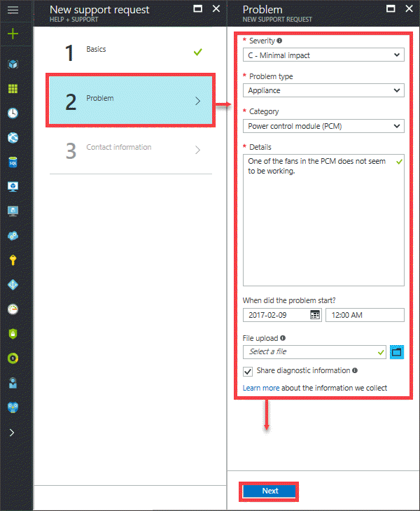
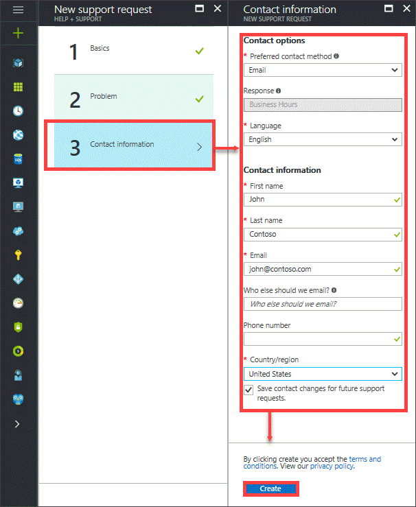
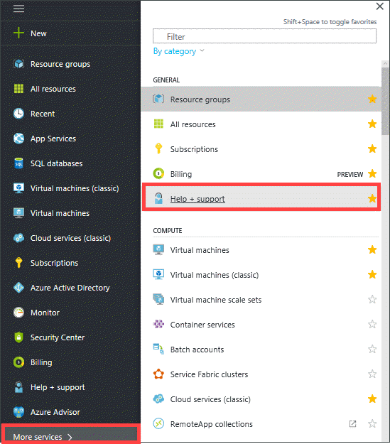
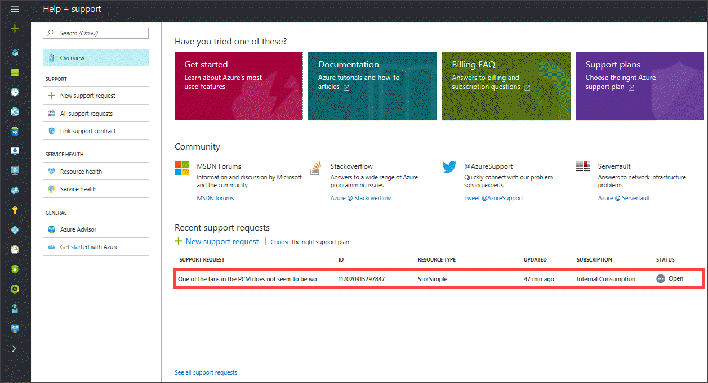
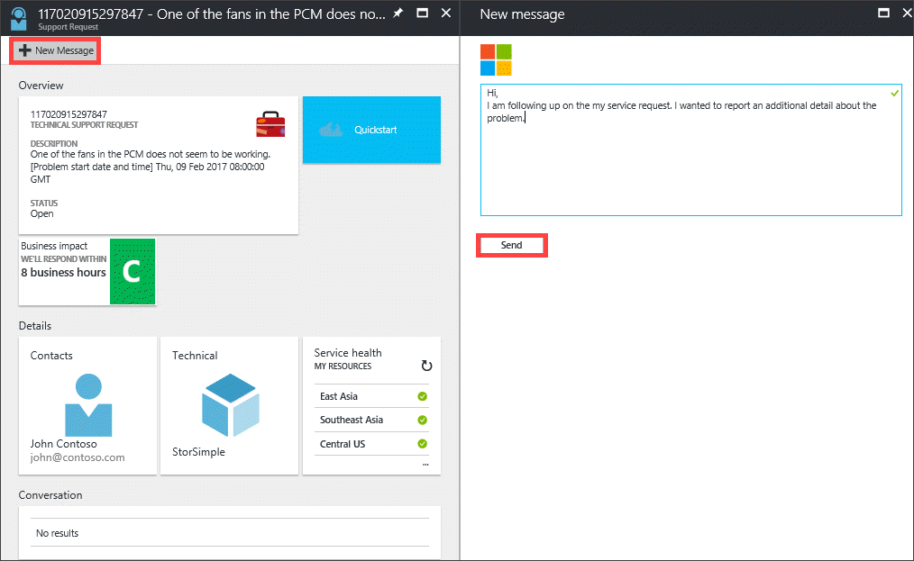

# Contact Microsoft Support

The StorSimple Device Manager provides the capability to **log a new support request** within the service summary blade. If you encounter any issues with your StorSimple solution, you can create a service request for technical support. In an online session with your support engineer, you may also need to start a support session on your StorSimple device. This article walks you through:

* How to create a support request.
* How to manage a support request lifecycle from within the portal.
* How to start a support session in the Windows PowerShell interface of your StorSimple device.

Review the [StorSimple 8000 Series Support SLAs and information](https://msdn.microsoft.com/library/mt433077.aspx) before you create a Support request.

## Create a support request

Depending upon your [support plan](https://azure.microsoft.com/support/plans/), you can create support tickets for an issue on your StorSimple device directly from the StorSimple Device Manager service summary blade. Perform the following steps to create a support request:

#### To create a support request

1. Go to your StorSimple Device Manager service. In the service summary blade settings, go to **SUPPORT + TROUBLESHOOTING** section and then click **New support request**.
     
    
   
2. In the **New support request** blade, select **Basics**. In the **Basics** blade, do the following steps:
   1. From the **Issue type** drop-down list , select **Technical**.
   2. The current **Subscription**, **Service** type, and the **Resource** (StorSimple Device Manager service) are automatically chosen. 
   3. Select a **Support plan** from the drop-down list if you have multiple plans associated with your subscription. You need a paid support plan to enable Technical Support.
   4. Click **Next**.

       

3. In the **New support request** blade, select **Step 2 Problem**. In the **Problem** blade, do the following steps:
    
    1. Choose the **Severity**.
    2. Specify if the issue is related to the appliance or the StorSimple Device Manager service.
    3. Choose a **Category** for this issue and provide more **Details** about the issue.
    4. Provide the start date and time for the problem.
    5. In the **File upload**, click the folder icon to browse to your support package.
    6. Check **Share diagnostic information**.
    7. Click **Next**.

        

4. In the **New support request** blade, click **Step 3 Contact information**. In the **Contact information** blade, do the following steps:

   1. In the **Contact options**, provide your preferred contact method (phone or email) and the language. The response time is automatically selected based on your subscription plan.
   2. In the Contact information, provide your name, email, optional contact, country/region. Select the **Save contact changes for future support requests** check box.
   3. Click **Create**.
   
          

      Microsoft Support will use this information to reach out to you for further information, diagnosis, and resolution.
      After you have submitted your request, a Support engineer will contact you as soon as possible to proceed with your request.

## Manage a support request

After creating a support ticket, you can manage the lifecycle of the ticket from within the portal.

#### To manage your support requests

1. To get to the help and support page, navigate to **Browse > Help + support**.

    

2. A tabular listing of All the support requests is displayed in the **Help + support** blade.

    

3. Select and click a support request. You can view the status and the details for this request. Click **+ New message** if you want to follow up on this request.

    

## Start a support session in Windows PowerShell for StorSimple

To troubleshoot any issues that you might experience with the StorSimple device, you will need to engage with the Microsoft Support team. Microsoft Support may need to use a support session to log on to your device.

Perform the following steps to start a support session:

#### To start a support session

1. Access the device directly by using the serial console or through a telnet session from a remote computer. To do this, follow the steps in [Use PuTTY to connect to the device serial console](storsimple-8000-deployment-walkthrough-u2.md#use-putty-to-connect-to-the-device-serial-console).
2. In the session that opens, press the **Enter** key to get a command prompt.
3. In the serial console menu, select option 1, **Log in with full access**.
4. At the prompt, type the following password:
   
    `Password1`
5. At the prompt, type the following command:
   
    `Enable-HcsSupportAccess`
6. An encrypted string will be presented to you. Copy this string into a text editor such as Notepad.
7. Save this string and send it in an email message to Microsoft Support.

> [!IMPORTANT]
> You can disable support access by running `Disable-HcsSupportAccess`. The StorSimple device will also attempt to disable support access 8 hours after the session was initiated. It is a best practice to change your StorSimple device credentials after initiating a support session.

## Next steps

Learn how to [diagnose and solve problems related to your StorSimple 8000 series device](storsimple-8000-troubleshoot-deployment.md)
