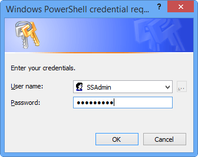

# Create and manage a support package for StorSimple 8000 series

## Overview

A StorSimple support package is an easy-to-use mechanism that collects all relevant logs to assist Microsoft Support with troubleshooting any StorSimple device issues. The collected logs are encrypted and compressed.

This tutorial includes step-by-step instructions to create and manage the support package for your StorSimple 8000 series device. If you are working with a StorSimple Virtual Array, go to [generate a log package](storsimple-ova-web-ui-admin.md#generate-a-log-package).

## Create a support package

In some cases, you'll need to manually create the support package through Windows PowerShell for StorSimple. For example:

* If you need to remove sensitive information from your log files prior to sharing with Microsoft Support.
* If you are having difficulty uploading the package due to connectivity issues.

You can share your manually generated support package with Microsoft Support over email. Perform the following steps to create a support package in Windows PowerShell for StorSimple.

#### To create a support package in Windows PowerShell for StorSimple

1. To start a Windows PowerShell session as an administrator on the remote computer that's used to connect to your StorSimple device, enter the following command:
   
    `Start PowerShell`
2. In the Windows PowerShell session, connect to the SSAdmin Console of your device:
   
   1. At the command prompt, enter:
     
       `$MS = New-PSSession -ComputerName <IP address for DATA 0> -Credential SSAdmin -ConfigurationName "SSAdminConsole"`
   2. In the dialog box that opens, enter your device administrator password. The default password is _Password1_.
     
      
   3. Select **OK**.
   4. At the command prompt, enter:
     
      `Enter-PSSession $MS`
3. In the session that opens, enter the appropriate command.
   
   * For network shares that are password protected, enter:
     
       `Export-HcsSupportPackage -Path <\\IP address\location of the shared folder> -Include Default -Credential domainname\username`
     
       You'll be prompted for a password and an encryption passphrase (because the support package is encrypted). A support package is then created in the default folder (Device name appended with current date and time).
   * For shares that are not password protected, you do not need the `-Credential` parameter. Enter the following:
     
       `Export-HcsSupportPackage`
     
       The support package is created for both controllers in the default folder. The package is an encrypted, compressed file that can be sent to Microsoft Support for troubleshooting. For more information, see [Contact Microsoft Support](storsimple-8000-contact-microsoft-support.md).

### The Export-HcsSupportPackage cmdlet parameters

You can use the following parameters with the Export-HcsSupportPackage cmdlet.

| Parameter | Required/Optional | Description |
| --- | --- | --- |
| `-Path` |Required |Use to provide the location of the network shared folder in which the support package is placed. |
| `-EncryptionPassphrase` |Required |Use to provide a passphrase to help encrypt the support package. |
| `-Credential` |Optional |Use to supply access credentials for the network shared folder. |
| `-Force` |Optional |Use to skip the encryption passphrase confirmation step. |
| `-PackageTag` |Optional |Use to specify a directory under *Path* in which the support package is placed. The default is [device name]-[current date and time:yyyy-MM-dd-HH-mm-ss]. |
| `-Scope` |Optional |Specify as **Cluster** (default) to create a support package for both controllers. If you want to create a package only for the current controller, specify **Controller**. |

## Edit a support package

After you have generated a support package, you might need to edit the package to remove sensitive information. This can include volume names, device IP addresses, and backup names from the log files.

> [!IMPORTANT]
> You can only edit a support package that was generated through Windows PowerShell for StorSimple. You can't edit a package created in the Azure portal with StorSimple Device Manager service.

To edit a support package before uploading it on the Microsoft Support site, first decrypt the support package, edit the files, and then re-encrypt it. Perform the following steps.

#### To edit a support package in Windows PowerShell for StorSimple

1. Generate a support package as described earlier, in [To create a support package in Windows PowerShell for StorSimple](#to-create-a-support-package-in-windows-powershell-for-storsimple).
2. [Download the script](https://gallery.technet.microsoft.com/scriptcenter/Script-to-decrypt-a-a8d1ed65) locally on your client.
3. Import the Windows PowerShell module. Specify the path to the local folder in which you downloaded the script. To import the module, enter:
   
    `Import-module <Path to the folder that contains the Windows PowerShell script>`
4. All the files are *.aes* files that are compressed and encrypted. To decompress and decrypt files, enter:
   
    `Open-HcsSupportPackage <Path to the folder that contains support package files>`
   
    Note that the actual file extensions are now displayed for all the files.
   
    
5. When you're prompted for the encryption passphrase, enter the passphrase that you used when the support package was created.
   
        cmdlet Open-HcsSupportPackage at command pipeline position 1
   
        Supply values for the following parameters:EncryptionPassphrase: ****
6. Browse to the folder that contains the log files. Because the log files are now decompressed and decrypted, these will have original file extensions. Modify these files to remove any customer-specific information, such as volume names and device IP addresses, and save the files.
7. Close the files to compress them with gzip and encrypt them with AES-256. This is for speed and security in transferring the support package over a network. To compress and encrypt files, enter the following:
   
    `Close-HcsSupportPackage <Path to the folder that contains support package files>`
   
    
8. When prompted, provide an encryption passphrase for the modified support package.
   
        cmdlet Close-HcsSupportPackage at command pipeline position 1
        Supply values for the following parameters:EncryptionPassphrase: ****
9. Write down the new passphrase, so that you can share it with Microsoft Support when requested.

### Example: Editing files in a support package on a password-protected share

The following example shows how to decrypt, edit, and re-encrypt a support package.

        PS C:\WINDOWS\system32> Import-module C:\Users\Default\StorSimple\SupportPackage\HCSSupportPackageTools.psm1

        PS C:\WINDOWS\system32> Open-HcsSupportPackage \\hcsfs\Logs\TD48\TD48Logs\C0-A\etw

        cmdlet Open-HcsSupportPackage at command pipeline position 1

        Supply values for the following parameters:

        EncryptionPassphrase: ****

        PS C:\WINDOWS\system32> Close-HcsSupportPackage \\hcsfs\Logs\TD48\TD48Logs\C0-A\etw

        cmdlet Close-HcsSupportPackage at command pipeline position 1

        Supply values for the following parameters:

        EncryptionPassphrase: ****

        PS C:\WINDOWS\system32>

## Next steps

* Learn about the [information collected in the Support package](https://support.microsoft.com/help/3193606/storsimple-support-packages-and-device-logs)
* Learn how to [use support packages and device logs to troubleshoot your device deployment](storsimple-8000-troubleshoot-deployment.md#support-packages-and-device-logs-available-for-troubleshooting).
* Learn how to [use the StorSimple Device Manager service to administer your StorSimple device](storsimple-8000-manager-service-administration.md).

