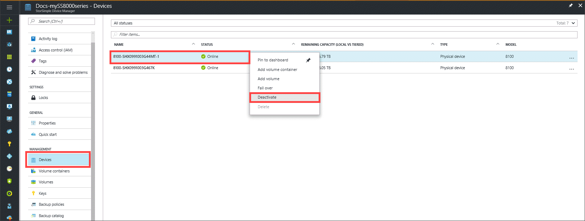
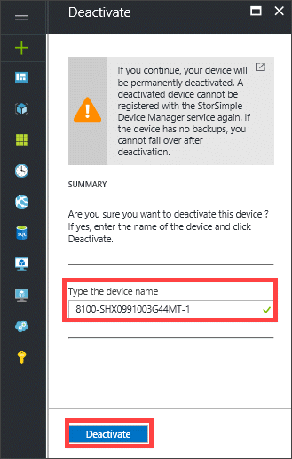
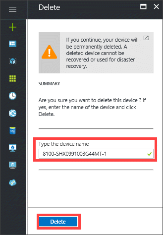
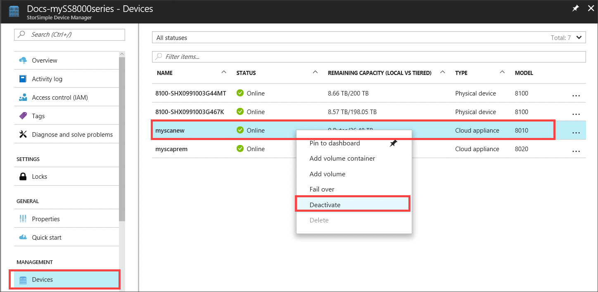

# Deactivate and delete a StorSimple device

## Overview

This article describes how to deactivate and delete a StorSimple device that is connected to a StorSimple Device Manager service. The guidance in this article applies only to StorSimple 8000 series devices including the StorSimple Cloud Appliances. If you are using a StorSimple Virtual Array, then go to [Deactivate and delete a StorSimple Virtual Array](storsimple-virtual-array-deactivate-and-delete-device.md).

Deactivation severs the connection between the device and the corresponding StorSimple Device Manager service. You may wish to take a StorSimple device out of service (for example, if you are replacing or upgrading your device or if you are no longer using StorSimple). If so, you need to deactivate the device before you can delete it.

When you deactivate a device, any data that was stored locally on the device is no longer accessible. Only the data associated with the device that was stored in the cloud can be recovered.

> [!WARNING]
> Deactivation is a PERMANENT operation and cannot be undone. A deactivated device cannot be registered with the StorSimple Device Manager service unless it is reset to factory defaults.
>
> The factory reset process deletes all the data that was stored locally on your device. Therefore, you must take a cloud snapshot of all your data before you deactivate a device. This cloud snapshot allows you to recover all the data at a later stage.

> [!NOTE]
>
> - Before you deactivate a StorSimple physical device or cloud appliance, ensure that the data from the deleted volume container is actually deleted from the device. You can monitor the cloud consumption charts and when you see the cloud usage drop because of the backups you have deleted, then you can proceed to deactivate the device. If you deactivate the device before this drop occurs, the data is stranded in the storage account and accrues charges.
>
> - Before you deactivate a StorSimple physical device or cloud appliance, stop or delete clients and hosts that depend on that device.
>
> - If the storage account(s) or the containers in the storage account associated with the volume containers are already deleted before deleting the data from the device, you will receive an error and may not be able to delete the data. We recommend that you delete the data on the device before you delete the Storage Account or containers therein. However, in this situation, you will have to proceed with device deactivation and deletion assuming that the data is already removed from the storage account.

After reading this tutorial, you will be able to:

- Deactivate a device and delete the data.
- Deactivate a device and retain the data.

## Deactivate and delete data

If you are interested in deleting the device completely and do not want to retain the data on the device, then complete the following steps.

### To deactivate the device and delete the data

1. Before you deactivate a device, you must delete all the volume containers (and the volumes) associated with the device. You can delete volume containers only after you have deleted the associated backups. Refer to the note in the above overview before you deactivate a StorSimple physical device or cloud appliance.

2. Deactivate the device as follows:

   1. Go to your StorSimple Device Manager service and click **Devices**. In the **Devices** blade, select the device that you wish to deactivate, right-click, and then click **Deactivate**.

        
   2. In the **Deactivate** blade, type the device name to confirm and then click **Deactivate**. The deactivate process starts and takes a few minutes to complete.

        

3. After deactivation, you can delete the device completely. Deleting a device removes it from the list of devices connected to the service. The service can then no longer manage the deleted device. Use the following steps to delete the device:
   
   1. Go to your StorSimple Device Manager service and click **Devices**. In the **Devices** blade, select the deactivated device that you wish to delete, right-click, and then click **Delete**.

        
   2. In the **Delete** blade, type the device name to confirm and then click **Delete**. The deletion takes a few minutes to complete.

        
   3. After the deletion is successfully complete, you are notified. The device list also updates to reflect the deletion.

## Deactivate and retain data

If you are interested in deleting the device but want to retain the data, then complete the following steps:

### To deactivate a device and retain the data

1. Deactivate the device. All the volume containers and the snapshots of the device remain.
   
   1. Go to your StorSimple Device Manager service and click **Devices**. In the **Devices** blade, select the device that you wish to deactivate, right-click, and then click **Deactivate**.

         
   2. In the **Deactivate** blade, type the device name to confirm and then click **Deactivate**. The deactivate process starts and takes a few minutes to complete.

         
2. You can now fail over the volume containers and the associated snapshots. For procedures, go to [Failover and disaster recovery for your StorSimple device](storsimple-8000-device-failover-disaster-recovery.md).
3. After deactivation and failover, you can delete the device completely. Deleting a device removes it from the list of devices connected to the service. The service can then no longer manage the deleted device. To delete the device, complete the following steps:
   
   1. Go to your StorSimple Device Manager service and click **Devices**. In the **Devices** blade, select the deactivated device that you wish to delete, right-click, and then click **Delete**.

       
   2. In the **Delete** blade, type the device name to confirm and then click **Delete**. The deletion takes a few minutes to complete.

       
   3. After the deletion is successfully complete, you are notified. The device list also updates to reflect the deletion.

## Deactivate and delete a cloud appliance

For a StorSimple Cloud Appliance, deactivation from the portal deallocates and deletes the virtual machine, and the resources created when it was provisioned. After the cloud appliance is deactivated, it cannot be restored to its previous state.

Deactivation results in the following actions:

* The StorSimple Cloud Appliance is removed from the service.
* The virtual machine for the StorSimple Cloud Appliance is deleted.
* The OS disk and data disks created for the StorSimple Cloud Appliance are retained. If you are not using these entities, you should delete them manually.
* The hosted service and Virtual Network that were created during provisioning are retained. If you are not using these entities, you should delete them manually.
* Cloud snapshots created by the StorSimple Cloud Appliance are retained.

After the cloud appliance is deactivated, you can delete it from the list of devices. Select the deactivated device, right-click, and then click **Delete**. StorSimple notifies you once the device is deleted and the list of devices updates.

## Next steps

* To restore the deactivated device to factory defaults, go to [Reset the device to factory default settings](storsimple-8000-manage-device-controller.md#reset-the-device-to-factory-default-settings).
* For technical assistance, [contact Microsoft Support](storsimple-8000-contact-microsoft-support.md).
* To learn more about how to use the StorSimple Device Manager service, go to [Use the StorSimple Device Manager service to administer your StorSimple device](storsimple-8000-manager-service-administration.md).

