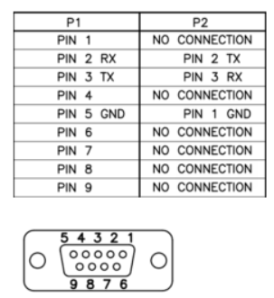
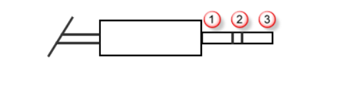

# Deploy your on-premises StorSimple device (Update 3 and later)

## Overview
Welcome to Microsoft Azure StorSimple device deployment. These deployment tutorials apply to StorSimple 8000 Series Update 3 or later. This series of tutorials includes a configuration checklist, configuration prerequisites, and detailed configuration steps for your StorSimple device.

The information in these tutorials assumes that you have reviewed the safety precautions, and unpacked, racked, and cabled your StorSimple device. If you still need to perform those tasks, start with reviewing the [safety precautions](storsimple-8000-safety.md). Follow the device-specific instructions to unpack, rack mount, and cable your device.

* [Unpack, rack mount, and cable your 8100](storsimple-8100-hardware-installation.md)
* [Unpack, rack mount, and cable your 8600](storsimple-8600-hardware-installation.md)

You need administrator privileges to complete the setup and configuration process. We recommend that you review the configuration checklist before you begin. The deployment and configuration process can take some time to complete.

> [!NOTE]
> The StorSimple deployment information published on the Microsoft Azure website applies to StorSimple 8000 series devices only. For complete information about the 7000 series devices, go to: [http://onlinehelp.storsimple.com/](http://onlinehelp.storsimple.com). For 7000 series deployment information, see the [StorSimple System Quick Start Guide](http://onlinehelp.storsimple.com/111_Appliance/). 

## Deployment steps
Perform these required steps to configure your StorSimple device and connect it to your StorSimple Device Manager service. In addition to the required steps, there are optional steps and procedures you may need during the deployment. The step-by-step deployment instructions indicate when you should perform each of these optional steps.

| Step | Description |
| --- | --- |
| **PREREQUISITES** |These must be completed in preparation for the upcoming deployment. |
| [Deployment configuration checklist](#deployment-configuration-checklist) |Use this checklist to gather and record information before and during the deployment. |
| [Deployment prerequisites](#deployment-prerequisites) |These validate the environment is ready for deployment. |
|  | |
| **STEP-BY-STEP DEPLOYMENT** |These steps are required to deploy your StorSimple device in production. |
| [Step 1: Create a new service](#step-1-create-a-new-service) |Set up cloud management and storage for your StorSimple device. *Skip this step if you have an existing service for other StorSimple devices*. |
| [Step 2: Get the service registration key](#step-2-get-the-service-registration-key) |Use this key to register & connect your StorSimple device with the management service. |
| [Step 3: Configure and register the device through Windows PowerShell for StorSimple](#step-3-configure-and-register-the-device-through-windows-powershell-for-storsimple) |To complete the setup using the management service, connect the device to your network and register it with Azure. |
| [Step 4: Complete minimum device setup](#step-4-complete-minimum-device-setup) [Best practice: Update your StorSimple device](#scan-for-and-apply-updates) |Use the management service to complete the device setup and enable it to provide storage. |
| [Step 5: Create a volume container](#step-5-create-a-volume-container) |Create a container to provision volumes. A volume container has storage account, bandwidth, and encryption settings for all the volumes contained in it. |
| [Step 6: Create a volume](#step-6-create-a-volume) |Provision storage volumes on the StorSimple device for your servers. |
| [Step 7: Mount, initialize, and format a volume](#step-7-mount-initialize-and-format-a-volume) [Optional: Configure MPIO](storsimple-8000-configure-mpio-windows-server.md) |Connect your servers to the iSCSI storage provided by the device. Optionally configure MPIO to ensure that your servers can tolerate link, network, and interface failure. |
| [Step 8: Take a backup](#step-8-take-a-backup) |Set up your backup policy to protect your data |
|  | |
| **OTHER PROCEDURES** |You may need to refer to these procedures as you deploy your solution. |
| [Configure a new storage account for the service](#configure-a-new-storage-account-for-the-service) | |
| [Use PuTTY to connect to the device serial console](#use-putty-to-connect-to-the-device-serial-console) | |
| [Get the IQN of a Windows Server host](#get-the-iqn-of-a-windows-server-host) | |
| [Create a manual backup](#create-a-manual-backup) | |

## Deployment configuration checklist
Before you deploy your device, you need to collect information to configure the software on your StorSimple device. Preparing some of this information ahead of time helps streamline the process of deploying the StorSimple device in your environment. Download and use this checklist to note down the configuration details as you deploy your device.

* [Download StorSimple deployment configuration checklist](https://www.microsoft.com/download/details.aspx?id=49159)

## Deployment prerequisites
The following sections explain the configuration prerequisites for your StorSimple Device Manager service and your StorSimple device.

### For the StorSimple Device Manager service
Before you begin, make sure that:

* You have your Microsoft account with access credentials.
* You have your Microsoft Azure storage account with access credentials.
* Your Microsoft Azure subscription is enabled for the StorSimple Device Manager service. Your subscription should be purchased through the [Enterprise Agreement](https://azure.microsoft.com/pricing/enterprise-agreement/).
* You have access to terminal emulation software such as PuTTY.

### For the device in the datacenter
Before configuring the device, make sure that your device is fully unpacked, mounted on a rack and fully cabled for power, network, and serial access as described in:

* [Unpack, rack mount, and cable your 8100 device](storsimple-8100-hardware-installation.md)
* [Unpack, rack mount, and cable your 8600 device](storsimple-8600-hardware-installation.md)

### For the network in the datacenter
Before you begin, make sure that:

* The ports in your datacenter firewall are opened to allow for iSCSI and cloud traffic as described in [Networking requirements for your StorSimple device](storsimple-8000-system-requirements.md#networking-requirements-for-your-storsimple-device).

## Step-by-step deployment
Use the following step-by-step instructions to deploy your StorSimple device in the datacenter.

## Step 1: Create a new service
A StorSimple Device Manager service can manage multiple StorSimple devices. Perform the following steps to create an instance of the StorSimple Device Manager service.

[!INCLUDE [storsimple-create-new-service](../../includes/storsimple-8000-create-new-service.md)]

> [!IMPORTANT]
> If you did not enable the automatic creation of a storage account with your service, you will need to create at least one storage account after you have successfully created a service. This storage account is used when you create a volume container.
>
> * If you did not create a storage account automatically, go to [Configure a new storage account for the service](#configure-a-new-storage-account-for-the-service) for detailed instructions.
> * If you enabled the automatic creation of a storage account, go to [Step 2: Get the service registration key](#step-2-get-the-service-registration-key).

## Step 2: Get the service registration key
After the StorSimple Device Manager service is up and running, you will need to get the service registration key. This key is used to register and connect your StorSimple device with the service.

Perform the following steps in the Azure portal.

[!INCLUDE [storsimple-8000-get-service-registration-key](../../includes/storsimple-8000-get-service-registration-key.md)]

## Step 3: Configure and register the device through Windows PowerShell for StorSimple
Use Windows PowerShell for StorSimple to complete the initial setup of your StorSimple device as explained in the following procedure. You need to use terminal emulation software to complete this step. For more information, see [Use PuTTY to connect to the device serial console](#use-putty-to-connect-to-the-device-serial-console).

[!INCLUDE [storsimple-8000-configure-and-register-device-u2](../../includes/storsimple-8000-configure-and-register-device-u2.md)]

## Step 4: Complete minimum device setup
For the minimum device configuration of your StorSimple device, you are required to: 

* Provide a friendly name for your device.
* Set the device time zone.
* Assign fixed IP addresses to both the controllers.

Perform the following steps in the Azure portal to complete the minimum device setup.

[!INCLUDE [storsimple-8000-complete-minimum-device-setup-u2](../../includes/storsimple-8000-complete-minimum-device-setup-u2.md)]

After you complete the minimum device setup, it is a best practice to [scan for and apply latest updates](#scan-for-and-apply-updates).

## Step 5: Create a volume container
A volume container has storage account, bandwidth, and encryption settings for all the volumes contained in it. You will need to create a volume container before you can start provisioning volumes on your StorSimple device.

Perform the following steps in the Azure portal to create a volume container.

[!INCLUDE [storsimple-8000-create-volume-container](../../includes/storsimple-8000-create-volume-container.md)]

## Step 6: Create a volume
After you create a volume container, you can provision a storage volume on the StorSimple device for your servers. Perform the following steps in the Azure portal to create a volume.

> [!IMPORTANT]
> StorSimple Device Manager can create both thin and fully provisioned volumes. You cannot however create partially provisioned volumes.

[!INCLUDE [storsimple-8000-create-volume](../../includes/storsimple-8000-create-volume-u2.md)]

## Step 7: Mount, initialize, and format a volume
The following steps are performed on your Windows Server host.

> [!IMPORTANT]
> * For the high availability of your StorSimple solution, we recommend that you configure MPIO on your host servers (optional) prior to configuring iSCSI. MPIO configuration on host servers will ensure that the servers can tolerate a link, network, or interface failure.
> * For MPIO and iSCSI installation and configuration instructions on Windows Server host, go to [Configure MPIO for your StorSimple device](storsimple-8000-configure-mpio-windows-server.md). These also include the steps to mount, initialize, and format StorSimple volumes.
> * For MPIO and iSCSI installation and configuration instructions on a Linux host, go to [Configure MPIO for your StorSimple Linux host](storsimple-configure-mpio-on-linux.md)

If you decide not to configure MPIO, perform the following steps to mount, initialize, and format your StorSimple volumes on a Windows Server host.

[!INCLUDE [storsimple-8000-mount-initialize-format-volume](../../includes/storsimple-8000-mount-initialize-format-volume.md)]

## Step 8: Take a backup
Backups provide point-in-time protection of volumes and improve recoverability while minimizing restore times. You can take two types of backup on your StorSimple device: local snapshots and cloud snapshots. Each of these backup types can be **Scheduled** or **Manual**.

Perform the following steps in the Azure portal to create a scheduled backup.

[!INCLUDE [storsimple-8000-take-backup](../../includes/storsimple-8000-take-backup.md)]

You can take a manual backup at any time. For procedures, go to [Create a manual backup](#create-a-manual-backup).

You have completed the device configuration.

## Configure a new storage account for the service
This is an optional step that you need to perform only if you did not enable the automatic creation of a storage account with your service. A Microsoft Azure storage account is required to create a StorSimple volume container.

If you need to create an Azure storage account in a different region, see [About Azure Storage Accounts](../storage/common/storage-create-storage-account.md) for step-by-step instructions.

Perform the following steps in the Azure portal, on the **StorSimple Device Manager service** page.

[!INCLUDE [storsimple-8000-configure-new-storage-account-u2](../../includes/storsimple-8000-configure-new-storage-account-u2.md)]

## Use PuTTY to connect to the device serial console
To connect to Windows PowerShell for StorSimple, you need to use terminal emulation software such as PuTTY. You can use PuTTY when you access the device directly through the serial console or by opening a telnet session from a remote computer.

[!INCLUDE [Use PuTTY to connect to the device serial console](../../includes/storsimple-use-putty.md)]

## Scan for and apply updates
Updating your device can take several hours. For detailed steps on how to install the latest update, go to [Install Update 5](storsimple-8000-install-update-5.md).

## Get the IQN of a Windows Server host
Perform the following steps to get the iSCSI Qualified Name (IQN) of a Windows host that is running Windows Server® 2012.

[!INCLUDE [Create a manual backup](../../includes/storsimple-get-iqn.md)]

## Create a manual backup
Perform the following steps in the Azure portal to create an on-demand manual backup for a single volume on your StorSimple device.

[!INCLUDE [Create a manual backup](../../includes/storsimple-8000-create-manual-backup.md)]

## View the pinout diagram for serial cable for StorSimple
The following pinout diagram can be used for the StorSimple serial console cable.

Here the DB9 female connector is P1 and the 3.5 mm connector is P2.

The tip of the stereo jack is considered to be PIN 3 RX, the middle is PIN 2 TX and the base is PIN 1 GND as shown in the following diagram.

## Next steps
* [Configure a StorSimple Cloud Appliance](storsimple-8000-cloud-appliance-u2.md).
* [Use the StorSimple Device Manager service to manage your StorSimple device](storsimple-8000-manager-service-administration.md).

