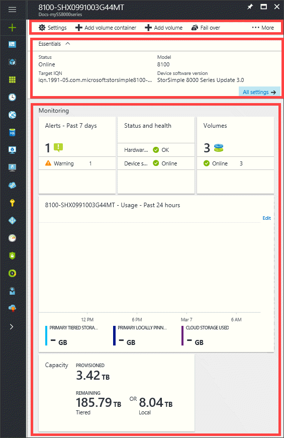
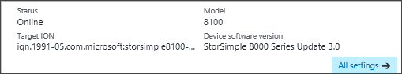
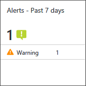
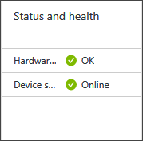
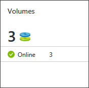
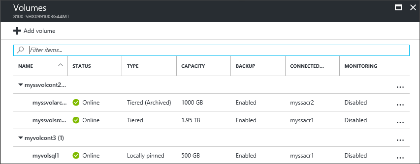
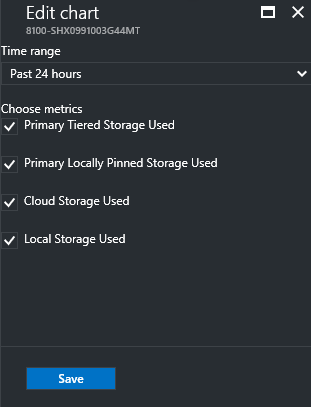
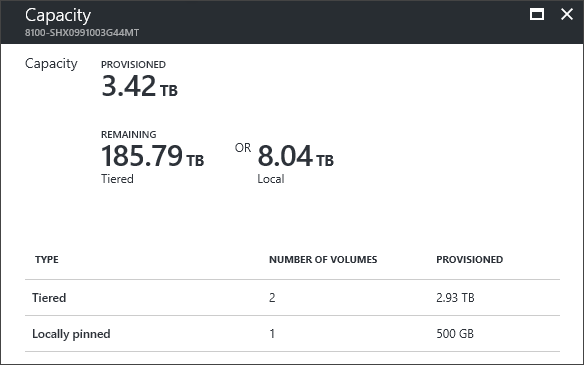

# Use the device summary in StorSimple Device Manager service

## Overview
The StorSimple device summary blade gives you an overview of information for a specific StorSimple device, in contrast to the service summary blade, which gives you information about all the devices included in your Microsoft Azure StorSimple solution.

The device summary blade provides a summary view of a StorSimple 8000 series device that is registered with a given StorSimple Device Manager, highlighting those device issues that need a system administrator's attention. This tutorial introduces the device summary blade, explains the content and function, and describes the tasks that you can perform from this blade.

The device summary blade displays the following information:

## Management command bar

In the StorSimple device blade, you see the options for managing your StorSimple device. You see the management commands across the top of the blade and on the left side. Use these options to add shares or volumes, or update or fail over your device.

## Essentials

The essentials area captures some of the important properties such as, the status, model, target IQN, and the software version. 

## Monitoring

* The **Alerts** tile provides a snapshot of all the active alerts for your device, grouped by alert severity.

    

    Click the tile to open the **Alerts** blade and then click an individual alert to view additional details about that alert, including any recommended actions. You can also clear the alert if the issue has been resolved.

    

* The **Status and health** tile provides insights into the hardware component health for a device including the device status. The device status may be offline, online, deactivated, or ready to set up.

    

* The **Volumes** tile provides a summary of the number of volumes in your device grouped by status.

    

    Click the tile to open the **Volumes** list blade, and then click on an individual volume to view or modify its properties.
    
    
    
    For more information, see how to [manage volumes](storsimple-8000-manage-volumes-u2.md).

* In the **Usage** chart, you can view the primary storage used across your device, and the cloud storage consumed over the past 7 days, the default time period.

     
    
     To choose a different time scale, use the **Edit** option in the top-right corner of the chart.

     

     In this chart, you can view metrics for the total primary storage (the amount of data written by hosts to your device) and the total cloud storage consumed by your device over a period of time.
  
     In this context, *primary storage* refers to the total amount of data written by the host, and can be broken down by volume type: *primary tiered storage* includes both locally stored data and data tiered to the cloud. *Primary locally pinned storage* includes just data stored locally. *Cloud storage*, on the other hand, is a measurement of the total amount of data stored in the cloud. This storage includes tiered data and backups. The data stored in the cloud is deduplicated and compressed, whereas primary storage indicates the amount of storage used before the data is deduplicated and compressed. (You can compare these two numbers to get an idea of the compression rate.) For both primary and cloud storage, the amounts shown are based on the tracking frequency you configure. For example, if you choose a one week frequency, then the chart shows data for each day in the previous week.

     To see the amount of cloud storage consumed over time, select the **CLOUD STORAGE USED** option. To see the total storage that has been written by the host, select the **PRIMARY TIERED STORAGE USED** and **PRIMARY LOCALLY PINNED STORAGE USED** options. 
     For more information, see [Use the StorSimple Device Manager service to monitor your StorSimple device](storsimple-monitor-device.md).

* The **Capacity** tile displays the primary storage that is provisioned and remaining across the device relative to the total storage available for the same. **Provisioned** refers to the amount of storage that is prepared and allocated for use, **Remaining** refers to the remaining capacity that can be provisioned across this device. 

    

    Click this tile to view how the capacity is provisioned across tiered and locally pinned volumes. The **Remaining Tiered** capacity is the available capacity that can be provisioned including cloud, while the **Remaining Local** is the capacity remaining on the disks attached to this device.

    

## Next steps
* Learn more about the [StorSimple service summary blade](storsimple-8000-service-dashboard.md).
* Learn more about [using the StorSimple Device Manager service to administer your StorSimple device](storsimple-8000-manager-service-administration.md).

