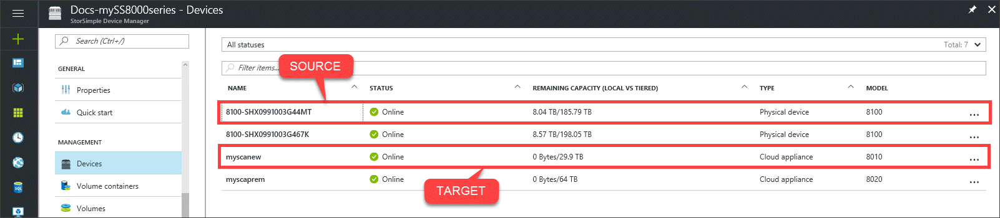
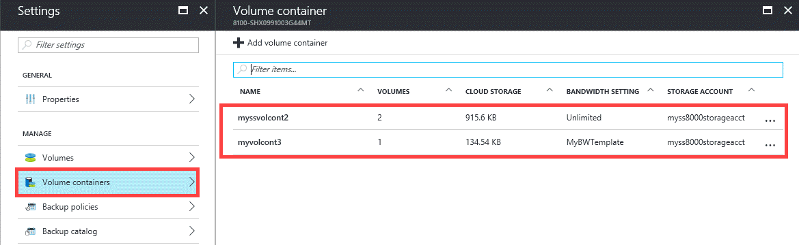
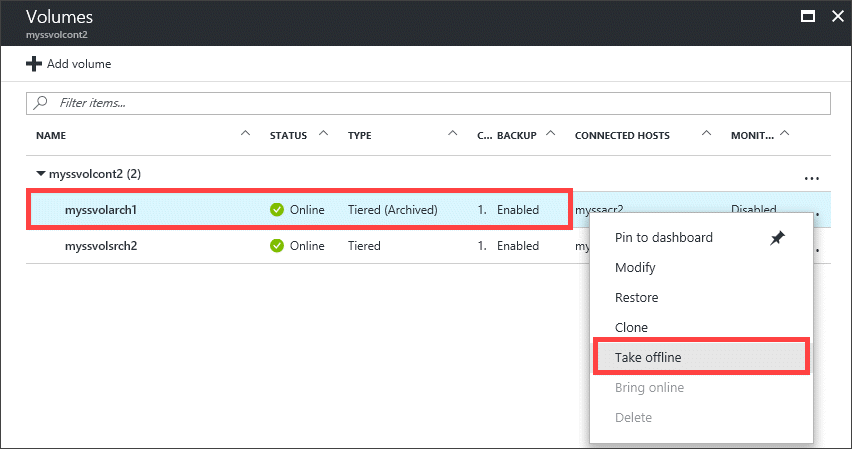
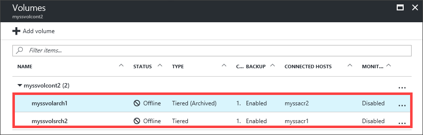
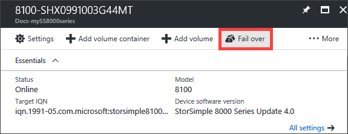
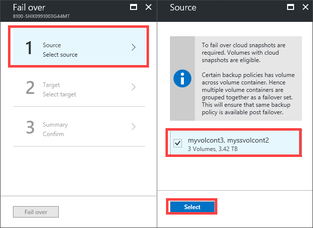
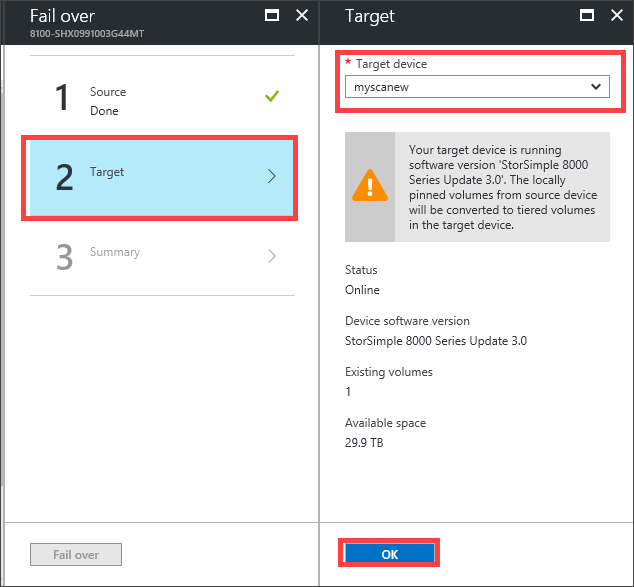
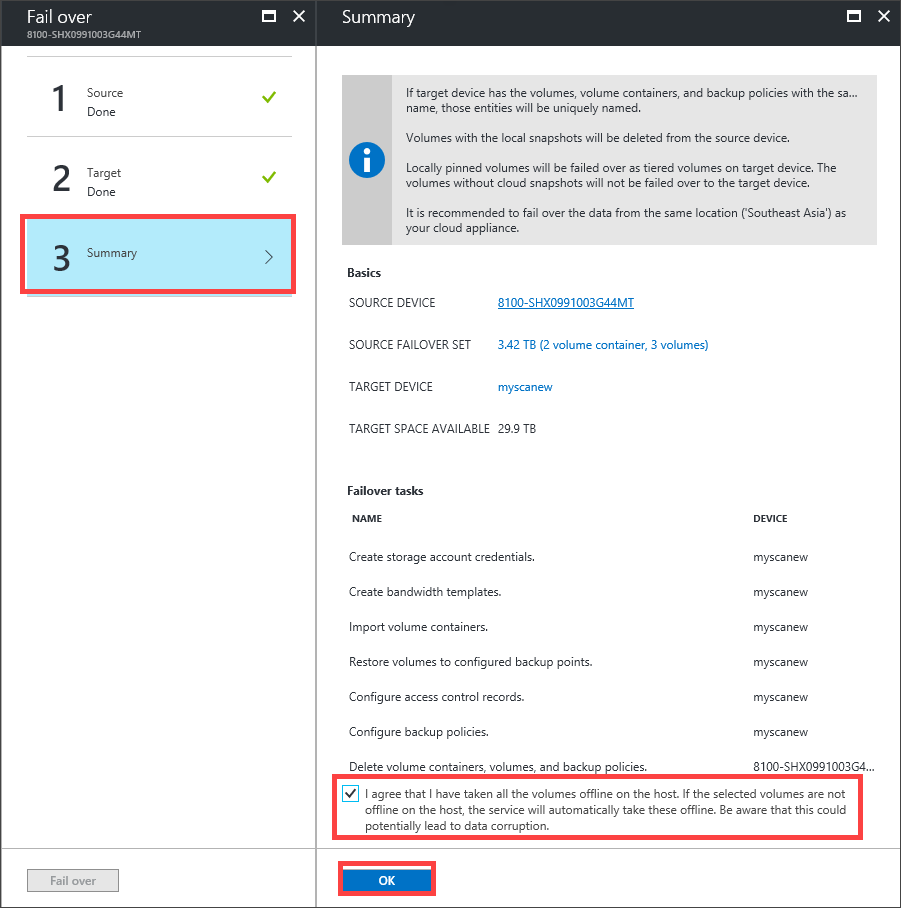
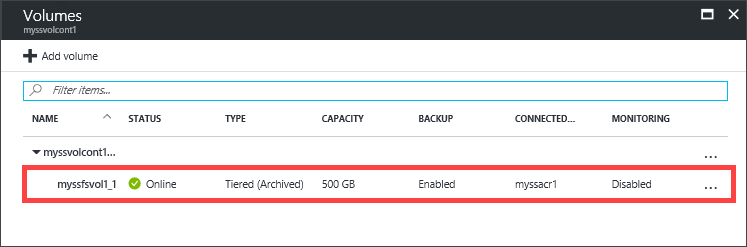

# Fail over to your StorSimple Cloud Appliance

## Overview

This tutorial describes the steps required to fail over a StorSimple 8000 series physical device to a StorSimple Cloud Appliance if there is a disaster. StorSimple uses the device failover feature to migrate data from a source physical device in the datacenter to a cloud appliance running in Azure. The guidance in this tutorial applies to StorSimple 8000 series physical devices and cloud appliances running software versions Update 3 and later.

To learn more about device failover and how it is used to recover from a disaster, go to [Failover and disaster recovery for StorSimple 8000 series devices](storsimple-8000-device-failover-disaster-recovery.md).

To fail over a StorSimple physical device to another physical device, go to [Fail over to a StorSimple physical device](storsimple-8000-device-failover-physical-device.md). To fail over a device to itself, go to [Fail over to the same StorSimple physical device](storsimple-8000-device-failover-same-device.md).

## Prerequisites

- Ensure that you have reviewed the considerations for device failover. For more information, go to [Common considerations for device failover](storsimple-8000-device-failover-disaster-recovery.md).

- You must have a StorSimple Cloud Appliance created and configured before running this procedure. If running   Update 3 software version or later, consider using an 8020 cloud appliance for the DR. The 8020 model has 64 TB and uses Premium Storage. For more information, go to [Deploy and manage a StorSimple Cloud Appliance](storsimple-8000-cloud-appliance-u2.md).

## Steps to fail over to a cloud appliance

Perform the following steps to restore the device to a target StorSimple Cloud Appliance.

1.  Verify that the volume container you want to fail over has associated cloud snapshots. For more information, go to [Use StorSimple Device Manager service to create backups](storsimple-8000-manage-backup-policies-u2.md).
2. Go to your StorSimple Device Manager service and click **Devices**. In the **Devices** blade, go to the list of devices connected with your service.
    
3. Select and click your source device. The source device has the volume containers that you want to fail over. Go to **Settings > Volume Containers**.

    
    
4. Select a volume container that you would like to fail over to another device. Click the volume container to display the list of volumes within this container. Select a volume, right-click, and click **Take Offline** to take the volume offline.

    

5. Repeat this process for all the volumes in the volume container.

     

6. Repeat the previous step for all the volume containers you would like to fail over to another device.

7. Go back to the **Devices** blade. From the command bar, click **Fail over**.

    
8. In the **Fail over** blade, perform the following steps:
   
    1. Click **Source**. Select the volume containers to fail over. **Only the volume containers with associated cloud snapshots and offline volumes are displayed.**
        
    2. Click **Target**. Select a target cloud appliance from the dropdown list of available devices. **Only the devices that have sufficient capacity to accommodate source volume containers are displayed in the list.**

        

    3. Review the failover settings under **Summary** and select the checkbox indicating that the volumes in selected volume containers are offline. 

        

9. A failover job is created. To monitor the failover job, click the job notification.

    

10. After the failover is completed, go back to the **Devices** blade.

    1. Select the device that was used as the target for the failover.

       

    2. Click **Volume Containers**. All the volume containers, along with the volumes from the old device, should be listed.

       If the volume container that you failed over has locally pinned volumes, those volumes are failed over as tiered volumes. Locally pinned volumes are not supported on a StorSimple Cloud Appliance.

       

## Next steps

* After you have performed a failover, you may need to [deactivate or delete your StorSimple device](storsimple-8000-deactivate-and-delete-device.md).

* For information about how to use the StorSimple Device Manager service, go to [Use the StorSimple Device Manager service to administer your StorSimple device](storsimple-8000-manager-service-administration.md).

