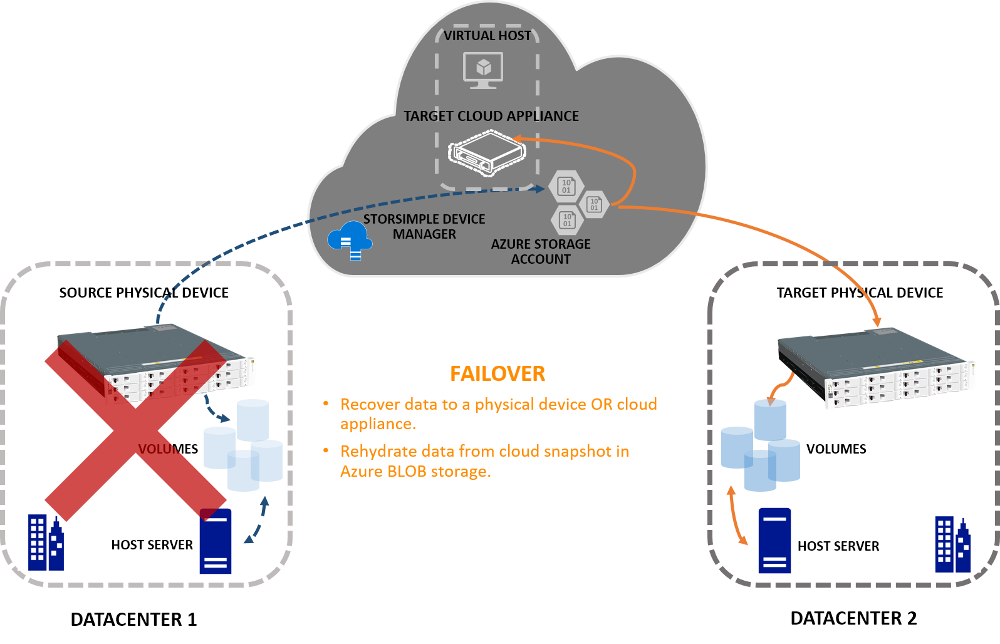

# Failover and disaster recovery for your StorSimple 8000 series device

## Overview

This article describes the device failover feature for the StorSimple 8000 series devices and how this feature can be used to recover StorSimple devices if a disaster occurs. StorSimple uses device failover to migrate the data from a source device in the datacenter to another target device. The guidance in this article applies to StorSimple 8000 series physical devices and cloud appliances running software versions Update 3 and later.

StorSimple uses the **Devices** blade to start the device failover feature in the event of a disaster. This blade lists all the StorSimple devices connected to your StorSimple Device Manager service.

## Disaster recovery (DR) and device failover

In a disaster recovery (DR) scenario, the primary device stops functioning. StorSimple uses the primary device as _source_ and moves the associated cloud data to another _target_ device. This process is referred to as the *failover*. The following graphic illustrates the process of failover.

The target device for a failover could be a physical device or even a cloud appliance. The target device may be located in the same or a different geographical location than the source device.

During the failover, you can select volume containers for migration. StorSimple then changes the ownership of these volume containers from the source device to the target device. Once the volume containers change ownership, StorSimple deletes these containers from the source device. After the deletion is complete, you can fail back the target device. _Failback_ transfers the ownership back to the original source device.

### Cloud snapshot used during device failover

Following a DR, the most recent cloud backup is used to restore the data to the target device. For more information on cloud snapshots, see [Use the StorSimple Device Manager service to take a manual backup](storsimple-8000-manage-backup-policies-u2.md#take-a-manual-backup).

On a StorSimple 8000 series, backup policies are associated with backups. If there are multiple backup policies for the same volume, then StorSimple selects the backup policy with the largest number of volumes. StorSimple then uses the most recent backup from the selected backup policy to restore the data on the target device.

Suppose there are two backup policies, *defaultPol* and *customPol*:

* *defaultPol*: One volume, *vol1*, runs daily starting at 10:30 PM.
* *customPol*: Four volumes, *vol1*, *vol2*, *vol3*, *vol4*, runs daily starting at 10:00 PM.

In this case, StorSimple prioritizes for crash-consistency and uses *customPol* as it has more volumes. The most recent backup from this policy is used to restore data. For more information on how to create and manage backup policies, go to [Use the StorSimple Device Manager service to manage backup policies](storsimple-8000-manage-backup-policies-u2.md).

## Common considerations for device failover

Before you fail over a device, review the following information:

* Before a device failover starts, all the volumes within the volume containers must be offline. In an unplanned failover, StotSimple volumes will automatically go offline. But if you are performing a planned failover (to test DR), you must take all the volumes offline.
* Only the volume containers that have an associated cloud snapshot are listed for DR. There must be at least one volume container with an associated cloud snapshot to recover data.
* If there are cloud snapshots that span across multiple volume containers, StorSimple fails over these volume containers as a set. In a rare instance, if there are local snapshots that span across multiple volume containers but associated cloud snapshots do not, StorSimple does fail over the local snapshots and the local data is lost after DR.
* The available target devices for DR are devices that have sufficient space to accommodate the selected volume containers. Any devices that do not have sufficient space, are not listed as target devices.
* After a DR (for a limited duration), the data access performance can be affected significantly, as the device needs to access the data from the cloud and store it locally.

#### Device failover across software versions

A StorSimple Device Manager service in a deployment may have multiple devices, both physical and cloud, all running different software versions.

Use the following table to determine if you can fail over or fail back to another device running a different software version and how the volume types behave during DR.

#### Failover and failback across software versions

| Fail over/ Fail back from | Physical device | Cloud appliance |
| --- | --- | --- |
| Update 3 to Update 4 |Tiered volumes fail over as tiered.   Locally pinned volumes fail over as locally pinned.    Following a failover when you take a snapshot on the Update 4 device, [heatmap-based tracking](storsimple-update4-release-notes.md#whats-new-in-update-4) kicks in. |Locally pinned volumes fail over as tiered. |
| Update 4 to Update 3 |Tiered volumes fail over as tiered.   Locally pinned volumes fail over as locally pinned.    Backups used to restore retain heatmap metadata.   Heatmap-based tracking is not available in Update 3 following a failback. |Locally pinned volumes fail over as tiered. |

## Device failover scenarios

If there is a disaster, you may choose to fail over your StorSimple device:

* [To a physical device](storsimple-8000-device-failover-physical-device.md).
* [To itself](storsimple-8000-device-failover-same-device.md).
* [To a cloud appliance](storsimple-8000-device-failover-cloud-appliance.md).

The preceding articles provide detailed steps for each of the above failover cases.

## Failback

For Update 3 and later versions, StorSimple also supports failback. Failback is just the reverse of failover, the target becomes the source and the original source device during the failover now becomes the target device. 

During failback, StorSimple re-synchronizes the data back to the primary location, halts the I/O and application activity, and transitions back to the original location.

After a failover is complete, StorSimple performs the following actions:

* StorSimple cleans the volume containers that are failed over from the source device.
* StorSimple initiates a background job per volume container (failed over) on the source device. If you attempt to fail back while the job is in progress, you receive a notification to that effect. Wait until the job is complete to start the failback.
* The time taken to complete the deletion of volume containers depends on various factors such as amount of data, age of the data, number of backups, and the network bandwidth available for the operation.

If you are planning test failovers or test failbacks, we recommend that you test volume containers with less data (Gbs). Usually, you can start the failback 24 hours after the failover is complete.

## Frequently asked questions

Q. **What happens if the DR fails or has partial success?**

A. If the DR fails, we recommend that you try again. The second device failover job is aware of the progress of the first job and starts from that point onwards.

Q. **Can I delete a device while the device failover is in progress?**

A. You cannot delete a device while a DR is in progress. You can only delete your device after the DR is complete. You can monitor the device failover job progress in the **Jobs** blade.

Q. **When does the garbage collection start on the source device so that the local data on source device is deleted?**

A. Garbage collection is enabled on the source device only after the device is completely cleaned. The cleanup includes cleaning up objects that have failed over from the source device such as volumes, backup objects (not data), volume containers, and policies.

Q. **What happens if the delete job associated with the volume containers in the source device fails?**

A.  If the delete job fails, then you can manually delete the volume containers. In the **Devices** blade, select your source device and click **Volume containers**. Select the volume containers that you failed over and in the bottom of the blade, click **Delete**. After you have deleted all the failed over volume containers on the source device, you can start the failback. For more information, go to [Delete a volume container](storsimple-8000-manage-volume-containers.md#delete-a-volume-container).

## Business continuity disaster recovery (BCDR)

A business continuity disaster recovery (BCDR) scenario occurs when the entire Azure datacenter stops functioning. This scenario can affect your StorSimple Device Manager service and the associated StorSimple devices.

If a StorSimple device was registered just before a disaster occurred, then this device may need to undergo a factory reset. After the disaster, the StorSimple device shows up in the Azure portal as offline. This device must be deleted from the portal. Reset the device to factory defaults and register it again with the service.

## Next steps

If you are ready to perform a device failover, choose one of the following scenarios for detailed instructions:

- [Fail over to another physical device](storsimple-8000-device-failover-physical-device.md)
- [Fail over to the same device](storsimple-8000-device-failover-same-device.md)
- [Fail over to StorSimple Cloud Appliance](storsimple-8000-device-failover-cloud-appliance.md)

If you have failed over your device, choose from one of the following options:

* [Deactivate or delete your StorSimple device](storsimple-8000-deactivate-and-delete-device.md).
* [Use the StorSimple Device Manager service to administer your StorSimple device](storsimple-8000-manager-service-administration.md).

