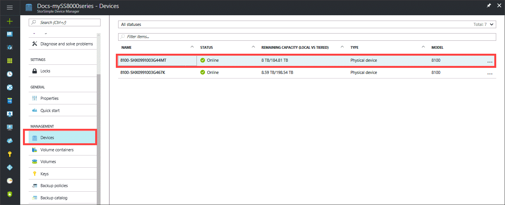
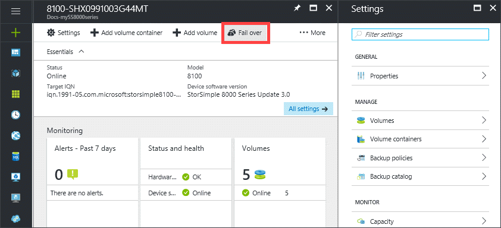
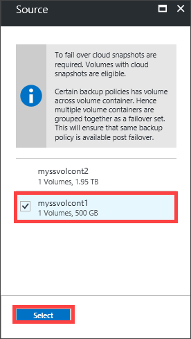
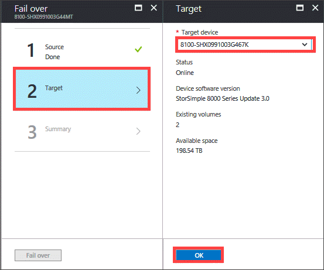
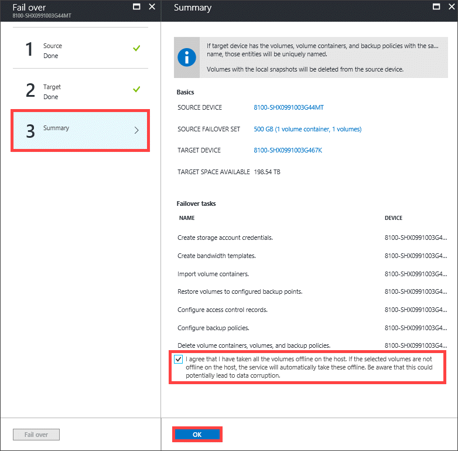
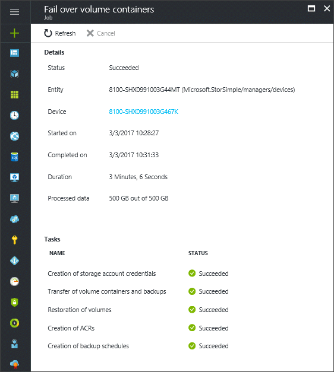
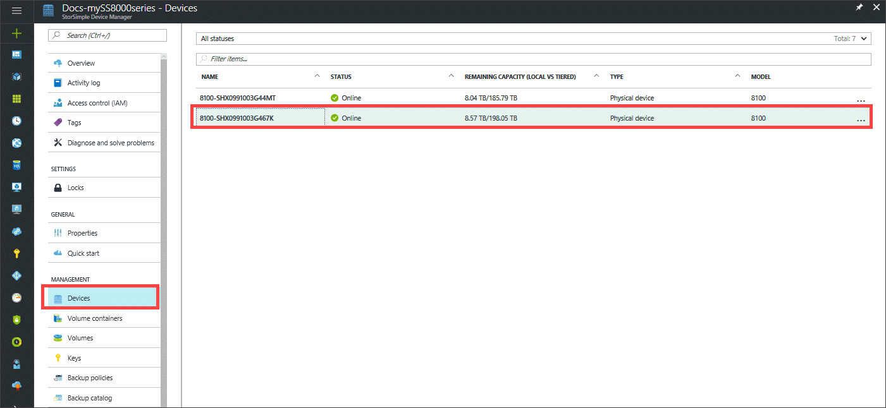
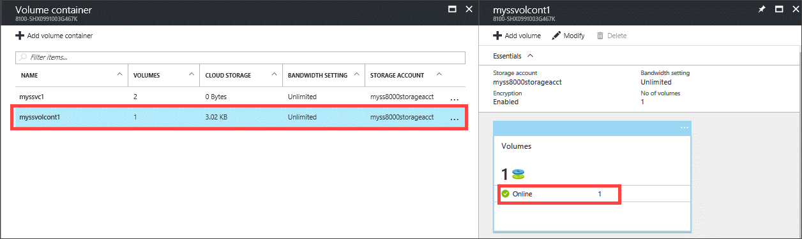

# Fail over to a StorSimple 8000 series physical device

## Overview

This tutorial describes the steps required to fail over a StorSimple 8000 series physical device to another StorSimple physical device if there is a disaster. StorSimple uses the device failover feature to migrate data from a source physical device in the datacenter to another physical device. The guidance in this tutorial applies to StorSimple 8000 series physical devices running software versions Update 3 and later.

To learn more about device failover and how it is used to recover from a disaster, go to [Failover and disaster recovery for StorSimple 8000 series devices](storsimple-8000-device-failover-disaster-recovery.md).

To fail over a StorSimple physical device to a StorSimple Cloud Appliance, go to [Fail over to a StorSimple Cloud Appliance](storsimple-8000-device-failover-cloud-appliance.md). To fail over a physical device to itself, go to [Fail over to the same StorSimple physical device](storsimple-8000-device-failover-same-device.md).

## Prerequisites

- Ensure that you have reviewed the considerations for device failover. For more information, go to [Common considerations for device failover](storsimple-8000-device-failover-disaster-recovery.md).

- You must have a StorSimple 8000 series physical device deployed in the datacenter. The device must run Update 3 or later software version. For more information, go to [Deploy your on-premises StorSimple device](storsimple-8000-deployment-walkthrough-u2.md).

## Steps to fail over to a physical device

Perform the following steps to restore your device to a target physical device.

1. Verify that the volume container you want to fail over has associated cloud snapshots. For more information, go to [Use StorSimple Device Manager service to create backups](storsimple-8000-manage-backup-policies-u2.md).
2. Go to your StorSimple Device Manager and then click **Devices**. In the **Devices** blade, go to the list of devices connected with your service.
    
3. Select and click your source device. The source device has the volume containers that you want to fail over. Go to **Settings > Volume Containers**.
4. Select a volume container that you would like to fail over to another device. Click the volume container to display the list of volumes within this container. Select a volume, right-click, and click **Take Offline** to take the volume offline. Repeat this process for all the volumes in the volume container.
5. Repeat the previous step for all the volume containers you would like to fail over to another device.
6. Go back to the **Devices** blade. From the command bar, click **Fail over**.
    
    
7. In the **Fail over** blade, perform the following steps:
   
   1. Click **Source**. The volume containers with volumes associated with cloud snapshots are displayed. Only the containers displayed are eligible for failover. In the list of volume containers, select the volume containers you would like to fail over. **Only the volume containers with associated cloud snapshots and offline volumes are displayed.**

       
   2. Click **Target**. For the volume containers selected in the previous step, select a target device from the drop-down list of available devices. Only the devices that have sufficient capacity to accommodate source volume containers are displayed in the list.

        

   3. Finally, review all the failover settings under **Summary**. After you have reviewed the settings, select the checkbox indicating that the volumes in selected volume containers are offline. Click **OK**.

       
  
8. StorSimple creates a failover job. Click the job notification to monitor the failover job via the **Jobs** blade.

    If the volume container that you failed over has local volumes, then you see individual restore jobs for each local volume (not for tiered volumes) in the container. These restore jobs may take quite some time to complete. It is likely that the failover job may complete earlier. These volumes will have local guarantees only after the restore jobs are complete.

    

9. After the failover is completed, go to the **Devices** blade.
   
   1. Select the device that was used as the target device for the failover process.

       

   2. Go to the **Volume Containers** blade. All the volume containers, along with the volumes from the old device, should be listed.

       

## Next steps

* After you have performed a failover, you may need to [deactivate or delete your StorSimple device](storsimple-8000-deactivate-and-delete-device.md).
* For information about how to use the StorSimple Device Manager service, go to [Use the StorSimple Device Manager service to administer your StorSimple device](storsimple-8000-manager-service-administration.md).

