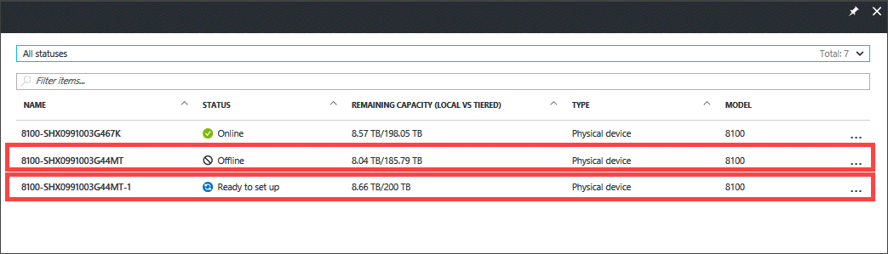
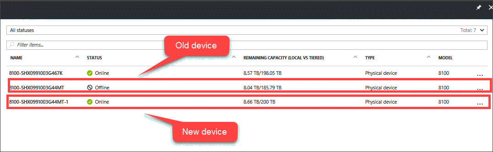
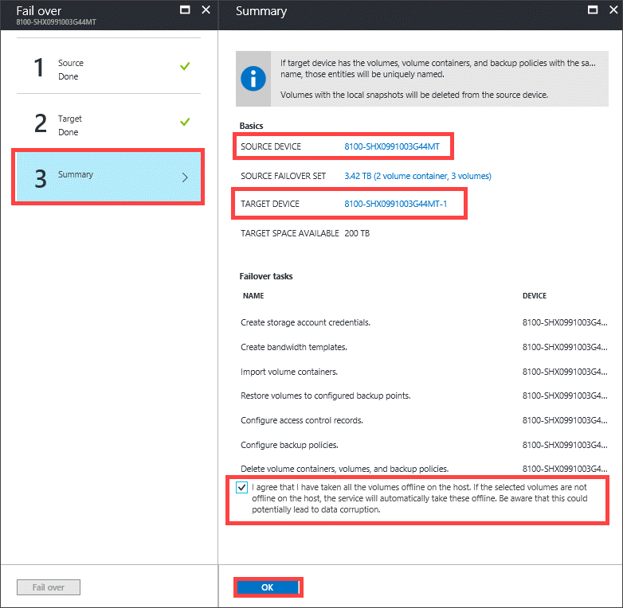
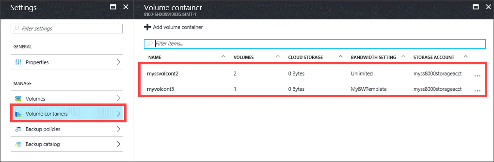
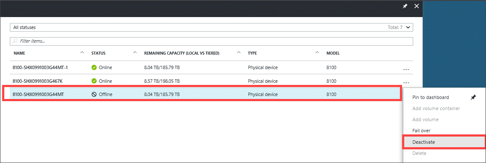
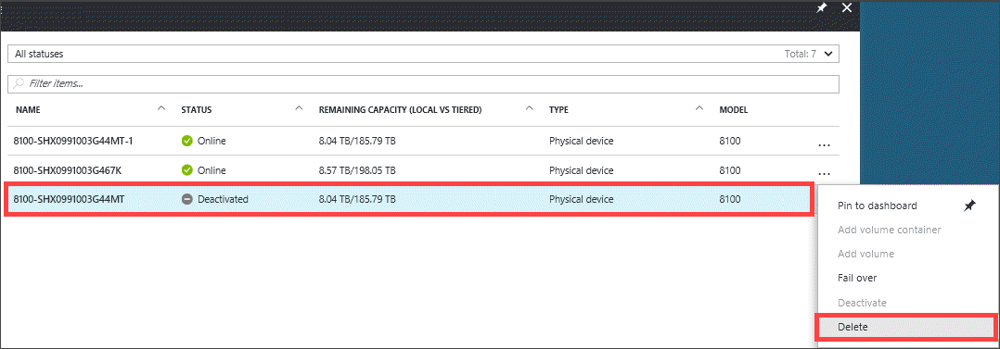

# Fail over your StorSimple physical device to same device

## Overview

This tutorial describes the steps required to fail over a StorSimple 8000 series physical device to itself if there is a disaster. StorSimple uses the device failover feature to migrate data from a source physical device in the datacenter to another physical device. The guidance in this tutorial applies to StorSimple 8000 series physical devices running software versions Update 3 and later.

To learn more about device failover and how it is used to recover from a disaster, go to [Failover and disaster recovery for StorSimple 8000 series devices](storsimple-8000-device-failover-disaster-recovery.md).

To fail over a physical device to another physical device, go to [Fail over to the same StorSimple physical device](storsimple-8000-device-failover-physical-device.md). To fail over a StorSimple physical device to a StorSimple Cloud Appliance, go to [Fail over to a StorSimple Cloud Appliance](storsimple-8000-device-failover-cloud-appliance.md).

## Prerequisites

- Ensure that you have reviewed the considerations for device failover. For more information, go to [Common considerations for device failover](storsimple-8000-device-failover-disaster-recovery.md).

## Steps to fail over to the same device

Perform the following steps if you need to fail over to the same device.

1. Take cloud snapshots of all the volumes in your device. For more information, go to [Use StorSimple Device Manager service to create backups](storsimple-8000-manage-backup-policies-u2.md).
2. Reset your device to factory defaults. Follow the detailed instructions in [how to reset a StorSimple device to factory default settings](storsimple-8000-manage-device-controller.md#reset-the-device-to-factory-default-settings).
3. Go to the StorSimple Device Manager service and then select **Devices**. In the **Devices** blade, the old device should show as **Offline**.

    

4. Configure your device and register it again with your StorSimple Device Manager service. The newly registered device should show as **Ready to set up**. The device name for the new device is the same as the old device but appended with a numeral to indicate that the device was reset to factory default and registered again.

    
5. For the new device, complete the device setup. For more information, go to [Step 4: Complete minimum device setup](storsimple-8000-deployment-walkthrough-u2.md#step-4-complete-minimum-device-setup). On the **Devices** blade, the status of the device changes to **Online**.

   > [!IMPORTANT]
   > **Complete the minimum configuration first, or your DR may fail.**

    

6. Select the old device (status offline) and from the command bar, click **Fail over**. In the **Fail over** blade, select old device as the source and specify the target device as the newly registered device.

    

    For detailed instructions, refer to Fail over to another physical device.

7. A device restore job is created that you can monitor from the **Jobs** blade.

8. After the job has successfully completed, access the new device and navigate to the **Volume containers** blade. Verify that all the volume containers from the old device have migrated to the new device.

   

9. After the failover is complete, you can deactivate and delete the old device from the portal. Select the old device (offline), right-click, and then select **Deactivate**. After the device is deactivated, the status of the device is updated.

     

10. Select the deactivated device, right-click, and then select **Delete**. This deletes the device from the list of devices.

    

## Next steps

* After you have performed a failover, you may need to [deactivate or delete your StorSimple device](storsimple-8000-deactivate-and-delete-device.md).
* For information about how to use the StorSimple Device Manager service, go to [Use the StorSimple Device Manager service to administer your StorSimple device](storsimple-8000-manager-service-administration.md).

