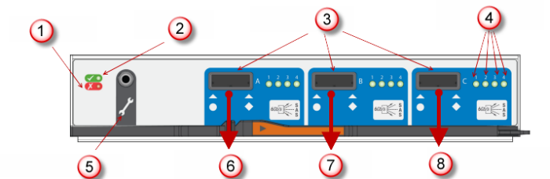
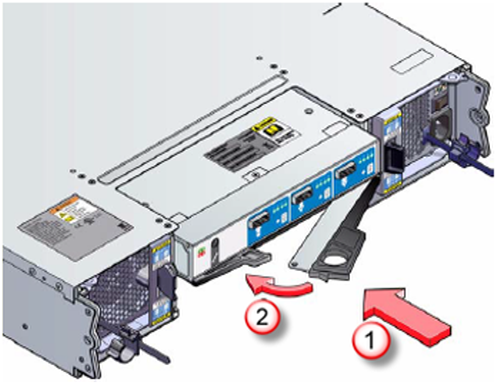
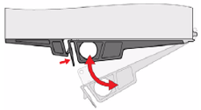
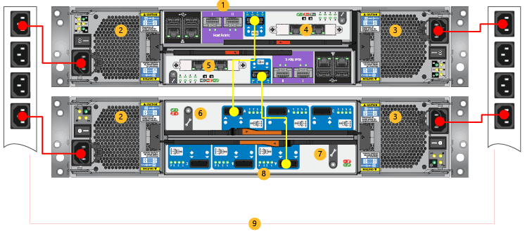

# Replace an EBOD controller on your StorSimple device

## Overview
This tutorial explains how to replace a faulty EBOD controller module on your Microsoft Azure StorSimple device. To replace an EBOD controller module, you need to:

* Remove the faulty EBOD controller
* Install a new EBOD controller

Consider the following information before you begin:

* Blank EBOD modules must be inserted into all unused slots. The enclosure will not cool properly if a slot is left open.
* The EBOD controller is hot-swappable and can be removed or replaced. Do not remove a failed module until you have a replacement. When you initiate the replacement process, you must finish it within 10 minutes.

> [!IMPORTANT]
> Before attempting to remove or replace any StorSimple component, make sure that you review the [safety icon conventions](storsimple-8000-safety.md#safety-icon-conventions) and other [safety precautions](storsimple-8000-safety.md).

## Remove an EBOD controller
Before replacing the failed EBOD controller module in your StorSimple device, make sure that the other EBOD controller module is active and running. The following procedure and table explain how to remove the EBOD controller module.

#### To remove an EBOD module
1. Open the Azure portal.
2. Go to your device and navigate to **Settings** > **Hardware health**, and verify that the status of the LED for the active EBOD controller module is green and the LED for the failed EBOD controller module is red.
3. Locate the failed EBOD controller module at the back of the device.
4. Remove the cables that connect the EBOD controller module to the controller before taking the EBOD module out of the system.
5. Make a note of the exact SAS port of the EBOD controller module that was connected to the controller. You will be required to restore the system to this configuration after you replace the EBOD module.
   
   > [!NOTE]
   > Typically, this will be Port A, which is labeled as **Host in** in the following diagram.
   
    
   
     **Figure 1** Back of EBOD module
   
   | Label | Description |
   |:--- |:--- |
   | 1 |Fault LED |
   | 2 |Power LED |
   | 3 |SAS connectors |
   | 4 |SAS LEDs |
   | 5 |Serial ports for factory use only |
   | 6 |Port A (Host in) |
   | 7 |Port B (Host out) |
   | 8 |Port C (Factory use only) |

## Install a new EBOD controller
The following procedure and table explain how to install an EBOD controller module in your StorSimple device.

#### To install an EBOD controller
1. Check the EBOD device for damage, especially to the interface connector. Do not install the new EBOD controller if any pins are bent.
2. With the latches in the open position, slide the module into the enclosure until the latches engage.
   
    
   
    **Figure 2**  Installing the EBOD controller module
3. Close the latch. You should hear a click as the latch engages.
   
    
   
    **Figure 3**  Closing the EBOD module latch
4. Reconnect the cables. Use the exact configuration that was present before the replacement. See the following diagram and table for details about how to connect the cables.
   
    
   
    **Figure 4**. Reconnecting cables
   
   | Label | Description |
   |:--- |:--- |
   | 1 |Primary enclosure |
   | 2 |PCM 0 |
   | 3 |PCM 1 |
   | 4 |Controller 0 |
   | 5 |Controller 1 |
   | 6 |EBOD controller 0 |
   | 7 |EBOD controller 1 |
   | 8 |EBOD enclosure |
   | 9 |Power Distribution Units |

## Next steps
Learn more about [StorSimple hardware component replacement](storsimple-8000-hardware-component-replacement.md).

