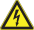
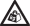
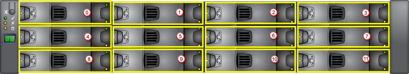
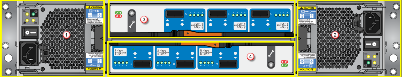

# Replace a hardware component on your StorSimple 8000 series device

## Overview
The hardware component replacement tutorials describe the hardware components of your Microsoft Azure StorSimple 8000 series device and the steps necessary to remove and replace them. This article describes the safety icons, provides pointers to the detailed tutorials, and lists the components that are replaceable.

> [!IMPORTANT]
> Before attempting to remove or replace any StorSimple component, make sure that you review the [safety icon conventions](#safety-icon-conventions) and other [safety precautions](storsimple-8000-safety.md).

### Safety icon conventions

The following table describes the safety icons used in these tutorials. Pay close attention to these safety icons as you go through the steps to remove and replace device components.

| Icon | Text | Additional information |
|:--- |:--- |:--- |
|  |**DANGER!** |Indicates a hazardous situation that, if not avoided, will result in death or serious injury. This signal word is limited to the most extreme situations. |
|  |**WARNING!** |Indicates a hazardous situation that, if not avoided, could result in death or serious injury. |
|  |**CAUTION!** |Indicates a hazardous situation that, if not avoided, could result in minor or moderate injury. |
|  |**NOTICE:** |Indicates information considered important, but not hazard-related. |
|  |**Electrical Shock Hazard** |Indicates high voltage. |
|  |**Heavy Weight** | |
|  |**No User Serviceable Parts** |Do not access unless properly trained. |
|  |**Read All Instructions First** | |
|  |**Tip Hazard** | |

### Before you begin

Familiarize yourself with the safety information about your device and safety icons used in this tutorial. Go to [Safely install and operate your StorSimple device](storsimple-8000-safety.md) for complete information. Be sure to review the [Safety precautions](storsimple-8000-safety.md#handling-precautions) before you handle your StorSimple device.

Before you attempt to replace a component, consider the following information.

  **WARNING!**

* Ground yourself properly by using an electrostatic discharge or antistatic mat when handling modules and components of your StorSimple device.
* Do not touch any circuitry. Use the supplied handles and guides while handling components that may have exposed circuitry.

  **NOTICE:**

When you replace a module, **NEVER leave an empty bay in the rear of the enclosure**. Obtain a replacement or blank module before removing the problem part.

## Hardware component replacement procedures

Your StorSimple 8000 series device consists of several plug-in modules in the primary and/or EBOD enclosures. The 8100 has a single primary enclosure, whereas the 8600 is a dual enclosure device with a primary enclosure and an EBOD enclosure.

The main hardware components in your device are summarized in the following tables. Click the link in the **Replacement procedure** column to go to the associated tutorial.

| Components | # Present | Plug-in module? | Replacement procedure |
|:--- |:--- |:--- |:--- |
| Chassis |1 |No |[Replace the chassis on your StorSimple device](storsimple-8000-chassis-replacement.md) |
| Primary controllers |2 |Yes |[Replace a controller module on your StorSimple device](storsimple-8000-controller-replacement.md) |
| 764W Power and Cooling Modules (PCMs) |2 |Yes |[Replace a Power and Cooling Module on your StorSimple device](storsimple-8000-power-cooling-module-replacement.md) |
| Backup battery |2 |Yes |[Replace the backup battery module on your StorSimple device](storsimple-8000-battery-replacement.md) |
| Disk drives |12 |Yes |[Replace a disk drive on your StorSimple device](storsimple-8000-disk-drive-replacement.md) |

**Table 1** Hardware components in the primary enclosure

The primary enclosure and the EBOD enclosure differ in their I/O modules. Additionally, the PCMs have different wattage. The PCMs in the primary enclosure are 764 W, whereas those in the EBOD enclosure are 580 W. The PCMs in the primary enclosure also contain a backup battery module.

| Components | # Present | Plug-in module? | Replacement procedure |
|:--- |:--- |:--- |:--- |
| Chassis |1 |No |[Replace the chassis on your StorSimple device](storsimple-8000-chassis-replacement.md) |
| EBOD controllers |2 |Yes |[Replace an EBOD controller on your StorSimple device](storsimple-8000-ebod-controller-replacement.md) |
| 580W Power and Cooling Modules (PCMs) |2 |Yes |[Replace a Power and Cooling Module on your StorSimple device](storsimple-8000-power-cooling-module-replacement.md) |
| Disk drives |12 |Yes |[Replace a disk drive on your StorSimple device](storsimple-8000-disk-drive-replacement.md) |

**Table 2** Hardware components in the EBOD enclosure

The plug-in modules on the device are highlighted in the following front and rear diagrams. You can use these diagrams to determine the location of the various plug-in modules if a replacement is required. The front diagram shows the disk drives, and the rear diagrams of the EBOD enclosure and the primary enclosure show the plug-in modules.

**Figure 1** Front of the device

| Label | Description |
|:--- |:--- |
| 0 - 11 |Disk drives (total of 12) |

Both the primary enclosure and the EBOD enclosure have drive carrier modules. The chassis houses twelve 3.5" disk drives arranged in a 3 by 4 format.

**Figure 2** Back of the primary enclosure

| Label | Description |
|:--- |:--- |
| 1 |PCM 0 |
| 2 |PCM 1 |
| 3 |Controller 0 |
| 4 |Controller 1 |

**Figure 3** Back of the EBOD enclosure

| Label | Description |
|:--- |:--- |
| 1 |PCM 0 |
| 2 |PCM 1 |
| 3 |EBOD Controller 0 |
| 4 |EBOD Controller 1 |

## Field replaceable units

The following field replaceable units (FRUs) are available for your StorSimple device:

* Chassis (including the integrated operations panel)
* 764 W AC PCM
* 580 W AC PCM
* Hard disk drive with drive carrier module
* Controller module
* EBOD controller module
* Backup battery module
* Rack mounting rail kit

Please [contact Microsoft Support](storsimple-8000-contact-microsoft-support.md) to order any of these replacement units.

## Next steps

Review all [safety information](storsimple-8000-safety.md) before you attempt to replace a StorSimple hardware component.
