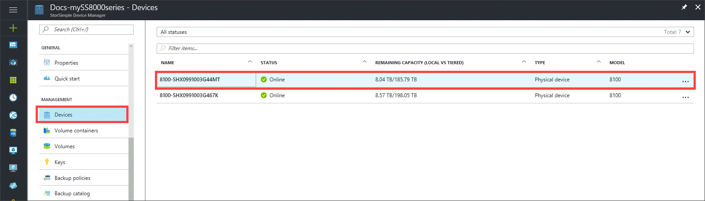
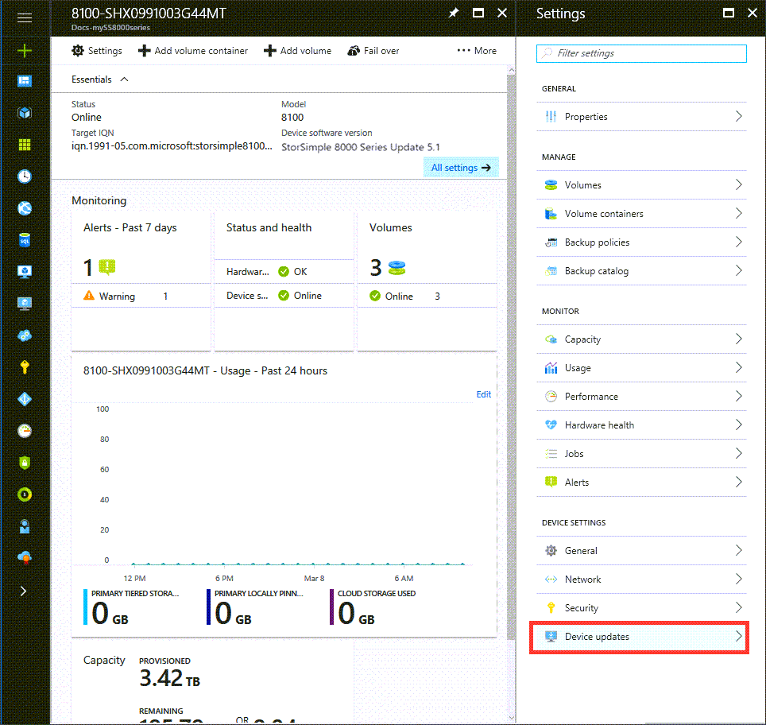
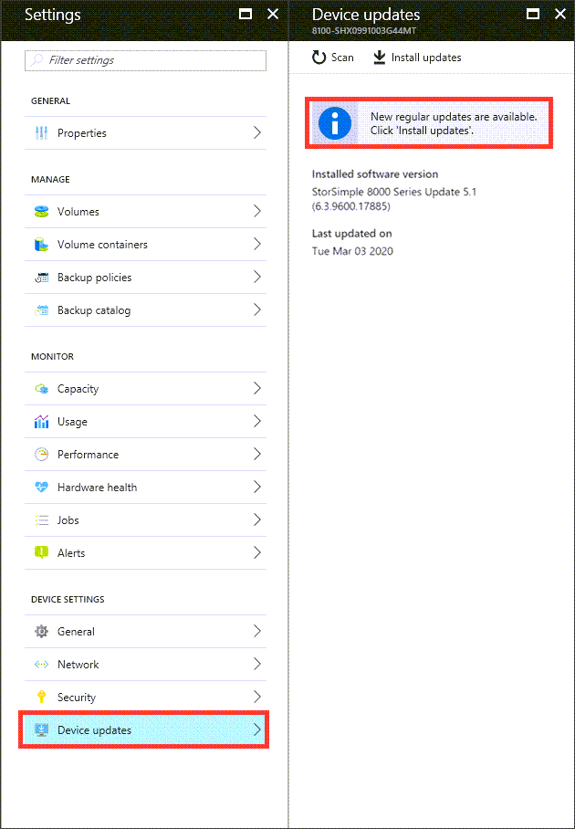
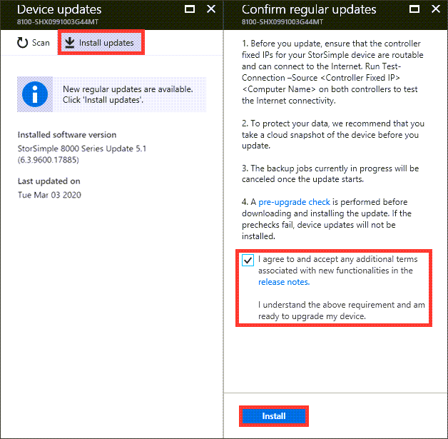
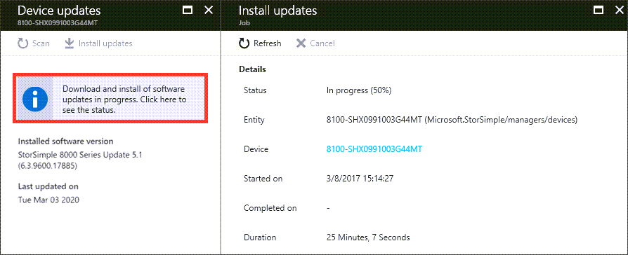
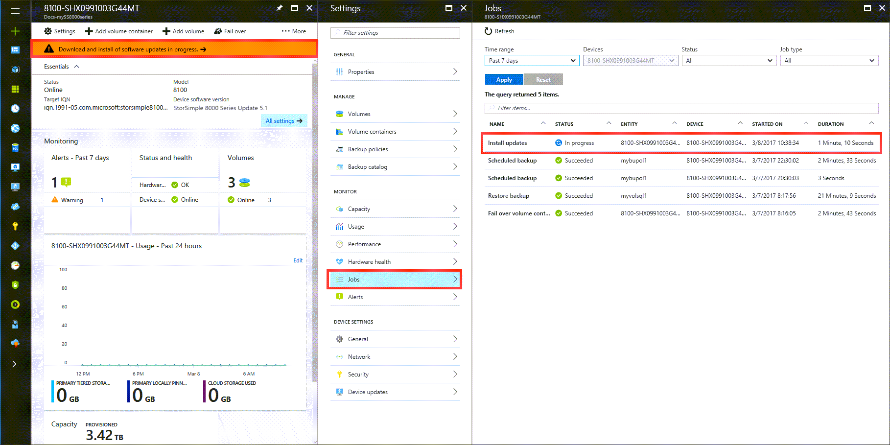

# Install Update 5.1 on your StorSimple device

## Overview

This tutorial explains how to install Update 5.1 on a StorSimple device running an earlier software version via the Azure portal or the hotfix method.

Update 5.1 includes non-disruptive security updates that can be applied through the Azure portal or by the hotfix method.

If you apply Update 5.1 from the Azure portal, manual and automatic pre-checks are done to determine the device health in terms of hardware state and network connectivity. These pre-checks occur only when you apply the updates from the Azure portal.

If you'd rather use the hotfix method, we strongly recommend that you install Update 5 first using the instructions in [Install Update 5 on your StorSimple device](storsimple-8000-install-update-5.md). Then follow the steps in [Install Update 5.1 as a hotfix](#install-update-51-as-a-hotfix), below, to install Update 5.1.

The security updates in Update 5.1 take about 30 minutes to install.

> [!IMPORTANT]
> * Update 5.1 is a mandatory update and should be installed immediately. For more information, see [Update 5.1 release notes](storsimple-update51-release-notes.md).
> * Update 5 is a minimally supported version.

> [!NOTE]
> * We recommend that you install the software and other regular updates via the Azure portal. <!--You should only go to the Windows PowerShell interface of the device (to install updates) if the pre-update gateway check fails in the portal. Depending upon the version you are updating from, the updates may take 4 hours (or greater) to install. The maintenance mode updates must be installed through the Windows PowerShell interface of the device. As maintenance mode updates are disruptive updates, these result in a down time for your device. - N/A FOR 5.1? No maintenance mode updates, and the security updates go quickly.-->
> * If you plan to install using the hotfix method, you must contact [Microsoft Support](mailto:support@microsoft.com) before you begin the installation.

[!INCLUDE [storsimple-preparing-for-update](../../includes/storsimple-preparing-for-updates.md)]

## Install Update 5.1 through the Azure portal

Perform the following steps to update your device to [Update 5.1](storsimple-update51-release-notes.md).

> [!NOTE]
> Microsoft pulls additional diagnostic information from the device. As a result, when our operations team identifies devices that are having problems, we are better equipped to collect information from the device and diagnose issues.

#### To install an update from the Azure portal

1. On the StorSimple service page, select your device.

    

2. Navigate to **Device settings** > **Device updates**.

    

3. A notification appears if new updates are available. Alternatively, in the **Device updates** blade, click **Scan Updates**. A job is created to scan for available updates. You are notified when the job completes successfully.

    

4. We recommend that you review the release notes before you apply an update on your device. To apply updates, click **Install updates**. In the **Confirm regular updates** blade, review the prerequisites to complete before you apply updates. Select the checkbox to indicate that you are ready to update the device and then click **Install**.

    

5. A set of prerequisite checks starts. These checks include:
   
   * **Controller health checks** to verify that both the device controllers are healthy and online.
   * **Hardware component health checks** to verify that all the hardware components on your StorSimple device are healthy.
   * **DATA 0 checks** to verify that DATA 0 is enabled on your device. If this interface is not enabled, you must enable it and then retry.

     The update is downloaded and installed only if all the checks are successfully completed. You are notified when the checks are in progress. If the prechecks fail, then you will be provided with the reasons for failure. Address those issues and then retry the operation. You may need to contact Microsoft Support if you cannot address these issues by yourself.

6. After the prechecks are successfully completed, an update job is created. You are notified when the update job is successfully created.
   
    
   
    The update is then applied on your device.

7. The update takes a few hours to complete. Select the update job and click **Details** to view the details of the job at any time.

    

     You can also monitor the progress of the update job from **Device settings > Jobs**. On the **Jobs** blade, you can see the update progress.

     

8. After the job is complete, navigate to the **Device settings > Device updates**. The software version should now be updated.

   Verify that your device is running **StorSimple 8000 Series Update 5.1 (6.3.9600.17885)** and the **Last updated date** is today's date.

## Install Update 5.1 as a hotfix

If you want to install Update 5.1 as a hotfix, do these steps before you begin the installation:

* Install Update 5 before you install Update 5.1. For instructions, see [Install Update 5 on your StorSimple device](storsimple-8000-install-update-5.md).
* Before you begin the hotfix installation, contact [Microsoft Support](mailto:support@microsoft.com).

The hotfix method involves the following steps:

1. Download the hotfix from the Microsoft Update Catalog.
2. Install and verify the regular mode hotfix.
3. Install and verify the maintenance mode hotfix.

#### Download updates for your device

You must download and install the following hotfixes to the suggested folders in the prescribed order.

| Order | KB       | Description | Update type | Install time |Install in folder|
|-------|----------|------------ |-------------|--------------|----- |
|1.     |KB4542887|Software update Download both _HcsSoftwareUpdate.exe_ and _CisMSDAgent.exe_ |Regular   Non-disruptive |~ 25 mins |FirstOrderUpdate|
|3.1, 2     |KB4037263|Disk firmware|Maintenance   Disruptive|~ 30 mins|ThirdOrderUpdate|

1 There are no second order updates in Update 5.1.

2 Install the third order updates if you didn't install disk firmware updates on top of the hotfix updates for Update 5.

Perform the following steps to download and install the hotfixes.

#### Download hotfixes

To download the hotfixes, see [To download hotfixes](storsimple-8000-install-update-5.md#to-download-hotfixes).

#### Install and verify device updates

Install the device updates in KB4542887 by following the steps in [To install and verify regular mode hotfixes](storsimple-8000-install-update-5.md#to-install-and-verify-regular-mode-hotfixes) in **Install Update 5 on your StorSimple device**.

> [!IMPORTANT]
> If you haven't yet contacted [Microsoft Support](mailto:support@microsoft.com), you must do that now, before you install the hotfixes.

Follow the steps to install first order updates. There are no second order updates in Update 5.1.

For Update 5.1, check for these software versions after installing:

 * FriendlySoftwareVersion: StorSimple 8000 Series Update 5.1
 * HcsSoftwareVersion: 6.3.9600.17885
 * CisAgentVersion: 1.0.9777.0
 * MdsAgentVersion: 35.2.2.0
 * Lsisas2Version: 2.0.78.00

#### Install and verify disk firmware updates

If you didn't install disk firmware updates when you installed Update 5, install the disk firmware updates in KB4037263 by following the steps in [To install and verify regular mode hotfixes](storsimple-8000-install-update-5.md#to-install-and-verify-maintenance-mode-hotfixes) in **Install Update 5 on your StorSimple device**.

You don't need to install disk firmware updates if you're running these firmware versions: `XMGJ`, `XGEG`, `KZ50`, `F6C2`, `VR08`, `N003`, `0107`.

To verify whether you need the disk firmware updates, run the `Get-HcsFirmwareVersion` cmdlet.

## Next steps

Learn more about the [Update 5.1 release](storsimple-update51-release-notes.md).
