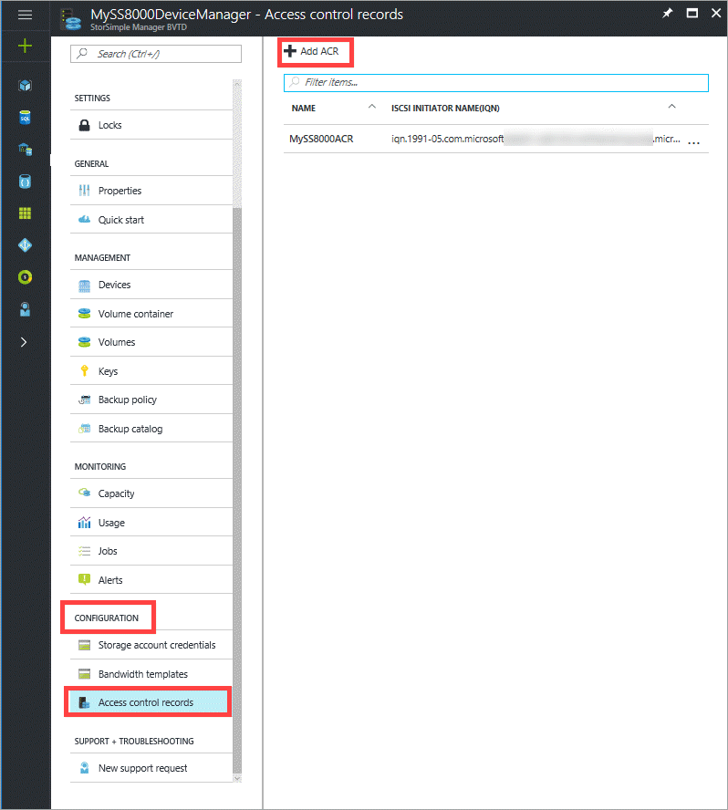
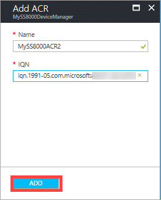
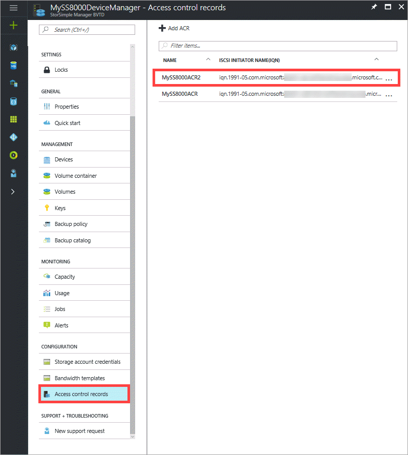
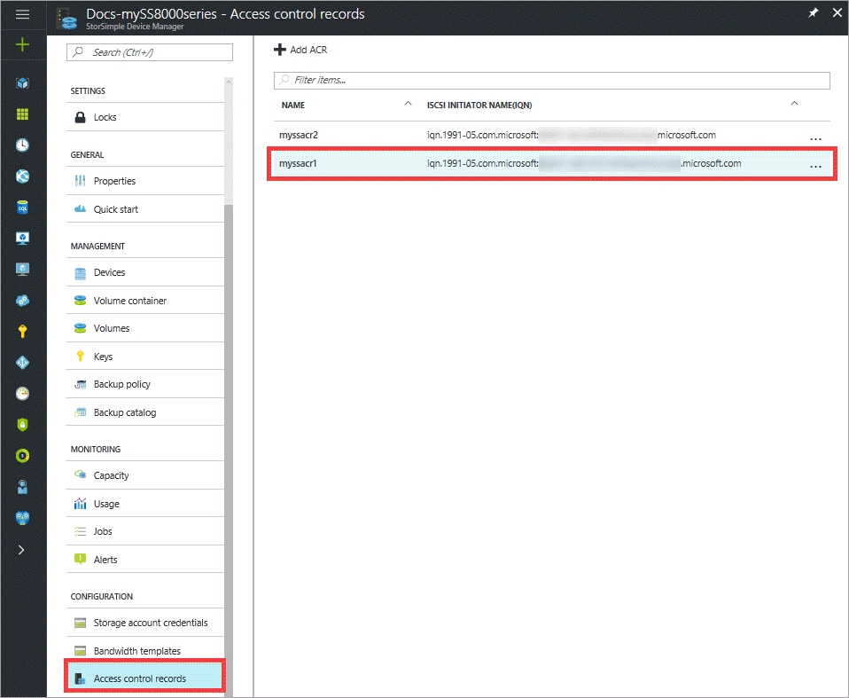
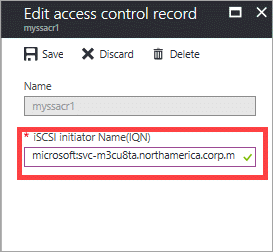
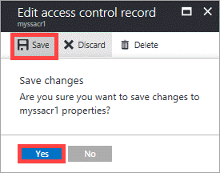
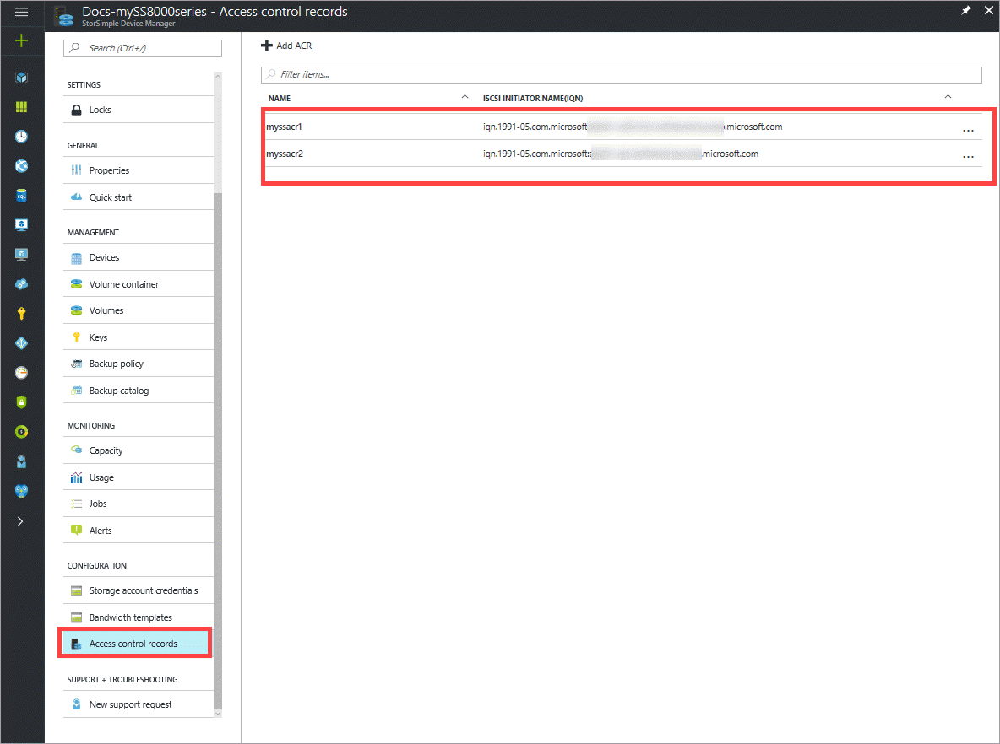
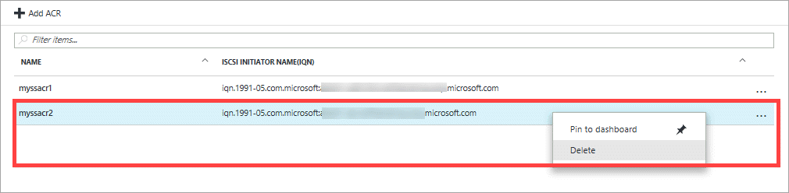
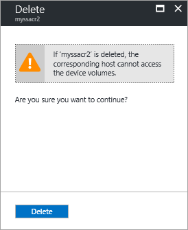
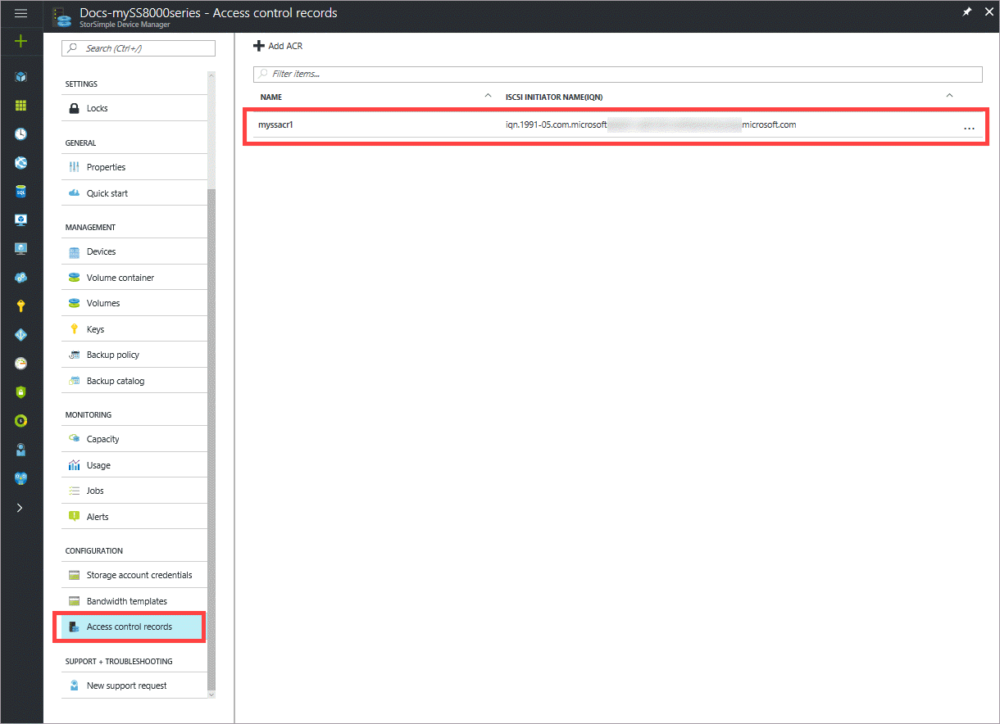

# Use the StorSimple Manager service to manage access control records

## Overview
Access control records (ACRs) allow you to specify which hosts can connect to a volume on the StorSimple device. ACRs are set to a specific volume and contain the iSCSI Qualified Names (IQNs) of the hosts. When a host tries to connect to a volume, the device checks the ACR associated with that volume for the IQN name and if there is a match, then the connection is established. The access control records in the **Configuration** section of your StorSimple Device Manager service blade display all the access control records with the corresponding IQNs of the hosts.

This tutorial explains the following common ACR-related tasks:

* Add an access control record
* Edit an access control record
* Delete an access control record

> [!IMPORTANT]
> * When assigning an ACR to a volume, take care that the volume is not concurrently accessed by more than one non-clustered host because this could corrupt the volume.
> * When deleting an ACR from a volume, make sure that the corresponding host is not accessing the volume because the deletion could result in a read-write disruption.

## Get the IQN

Perform the following steps to get the IQN of a Windows host that is running Windows Server 2012.

[!INCLUDE [storsimple-get-iqn](../../includes/storsimple-get-iqn.md)]

## Add an access control record
You use the **Configuration** section in the StorSimple Device Manager service blade to add ACRs. Typically, you will associate one ACR with one volume.

Perform the following steps to add an ACR.

#### To add an ACR

1. Go to your StorSimple Device Manager service, double-click the service name, and then within the **Configuration** section, click **Access control records**.
2. In the **Access control records** blade, click **+ Add ACR**.

    

3. In the **Add ACR** blade, do the following steps:

    1. Supply a name for your ACR.
    
    2. Provide the IQN name of your Windows Server host under **iSCSI Initiator Name (IQN)**.

    3. Click **Add** to create the ACR.

        

4.  The newly added ACR will display in the tabular listing of ACRs.

    

## Edit an access control record
You use the **Configuration** section in the StorSimple Device Manager service blade to edit ACRs.

> [!NOTE]
> It is recommended that you modify only those ACRs that are currently not in use. To edit an ACR associated with a volume that is currently in use, you must first take the volume offline.

Perform the following steps to edit an ACR.

#### To edit an access control record
1.  Go to your StorSimple Device Manager service, double-click the service name, and then within the **Configuration** section, click **Access control records**.

    

2. In the tabular listing of the access control records, click and select the ACR that you wish to modify.

    

3. In the **Edit access control record** blade, provide a different IQN corresponding to another host.

    

4. Click **Save**. When prompted for confirmation, click **Yes**. 

    

5. You are notified when the ACR is updated. The tabular listing also updates to reflect the change.

   
## Delete an access control record
You use the **Configuration** section in the StorSimple Device Manager service blade to delete ACRs.

> [!NOTE]
> You can delete only those ACRs that are currently not in use. To delete an ACR associated with a volume that is currently in use, you must first take the volume offline.

Perform the following steps to delete an access control record.

#### To delete an access control record
1.  Go to your StorSimple Device Manager service, double-click the service name, and then within the **Configuration** section, click **Access control records**.

    

2. In the tabular listing of the access control records, click and select the ACR that you wish to delete.

    

3. Right-click to invoke the context menu and select **Delete**.

    

4. When prompted for confirmation, review the information and then click **Delete**.

    

5. You are notified when the deletion completes. The tabular listing is updated to reflect the deletion.

    

## Next steps
* Learn more about [managing StorSimple volumes](storsimple-8000-manage-volumes-u2.md).
* Learn more about [using the StorSimple Manager service to administer your StorSimple device](storsimple-8000-manager-service-administration.md).

