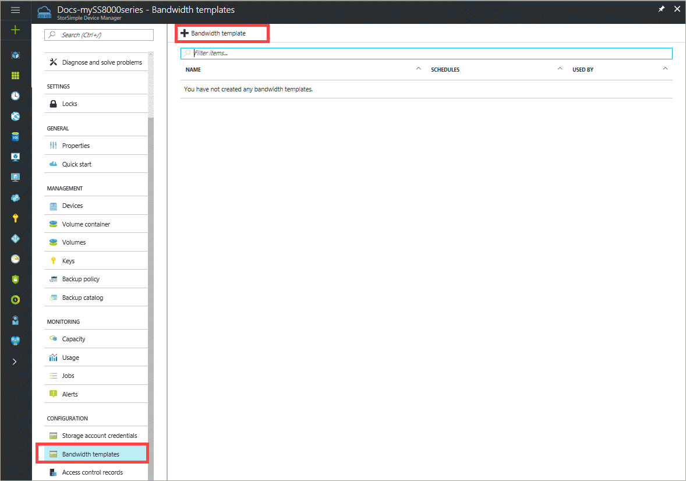
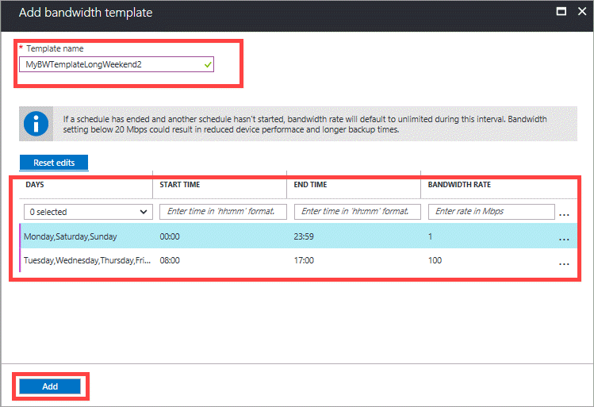

# Use the StorSimple Device Manager service to manage StorSimple bandwidth templates

## Overview

Bandwidth templates allow you to configure network bandwidth usage across multiple time-of-day schedules to tier the data from the StorSimple device to the cloud.

With bandwidth throttling schedules you can:

* Specify customized bandwidth schedules depending on the workload network usages.
* Centralize management and reuse the schedules across multiple devices in an easy and seamless manner.

> [!NOTE]
> This feature is available only for StorSimple physical devices (models 8100 and 8600) and not for StorSimple Cloud Appliances (models 8010 and 8020).

## The Bandwidth templates blade

The **Bandwidth templates** blade has all the bandwidth templates for your service in a tabular format, and contains the following information:

* **Name** – A unique name assigned to the bandwidth template when it was created.
* **Schedule** – The number of schedules contained in a given bandwidth template.
* **Used by** – The number of volumes using the bandwidth templates.

You can also find additional information to help configure bandwidth templates in:

* [Questions and answers about bandwidth templates](#questions-and-answers-about-bandwidth-templates)
* [Best practices for bandwidth templates](#best-practices-for-bandwidth-templates)

## Add a bandwidth template

Perform the following steps to create a new bandwidth template.

#### To add a bandwidth template

1. Go to your StorSimple Device Manager service, click **Bandwidth templates** and then click **+ Add Bandwidth template**.

    

2. In the **Add bandwidth template** blade, do the following steps:
   
    1. Specify a unique name for your bandwidth template.
    2. Define a bandwidth schedule. To create a schedule:
   
        1. From the drop-down list, choose the **Days** of the week the schedule is configured for. You can select multiple days.        
        
        2. Enter a **Start Time** in _hh:mm_ format. This is when the schedule will begin.

        3. Enter an **End Time** in _hh:mm_ format. This is when the schedule will stop.
      
           > [!NOTE]
           > Overlapping schedules are not allowed. If the start and end times will result in an overlapping schedule, you will see an error message to that effect.

        4. Specify the **Bandwidth Rate**. This is the bandwidth in Megabits per second (Mbps) used by your StorSimple device in operations involving the cloud (both uploads and downloads). Supply a number between 1 and 1,000 for this field.

            
         
            Repeat the above steps to define multiple schedules for your template until you are done.

        5. Click **Add** to start creating a bandwidth template. The created template is added to the list of bandwidth templates.
      

## Edit a bandwidth template

Perform the following steps to edit a bandwidth template.

### To edit a bandwidth template

1. Go to your StorSimple Device Manager service and click **Bandwidth templates**.
2. In the list of bandwidth templates, select the template you wish to delete. Right-click and from the context menu, select **Delete**.
3. When prompted for confirmation, click **OK**. This should delete the bandwidth template. 
4. The list of bandwidth templates updates to reflect the deletion.

> [!NOTE]
> You cannot save your changes if the edited schedule overlaps with an existing schedule in the bandwidth template that you are modifying.

## Delete a bandwidth template

Perform the following steps to delete a bandwidth template.

#### To delete a bandwidth template

1. Go to your StorSimple Device Manager service and click **Bandwidth templates**.
2. In the list of bandwidth templates, select the template you wish to delete. Right-click and from the context menu, select Delete.
3. When prompted for confirmation, click **OK**. This should delete the bandwidth template.
4. The list of bandwidth templates updates to reflect the deletion.

If the template is in use by any volume(s), you will not be allowed to delete it. You will see an error message indicating that the template is in use. An error message dialog box will appear advising you that all the references to the template should be removed.

You can delete all the references to the template by accessing the **Volume Containers** page and modifying the volume containers that use this template so that they use another template or use a custom or unlimited bandwidth setting. When all the references have been removed, you can delete the template.

## Use a default bandwidth template

A default bandwidth template is provided and is used by volume containers by default to enforce bandwidth controls when accessing the cloud. The default template also serves as a ready reference for users who create their own templates. The details of this default template are:

* **Name** – Unlimited nights and weekends
* **Schedule** – A single schedule from Monday to Friday that applies a bandwidth rate of 1 Mbps between 8 AM and 5 PM device time. The bandwidth is set to Unlimited for the remainder of the week.

The default template can be edited. The usage of this template (including edited versions) is tracked.

## Create an all-day bandwidth template that starts at a specified time

Follow this procedure to create a schedule that starts at a specified time and runs all day. In the example, the schedule starts at 9 AM in the morning and runs until 9 AM the next morning. It's important to note that the start and end times for a given schedule must both be contained on the same 24 hour schedule and cannot span multiple days. If you need to set up bandwidth templates that span multiple days, you will need to use multiple schedules (as shown in the example).

#### To create an all-day bandwidth template

1. Create a schedule that starts at 9 AM in the morning and runs until midnight.
2. Add another schedule. Configure the second schedule to run from midnight until 9 AM in the morning.
3. Save the bandwidth template.

The composite schedule will then start at a time of your choosing and run all-day.

## Questions and answers about bandwidth templates

**Q**. What happens to bandwidth controls when you are in between the schedules? (A schedule has ended and another one has not started yet.)

**A**. In such cases, no bandwidth controls will be employed. This means that the device can use unlimited bandwidth when tiering data to the cloud.

**Q**. Can you modify bandwidth templates on an offline device?

**A**. You will not be able to modify bandwidth templates on volumes containers if the corresponding device is offline.

**Q**. Can you edit a bandwidth template associated with a volume container when the associated volumes are offline?

**A**. You can modify a bandwidth template associated with a volume container whose volumes are offline. Note that when volumes are offline, no data will be tiered from the device to the cloud.

**Q**. Can you delete a default template?

**A**. Although you can delete a default template, it is not a good idea to do so. The usage of a default template, including edited versions, is tracked. The tracking data is analyzed and over the course of time, is used to improve the default template.

**Q**. How do you determine that your bandwidth templates need to be modified?

**A**. One of the signs that you need to modify the bandwidth templates is when you start seeing the network slow down or choke multiple times in a day. If this happens, monitor the storage and usage network by looking at the I/O Performance and Network Throughput charts.

From the network throughput data, identify the time of day and the volume containers in which the network bottleneck occurs. If this happens when data is being tiered to the cloud (get this information from I/O performance for all volume containers for device to cloud), then you will need to modify the bandwidth templates associated with your volume containers.

After the modified templates are in use, you will need to monitor the network again for significant latencies. If these still exist, then you will need to revisit your bandwidth templates.

**Q**. What happens if multiple volume containers on my device have schedules that overlap but different limits apply to each?

**A**. Let's assume that you have a device with 3 volume containers. The schedules associated with these containers completely overlap. For each of these containers, the bandwidth limits used are 5, 10, and 15 Mbps respectively. When I/O are occurring on all of these containers at the same time, the minimum of the 3 bandwidth limits may be applied: in this case, 5 Mbps as these outgoing I/O requests share the same queue.

## Best practices for bandwidth templates

Follow these best practices for your StorSimple device:

* Configure bandwidth templates on your device to enable variable throttling of the network throughput by the device at different times of the day. These bandwidth templates when used with backup schedules can effectively leverage additional network bandwidth for cloud operations during off-peak hours.
* Calculate the actual bandwidth required for a particular deployment based on the size of the deployment and the required recovery time objective (RTO).

## Next steps

Learn more about [using the StorSimple Device Manager service to administer your StorSimple device](storsimple-8000-manager-service-administration.md).

