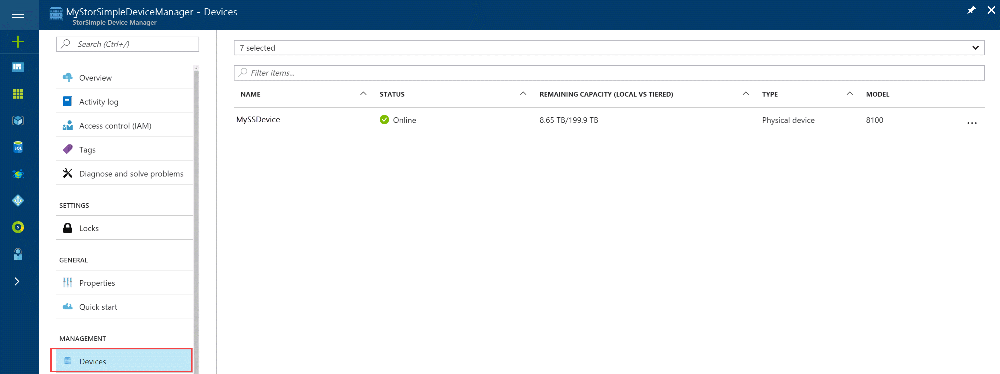
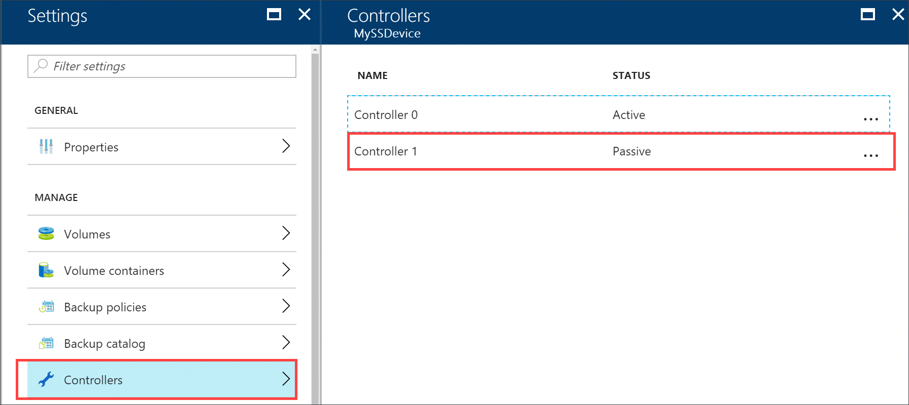
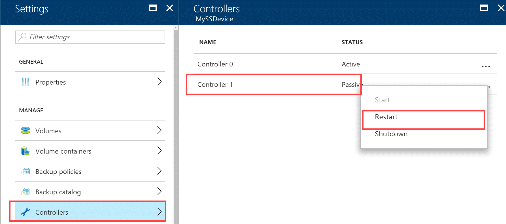

# Manage your StorSimple device controllers

## Overview

This tutorial describes the different operations that can be performed on your StorSimple device controllers. The controllers in your StorSimple device are redundant (peer) controllers in an active-passive configuration. At a given time, only one controller is active and is processing all the disk and network operations. The other controller is in a passive mode. If the active controller fails, the passive controller automatically becomes active.

This tutorial includes step-by-step instructions to manage the device controllers by using the:

* **Controllers** blade for your device in the  StorSimple Device Manager service.
* Windows PowerShell for StorSimple.

We recommend that you manage the device controllers via the  StorSimple Device Manager service. If an action can only be performed by using Windows PowerShell for StorSimple, the tutorial makes a note of it.

After reading this tutorial, you will be able to:

* Restart or shut down a StorSimple device controller
* Shut down a StorSimple device
* Reset your StorSimple device to factory defaults

## Restart or shut down a single controller
A controller restart or shutdown is not required as a part of normal system operation. Shutdown operations for a single device controller are common only in cases in which a failed device hardware component requires replacement. A controller restart may also be required in a situation in which performance is affected by excessive memory usage or a malfunctioning controller. You may also need to restart a controller after a successful controller replacement, if you wish to enable and test the replaced controller.

Restarting a device is not disruptive to connected initiators, assuming the passive controller is available. If a passive controller is not available or turned off, then restarting the active controller may result in the disruption of service and downtime.

> [!IMPORTANT]
> * **A running controller should never be physically removed as this would result in a loss of redundancy and an increased risk of downtime.**
> * The following procedure applies only to the StorSimple physical device. For information about how to start, stop, and restart the StorSimple Cloud Appliance, see [Work with the cloud appliance](storsimple-8000-cloud-appliance-u2.md##work-with-the-storsimple-cloud-appliance).

You can restart or shut down a single device controller via the Azure portal of the  StorSimple Device Manager service or Windows PowerShell for StorSimple.

To manage your device controllers from the Azure portal, perform the following steps.

#### To restart or shut down a controller in Azure portal
1. In your StorSimple Device Manager service, go to **Devices**. Select your device from the list of devices. 

    

2. Go to **Settings > Controllers**.
   
    
3. In the **Controllers** blade, verify that the status of both the controllers on your device is **Healthy**. Select a controller, right-click and then select **Restart** or **Shut down**.

    

4. A job is created to restart or shut down the controller and you are presented with applicable warnings, if any. To monitor the restart or shutdown, go to **Service > Activity logs** and then filter by parameters specific to your service. If a controller was shut down, then you will need to push the power button to turn on the controller to turn it on.

#### To restart or shut down a controller in Windows PowerShell for StorSimple
Perform the following steps to shut down or restart a single controller on your StorSimple device from the Windows PowerShell for StorSimple.

1. Access the device via the serial console or a telnet session from a remote computer. To connect to Controller 0 or Controller 1, follow the steps in [Use PuTTY to connect to the device serial console](storsimple-8000-deployment-walkthrough-u2.md#use-putty-to-connect-to-the-device-serial-console).
2. In the serial console menu, choose option 1, **Log in with full access**.
3. In the banner message, make a note of the controller you are connected to (Controller 0 or Controller 1) and whether it is the active or the passive (standby) controller.
   
   * To shut down a single controller, at the prompt, type:
     
       `Stop-HcsController`
     
       This shuts down the controller that you are connected to. If you stop the active controller, then the device fails over to the passive controller.

   * To restart a controller, at the prompt, type:
     
       `Restart-HcsController`
     
       This restarts the controller that you are connected to. If you restart the active controller, it fails over to the passive controller before the restart.

## Shut down a StorSimple device

This section explains how to shut down a running or a failed StorSimple device from a remote computer. A device is turned off after both the device controllers are shut down. A device shutdown is done when the device is physically moved, or is taken out of service.

> [!IMPORTANT]
> Before you shut down the device, check the health of the device components. Navigate to your device and then click **Settings > Hardware health**. In the **Status and hardware health** blade, verify that the LED status of all the components is green. Only a healthy device has a green status. If your device is being shut down to replace a malfunctioning component, you will see a failed (red) or a degraded (yellow) status for the respective component(s).

#### To shut down a StorSimple device

1. Use the [restart or shut down a controller](#restart-or-shut-down-a-single-controller) procedure to identify and shut down the passive controller on your device. You can perform this operation in the Azure portal or in Windows PowerShell for StorSimple.
2. Repeat the above step to shut down the active controller.
3. You must now look at the back plane of the device. After the two controllers are completely shut down, the status LEDs on both the controllers should be blinking red. If you need to turn off the device completely at this time, flip the power switches on both Power and Cooling Modules (PCMs) to the OFF position. This should turn off the device.

## Reset the device to factory default settings

> [!IMPORTANT]
> If you need to reset your device to factory default settings, contact Microsoft Support. The procedure described below should be used only in conjunction with Microsoft Support.

This procedure describes how to reset your Microsoft Azure StorSimple device to factory default settings using Windows PowerShell for StorSimple.
Resetting a device removes all data and settings from the entire cluster by default.

Perform the following steps to reset your Microsoft Azure StorSimple device to factory default settings:

### To reset the device to default settings in Windows PowerShell for StorSimple
1. Access the device through its serial console. Check the banner message to ensure that you are connected to the **Active** controller.
2. In the serial console menu, choose option 1, **Log in with full access**.
3. At the prompt, type the following command to reset the entire cluster, removing all data, metadata, and controller settings:
   
    `Reset-HcsFactoryDefault`
   
    To instead reset a single controller, use the  [Reset-HcsFactoryDefault](https://technet.microsoft.com/library/dn688132.aspx) cmdlet with the `-scope` parameter.)
   
    The system will reboot multiple times. You will be notified when the reset has successfully completed. Depending on the system model, it can take 45-60 minutes for an 8100 device and 60-90 minutes for an 8600 to finish this process.
   
## Questions and answers about managing device controllers
In this section, we have summarized some of the frequently asked questions regarding managing StorSimple device controllers.

**Q.** What happens if both the controllers on my device are healthy and turned on and I restart or shut down the active controller?

**A.** If both the controllers on your device are healthy and turned on, you are prompted for confirmation. You may choose to:

* **Restart the active controller** – You are notified that restarting an active controller caused the device to fail over to the passive controller. The controller restarts.
* **Shut down an active controller** – You are notified that shutting down an active controller results in downtime. You also need to push the power button on the device to turn on the controller.

**Q.** What happens if the passive controller on my device is unavailable or turned off and I restart or shut down the active controller?

**A.** If the passive controller on your device is unavailable or turned off, and you choose to:

* **Restart the active controller** – You are notified that continuing the operation will result in a temporary disruption of the service, and you are prompted for confirmation.
* **Shut down an active controller** – You are notified that continuing the operation results in downtime. You also need to push the power button on one or both controllers to turn on the device. You are prompted for confirmation.

**Q.** When does the controller restart or shutdown fails to progress?

**A.** Restarting or shutting down a controller may fail if:

* A device update is in progress.
* A controller restart is already in progress.
* A controller shutdown is already in progress.

**Q.** How can you figure out if a controller was restarted or shut down?

**A.** You can check the controller status on Controller blade. The controller status will indicate whether a controller is in the process of restarting or shutting down. Additionally, the **Alerts** blade contain an informational alert if the controller is restarted or shut down. The controller restart and shutdown operations are also recorded in the activity logs. For more information about activity logs, go to [View the activity logs](storsimple-8000-service-dashboard.md#view-the-activity-logs).

**Q.** Is there any impact to the I/O as a result of controller failover?

**A.** The TCP connections between initiators and active controller will be reset as a result of controller failover, but will be reestablished when the passive controller assumes operation. There may be a temporary (less than 30 seconds) pause in I/O activity between initiators and the device during the course of this operation.

**Q.** How do I return my controller to service after it has been shut down and removed?

**A.** To return a controller to service, you must insert it into the chassis as described in [Replace a controller module on your StorSimple device](storsimple-8000-controller-replacement.md).

## Next steps
* If you encounter any issues with your StorSimple device controllers that you cannot resolve by using the procedures listed in this tutorial, [contact Microsoft Support](storsimple-8000-contact-microsoft-support.md).
* To learn more about using the  StorSimple Device Manager service, go to [Use the  StorSimple Device Manager service to administer your StorSimple device](storsimple-8000-manager-service-administration.md).

