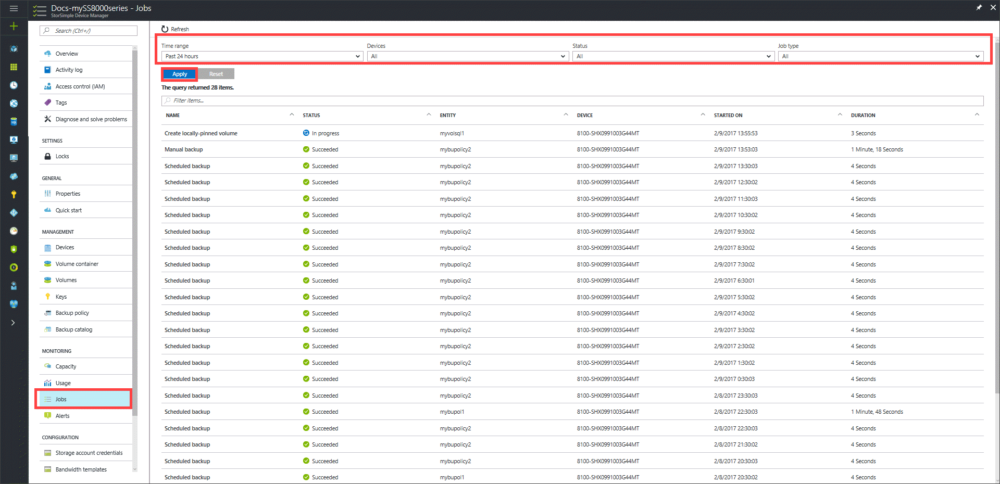
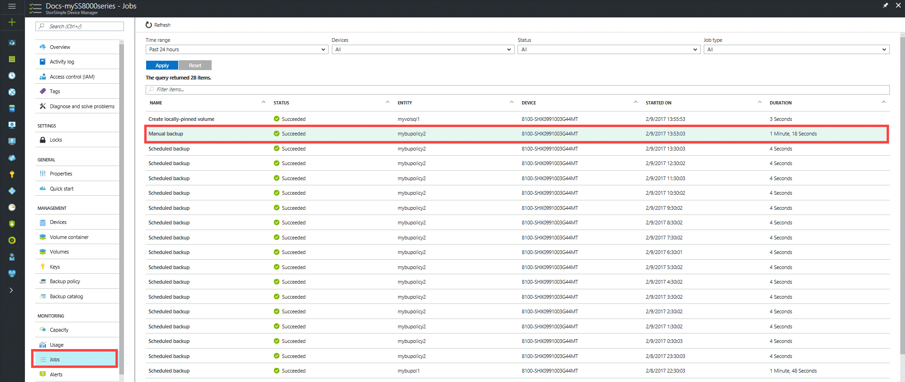
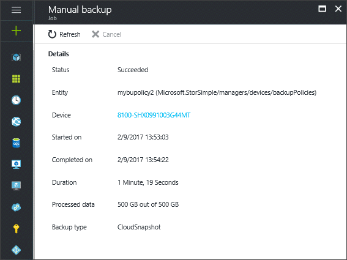
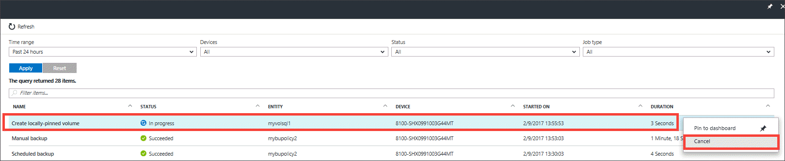

# Use the StorSimple Device Manager service to view and manage jobs (Update 3 and later)

## Overview
The **Jobs** blade provides a single central portal for viewing and managing jobs that were started on devices connected to your StorSimple Device Manager service. You can view scheduled, running, completed, canceled, and failed jobs for multiple devices. Results are presented in a tabular format.

You can quickly find the jobs you are interested in by filtering on fields such as:

* **Status** – Jobs can be in progress, succeeded, canceled, failed, canceling, or succeeded with errors.
* **Time range** – Jobs can be filtered based on the date and time range. The ranges are past 1 hour, past 24 hours, past 7 days, past 30 days, past year, or custom date.
* **Type** – The job type can be scheduled backup, manual backup, restore backup, clone volume, fail over volume containers, create locally-pinned volume, modify volume, install updates, collect support logs and create cloud appliance.
* **Devices** – Jobs are initiated on a certain device connected to your service.
  
The filtered jobs are then tabulated on the basis of the following attributes:
  
* **Name** – scheduled backup, manual backup, restore backup, clone volume, fail over volume containers, create locally pinned volume, modify volume, install updates, collect support logs, or create cloud appliance.
* **Status** – running, completed, canceled, failed, canceling, or completed with errors.
* **Entity** – The jobs can be associated with a volume, a backup policy, or a device. For example, a clone job is associated with a volume, whereas a scheduled backup job is associated with a backup policy. A device job is created as a result of a disaster recovery (DR) or a restore operation.
* **Device** – The name of the device on which the job was started.
* **Started on** – The time when the job was started.
* **Duration** – The time required to complete the job.

The list of jobs is refreshed every 30 seconds.

You can perform the following job-related actions on this page:

* View job details
* Cancel a job

## View job details
Perform the following steps to view the details of any job.

#### To view job details
1. Go to your StorSimple Device Manager service and then click **Jobs**.

2. In the **Jobs** blade, display the job(s) you are interested in by running a query with appropriate filters. You can search for completed, running, or canceled jobs.

    

2. Select and click a job.

    

3. In the job details blade, you can view the status, details, time statistics, and data statistics.
   
    

## Cancel a job
Perform the following steps to cancel a running job.

> [!NOTE]
> Some jobs, such as modifying a volume to change the volume type or expanding a volume, cannot be canceled.

### To cancel a job
1. On the **Jobs** page, display the running job(s) that you want to cancel by running a query with appropriate filters. Select the job.

2. Right-click on the selected job to invoke the context menu and click **Cancel**.

    

3. When prompted for confirmation, click **Yes**. This job is now canceled.

## Next steps
* Learn how to [manage your StorSimple backup policies](storsimple-8000-manage-backup-policies-u2.md).
* Learn how to [use the StorSimple Device Manager service to administer your StorSimple device](storsimple-8000-manager-service-administration.md).

