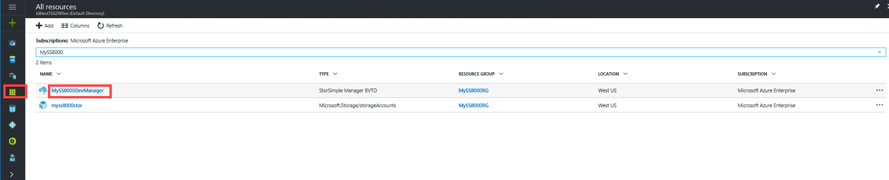
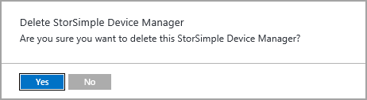
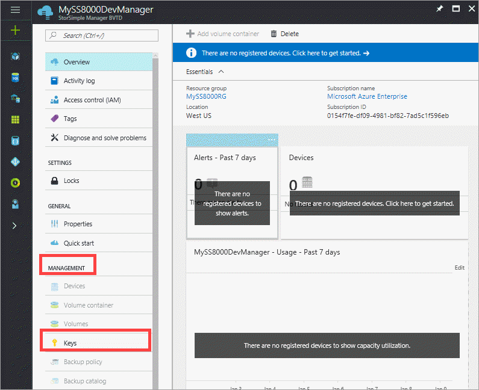
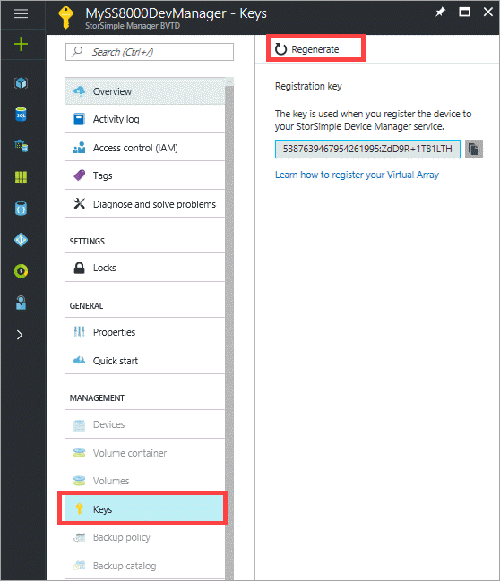
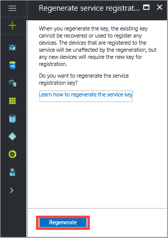

# Deploy the StorSimple Device Manager service for StorSimple 8000 series devices

[!INCLUDE [storsimple-8000-eol-banner](../../includes/storsimple-8000-eol-banner.md)]

## Overview

The StorSimple Device Manager service runs in Microsoft Azure and connects to multiple StorSimple devices. After you create the service, you can use it to manage all the devices that are connected to the StorSimple Device Manager service from a single, central location, thereby minimizing administrative burden.

This tutorial describes the steps required for the creation, deletion, migration of the service and the management of the service registration key. The information contained in this article is applicable only to StorSimple 8000 series devices. For more information on StorSimple Virtual Arrays, go to [deploy a StorSimple Device Manager service for your StorSimple Virtual Array](storsimple-virtual-array-manage-service.md).

> [!NOTE]
> -  The Azure portal supports devices running Update 5.0 or later. If your device is not up to date, install Update 5 immediately. For more information, go to [Install Update 5](storsimple-8000-install-update-5.md). 
> - If you're using a StorSimple Cloud Appliance (8010/8020), you cannot update a cloud appliance. Use the latest version of software to create a new cloud appliance with Update 5.0,  and then fail over to the new cloud appliance created. 
> - All devices running Update 4.0 or earlier will experience reduced management functionality. 

## Create a service
To create a StorSimple Device Manager service, you need to have:

* A subscription with an Enterprise Agreement
* An active Microsoft Azure storage account
* The billing information that is used for access management

Only the subscriptions with an Enterprise Agreement are allowed. You can also choose to generate a default storage account when you create the service.

A single service can manage multiple devices. However, a device cannot span multiple services. A large enterprise can have multiple service instances to work with different subscriptions, organizations, or even deployment locations. 

> [!NOTE]
> You need separate instances of StorSimple Device Manager service to manage StorSimple 8000 series devices and StorSimple Virtual Arrays.

Perform the following steps to create a service.

[!INCLUDE [storsimple-create-new-service](../../includes/storsimple-8000-create-new-service.md)]

For each StorSimple Device Manager service, the following attributes exist:

* **Name** – The name that was assigned to your StorSimple Device Manager service when it was created. **The service name cannot be changed after the service is created. This is also true for other entities such as devices, volumes, volume containers, and backup policies that cannot be renamed in the Azure portal.**
* **Status** – The status of the service, which can be **Active**, **Creating**, or **Online**.
* **Location** – The geographical location in which the StorSimple device will be deployed.
* **Subscription** – The billing subscription that is associated with your service.

## Delete a service

Before you delete a service, make sure that no connected devices are using it. If the service is in use, deactivate the connected devices. The deactivate operation will sever the connection between the device and the service, but preserve the device data in the cloud.

> [!IMPORTANT]
> After a service is deleted, the operation cannot be reversed. Any device that was using the service needs to be reset to factory defaults before it can be used with another service. In this scenario, the local data on the device, as well as the configuration, is lost.

Perform the following steps to delete a service.

### To delete a service

1. Search for the service you want to delete. Click **Resources** icon and then input the appropriate terms to search. In the search results, click the service you want to delete.

    

2. This takes you to the StorSimple Device Manager service blade. Click **Delete**.

    

3. Click **Yes** in the confirmation notification. It may take a few minutes for the service to be deleted.

    

## Get the service registration key

After you have successfully created a service, you will need to register your StorSimple device with the service. To register your first StorSimple device, you will need the service registration key. To register additional devices with an existing StorSimple service, you need both the registration key and the service data encryption key (which is generated on the first device during registration). For more information about the service data encryption key, see [StorSimple security](storsimple-8000-security.md). You can get the registration key by accessing **Keys** on your StorSimple Device Manager blade.

Perform the following steps to get the service registration key.

[!INCLUDE [storsimple-8000-get-service-registration-key](../../includes/storsimple-8000-get-service-registration-key.md)]

Keep the service registration key in a safe location. You will need this key, as well as the service data encryption key, to register additional devices with this service. After obtaining the service registration key, you must configure your device through the Windows PowerShell for StorSimple interface.

For details on how to use this registration key, see [Step 3: Configure and register the device through Windows PowerShell for StorSimple](storsimple-8000-deployment-walkthrough-u2.md#step-3-configure-and-register-the-device-through-windows-powershell-for-storsimple).

## Regenerate the service registration key
You need to regenerate a service registration key if you are required to perform key rotation or if the list of service administrators has changed. When you regenerate the key, the new key is used only for registering subsequent devices. The devices that were already registered are unaffected by this process.

Perform the following steps to regenerate a service registration key.

### To regenerate the service registration key
1. In the **StorSimple Device Manager** blade, go to **Management &gt;** **Keys**.
    
    

2. In the **Keys** blade, click **Regenerate**.

    
3. In the **Regenerate service registration key** blade, review the action required when the keys are regenerated. All the subsequent devices that are registered with this service use the new registration key. Click **Regenerate** to confirm. You are notified after the regeneration is complete.

    

4. A new service registration key will appear.

5. Copy this key and save it for registering any new devices with this service.

## Change the service data encryption key
[!INCLUDE [storage-files-migration-generate-key](../../includes/storage-files-migration-generate-key.md)]

## Supported operations on devices running versions prior to Update 5.0
In the Azure portal, only the StorSimple devices running Update 5.0 and higher are supported. The devices that are running older versions have limited support. After you have migrated to the Azure portal, use the following table to understand which operations are supported on devices running versions prior to Update 5.0.

| Operation                                                                                                                       | Supported      |
|---------------------------------------------------------------------------------------------------------------------------------|----------------|
| Register a device                                                                                                               | Yes            |
| Configure device settings such as general, network, and security                                                                | Yes            |
| Scan, download, and install updates                                                                                             | Yes            |
| Deactivate device                                                                                                               | Yes            |
| Delete device                                                                                                                   | Yes            |
| Create, modify, and delete a volume container                                                                                   | No             |
| Create, modify, and delete a volume                                                                                             | No             |
| Create, modify, and delete a backup policy                                                                                      | No             |
| Take a manual backup                                                                                                            | No             |
| Take a scheduled backup                                                                                                         | Not applicable |
| Restore from a backupset                                                                                                        | No             |
| Clone to a device running Update 3.0 and later   The source device is running version prior to Update 3.0.                                | Yes            |
| Clone to a device running versions prior to Update 3.0                                                                          | No             |
| Failover as source device   (from a device running version prior to Update 3.0 to a device running Update 3.0 and later)                                                               | Yes            |
| Failover as target device   (to a device running software version prior to Update 3.0)                                                                                   | No             |
| Clear an alert                                                                                                                  | Yes            |
| View backup policies, backup catalog, volumes, volume containers, monitoring charts, jobs, and alerts created in classic portal | Yes            |
| Turn on and off device controllers                                                                                              | Yes            |

## Next steps
* Learn more about the [StorSimple deployment process](storsimple-8000-deployment-walkthrough-u2.md).
* Learn more about [managing your StorSimple storage account](storsimple-8000-manage-storage-accounts.md).
* Learn more about how to [use the StorSimple Device Manager service to administer your StorSimple device](storsimple-8000-manager-service-administration.md).
