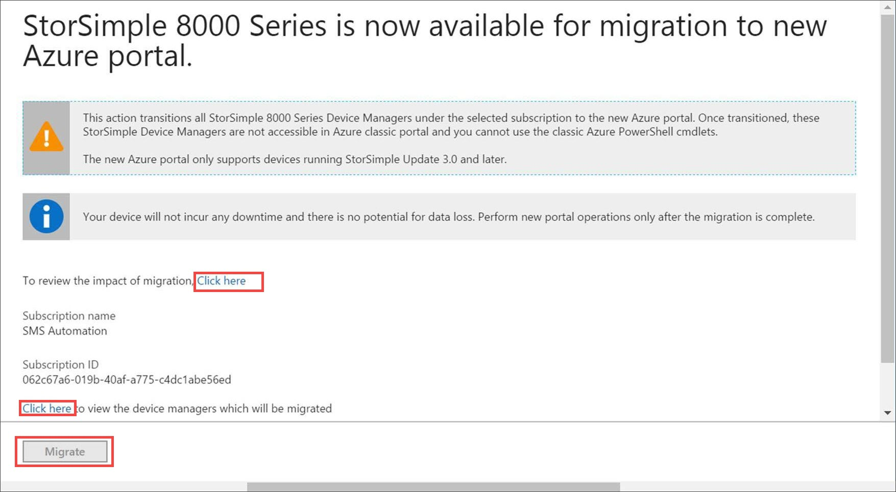
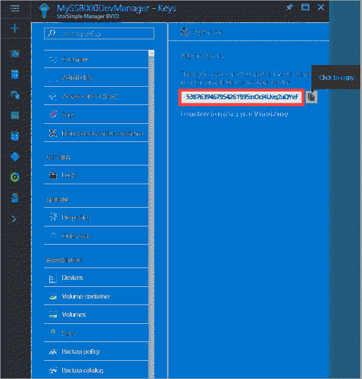

# Deploy the StorSimple Device Manager service for StorSimple 8000 series devices

## Overview

The StorSimple Device Manager service runs in Microsoft Azure and connects to multiple StorSimple devices. After you create the service, you can use it to manage all the devices that are connected to the StorSimple Device Manager service from a single, central location, thereby minimizing administrative burden.

The common tasks related to a StorSimple Device Manager service are:

* Create a service
* Delete a service
* Get the service registration key
* Regenerate the service registration key
* Move StorSimple service 

This tutorial describes how to perform each of the preceding tasks. The information contained in this article is applicable only to StorSimple 8000 series devices. For more information on StorSimple Virtual Arrays, go to [deploy a StorSimple Device Manager service for your StorSimple Virtual Array](storsimple-virtual-array-manage-service.md).

For each StorSimple Device Manager service, the following information is presented on the StorSimple Device Manager page:

* **Name** – The name that was assigned to your StorSimple Device Manager service when it was created. The service name cannot be changed after the service is created.
* **Status** – The status of the service, which can be **Active**, **Creating**, or **Online**.
* **Location** – The geographical location in which the StorSimple device will be deployed.
* **Subscription** – The billing subscription that is associated with your service.

## Create a service
To create a StorSimple Device Manager service, you need to have:

* A subscription with an Enterprise Agreement
* An active Microsoft Azure storage account
* The billing information that is used for access management

You can also choose to generate a default storage account when you create the service.

A single service can manage multiple devices. However, a device cannot span multiple services. A large enterprise can have multiple service instances to work with different subscriptions, organizations, or even deployment locations. 

> [!NOTE]
> You need separate instances of StorSimple Device Manager service to manage StorSimple 8000 series devices and StorSimple Virtual Arrays.

> [!IMPORTANT] 
> If you have an unused service created (no device operations were performed on this resource) prior to August 2016, it cannot be managed via Azure portal or Azure classic portal. We recommend that you create a new service in the Azure portal.

Perform the following steps to create a service.

[!INCLUDE [storsimple-create-new-service](../../includes/storsimple-8000-create-new-service.md)]

## Move a service to Azure portal
StorSimple 8000 series can be now managed in the Azure portal. If you have an existing service to manage the StorSimple devices, we recommend that you move your service to the Azure portal.

The Azure classic portal for the StorSimple Manager service is not available after September 30, 2017.

### Considerations for transition

Review the impact of migrating to the new Azure portal before you move the service.

#### Before you transition

* Your device is running Update 3.0 or later. If your device is running an older version, install the lastest updates. For more information, go to [Install Update 4](storsimple-8000-install-update-4.md).

* Once you are transitioned to the new Azure portal, you cannot use the Azure classic portal to manage your StorSimple device.

* The transition is non-disruptive and there is no downtime for the device.

#### During the transition

* You cannot manage your device from the portal.
* Operations such as tiering and scheduled backups continue to occur.

#### After the transition

* You can no longer manage your devices from the classic portal.

* The existing Azure Service Management (ASM) PowerShell cmdlets are not supported. Update the scripts to manage your devices through the ARM.

* Your service and device configuration are retained. All your volumes and backups are also transitioned to the Azure portal.

### Begin transition

Perform the following steps to transition your service to the Azure portal.

1. Go to your existing StorSimple Manager service in the classic portal.

2. You see a notification that informs you that the StorSimple Device Manager service is now available in the Azure portal. Note the in the Azure portal, the service is referred to as StorSimple Device Manager service.

    

    1. Ensure that you have reviewed the full impact of migration.
    2. Review the list of StorSimple services that will be moved from the classic portal.

3. Click **Migrate**. The transition begins and takes a few minutes to complete.

Once the transition is complete, you can manage your devices via the StorSimple Device Manager service in the Azure portal.

## Delete a service

Before you delete a service, make sure that no connected devices are using it. If the service is in use, deactivate the connected devices. The deactivate operation will sever the connection between the device and the service, but preserve the device data in the cloud.

> [!IMPORTANT]
> After a service is deleted, the operation cannot be reversed. Any device that was using the service will need to be factory reset before it can be used with another service. In this scenario, the local data on the device, as well as the configuration, will be lost.

Perform the following steps to delete a service.

### To delete a service

1. Search for the service you want to delete. Click **Resources** icon and then input the approriate terms to search. In the search results, click the service you want to delete.

    

2. This takes you to the StorSimple Device Manager service blade. Click **Delete**.

    

3. Click **Yes** in the confirmation notification. It may take a few minutes for the service to be deleted.

    

## Get the service registration key

After you have successfully created a service, you will need to register your StorSimple device with the service. To register your first StorSimple device, you will need the service registration key. To register additional devices with an existing StorSimple service, you will need both the registration key and the service data encryption key (which is generated on the first device during registration). For more information about the service data encryption key, see [StorSimple security](storsimple-8000-security.md). You can get the registration key by accessing **Keys** on your StorSimple Device Manager blade.

Perform the following steps to get the service registration key.

[!INCLUDE [storsimple-8000-get-service-registration-key](../../includes/storsimple-8000-get-service-registration-key.md)]

Keep the service registration key in a safe location. You will need this key, as well as the service data encryption key, to register additional devices with this service. After obtaining the service registration key, you will need to configure your device through the Windows PowerShell for StorSimple interface.

For details on how to use this registration key, see [Step 3: Configure and register the device through Windows PowerShell for StorSimple](storsimple-8000-deployment-walkthrough-u2.md#step-3-configure-and-register-the-device-through-windows-powershell-for-storsimple).

## Regenerate the service registration key
You will need to regenerate a service registration key if you are required to perform key rotation or if the list of service administrators has changed. When you regenerate the key, the new key is used only for registering subsequent devices. The devices that were already registered are unaffected by this process.

Perform the following steps to regenerate a service registration key.

### To regenerate the service registration key
1. In the **StorSimple Device Manager** blade, go to **Management &gt;** **Keys**.
    
    

2. In the **Keys** blade, click **Regenerate**.

    
3. In the **Regenerate service registration key** blade, review the action required when the keys are regenerated. All the subsequent devices that are registered with this service will use the new registration key. Click **Regenerate** to confirm. You will be notified after the regeneration is complete.

    

4. A new service registration key will appear.

    

5. Copy this key and save it for registering any new devices with this service.

## Next steps
* Learn more about the [StorSimple deployment process](storsimple-8000-deployment-walkthrough-u2.md).
* Learn more about [managing your StorSimple storage account](storsimple-8000-manage-storage-accounts.md).
* Learn more about how to [use the StorSimple Device Manager service to administer your StorSimple device](storsimple-8000-manager-service-administration.md).
