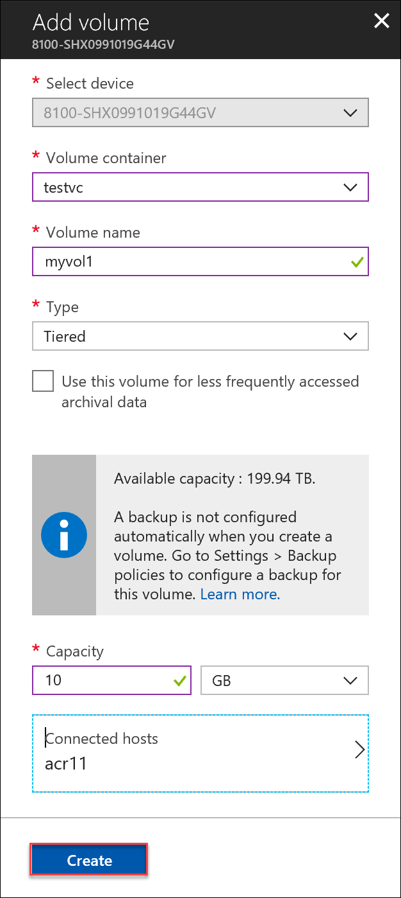
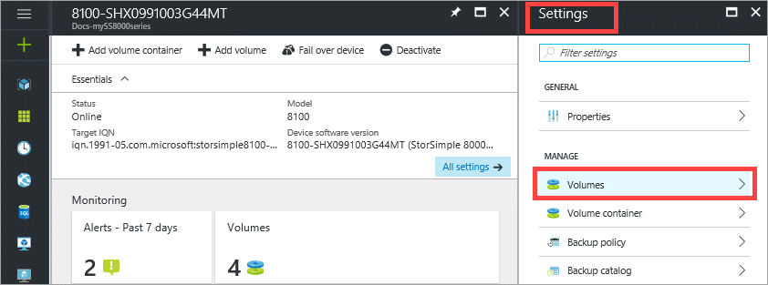
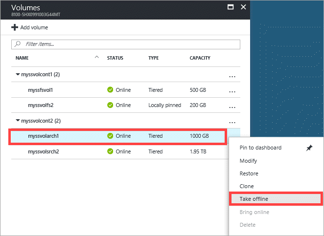
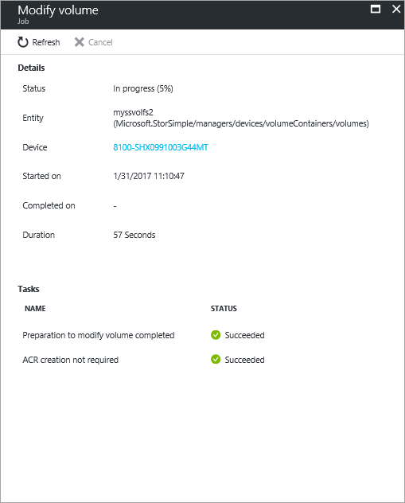
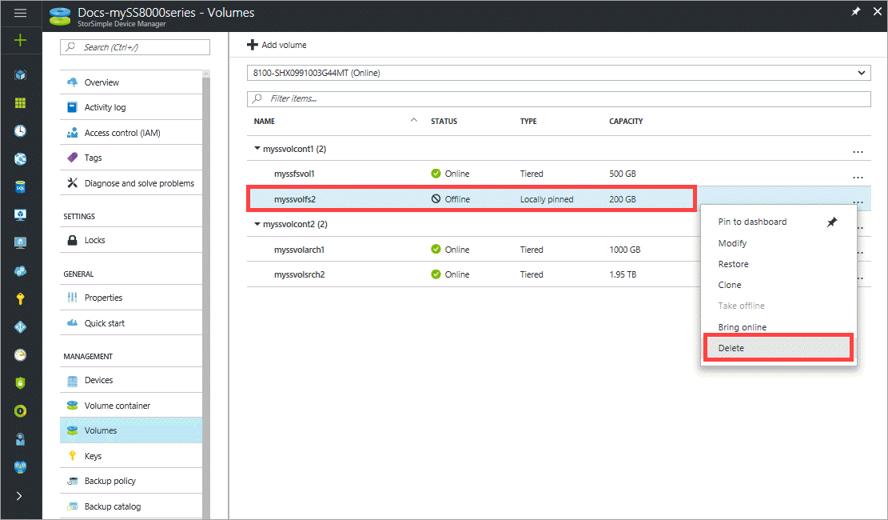
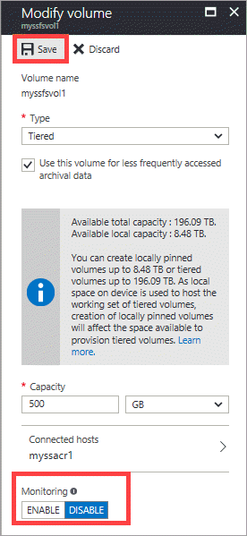

# Use the StorSimple Device Manager service to manage volumes (Update 3 or later)

## Overview

This tutorial explains how to use the StorSimple Device Manager service to create and manage volumes on the StorSimple 8000 series devices running Update 3 and later.

The StorSimple Device Manager service is an extension in the Azure portal that lets you manage your StorSimple solution from a single web interface. Use the Azure portal to manage volumes on all your devices. You can also create and manage StorSimple services, manage devices, backup policies, and backup catalog, and view alerts.

## Volume types

StorSimple volumes can be:

* **Locally pinned volumes**: Data in these volumes remains on the local StorSimple device at all times.
* **Tiered volumes**: Data in these volumes can spill to the cloud.

An archival volume is a type of tiered volume. The larger deduplication chunk size used for archival volumes allows the device to transfer larger segments of data to the cloud.

If necessary, you can change the volume type from local to tiered or from tiered to local. For more information, go to [Change the volume type](#change-the-volume-type).

### Locally pinned volumes

Locally pinned volumes are fully provisioned volumes that do not tier data to the cloud, thereby ensuring local guarantees for primary data, independent of cloud connectivity. Data on locally pinned volumes is not deduplicated and compressed; however, snapshots of locally pinned volumes are deduplicated. 

Locally pinned volumes are fully provisioned; therefore, you must have sufficient space on your device when you create them. You can provision locally pinned volumes up to a maximum size of 8 TB on the StorSimple 8100 device and 20 TB on the 8600 device. StorSimple reserves the remaining local space on the device for snapshots, metadata, and data processing. You can increase the size of a locally pinned volume to the maximum space available, but you cannot decrease the size of a volume once created.

When you create a locally pinned volume, the available space for creation of tiered volumes is reduced. The reverse is also true: if you have existing tiered volumes, the space available for creating locally pinned volumes will be lower than the maximum limits stated above. For more information on local volumes, refer to the [frequently asked questions on locally pinned volumes](storsimple-8000-local-volume-faq.md).

### Tiered volumes

Tiered volumes are thinly provisioned volumes in which the frequently accessed data stays local on the device and less frequently used data is automatically tiered to the cloud. Thin provisioning is a virtualization technology in which available storage appears to exceed physical resources. Instead of reserving sufficient storage in advance, StorSimple uses thin provisioning to allocate just enough space to meet current requirements. The elastic nature of cloud storage facilitates this approach because StorSimple can increase or decrease cloud storage to meet changing demands.

If you are using the tiered volume for archival data, select the **Use this volume for less frequently accessed archival data** check box to change the deduplication chunk size for your volume to 512 KB. If you do not select this option, the corresponding tiered volume will use a chunk size of 64 KB. A larger deduplication chunk size allows the device to expedite the transfer of large archival data to the cloud.

### Provisioned capacity

Refer to the following table for maximum provisioned capacity for each device and volume type. (Note that locally pinned volumes are not available on a virtual device.)

|  | Maximum tiered volume size | Maximum locally pinned volume size |
| --- | --- | --- |
| **Physical devices** | | |
| 8100 |64 TB |8 TB |
| 8600 |64 TB |20 TB |
| **Virtual devices** | | |
| 8010 |30 TB |N/A |
| 8020 |64 TB |N/A |

## The volumes blade

The **Volumes** blade allows you to manage the storage volumes that are provisioned on the Microsoft Azure StorSimple device for your initiators (servers). It displays the list of volumes on the StorSimple devices connected to your service.

 

A volume consists of a series of attributes:

* **Volume Name** – A descriptive name that must be unique and helps identify the volume. This name is also used in monitoring reports when you filter on a specific volume. Once the volume is created, it cannot be renamed.
* **Status** – Can be online or offline. If a volume is offline, it is not visible to initiators (servers) that are allowed access to use the volume.
* **Capacity** – specifies the total amount of data that can be stored by the initiator (server). Locally-pinned volumes are fully provisioned and reside on the StorSimple device. Tiered volumes are thinly provisioned and the data is deduplicated. With thinly provisioned volumes, your device doesn’t pre-allocate physical storage capacity internally or on the cloud according to configured volume capacity. The volume capacity is allocated and consumed on demand.
* **Type** – Indicates whether the volume is **Tiered** (the default) or **Locally pinned**.

Use the instructions in this tutorial to perform the following tasks:

* Add a volume 
* Modify a volume 
* Change the volume type
* Delete a volume 
* Take a volume offline 
* Monitor a volume 

## Add a volume

You [created a volume](storsimple-8000-deployment-walkthrough-u2.md#step-6-create-a-volume) during deployment of your StorSimple 8000 series device. Adding a volume is a similar procedure.

#### To add a volume

1. From the tabular listing of the devices in the **Devices** blade, select your device. Click **+ Add volume**.

    

2. In the **Add a volume** blade:
   
    1. The **Select device** field is automatically populated with your current device.

    2. From the drop-down list, select the volume container where you need to add a volume.

    3.  Type a **Name** for your volume. Once the volume is created, you cannot rename the volume.

    4. On the drop-down list, select the **Type** for your volume. For workloads that require local guarantees, low latencies, and higher performance, select a **Locally pinned** volume. For all other data, select a **Tiered** volume. If you are using this volume for archival data, check **Use this volume for less frequently accessed archival data**.
      
       A tiered volume is thinly provisioned and can be created quickly. Selecting **Use this volume for less frequently accessed archival data** for tiered volume targeted for archival data changes the deduplication chunk size for your volume to 512 KB. If this field is not checked, the corresponding tiered volume uses a chunk size of 64 KB. A larger deduplication chunk size allows the device to expedite the transfer of large archival data to the cloud.
       
       A locally pinned volume is thickly provisioned and ensures that the primary data on the volume stays local to the device and does not spill to the cloud.  If you create a locally pinned volume, the device checks for available space on the local tiers to provision the volume of the requested size. The operation of creating a locally pinned volume may involve spilling existing data from the device to the cloud and the time taken to create the volume may be long. The total time depends on the size of the provisioned volume, available network bandwidth, and the data on your device.

    5. Specify the **Provisioned Capacity** for your volume. Make a note of the capacity that is available based on the volume type selected. The specified volume size must not exceed the available space.
      
       You can provision locally pinned volumes up to 8.5 TB or tiered volumes up to 200 TB on the 8100 device. On the larger 8600 device, you can provision locally pinned volumes up to 22.5 TB or tiered volumes up to 500 TB. As local space on the device is required to host the working set of tiered volumes, creation of locally pinned volumes impacts the space available for provisioning tiered volumes. Therefore, if you create a locally pinned volume, space available for creation of tiered volumes is reduced. Similarly, if a tiered volume is created, the available space for creation of locally pinned volumes is reduced.
      
       If you provision a locally pinned volume of 8.5 TB (maximum allowable size) on your 8100 device, then you have exhausted all the local space available on the device. You can't create any tiered volume from that point onwards as there is no local space on the device to host the working set of the tiered volume. Existing tiered volumes also affect the space available. For example, if you have an 8100 device that already has tiered volumes of roughly 106 TB, only 4 TB of space is available for locally pinned volumes.

    6. In the **Connected hosts** field, click the arrow. In the **Connected hosts** blade, choose an existing ACR or add a new ACR. If you choose a new ACR, then supply a **Name** for your ACR, provide the **iSCSI Qualified Name** (IQN) of your Windows host. If you don't have the IQN, go to Get the IQN of a Windows Server host. Click **Create**. A volume is created with the specified settings.

        

Your new volume is now ready to use.

> [!NOTE]
> If you create a locally pinned volume and then create another locally pinned volume immediately afterwards, the volume creation jobs run sequentially. The first volume creation job must finish before the next volume creation job can begin.

## Modify a volume

Modify a volume when you need to expand it or change the hosts that access the volume.

> [!IMPORTANT]
> * If you modify the volume size on the device, the volume size needs to be changed on the host as well.
> * The host-side steps described here are for Windows Server 2012 (2012R2). Procedures for Linux or other host operating systems will be different. Refer to your host operating system instructions when modifying the volume on a host running another operating system.

#### To modify a volume

1. Go to your StorSimple Device Manager service and then click **Devices**. From the tabular listing of the devices, select the device that has the volume that you intend to modify. Click **Settings > Volumes**.

    

2. From the tabular listing of volumes, select the volume and right-click to invoke the context menu. Select **Take offline** to take the volume you will modify offline.

    

3. In the **Take offline** blade, review the impact of taking the volume offline and select the corresponding checkbox. Ensure that the corresponding volume on the host is offline first. For information on how to take a volume offline on your host server connected to StorSimple, refer to operating system specific instructions. Click **Take offline**.

    

4. After the volume is offline (as shown by the volume status), select the volume and right-click to invoke the context menu. Select **Modify volume**.

    

5. In the **Modify volume** blade, you can make the following changes:
   
   1. The volume **Name** cannot be edited.
   2. Convert the **Type** from locally pinned to tiered or from tiered to locally pinned (see [Change the volume type](#change-the-volume-type) for more information).
   3. Increase the **Provisioned Capacity**. The **Provisioned Capacity** can only be increased. You cannot shrink a volume after it is created.
   4. Under **Connected hosts**, you can modify the ACR. To modify an ACR, the volume must be offline.

       

5. Click **Save** to save your changes. When prompted for confirmation, click **Yes**. The Azure portal will display an updating volume message. It will display a success message when the volume has been successfully updated.

    

7. If you are expanding a volume, complete the following steps on your Windows host computer:
   
   1. Go to **Computer Management** ->**Disk Management**.
   2. Right-click **Disk Management** and select **Rescan Disks**.
   3. In the list of disks, select the volume that you updated, right-click, and then select **Extend Volume**. The Extend Volume wizard starts. Click **Next**.
   4. Complete the wizard, accepting the default values. After the wizard is finished, the volume should show the increased size.
      
      > [!NOTE]
      > If you expand a locally pinned volume and then expand another locally pinned volume immediately afterwards, the volume expansion jobs run sequentially. The first volume expansion job must finish before the next volume expansion job can begin.
      

## Change the volume type

You can change the volume type from tiered to locally pinned or from locally pinned to tiered. However, this conversion should not be a frequent occurrence.

### Tiered to local volume conversion considerations

Some reasons for converting a volume from tiered to locally pinned are:

* Local guarantees regarding data availability and performance
* Elimination of cloud latencies and cloud connectivity issues.

Typically, these are small existing volumes that you want to access frequently. A locally pinned volume is fully provisioned when it is created. 

If you are converting a tiered volume to a locally pinned volume, StorSimple verifies that you have sufficient space on your device before it starts the conversion. If you have insufficient space, you will receive an error and the operation will be canceled. 

> [!NOTE]
> Before you begin a conversion from tiered to locally pinned, make sure that you consider the space requirements of your other workloads. 

Conversion from a tiered to a locally pinned volume can adversely affect device performance. Additionally, the following factors might increase the time it takes to complete the conversion:

* There is insufficient bandwidth.
* There is no current backup.

To minimize the effects that these factors may have:

* Review your bandwidth throttling policies and make sure that a dedicated 40 Mbps bandwidth is available.
* Schedule the conversion for off-peak hours.
* Take a cloud snapshot before you start the conversion.

If you are converting multiple volumes (supporting different workloads), then you should prioritize the volume conversion so that higher priority volumes are converted first. For example, you should convert volumes that host virtual machines (VMs) or volumes with SQL workloads before you convert volumes with file share workloads.

### Local to tiered volume conversion considerations

You may want to change a locally pinned volume to a tiered volume if you need additional space to provision other volumes. When you convert the locally pinned volume to tiered, the available capacity on the device increases by the size of the released capacity. If connectivity issues prevent the conversion of a volume from the local type to the tiered type, the local volume will exhibit properties of a tiered volume until the conversion is complete. This is because some data might have spilled to the cloud. This spilled data continues to occupy local space on the device that cannot be freed until the operation is restarted and completed.

> [!NOTE]
> Converting a volume can take some time and you cannot cancel a conversion after it starts. The volume remains online during the conversion, and you can take backups, but you cannot expand or restore the volume while the conversion is taking place.

#### To change the volume type

1. Go to your StorSimple Device Manager service and then click **Devices**. From the tabular listing of the devices, select the device that has the volume that you intend to modify. Click **Settings > Volumes**.

    

3. From the tabular listing of volumes, select the volume and right-click to invoke the context menu. Select **Modify**.

    

4. On the **Modify volume** blade, change the volume type by selecting the new type from the **Type** drop-down list.
   
   * If you are changing the type to **Locally pinned**, StorSimple will check to see if there is sufficient capacity.
   * If you are changing the type to **Tiered** and this volume will be used for archival data, select the **Use this volume for less frequently accessed archival data** check box.
   * If you are configuring a locally pinned volume as tiered or _vice-versa_, the following message appears.
   
     

7. Click **Save** to save the changes. When prompted for confirmation, click **Yes** to start the conversion process. 

    

8. The Azure portal displays a notification for the job creation that would update the volume. Click on the notification to monitor the status of the volume conversion job.

    

## Take a volume offline

You may need to take a volume offline when you are planning to modify or delete the volume. When a volume is offline, it is not available for read-write access. You must take the volume offline on the host and the device.

#### To take a volume offline

1. Make sure that the volume in question is not in use before taking it offline.
2. Take the volume offline on the host first. This eliminates any potential risk of data corruption on the volume. For specific steps, refer to the instructions for your host operating system.
3. After the host is offline, take the volume on the device offline by performing the following steps:
   
    1. Go to your StorSimple Device Manager service and then click **Devices**. From the tabular listing of the devices, select the device that has the volume that you intend to modify. Click **Settings > Volumes**.

        

    2. From the tabular listing of volumes, select the volume and right-click to invoke the context menu. Select **Take offline** to take the volume you will modify offline.

        

3. In the **Take offline** blade, review the impact of taking the volume offline and select the corresponding checkbox. Click **Take offline**. 

    
      
      You are notified when the volume is offline. The volume status also updates to Offline.
      
4. After a volume is offline, if you select the volume and right-click, **Bring Online** option becomes available in the context menu.

> [!NOTE]
> The **Take Offline** command sends a request to the device to take the volume offline. If hosts are still using the volume, this results in broken connections, but taking the volume offline will not fail.

## Delete a volume

> [!IMPORTANT]
> You can delete a volume only if it is offline.

Complete the following steps to delete a volume.

#### To delete a volume

1. Go to your StorSimple Device Manager service and then click **Devices**. From the tabular listing of the devices, select the device that has the volume that you intend to modify. Click **Settings > Volumes**.

    

3. Check the status of the volume you want to delete. If the volume you want to delete is not offline, take it offline first. Follow the steps in [Take a volume offline](#take-a-volume-offline).
4. After the volume is offline, select the volume, right-click to invoke the context menu and then select **Delete**.

    

5. In the **Delete** blade, review and select the checkbox against the impact of deleting a volume. When you delete a volume, all the data that resides on the volume is lost. 

    

6. After the volume is deleted, the tabular list of volumes updates to indicate the deletion.

    
   
   > [!NOTE]
   > If you delete a locally pinned volume, the space available for new volumes may not be updated immediately. The StorSimple Device Manager Service updates the local space available periodically. We suggest you wait for a few minutes before you try to create the new volume.
   >
   > Additionally, if you delete a locally pinned volume and then delete another locally pinned volume immediately afterwards, the volume deletion jobs run sequentially. The first volume deletion job must finish before the next volume deletion job can begin.

## Monitor a volume

Volume monitoring allows you to collect I/O-related statistics for a volume. Monitoring is enabled by default for the first 32 volumes that you create. Monitoring of additional volumes is disabled by default. 

> [!NOTE]
> Monitoring of cloned volumes is disabled by default.

Perform the following steps to enable or disable monitoring for a volume.

#### To enable or disable volume monitoring

1. Go to your StorSimple Device Manager service and then click **Devices**. From the tabular listing of the devices, select the device that has the volume that you intend to modify. Click **Settings > Volumes**.
2. From the tabular listing of volumes, select the volume and right-click to invoke the context menu. Select **Modify**.
3. In the **Modify volume** blade, for **Monitoring** select **Enable** or **Disable** to enable or disable monitoring.

     

4. Click **Save** and when prompted for confirmation, click **Yes**. The Azure portal displays a notification for updating the volume and then a success message, after the volume is successfully updated.

## Next steps

* Learn how to [clone a StorSimple volume](storsimple-8000-clone-volume-u2.md).
* Learn how to [use the StorSimple Device Manager service to administer your StorSimple device](storsimple-8000-manager-service-administration.md).

