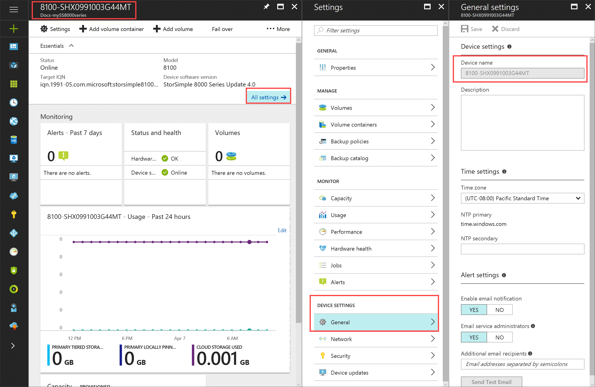
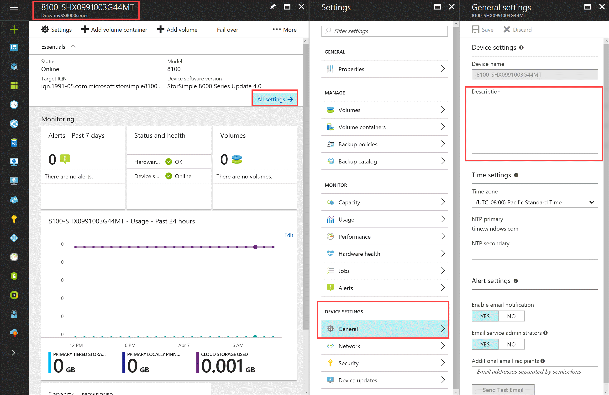
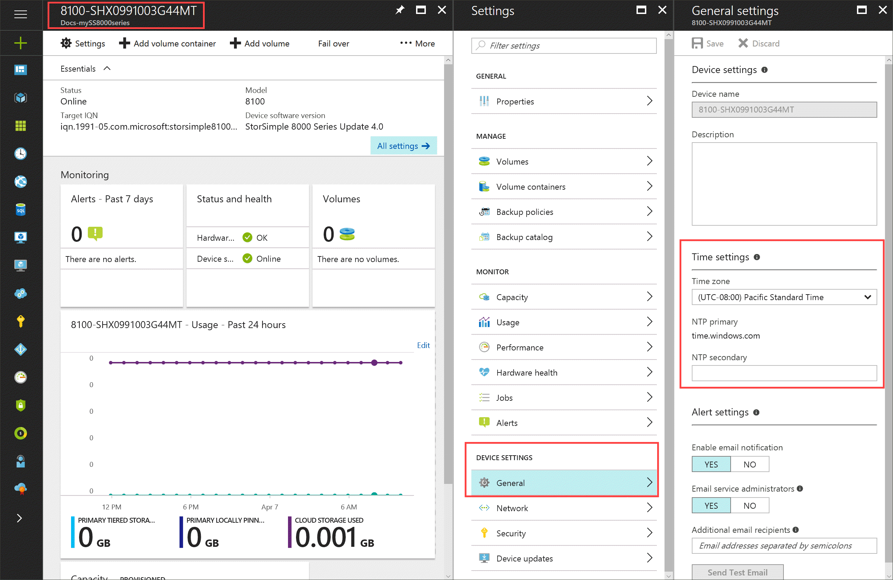
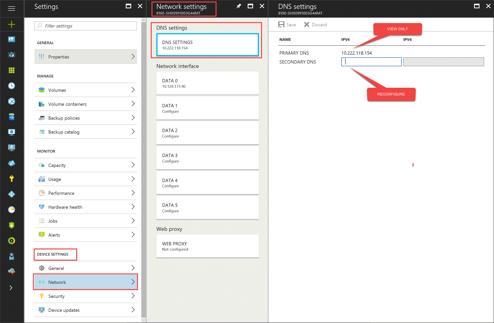
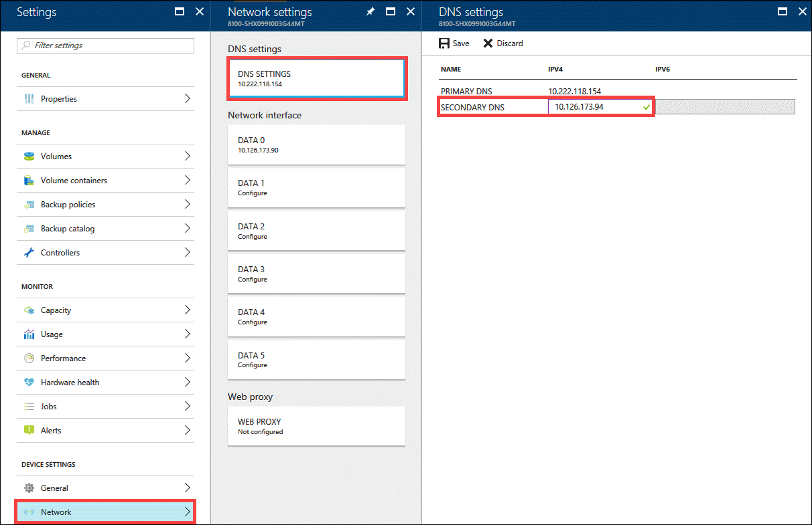
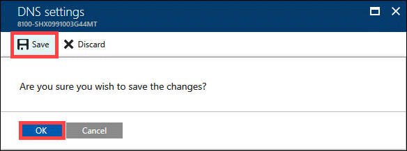
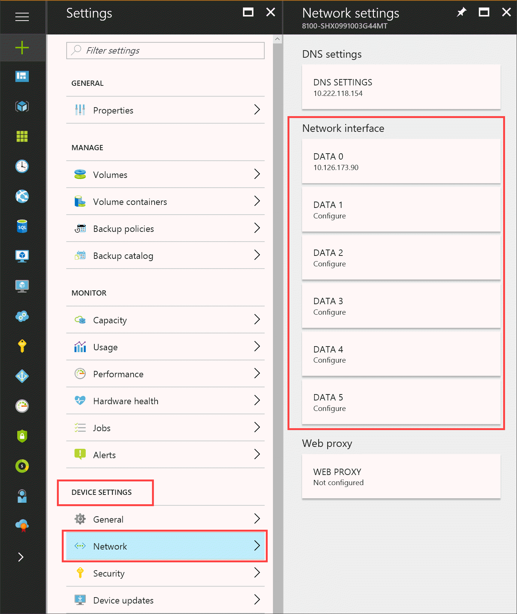
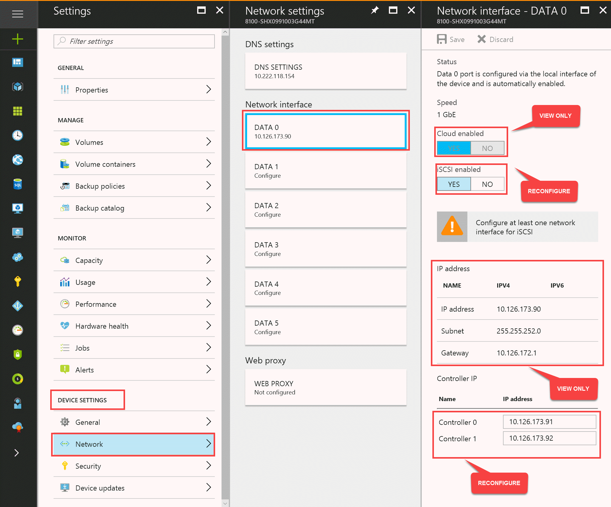
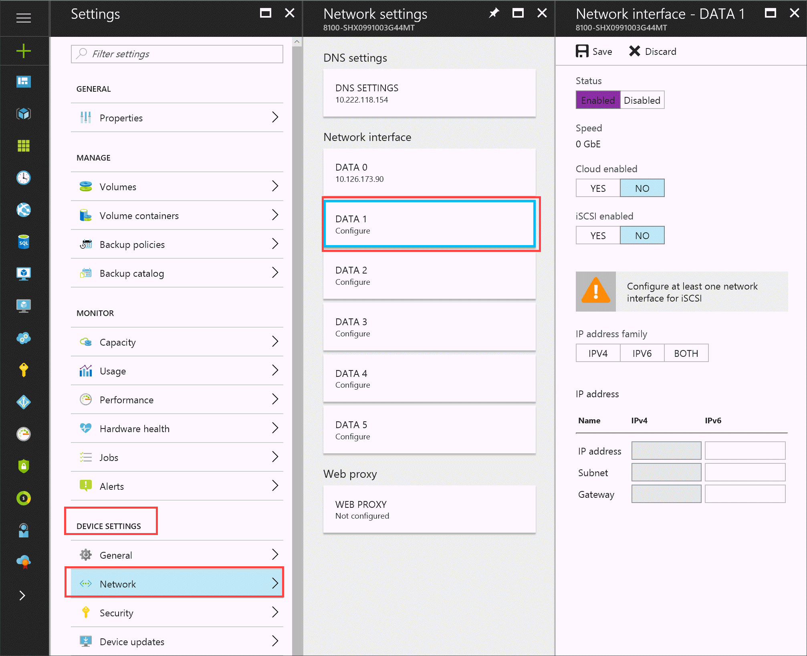

# Use the StorSimple Device Manager service to modify your StorSimple device configuration

## Overview

The Azure portal **Device settings** section in the **Settings** blade contains all the device parameters that you can reconfigure on a StorSimple device that is managed by a StorSimple Device Manager service. This tutorial explains how you can use the **Settings** blade to perform the following device-level tasks:

* Modify device friendly name
* Modify device time settings
* Assign a secondary DNS
* Modify network interfaces
* Swap or reassign IPs

## Modify device friendly name

You can use the Azure portal to change the device name and assign it a unique friendly name of your choice. Use the **General settings** blade on your device to modify the device friendly name. The friendly name can contain any characters and can be a maximum of 64 characters long.

> [!NOTE] 
> You can only modify the device name in the Azure portal before the device setup is complete. Once the minimum device setup is complete, you cannot change the device name.

A StorSimple device that is connected to the StorSimple Device Manager service is assigned a default name. The default name typically reflects the serial number of the device. For example, a default device name that is 15 characters long, such as 8600-SHX0991003G44HT, indicates the following:

* **8600**  – Indicates the device model.
* **SHX** – Indicates the manufacturing site.
* **0991003** - Indicates a specific product.
* **G44HT**- The last 5 digits are incremented to create unique serial numbers. This might not be a sequential set.

## Modify device description

Use the **General settings** blade on your device to modify the device description.

A device description usually helps identify the owner and the physical location of the device. The description field must contain fewer than 256 characters.

## Modify time settings

Your device must synchronize time in order to authenticate with your cloud storage service provider. Use the **General settings** blade on your device to modify the device time settings.

 Select your time zone from the drop-down list. You can specify up to two Network Time Protocol (NTP) servers:

 - **Primary NTP server** -  The configuration is required and is specified when you use Windows PowerShell for StorSimple to configure your device. You can specify the default Windows Server **time.windows.com** as your NTP server. You can view the primary NTP server configuration through the Azure portal, but you must use the Windows PowerShell interface to change it. Use the `Set-HcsNTPClientServerAddress` cmdlet to modify the Primary NTP server of your device. For more information, go to syntax for [Set-HcsNTPClientServerAddress](https://technet.microsoft.com/library/dn688138.aspx) cmdlet.

- **Secondary NTP server** - The configuration is optional. You can use the portal to configure a secondary NTP server.

When configuring the NTP server, ensure that your network allows the NTP traffic to pass from your datacenter to the Internet. When specifying a public NTP server, you must make sure that your network firewalls and other security devices are configured to allow NTP traffic to travel to and from the outside network. If bidirectional NTP traffic is not permitted, you must use an internal NTP server (a Windows domain controller provides this function). If your device cannot synchronize time, it may not be able to communicate with your cloud storage provider.

To see a list of public NTP servers, go to the [NTP Servers Web](https://support.ntp.org/bin/view/Servers/WebHome).

### What happens if the device is deployed in a different time zone?

If the device is deployed in a different time zone, the device time zone will change. Given that all the backup policies use the device time zone, the backup policies will automatically adjust in accordance with the new time zone. No user intervention is required.

## Modify DNS settings

A DNS server is used when your device attempts to communicate with your cloud storage service provider. Use the **Network settings** blade on your device to view and modify the configured DNS settings. 

For high availability, you are required to configure both the primary and the secondary DNS servers during the initial device deployment.

**Primary DNS server** - You use the Windows PowerShell for StorSimple to first specify the Primary DNS server during the initial setup. You can reconfigure the primary DNS server only via the Windows PowerShell interface. Use the `Set-HcsDNSClientServerAddress` cmdlet to modify the primary DNS server of your device. For more information, go to syntax for [Set-HcsDNSClientServerAddress](https://technet.microsoft.com/library/dn688138.aspx) cmdlet.

**Secondary DNS server** - To modify the secondary DNS server, use the `Set-HcsDNSClientServerAddress` cmdlet in the Windows PowerShell interface of the device or **Network settings** blade of your StorSimple device in the Azure portal.

To modify the secondary DNS server in Azure portal, perform the following steps.

1. Go to your StorSimple Device Manager service. From the list of devices, select and click your device.

2. In the **Settings** blade, go to **Device settings > Network**. This opens up the **Network settings** blade. Click **DNS settings** tile. Modify the secondary DNS server IP address.

    

4. From the command bar, click **Save** and when prompted for confirmation, click **OK**.

    

## Modify network interfaces

Your device has six device network interfaces, four of which are 1 GbE and two of which are 10 GbE. These interfaces are labeled as DATA 0 – DATA 5. DATA 0, DATA 1, DATA 4, and DATA 5 are 1 GbE, whereas DATA 2 and DATA 3 are 10 GbE network interfaces.

Use the **Network settings** blade to configure each of the interfaces to be used.

To ensure high availability, we recommend that you have at least two iSCSI interfaces and two cloud-enabled interfaces on your device. We recommend but do not require that unused interfaces be disabled.

For each network interface, the following parameters are displayed:

* **Speed** – Not a user-configurable parameter. DATA 0, DATA 1, DATA 4, and DATA 5 are always 1 GbE, whereas DATA 2 and DATA 3 are 10 GbE interfaces.
  
  > [!NOTE]
  > Speed and duplex are always auto-negotiated. Jumbo frames are not supported.
  
* **Interface state** – An interface can be enabled or disabled. If enabled, the device will attempt to use the interface. We recommend that only those interfaces that are connected to the network and used be enabled. Disable any interfaces that you are not using.
* **Interface type** – This parameter allows you to isolate iSCSI traffic from cloud storage traffic. This parameter can be one of the following:
  
  * **Cloud enabled** – when enabled, the device will use this interface to communicate with the cloud.
  * **iSCSI enabled** – when enabled, the device will use this interface to communicate with the iSCSI host.
    
    We recommend that you isolate iSCSI traffic from cloud storage traffic. Also note if your host is within the same subnet as your device, you do not need to assign a gateway; however, if your host is in a different subnet than your device, you will need to assign a gateway.
* **IP address** – When you configure any of the network interfaces, you must configure a virtual IP (VIP). This can be IPv4 or IPv6 or both. Both the IPv4 and IPv6 address families are supported for the device network interfaces. When using IPv4, specify a 32-bit IP address (*xxx.xxx.xxx.xxx*) in dot-decimal notation. When using IPv6, simply supply a 4-digit prefix, and a 128-bit address will be generated automatically for your device network interface based on that prefix.
* **Subnet** – This refers to the subnet mask and is configured via the Windows PowerShell interface.
* **Gateway** – This is the default gateway that should be used by this interface when it attempts to communicate with nodes that are not within the same IP address space (subnet). The default gateway must be in the same address space (subnet) as the interface IP address, as determined by the subnet mask.
* **Fixed IP address** – This field is available only while you configure the DATA 0 interface. For operations such as updates or troubleshooting the device, you may need to connect directly to the device controller. The fixed IP address can be used to access both the active and the passive controller on your device.

> [!NOTE]
> * To ensure proper operation, verify the interface speed and duplex on the switch that each device interface is connected to. Switch interfaces should either negotiate with or be configured for Gigabit Ethernet (1000 Mbps) and be full-duplex. Interfaces operating at slower speeds or in half-duplex will result in performance issues.
> * To minimize disruptions and downtime, we recommend that you enable portfast on each of the switch ports that the iSCSI network interface of your device will be connecting to. This will ensure that network connectivity can be established quickly in the event of a failover.

### Configure DATA 0

DATA 0 is cloud-enabled by default. When configuring DATA 0, you are also required to configure two fixed IP addresses, one for each controller. These fixed IP addresses can be used to access the device controllers directly and are useful when you install updates on the device, for garbage collection to work properly or when you access the controllers for the purpose of troubleshooting.

You can reconfigure the fixed IP controllers via the DATA 0 settings blade.

> [!NOTE]
> The fixed IP addresses for the controller are used for servicing the updates to the device and for space reclamation algorithms (garbage collection) to work properly. Therefore, the fixed IPs must be routable and able to connect to the Internet.

### Configure DATA 1 - DATA 5

For DATA 1 - DATA 5 network interfaces, you can configure all the network settings as shown in the following screenshot:

## Swap or reassign IPs

Currently, if any network interface on the controller is assigned a VIP that is in use (by the same device or another device in the network), then the controller will fail over. If you swap or reassign VIPs for a device network interface, you must follow a proper procedure as you could create a duplicate IP situation.

Perform the following steps to swap or reassign the VIPs for any of the network interfaces:

#### To reassign IPs

1. Clear the IP address for both interfaces.
2. After the IP addresses are cleared, assign the new IP addresses to the respective interfaces.

## Next steps

* Learn how to [configure MPIO for your StorSimple device](storsimple-8000-configure-mpio-windows-server.md).
* Learn how to [use the StorSimple Device Manager service to administer your StorSimple device](storsimple-8000-manager-service-administration.md).

