# Use the StorSimple Device Manager service to monitor your StorSimple device

## Overview
You can use the StorSimple Device Manager service to monitor specific devices within your StorSimple solution. You can create custom charts based on I/O performance, capacity utilization, network throughput, and device performance metrics and pin those to the dashboard. For more information, go to [customize your portal dashboard](../azure-portal/azure-portal-dashboards.md).

To view the monitoring information for a specific device, in the Azure portal, select the StorSimple Device Manager service. From the list of devices, select your device and then go to **Monitor**. You can then see the **Capacity**, **Usage**, and **Performance** charts for the selected device.

## Capacity
**Capacity** tracks the provisioned space and the space remaining on the device. The remaining capacity is then displayed as locally pinned or tiered.

The provisioned and remaining capacity is further broken down by tiered and locally pinned volumes. For each volume, the provisioned capacity, and the remaining capacity on the device is displayed.

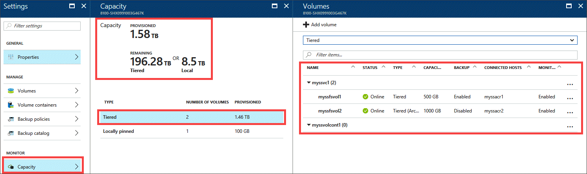


## Usage
**Usage** tracks metrics related to the amount of data storage space that is used by the volumes, volume containers, or device. You can create reports based on the capacity utilization of your primary storage, your cloud storage, or your device storage. Capacity utilization can be measured on a specific volume, a specific volume container, or all volume containers.
By default, the usage for past 24 hours is reported. You can edit the chart to change the duration over which the usage is reported by selecting from:
* Past 24 hours
* Past 7 days
* Past 30 days
* Past 90 days
* Past year

Two key metrices, growth and range are reported for the usage charts. Range refers to the maximum value and the minimum values of the usage reported over the selected duration (fo instance, Past 7 days).

Growth refers to the increase in usage from the first day to the last day over the selected duration. 

Growth and range can also be represented by the following equations:

```
Range = {Usage(minimum), Usage(maximum)}

Growth = Usage(Last day) - Usage(first day)

Growth (%) = [{Usage(last day) - Usage(first day)} X 100]/Usage(first day)
```

The primary, cloud, and local storage used can be described as follows:

### Primary storage usage
These charts show the amount of data written to StorSimple volumes before the data is deduplicated and compressed. You can view the primary storage used by all volumes in a volume container or for a single volume. The primary storage used is further broken down by primary tiered storage used and primary locally pinned storage used.

The following charts show the primary storage used for a StorSimple device before and after a cloud snapshot was taken. As this is just volume data, a cloud snapshot should not change the primary storage. As you can see, the chart shows no difference in the primary tiered or locally pinned storage used as a result of taking a cloud snapshot. The cloud snapshot started at around 11:50 pm on that device.

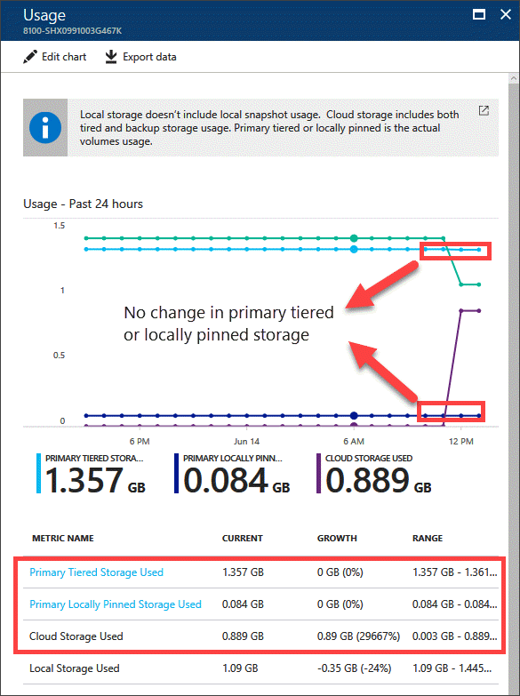

If you now run IO on the host connected to your StorSimple device, you will see an increase in primary tiered storage or primary locally pinned storage used depending upon which volumes (tiered or locally pinned) you write the data to. Here are the primary storage usage charts for a StorSimple device. On this device, the StorSimple host started serving writes at around 2:30 pm on a tiered volume on the device. You can see the peak in the write bytes/s corresponding to the IO running on the host.

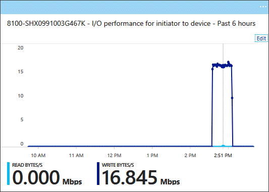

If you look at the primary tiered storage used, that has gone up whereas the primary locally pinned usage stays unchanged as there are no writes served to the locally pinned volumes on the device.

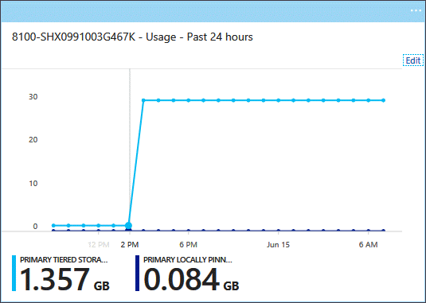

If you are running Update 3 or higher, you can break down the primary storage capacity utilization by an individual volume, all volumes, all tiered volumes, and all locally pinned volumes as shown below. Breaking down by all locally pinned volumes will allow you to quickly ascertain how much of the local tier is used up.

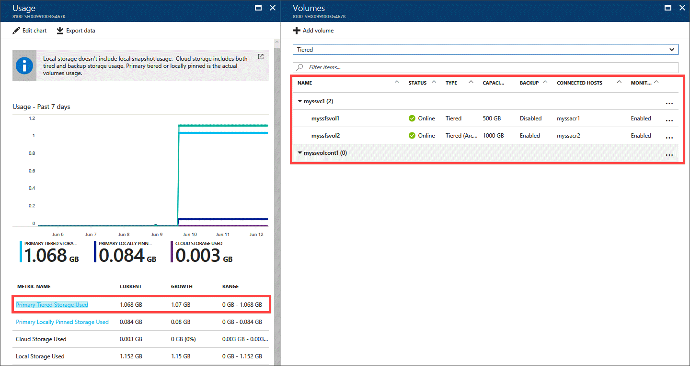

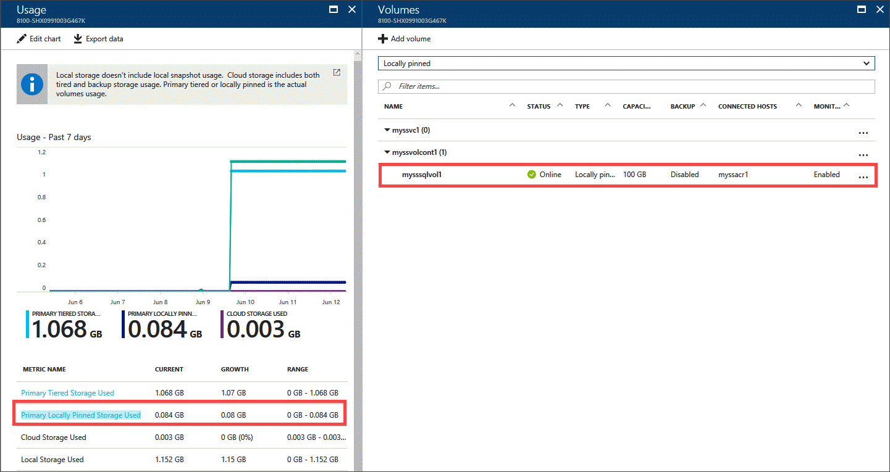

You can further click on each of the volumes in the list and see the corresponding usage.


### Cloud storage usage
These charts show the amount of cloud storage used. This data is deduplicated and compressed. This amount includes cloud snapshots which might contain data that isn't reflected in any primary volume and is kept for legacy or required retention purposes. You can compare the primary and cloud storage consumption figures to get an idea of the data reduction rate, although the number will not be exact.

The following charts show the cloud storage utilization of a StorSimple device when a cloud snapshot was taken.

* The cloud snapshot started at around 11:50 am on that device and you can see that before the cloud snapshot, there was no cloud storage used. 
* Once the cloud snapshot completed, the cloud storage utilization shot up 0.89 GB. 
* While the cloud snapshot was in progress, there is also a corresponding peak in the IO from device to cloud.

    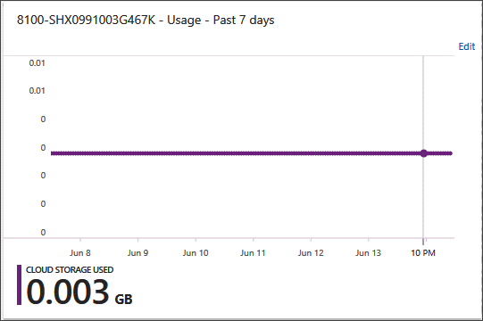

    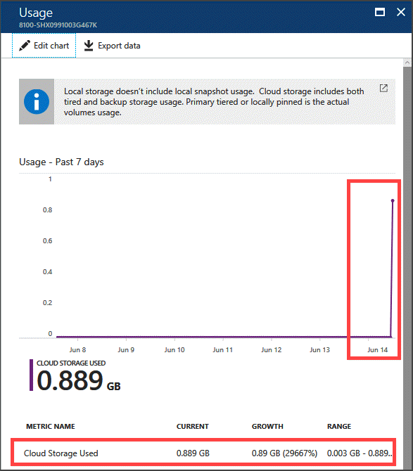

    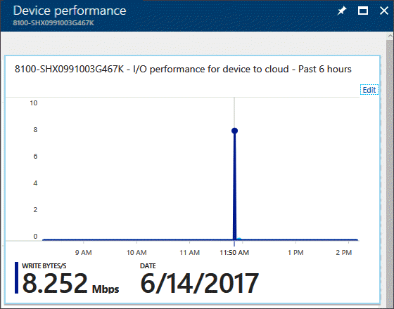


### Local storage usage
These charts show the total utilization for the device, which will be more than primary storage usage because it includes the SSD linear tier. This tier contains an amount of data that also exists on the device's other tiers. The capacity in the SSD linear tier is cycled so that when new data comes in, the old data is moved to the HDD tier (at which time it is deduplicated and compressed) and subsequently to the cloud.

Over time, primary storage used and local storage used will most likely increase together until the data begins to be tiered to the cloud. At that point, the local storage used will probably begin to plateau, but the primary storage used will increase as more data is written.

The following charts show the primary storage used for a StorSimple device when a cloud snapshot was taken. The cloud snapshot started at 11:50 am and the local storage started decreasing at that time. The local storage used went down from 1.445 GB to 1.09 GB. This indicates that most likely the uncompressed data in the linear SSD tier was deduplicated, compressed, and moved into the HDD tier. Note that if the device already has a large amount of data in both the SSD and HDD tiers, you may not see this decrease. In this example, the device has a small amount of data.

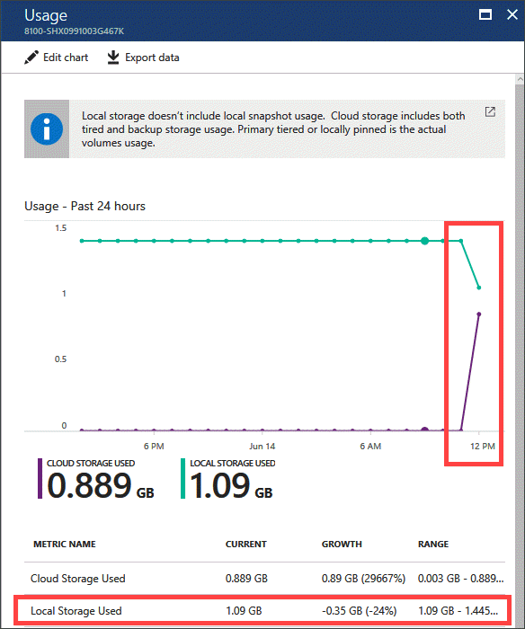

## Performance
**Performance** tracks metrics related to the number of read and write operations between either the iSCSI initiator interfaces on the host server and the device or the device and the cloud. This performance can be measured for a specific volume, a specific volume container, or all volume containers. Performance also includes CPU utilization and Network throughput for the various network interfaces on your device.

### I/O performance for initiator to device
The chart below shows the I/O for the initiator to your device for all the volumes for a production device. The metrics plotted are read and write bytes per second. You can also chart read, write, and outstanding IO, or read and write latencies.


### I/O performance for device to cloud
For the same device, the I/O operations are plotted for the data from the device to the cloud for all the volume containers. On this device, the data is only in the linear tier and nothing has spilled to the cloud. There are no read-write operations occurring from device to the cloud. Therefore, the peaks in the chart are at an interval of 5 minutes that corresponds to the frequency at which the heartbeat is checked between the device and the service.

For the same device, a cloud snapshot was taken for volume data starting at 11:50 am. This resulted in data flowing from the device to the cloud. Writes were served to the cloud in this duration. The IO chart shows a peak in the Write Bytes/s corresponding to the time when the snapshot was taken.


### Network throughput for device network interfaces
**Network throughput** tracks metrics related to the amount of data transferred from the iSCSI initiator network interfaces on the host server and the device and between the device and the cloud. You can monitor this metric for each of the iSCSI network interfaces on your device.

The following charts show the network throughput for the Data 0, 1 1 GbE network on your device, which was both cloud-enabled (default) and iSCSI-enabled. On this device on June 14 at around 9 pm, data was tiered into the cloud (no cloud snapshots were taken at that time which points to tiering being the mechanism to move the data into the cloud) which resulted in IO being served to the cloud. There is a corresponding peak in the network throughput graph for the same time and most of the network traffic is outbound to the cloud.

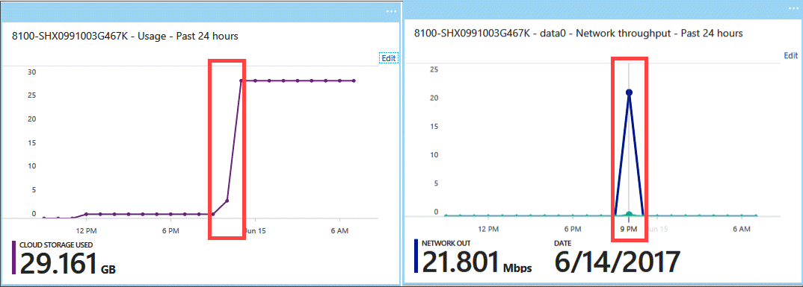

If we look at the Data 1 interface throughput chart, another 1 GbE network interface which was only iSCSI-enabled, then there was virtually no network traffic in this duration.

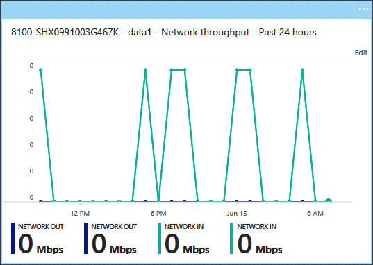


## CPU utilization for device
**CPU utilization** tracks metrics related to the CPU utilized on your device. The following chart shows the CPU utilization stats for a device in production.

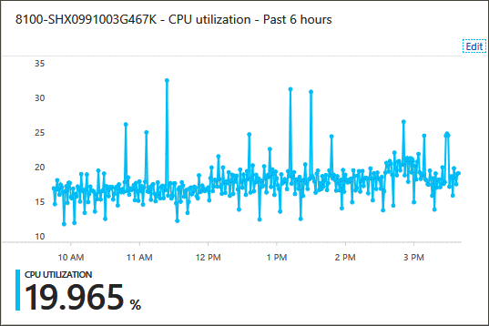


## Next steps
* Learn how to [use the StorSimple Device Manager service device dashboard](storsimple-device-dashboard.md).
* Learn how to [use the StorSimple Device Manager service to administer your StorSimple device](storsimple-manager-service-administration.md).

