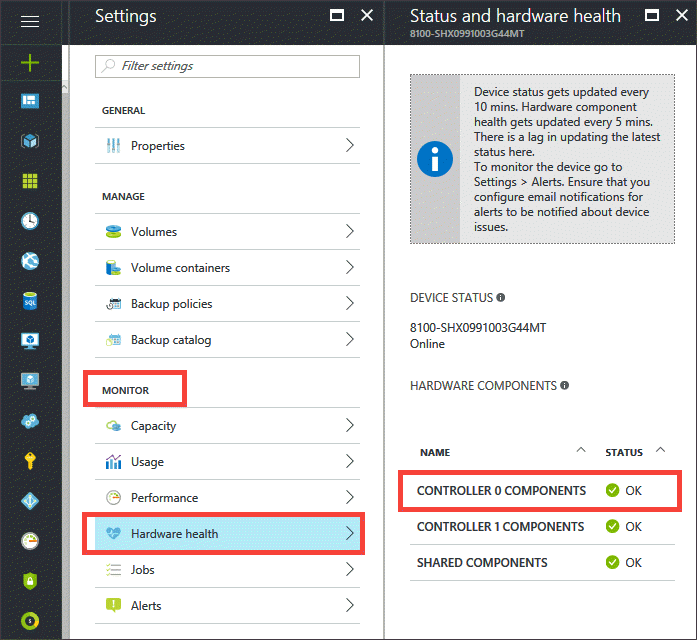
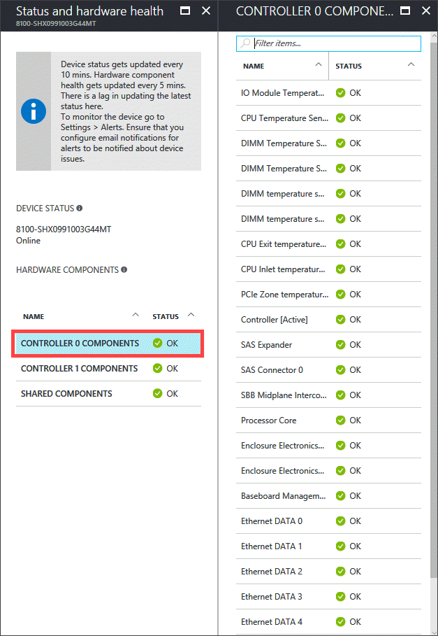
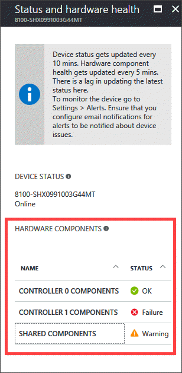
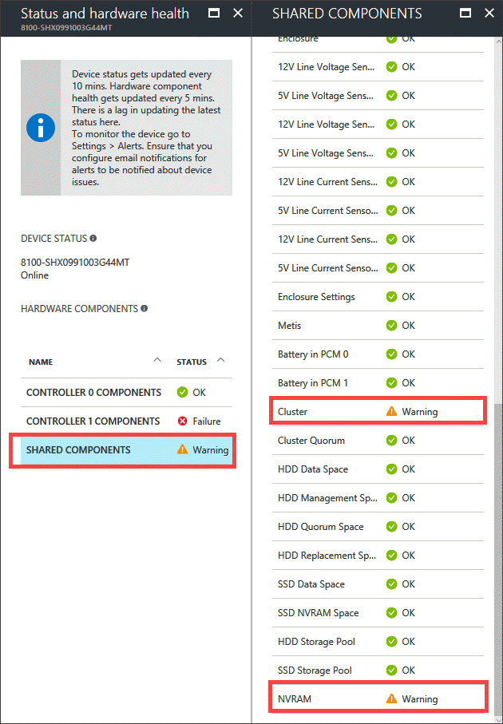
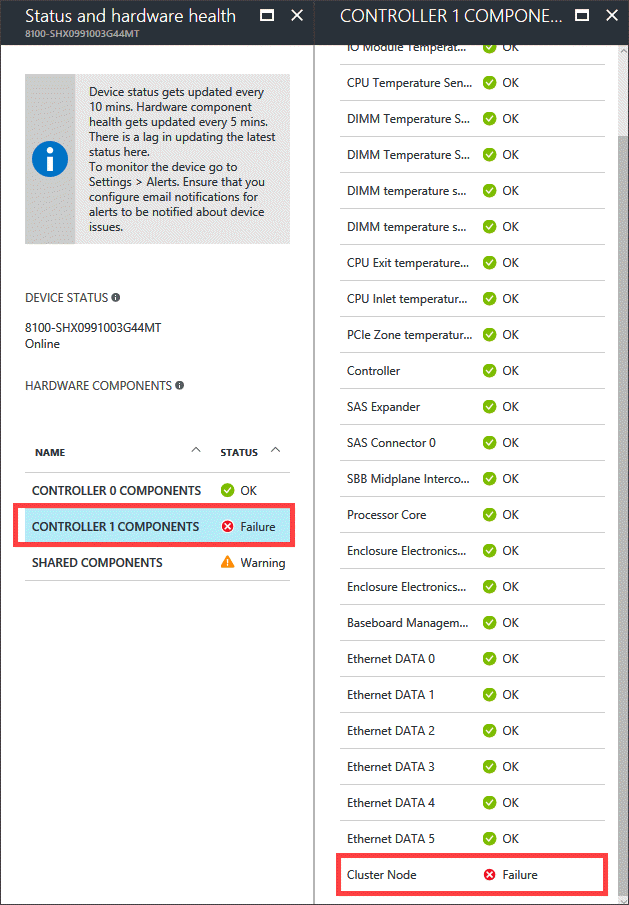

# Use the StorSimple Device Manager service to monitor hardware components and status

## Overview
This article describes the various physical and logical components in your on-premises StorSimple 8000 series device. It also explains how to monitor the device component status by using the **Status and hardware health** blade in the StorSimple Device Manager service.

The **Status and hardware health** blade shows the hardware status of all the StorSimple device components.

Under the list of components for 8100, there are three sections that describe:

* **Shared Components** – These are not part of the controllers, such as disk drives, enclosure, Power and Cooling Module (PCM) components and PCM temperature, line voltage, and line current sensors.
* **Controller 0 Components** – The components that reside on Controller 0, such as controller, SAS expander and connector, controller temperature sensors, and the various network interfaces.
* **Controller 1 Components** – The components that constitute Controller 1, similar to those detailed for Controller 0.

An 8600 device has additional components that correspond to the Extended Bunch of Disks (EBOD) enclosure. Under the list of components, there are five sections. Of these, there are three sections that contain the components in the primary enclosure and are identical to the ones described for 8100. There are two additional sections for the EBOD enclosure that describe:

* **EBOD Controller 0 Components** – The components that reside on EBOD enclosure 0, such as the EBOD controller, SAS expander and connector, and controller temperature sensors.
* **EBOD Controller 1 Components** – The components that constitute EBOD enclosure 1, similar to those detailed for EBOD enclosure 0.
* **EBOD enclosure Shared Components** – The components present in the EBOD enclosure and PCM that are not part of the EBOD controller.

> [!NOTE]
> **The hardware status is not available for a StorSimple Cloud Appliance (8010/8020).**

## Monitor the hardware status
Perform the following steps to view the hardware status of a device component:

1. Navigate to **Devices**, select a specific StorSimple device. Go to **Monitor > Hardware health**.

    

2. Locate the **Hardware components** section and choose from the available components. Simply click the component label to expand the list and view the status of the various device components. See the [detailed component list for the primary enclosure](#component-list-for-primary-enclosure-of-storsimple-device) and the [detailed component list for the EBOD enclosure](#component-list-for-ebod-enclosure-of-storsimple-device).

    

3. Use the following color coding scheme to interpret the  component status:
   
   * **Green check** – Denotes a healthy component with **OK** status.
   * **Yellow** – Denotes a degraded component in **Warning** state.
   * **Red exclamation** – Denotes a failed component that has a **Failure** status.
   * **White with black text** – Denotes a component that is not present.
   
   The following screenshot shows a device that has components in **OK**, **Warning**, and **Failure** state.
       
   

   Expanding the **Shared components list**, we can see that the NVRAM and the cluster are degraded.

   

   Expanding the **Controller 1 components** list, we can see that the cluster node has failed.  

     

4. If you encounter a component that is not in a **Healthy** state, contact Microsoft Support. If alerts are enabled on your device, you will receive an email alert. If you need to replace a failed hardware component, see [StorSimple hardware component replacement](storsimple-hardware-component-replacement.md).

## Component list for primary enclosure of StorSimple device
The following table outlines the physical and logical components contained in the primary enclosure (present both in 8100 and 8600) of your on-premises StorSimple device.

| Component | Module | Type | Location | Field replaceable unit (FRU)? | Description |
| --- | --- | --- | --- | --- | --- |
| Drive in slot [0-11] |Disk Drives |Physical |Shared |Yes |One line is presented for each of the SSD or the HDD drives in the primary enclosure. |
| Ambient temperature sensor |Enclosure |Physical |Shared |No |Measures the temperature within the chassis. |
| Mid-plane temperature sensor |Enclosure |Physical |Shared |No |Measures the temperature of the mid-plane. |
| Audible alarm |Enclosure |Physical |Shared |No |Indicates whether the audible alarm subsystem within the chassis is functional. |
| Enclosure |Enclosure |Physical |Shared |Yes |Indicates the presence of a chassis. |
| Enclosure settings |Enclosure |Physical |Shared |No |Refers to the front panel of the chassis. |
| Line voltage sensors |PCM |Physical |Shared |No |Numerous line voltage sensors have their state displayed, which indicates whether the measured voltage is within tolerance. |
| Line current sensors |PCM |Physical |Shared |No |Numerous line current sensors have their state displayed, which indicates whether the measured current is within tolerance. |
| Temperature sensors in PCM |PCM |Physical |Shared |No |Numerous temperature sensors such as Inlet and Hotspot sensors have their state displayed, indicating whether the measured temperature is within tolerance. |
| Power supply [0-1] |PCM |Physical |Shared |Yes |One line is presented for each of the power supplies in the two PCMs located in the back of the device. |
| Cooling [0-1] |PCM |Physical |Shared |Yes |One line is presented for each of the four cooling fans residing in the two PCMs. |
| Battery [0-1] |PCM |Physical |Shared |Yes |One line is presented for each of the backup battery modules that are seated in the PCM. |
| Metis |N/A |Logical |Shared |N/A |Displays the state of the batteries: whether they need charging and are approaching end-of-life. |
| Cluster |N/A |Logical |Shared |N/A |Displays the state of the cluster that is created between the two integrated controller modules. |
| Cluster node |N/A |Logical |Shared |N/A |Indicates the state of the controller as part of the cluster. |
| Cluster quorum |N/A |Logical | |N/A |Indicates the presence of the majority disk membership in the HDD storage pool. |
| HDD data space |N/A |Logical |Shared |N/A |The storage space that is used for data in the hard disk drive (HDD) storage pool. |
| HDD management space |N/A |Logical |Shared |N/A |The space reserved in the HDD storage pool for management tasks. |
| HDD quorum space |N/A |Logical |Shared |N/A |The space reserved in the HDD storage pool for cluster quorum. |
| HDD replacement space |N/A |Logical |Shared |N/A |The space reserved in the HDD storage pool for controller replacement. |
| SSD data space |N/A |Logical |Shared |N/A |The storage space used for data in the solid state drive (SSD) storage pool. |
| SSD NVRAM space |N/A |Logical |Shared |N/A |The storage space in the SSD storage pool that is dedicated for NVRAM logic. |
| HDD storage pool |N/A |Logical |Shared |N/A |Displays the state of the logical storage pool that is created from device HDDs. |
| SSD storage pool |N/A |Logical |Shared |N/A |Displays the state of the logical storage pool that is created from device SSDs. |
| Controller [0-1] [state] |I/O |Physical |Controller |Yes |Displays the state of the controller, and whether it is in active or standby mode within the chassis. |
| Temperature sensors in controller |I/O |Physical |Controller |No |Numerous temperature sensors such as I/O module, CPU temperature, DIMM and PCIe sensors have their state displayed, which indicates whether or not the temperature encountered is within tolerance. |
| SAS expander |I/O |Physical |Controller |No |Indicates the state of the serial attached SCSI (SAS) expander, which is used to connect the integrated storage to the controller. |
| SAS connector [0-1] |I/O |Physical |Controller |No |Indicates the state of each SAS connector, which is used to connect integrated storage to the SAS expander. |
| SBB mid-plane interconnect |I/O |Physical |Controller |No |Indicates the state of the mid-plane connector, which is used to connect each controller to the mid-plane. |
| Processor core |I/O |Physical |Controller |No |Indicates the state of the processor cores within each controller. |
| Enclosure electronics power |I/O |Physical |Controller |No |Indicates the state of the power system used by the enclosure. |
| Enclosure electronics diagnostics |I/O |Physical |Controller |No |Indicates the state of the diagnostics subsystems provided by the controller. |
| Baseboard Management Controller (BMC) |I/O |Physical |Controller |No |Indicates the state of the baseboard management controller (BMC), which is a specialized service processor that monitors the hardware device through sensors and communicates with the system administrator via an independent connection. |
| Ethernet |I/O |Physical |Controller |No |Indicates the state of each of the network interfaces, that is, the management and data ports provided on the controller. |
| NVRAM |I/O |Physical |Controller |No |Indicates the state of NVRAM, a non-volatile random access memory backed up by the battery that serves to retain application-critical information in the event of power failure. |

## Component list for EBOD enclosure of StorSimple device
The following table outlines the physical and logical components contained in the EBOD enclosure (only present in 8600 model) of your on-premises StorSimple device.

| Component | Module | Type | Location | FRU? | Description |
| --- | --- | --- | --- | --- | --- |
| Drive in slot [0-11] |Disk Drives |Physical |Shared |Yes |One line is presented for each of the HDD drives in the front of the EBOD enclosure. |
| Ambient temperature sensor |Enclosure |Physical |Shared |No |Measures the temperature within the chassis. |
| Mid-plane temperature sensor |Enclosure |Physical |Shared |No |Measures the temperature of the mid-plane. |
| Audible alarm |Enclosure |Physical |Shared |No |Indicates whether the audible alarm subsystem within the chassis is functional. |
| Enclosure |Enclosure |Physical |Shared |Yes |Indicates the presence of a chassis. |
| Enclosure settings |Enclosure |Physical |Shared |No |Refers to the OPS or the front panel of the chassis. |
| Line voltage sensors |PCM |Physical |Shared |No |Numerous line voltage sensors have their state displayed, which indicates whether the measured voltage is within tolerance. |
| Line current sensors |PCM |Physical |Shared |No |Numerous line current sensors have their state displayed, which indicates whether the measured current is within tolerance. |
| Temperature sensors in PCM |PCM |Physical |Shared |No |Numerous temperature sensors such as Inlet and Hotspot sensors have their state displayed, which indicates whether the measured temperature is within tolerance. |
| Power supply [0-1] |PCM |Physical |Shared |Yes |One line is presented for each of the power supplies in the two PCMs located in the back of the device. |
| Cooling [0-1] |PCM |Physical |Shared |Yes |One line is presented for each of the four cooling fans residing in the two PCMs. |
| Local storage [HDD] |N/A |Logical |Shared |N/A |Displays the state of the logical storage pool that is created from device HDDs. |
| Controller [0-1] [state] |I/O |Physical |Controller |Yes |Displays the state of the controllers in the EBOD module. |
| Temperature sensors in EBOD |I/O |Physical |Controller |No |Numerous temperature sensors from each controller have their state displayed, which indicates whether the temperature encountered is within tolerance. |
| SAS expander |I/O |Physical |Controller |No |Indicates the state of the SAS expander, which is used to connect the integrated storage to the controller. |
| SAS connector [0-2] |I/O |Physical |Controller |No |Indicates the state of each SAS connector, which is used to connect integrated storage to the SAS expander. |
| SBB mid-plane interconnect |I/O |Physical |Controller |No |Indicates the state of the mid-plane connector, which is used to connect each controller to the mid-plane. |
| Enclosure electronics power |I/O |Physical |Controller |No |Indicates the state of the power system used by the enclosure. |
| Enclosure electronics diagnostics |I/O |Physical |Controller |No |Indicates the state of the diagnostics subsystems provided by the controller. |
| Connection to device controller |I/O |Physical |Controller |No |Indicates the state of the connection between the EBOD I/O module and the device controller. |

## Next steps
* To use the StorSimple Device Manager service to administer your device, go to [use the StorSimple Device Manager service to administer your StorSimple device](storsimple-8000-manager-service-administration.md).
* If you need to troubleshoot a device component that has a degraded or failed status, refer to [StorSimple monitoring indicators](storsimple-monitoring-indicators.md).
* To replace a failed hardware component, see [StorSimple hardware component replacement](storsimple-hardware-component-replacement.md).
* If you continue to experience device issues, [contact Microsoft Support](storsimple-8000-contact-microsoft-support.md).

