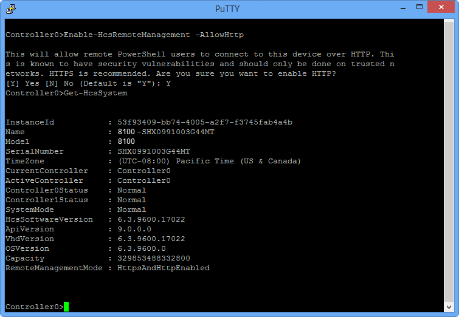
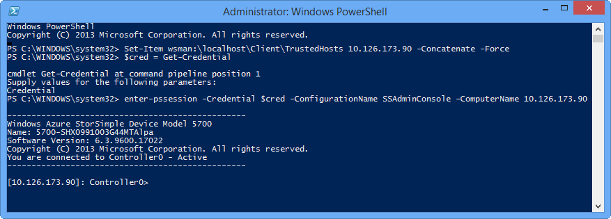
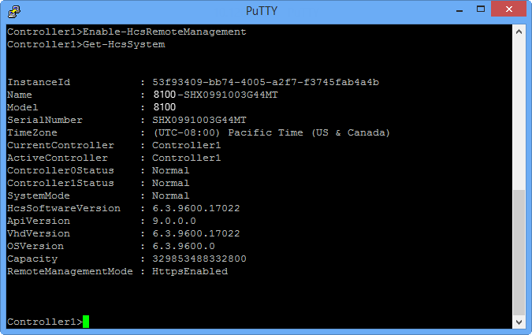
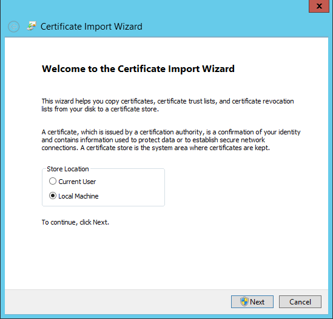
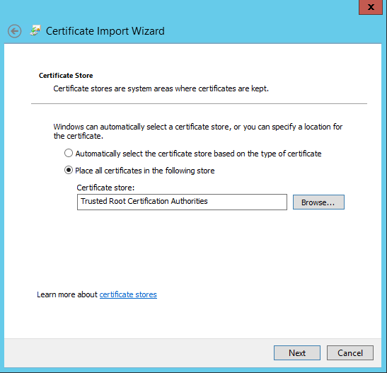
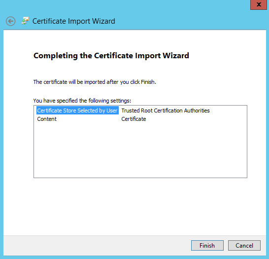
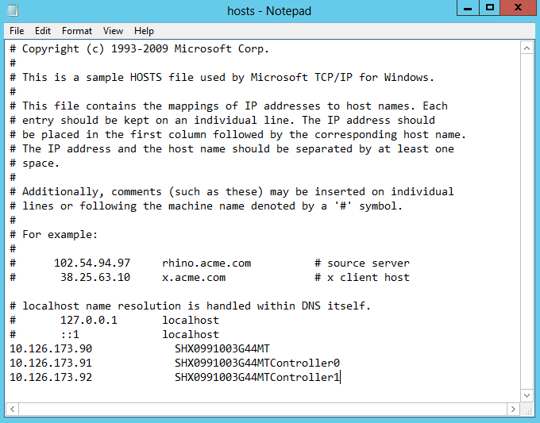
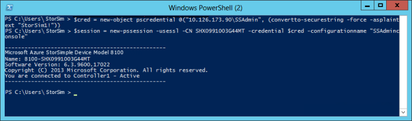

# Connect remotely to your StorSimple 8000 series device

## Overview

You can remotely connect to your device via Windows PowerShell. When you connect this way, you do not see a menu. (You see a menu only if you use the serial console on the device to connect.) With Windows PowerShell remoting, you connect to a specific runspace. You can also specify the display language.

For more information about using Windows PowerShell remoting to manage your device, go to [Use Windows PowerShell for StorSimple to administer your StorSimple device](storsimple-8000-windows-powershell-administration.md).

This tutorial explains how to configure your device for remote management and then how to connect to Windows PowerShell for StorSimple. You can use HTTP or HTTPS to remotely connect via Windows PowerShell. However, when you are deciding how to connect to Windows PowerShell for StorSimple, consider the following information:

* Connecting directly to the device serial console is secure, but connecting to the serial console over network switches is not. Be cautious of the security risk when connecting to the device serial console over network switches.
* Connecting through an HTTP session might offer more security than connecting through the serial console over the network. Although this is not the most secure method, it is acceptable on trusted networks.
* Connecting through an HTTPS session with a self-signed certificate is the most secure and the recommended option.

You can connect remotely to the Windows PowerShell interface. However, remote access to your StorSimple device via the Windows PowerShell interface is not enabled by default. You must enable remote management on the device first, and then on the client that is used to access your device.

The steps described in this article were performed on a host system running Windows Server 2012 R2.

## Connect through HTTP

Connecting to Windows PowerShell for StorSimple through an HTTP session offers more security than connecting through the serial console of your StorSimple device. Although this is not the most secure method, it is acceptable on trusted networks.

You can use either the Azure portal or the serial console to configure remote management. Select from the following procedures:

* Use the Azure portal to enable remote management over HTTP
* [Use the serial console to enable remote management over HTTP](#use-the-serial-console-to-enable-remote-management-over-http)

After you enable remote management, use the following procedure to prepare the client for a remote connection.

* [Prepare the client for remote connection](#prepare-the-client-for-remote-connection)

### Use the Azure portal to enable remote management over HTTP

Perform the following steps in the Azure portal to enable remote management over HTTP.

#### To enable remote management through the Azure portal

1. Go to your StorSimple Device Manager service. Select **Devices** and then select and click the device you want to configure for remote management. Go to **Device settings > Security**.
2. In the **Security settings** blade, click **Remote Management**.
3. In the **Remote management** blade, set **Enable Remote Management** to **Yes**.
4. You can now choose to connect using HTTP. (The default is to connect over HTTPS.) Make sure that HTTP is selected.
   
   > [!NOTE]
   > Connecting over HTTP is acceptable only on trusted networks.
   
5. Click **Save** and when prompted for confirmation, select **Yes**.

### Use the serial console to enable remote management over HTTP
Perform the following steps on the device serial console to enable remote management.

#### To enable remote management through the device serial console
1. On the serial console menu, select option 1. For more information about using the serial console on the device, go to [Connect to Windows PowerShell for StorSimple via device serial console](storsimple-8000-windows-powershell-administration.md#connect-to-windows-powershell-for-storsimple-via-the-device-serial-console).
2. At the prompt, type: `Enable-HcsRemoteManagement –AllowHttp`
3. You are notified about the security vulnerabilities of using HTTP to connect to the device. When prompted, confirm by typing **Y**.
4. Verify that HTTP is enabled by typing: `Get-HcsSystem`
5. Verify that the **RemoteManagementMode** field shows **HttpsAndHttpEnabled**.The following illustration shows these settings in PuTTY.
   
     

### Prepare the client for remote connection
Perform the following steps on the client to enable remote management.

#### To prepare the client for remote connection
1. Start a Windows PowerShell session as an administrator. If using a Windows 10 client, by default, the Windows Remote Management service is set to manual. You may need to start the service by typing:

    `Start-Service WinRM`
    
2. Type the following command to add the IP address of the StorSimple device to the client’s trusted hosts list:
   
     `Set-Item wsman:\localhost\Client\TrustedHosts <device_ip> -Concatenate -Force`
   
     Replace <*device_ip*> with the IP address of your device; for example: 
   
     `Set-Item wsman:\localhost\Client\TrustedHosts 10.126.173.90 -Concatenate -Force`
3. Type the following command to save the device credentials in a variable: 
   
    ```
    $cred = Get-Credential
    ```
    
4. In the dialog box that appears:
   
   1. Type the user name in this format: *device_ip\SSAdmin*.
   2. Type the device administrator password that was set when the device was configured with the setup wizard. The default password is *Password1*.
5. Start a Windows PowerShell session on the device by typing this command:
   
     `Enter-PSSession -Credential $cred -ConfigurationName SSAdminConsole -ComputerName <device_ip>`
   
   > [!NOTE]
   > To create a Windows PowerShell session for use with the StorSimple virtual device, append the `–Port` parameter and specify the public port that you configured in Remoting for StorSimple Virtual Appliance.
   
   
At this point, you should have an active remote Windows PowerShell session to the device.
   


## Connect through HTTPS

Connecting to Windows PowerShell for StorSimple through an HTTPS session is the most secure and recommended method of remotely connecting to your Microsoft Azure StorSimple device. The following procedures explain how to set up the serial console and client computers so that you can use HTTPS to connect to Windows PowerShell for StorSimple.

You can use either the Azure portal or the serial console to configure remote management. Select from the following procedures:

* Use the Azure portal to enable remote management over HTTPS
* [Use the serial console to enable remote management over HTTPS](#use-the-serial-console-to-enable-remote-management-over-https)

After you enable remote management, use the following procedures to prepare the host for a remote management and connect to the device from the remote host.

* [Prepare the host for remote management](#prepare-the-host-for-remote-management)
* [Connect to the device from the remote host](#connect-to-the-device-from-the-remote-host)

### Use the Azure portal to enable remote management over HTTPS

Perform the following steps in the Azure portal to enable remote management over HTTPS.

#### To enable remote management over HTTPS from the Azure portal

1. Go to your StorSimple Device Manager service. Select **Devices** and then select and click the device you want to configure for remote management. Go to **Device settings > Security**.
2. In the **Security settings** blade, click **Remote Management**.
3. Set **Enable Remote Management** to **Yes**.
4. You can now choose to connect using HTTPS. (The default is to connect over HTTPS.) Make sure that HTTPS is selected.
5. Click ... and then click **Download Remote Management Certificate**. Specify a location to save this file. You need to install this certificate on the client or host computer that you will use to connect to the device.
6. Click **Save** and then click **Yes** when prompted for confirmation.

### Use the serial console to enable remote management over HTTPS

Perform the following steps on the device serial console to enable remote management.

#### To enable remote management through the device serial console
1. On the serial console menu, select option 1. For more information about using the serial console on the device, go to [Connect to Windows PowerShell for StorSimple via device serial console](storsimple-8000-windows-powershell-administration.md#connect-to-windows-powershell-for-storsimple-via-the-device-serial-console).
2. At the prompt, type:
   
     `Enable-HcsRemoteManagement`
   
    This should enable HTTPS on your device.
3. Verify that HTTPS has been enabled by typing: 
   
     `Get-HcsSystem`
   
    Make sure that the **RemoteManagementMode** field shows **HttpsEnabled**.The following illustration shows these settings in PuTTY.
   
     
4. From the output of `Get-HcsSystem`, copy the serial number of the device and save it for later use.
   
   > [!NOTE]
   > The serial number maps to the CN name in the certificate.
   
5. Obtain a remote management certificate by typing: 
   
     `Get-HcsRemoteManagementCert`
   
    A certificate similar to the following will appear.
   
    
6. Copy the information in the certificate from **-----BEGIN CERTIFICATE-----** to **-----END CERTIFICATE-----** into a text editor such as Notepad, and save it as a .cer file. (You will copy this file to your remote host when you prepare the host.)
   
   > [!NOTE]
   > To generate a new certificate, use the `Set-HcsRemoteManagementCert` cmdlet.
   
### Prepare the host for remote management

To prepare the host computer for a remote connection that uses an HTTPS session, perform the following procedures:

* [Import the .cer file into the root store of the client or remote host](#to-import-the-certificate-on-the-remote-host).
* [Add the device serial numbers to the hosts file on your remote host](#to-add-device-serial-numbers-to-the-remote-host).

Each of the preceding procedures, is described below.

#### To import the certificate on the remote host
1. Right-click the .cer file and select **Install certificate**. This starts the Certificate Import Wizard.
   
    
2. For **Store location**, select **Local Machine**, and then click **Next**.
3. Select **Place all certificates in the following store**, and then click **Browse**. Navigate to the root store of your remote host, and then click **Next**.
   
    
4. Click **Finish**. A message that tells you that the import was successful appears.
   
    

#### To add device serial numbers to the remote host
1. Start Notepad as an administrator, and then open the hosts file located at \Windows\System32\Drivers\etc.
2. Add the following three entries to your hosts file: **DATA 0 IP address**, **Controller 0 Fixed IP address**, and **Controller 1 Fixed IP address**.
3. Enter the device serial number that you saved earlier. Map this to the IP address as shown in the following image. For Controller 0 and Controller 1, append **Controller0** and **Controller1** at the end of the serial number (CN name).
   
    
4. Save the hosts file.

### Connect to the device from the remote host

Use Windows PowerShell and TLS to enter an SSAdmin session on your device from a remote host or client. The SSAdmin session maps to option 1 in the [serial console](storsimple-8000-windows-powershell-administration.md#connect-to-windows-powershell-for-storsimple-via-the-device-serial-console) menu of your device.

Perform the following procedure on the computer from which you want to make the remote Windows PowerShell connection.

#### To enter an SSAdmin session on the device by using Windows PowerShell and TLS
1. Start a Windows PowerShell session as an administrator. If using a Windows 10 client, by default, the Windows Remote Management service is set to manual. You may need to start the service by typing:

    `Start-Service WinRM`

2. Add the device IP address to the client’s trusted hosts by typing:
   
     `Set-Item wsman:\localhost\Client\TrustedHosts <device_ip> -Concatenate -Force`
   
    Where <*device_ip*> is the IP address of your device; for example: 
   
     `Set-Item wsman:\localhost\Client\TrustedHosts 10.126.173.90 -Concatenate -Force`
3. To create a new credential, type:
   
     `$cred = New-Object pscredential @("<IP of target device>\SSAdmin", (ConvertTo-SecureString -Force -AsPlainText "<Device Administrator Password>"))`
   
    Where <*IP of target device*> is the IP address of DATA 0 for your device; for example, **10.126.173.90** as shown in the preceding image of the hosts file. Also, supply the administrator password for your device.
4. Create a session by typing:
   
     `$session = New-PSSession -UseSSL -ComputerName <Serial number of target device> -Credential $cred -ConfigurationName "SSAdminConsole"`
   
    For the -ComputerName parameter in the cmdlet, provide the <*serial number of target device*>. This serial number was mapped to the IP address of DATA 0 in the hosts file on your remote host; for example, **SHX0991003G44MT** as shown in the following image.
5. Type:
   
     `Enter-PSSession $session`
6. You will need to wait a few minutes, and then you will be connected to your device via HTTPS over TLS. You see a message that indicates you are connected to your device.
   
    

## Next steps

* Learn more about [using Windows PowerShell to administer your StorSimple device](storsimple-8000-windows-powershell-administration.md).
* Learn more about [using the StorSimple Device Manager service to administer your StorSimple device](storsimple-8000-manager-service-administration.md).

