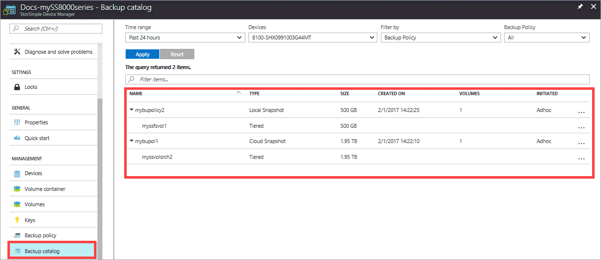
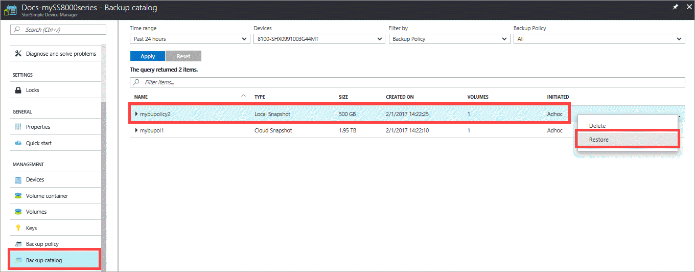
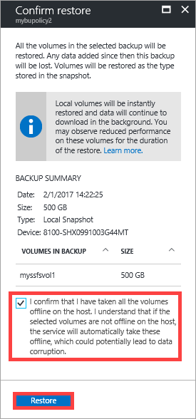
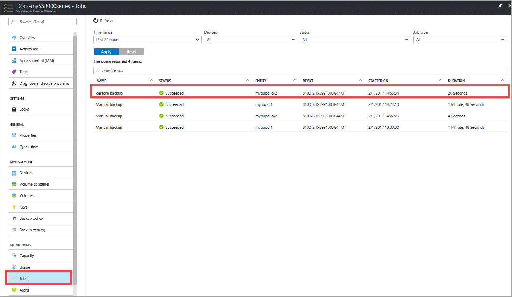

# Restore a StorSimple volume from a backup set

## Overview

This tutorial describes the restore operation performed on a StorSimple 8000 series device using an existing backup set. Use the **Backup catalog** blade to restore a volume from a local or cloud backup. The **Backup catalog** blade displays all the backup sets that are created when manual or automated backups are taken. The restore operation from a backup set brings the volume online immediately while data is downloaded in the background.

An alternate method to start restore is to go to **Devices > [Your device] > Volumes**. In the **Volumes** blade, select a volume, right-click to invoke the context menu, and then select **Restore**.

## Before you restore

Before you start a restore, review the following caveats:

* **You must take the volume offline** – Take the volume offline on both the host and the device before you initiate the restore operation. Although the restore operation automatically brings the volume online on the device, you must manually bring the device online on the host. You can bring the volume online on the host as soon as the volume is online on the device. (You do not need to wait until the restore operation is finished.) For procedures, go to [Take a volume offline](storsimple-8000-manage-volumes-u2.md#take-a-volume-offline).

* **Volume type after restore** – Deleted volumes are restored based on the type in the snapshot; that is, volumes that were locally pinned are restored as locally pinned volumes and volumes that were tiered are restored as tiered volumes.

    For existing volumes, the current usage type of the volume overrides the type that is stored in the snapshot. For example, if you restore a volume from a snapshot that was taken when the volume type was tiered and that volume type is now locally pinned (due to a conversion operation that was performed), then the volume will be restored as a locally pinned volume. Similarly, if an existing locally pinned volume was expanded and subsequently restored from an older snapshot taken when the volume was smaller, the restored volume will retain the current expanded size.

    You cannot convert a volume from a tiered volume to a locally pinned volume or from a locally pinned volume to a tiered volume while the volume is being restored. Wait until the restore operation is finished, and then you can convert the volume to another type. For information about converting a volume, go to [Change the volume type](storsimple-8000-manage-volumes-u2.md#change-the-volume-type). 

* **The volume size is reflected in the restored volume** – This is an important consideration if you are restoring a locally pinned volume that has been deleted (because locally pinned volumes are fully provisioned). Make sure that you have sufficient space before you attempt to restore a locally pinned volume that was previously deleted.

* **You cannot expand a volume while it is being restored** – Wait until the restore operation is finished before you attempt to expand the volume. For information about expanding a volume, go to [Modify a volume](storsimple-8000-manage-volumes-u2.md#modify-a-volume).

* **You can perform a backup while you restore a local volume** – For procedures go to [Use the StorSimple Device Manager service to manage backup policies](storsimple-8000-manage-backup-policies-u2.md).

* **You can cancel a restore operation** – If you cancel the restore job, then the volume will be rolled back to the state that it was in before you initiated the restore operation. For procedures, go to [Cancel a job](storsimple-8000-manage-jobs-u2.md#cancel-a-job).

## How does restore work

For devices running Update 4 or later, a heatmap-based restore is implemented. As the host requests to access data reach the device, these requests are tracked and a heatmap is created. High request rate results in data chunks with higher heat whereas lower request rate translates to chunks with lower heat. You must access the data at least twice to be marked as _hot_. A file that is modified is also marked as _hot_. Once you initiate the restore, then proactive hydration of data occurs based on the heatmap. For versions earlier than Update 4, the data is downloaded during restore based on access only.

The following caveats apply to heatmap-based restores:

* Heatmap tracking is enabled only for tiered volumes and locally pinned volumes are not supported.

* Heatmap-based restore is not supported when cloning a volume to another device. 

* If there is an in-place restore and a local snapshot for the volume to be restored exists on the device, then we do not rehydrate (as data is already available locally). 

* By default, when you restore, the rehydration jobs are initiated that proactively rehydrate data based on the heatmap. 

In Update 4, Windows PowerShell cmdlets can be used to query running rehydration jobs, cancel a rehydration job, and get the status of the rehydration job.

* `Get-HcsRehydrationJob` - This cmdlet gets the status of the rehydration job. A single rehydration job is triggered for one volume.

* `Set-HcsRehydrationJob` - This cmdlet allows you to pause, stop, resume the rehydration job, when the rehydration is in progress.

For more information on rehydration cmdlets, go to [Windows PowerShell cmdlet reference for StorSimple](https://technet.microsoft.com/library/dn688168.aspx).

With automatic rehydration, typically higher transient read performance is expected. The actual magnitude of improvements depends on various factors such as access pattern, data churn, and data type. 

To cancel a rehydration job, you can use the PowerShell cmdlet. If you wish to permanently disable rehydration jobs for all the future restores, [contact Microsoft Support](storsimple-8000-contact-microsoft-support.md).

## How to use the backup catalog

The **Backup Catalog** blade provides a query that helps you to narrow your backup set selection. You can filter the backup sets that are retrieved based on the following parameters:

* **Time range** – The date and time range when the backup set was created.
* **Device** – The device on which the backup set was created.
* **Backup policy** or **Volume** – The backup policy or volume associated with this backup set.

The filtered backup sets are then tabulated based on the following attributes:

* **Name** – The name of the backup policy or volume associated with the backup set.
* **Type** – Backup sets can be local snapshots or cloud snapshots. A local snapshot is a backup of all your volume data stored locally on the device, whereas a cloud snapshot refers to the backup of volume data residing in the cloud. Local snapshots provide faster access, whereas cloud snapshots are chosen for data resiliency.
* **Size** – The actual size of the backup set.
* **Created on** – The date and time when the backups were created. 
* **Volumes** - The number of volumes associated with the backup set.
* **Initiated** – The backups can be initiated automatically according to a schedule or manually by a user. (You can use a backup policy to schedule backups. Alternatively, you can use the **Take backup** option to take an interactive or on-demand backup.)

## How to restore your StorSimple volume from a backup

You can use the **Backup Catalog** blade to restore your StorSimple volume from a specific backup. Keep in mind, however, that restoring a volume will revert the volume to the state it was in when the backup was taken. Any data that was added after the backup operation will be lost.

> [!WARNING]
> Restoring from a backup will replace the existing volumes from the backup. This may cause the loss of any data that was written after the backup was taken.

### To restore your volume
1. Go to your StorSimple Device Manager service and then click **Backup catalog**.

2. Select a backup set as follows:
   
   1. Specify the time range.
   2. Select the appropriate device.
   3. In the drop-down list, choose the volume or backup policy for the backup that you wish to select.
   4. Click **Apply** to execute this query.

      The backups associated with the selected volume or backup policy should appear in the list of backup sets.
   
           
     
3. Expand the backup set to view the associated volumes. These volumes must be taken offline on the host and device before you can restore them. Access the volumes on the **Volumes** blade of your device, and then follow the steps in [Take a volume offline](storsimple-8000-manage-volumes-u2.md#take-a-volume-offline) to take them offline.
   
   > [!IMPORTANT]
   > Make sure that you have taken the volumes offline on the host first, before you take the volumes offline on the device. If you do not take the volumes offline on the host, it could potentially lead to data corruption.
   
4. Navigate back to the **Backup Catalog** tab and select a backup set. Right-click and then from the context menu, select **Restore**.

    

5. You will be prompted for confirmation. Review the restore information, and then select the confirmation check box.
   
    

7. Click **Restore**. This initiates a restore job that you can view by accessing the **Jobs** page.

   

8. After the restore is complete, verify that the contents of your volumes are replaced by volumes from the backup.

## If the restore fails

You will receive an alert if the restore operation fails for any reason. If this occurs, refresh the backup list to verify that the backup is still valid. If the backup is valid and you are restoring from the cloud, then connectivity issues might be causing the problem.

To complete the restore operation, take the volume offline on the host and retry the restore operation. Note that any modifications to the volume data that were performed during the restore process will be lost.

## Next steps
* Learn how to [Manage StorSimple volumes](storsimple-8000-manage-volumes-u2.md).
* Learn how to [use the StorSimple Device Manager service to administer your StorSimple device](storsimple-8000-manager-service-administration.md).

