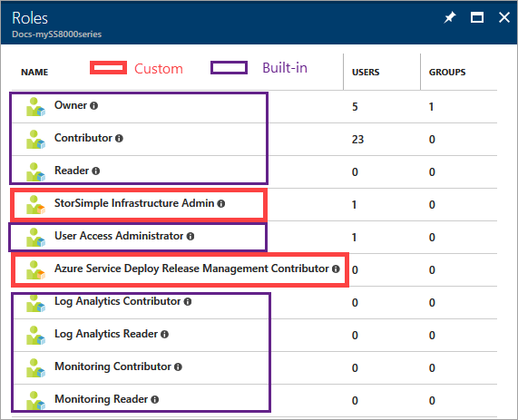
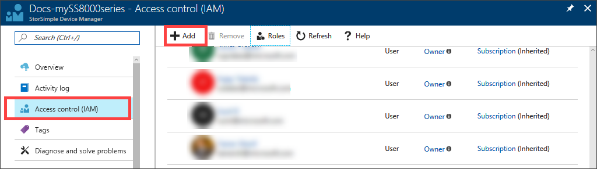
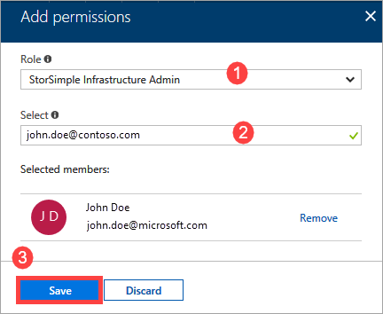
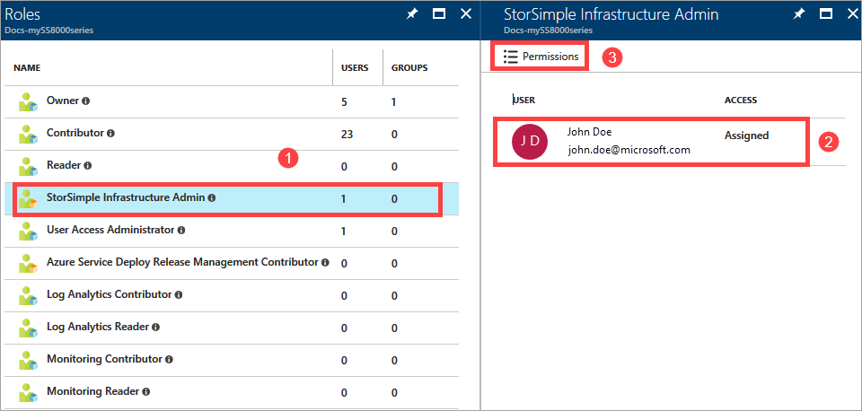
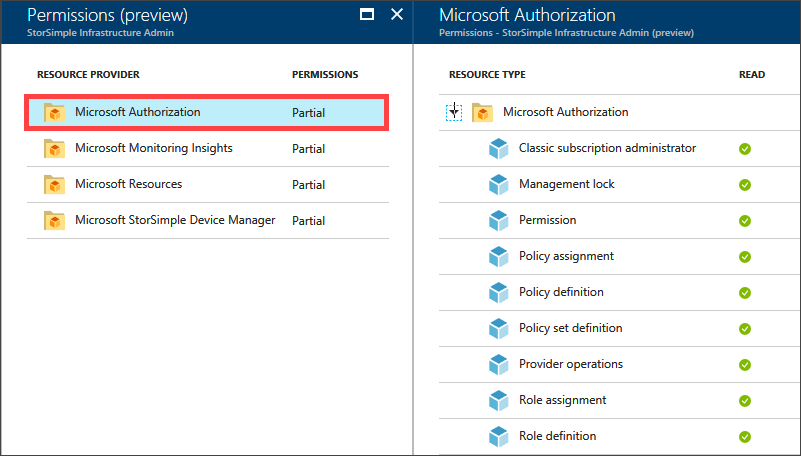

# Role-based Access Control for StorSimple

This article provides a brief description of how Azure Role-Based Access Control (RBAC) can be used for your StorSimple device. RBAC offers fine-grained access management for Azure. Use RBAC to grant just the right amount of access to the StorSimple users to do their jobs instead of giving everyone unrestricted access. For more information on the basics of access management in Azure, see [Get started with Role-based Access Control in the Azure portal](../role-based-access-control/overview.md).

This article applies to StorSimple 8000 series devices running Update 3.0 or later in the Azure portal.

[!INCLUDE [updated-for-az](../../includes/updated-for-az.md)]

## RBAC roles for StorSimple

RBAC can be assigned based on the roles. The roles ensure certain permission levels based on the available resources in the environment. There are two types of roles that StorSimple users can choose from: built-in or custom.

* **Built-in roles** - The built-in roles can be owner, contributor, reader, or user access administrator. For more information, see [Built-in roles for Azure Role-based Access Control](../role-based-access-control/built-in-roles.md).

* **Custom roles** - If the built-in roles do not suit your needs, you can create custom RBAC roles for StorSimple. To create a custom RBAC role, start with a built-in role, edit it, and then import it back in the environment. The download and upload of the role are managed using either Azure PowerShell or the Azure CLI. For more information, see [Create custom roles for Role-based Access Control](../role-based-access-control/custom-roles.md).

To view the different roles available for a StorSimple device user in the Azure portal, go to your StorSimple Device Manager service and then go to **Access control (IAM) > Roles**.


## Create a custom role for StorSimple Infrastructure Administrator

In the following example, we start with the built-in role **Reader** that allows users to view all the resource scopes but not to edit them or create new ones. We then extend this role to create a new custom role StorSimple Infrastructure admin. This role is assigned to users who can manage the infrastructure for the StorSimple devices.

1. Run Windows PowerShell as an administrator.

2. Log in to Azure.

    `Connect-AzAccount`

3. Export the Reader role as a JSON template on your computer.

    ```powershell
    Get-AzRoleDefinition -Name "Reader"

    Get-AzRoleDefinition -Name "Reader" | ConvertTo-Json | Out-File C:\ssrbaccustom.json
    ```

4. Open the JSON file in Visual Studio. You see that a typical RBAC role consists of three main sections, **Actions**, **NotActions**, and **AssignableScopes**.

    In the **Action** section, all the permitted operations for this role are listed. Each action is assigned from a resource provider. For a StorSimple infrastructure admin, use the `Microsoft.StorSimple` resource provider.

    Use PowerShell to see all the resource providers available and registered in your subscription.

    `Get-AzResourceProvider`

    You can also check for all the available PowerShell cmdlets to manage the resource providers.

    In the **NotActions** sections, all the restricted actions for a particular RBAC role are listed. In this example, no actions are restricted.
    
    Under the **AssignableScopes**, the subscription IDs are listed. Ensure that the RBAC role contains the explicit subscription ID where it is used. If the correct subscription ID is not specified, you are not allowed to import the role in your subscription.

    Edit the file keeping in mind the preceding considerations.

    ```json
    {
        "Name":  "StorSimple Infrastructure Admin",
        "Id":  "<guid>",
        "IsCustom":  true,
        "Description":  "Lets you view everything, but not make any changes except for Clear alerts, Clear settings, install, download etc.",
        "Actions":  [
                        "Microsoft.StorSimple/managers/alerts/read",
                        "Microsoft.StorSimple/managers/devices/volumeContainers/read",
                        "Microsoft.StorSimple/managers/devices/jobs/read",
                        "Microsoft.StorSimple/managers/devices/alertSettings/read",
                        "Microsoft.StorSimple/managers/devices/alertSettings/write",
                        "Microsoft.StorSimple/managers/clearAlerts/action",
                        "Microsoft.StorSimple/managers/devices/networkSettings/read",
                        "Microsoft.StorSimple/managers/devices/publishSupportPackage/action",
                        "Microsoft.StorSimple/managers/devices/scanForUpdates/action",
                        "Microsoft.StorSimple/managers/devices/metrics/read"

                    ],
        "NotActions":  [

                    ],
        "AssignableScopes":  [
                                "/subscriptions/<subscription_ID>/"
                            ]
    }
    ```

6. Import the custom RBAC role back into the environment.

    `New-AzRoleDefinition -InputFile "C:\ssrbaccustom.json"`


This role should now appear in the list of roles in the **Access control** blade.



For more information, go to [Custom roles](../role-based-access-control/custom-roles.md).

### Sample output for custom role creation via the PowerShell

```powershell
Connect-AzAccount
```

```Output
Environment           : AzureCloud
Account               : john.doe@contoso.com
TenantId              : <tenant_ID>
SubscriptionId        : <subscription_ID>
SubscriptionName      : Internal Consumption
CurrentStorageAccount :
```

```powershell
Get-AzRoleDefinition -Name "Reader"
```

```Output
Name             : Reader
Id               : <guid>
IsCustom         : False
Description      : Lets you view everything, but not make any changes.
Actions          : {*/read}
NotActions       : {}
AssignableScopes : {/}
```

```powershell
Get-AzRoleDefinition -Name "Reader" | ConvertTo-Json | Out-File C:\ssrbaccustom.json
New-AzRoleDefinition -InputFile "C:\ssrbaccustom.json"
```

```Output
Name             : StorSimple Infrastructure Admin
Id               : <tenant_ID>
IsCustom         : True
Description      : Lets you view everything, but not make any changes except for Clear alerts, Clear settings, install,
                   download etc.
Actions          : {Microsoft.StorSimple/managers/alerts/read,
                   Microsoft.StorSimple/managers/devices/volumeContainers/read,
                   Microsoft.StorSimple/managers/devices/jobs/read,
                   Microsoft.StorSimple/managers/devices/alertSettings/read...}
NotActions       : {}
AssignableScopes : {/subscriptions/<subscription_ID>/}
```

## Add users to the custom role

You grant access from within the resource, resource group, or subscription that is the scope of the role assignment. When providing access, bear in mind that the access granted at the parent node is inherited by the child. For more information, go to [role-based access control](../role-based-access-control/overview.md).

1. Go to **Access control (IAM)**. Click **+ Add** on the Access control blade.

    

2. Select the role that you wish to assign, in this case it is the **StorSimple Infrastructure Admin**.

3. Select the user, group, or application in your directory that you wish to grant access to. You can search the directory with display names, email addresses, and object identifiers.

4. Select **Save** to create the assignment.

    

An **Adding user** notification tracks the progress. After the user is successfully added, the list of users in Access control is updated.

## View permissions for the custom role

Once this role is created, you can view the permissions associated with this role in the Azure portal.

1. To view the permissions associated with this role, go to **Access control (IAM) > Roles > StorSimple Infrastructure Admin**. The list of users in this role is displayed.

2. Select a StorSimple Infrastructure Admin user and click **Permissions**.

    

3. The permissions associated with this role are displayed.

    


## Next steps

Learn how to [Assign custom roles for internal and external users](../role-based-access-control/role-assignments-external-users.md).
