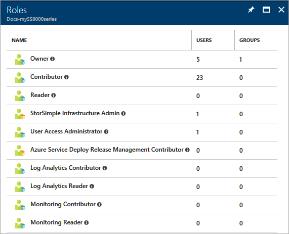
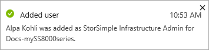

# Role-based Access Control for StorSimple

This article provides a brief description of how Azure Role-Based Access Control (RBAC) can be used for your StorSimple device. RBAC offers fine-grained access management for Azure. Use RBAC to grant just the right amount of access to the StorSimple users to do their jobs instead of giving everyone unrestricted access. For more information on the basics of access management in Azure, refer to [Get started with Role-based Access Control in the Azure portal](../active-directory/role-based-access-control-what-is.md).

This article applies to StorSimple 8000 series devices running Update 3.0 or later in the Azure portal.

## RBAC roles for StorSimple

RBAC can be assigned based on the roles. There are two types of roles that StorSimple users can choose from: built-in or custom.

* **Built-in roles** - The built-in roles ensure certain permission levels based on the available resources in the environment. The following built-in roles are included (but not limited to) in Azure:

    * Owner  - They can manage everything, including access.
    * Contributor - They can do anything the owner can do except assign access. Someone with this role can view and regenerate the service registration keys. With the serivce registration keys, they can register new devices with a StorSimple Device Manager service.
    * Reader - They can view information about everything. For instance the device network, general, and security settings. But they can't make any changes to those settings. 
    * User Access Administrator  - They can manage user access to the storage account. For example, they can grant Reader access to a specific user.
    * Log Analytics Contributor
    * Log Analytics Reader
    * Monitoring Contributor
    * Monitoring Reader

    For more information, refer to [Built-in roles for Azure Role-based Access Control](../active-directory/role-based-access-built-in-roles.md).

* **Custom roles** - If the built-in roles do not suit your needs, you can create custom RBAC roles. To create a custom RBAC role, start with a built-in role, edit it, and then import it back in the environment. The download and upload of the role are managed using either Azure PowerShell or the Azure CLI.

    For more information, refer to [Create custom roles for Role-based Access Control](../active-directory/role-based-access-control-custom-roles.md).

To view the different roles available for a StorSimple device user in the Azure portal, go to **Access control (IAM) > Roles**.


## Create a custom role for StorSimple Infrastructure Administrator

A StorSimple Infrastructure Admin (StorSimple Infra Admin) can manage the infrastructre management for the StorSimple devices. The following examples walks you through the process of creating a custom role for a StorSimple Infrastructure Admin.

In this example, we will start with the built-in role **Reader** which allows users to view all the resource scopes but not to edit them or create new ones.

1. Run Windows PowerShell as an administrator.

2. Log into Azure.

    `Login-AzureRMAccount`

3. Export the Reader role as a JSON template on your computer.

    ```
    Get-AzureRMRoleDefinition -Name "Reader"

    Get-AzureRMRoleDefinition -Name "Reader" | ConvertTo-Json | Out-File C:\ssrbaccustom.json
    ```

4. Open the JSON file in Visual Studio. You will see that a typical RBAC role consists of three main sections, **Actions**, **NotActions**, and **AssignableScopes**.

    In the **Action** section, all the permitted operations for this role are listed. Each action is assigned from a resource provider. For a StorSimple infrastructure admin, use the `Microsoft.StorSimple` resource provider.

    Use PowerShell to see all the resource providers available and registered in your subscription.

    `Get-AzureRMResourceProvider`

    You can also check for all the available PowerShell cmdlets to manage the resource providers.

    In the **NotActions** sections, all the restricted actions for a particular RBAC role are listed. In this example, no actions are restricted.
    
    Under the **AssignableScopes**, the subscription IDs are listed. Ensure that the RBAC role contains the explicit subscription ID where it is used. If the correct subscription ID is not specified, you are not allowed to import the role in your subscription.

    Edit the file keeping in mind the above considerations.

    ```
    {
        "Name":  "StorSimple infra admin",
        "Id":  "<guid>",
        "IsCustom":  true,
        "Description":  "Lets you view everything, but not make any changes except for Clear alerts, Clear settings, install, download etc.",
        "Actions":  [
                        "Microsoft.StorSimple/managers/alerts/read",
                        "Microsoft.StorSimple/managers/devices/volumeContainers/read",
                        "Microsoft.StorSimple/managers/devices/jobs/read",
                        "Microsoft.StorSimple/managers/devices/alertSettings/read",
                        "Microsoft.StorSimple/managers/devices/alertSettings/write",
                        "Microsoft.StorSimple/managers/clearAlerts/action",
                        "Microsoft.StorSimple/managers/devices/networkSettings/read",
                        "Microsoft.StorSimple/managers/devices/publishSupportPackage/action",
                        "Microsoft.StorSimple/managers/devices/scanForUpdates/action",
                        "Microsoft.StorSimple/managers/devices/metrics/read"

                    ],
        "NotActions":  [

                    ],
        "AssignableScopes":  [
                                "/subscriptions/2136cf2e-684f-487b-9fc4-0accc9c0166e/"
                            ]
    }
    ```

6. Import the custom RBAC role back into the environment.

    `New-AzureRMRoleDefinition -InputFile "C:\ssrbaccustom.json"`


This role should now appear in the list of roles in the **Access control** blade.



For more information, go to [Create a custom RBAC role using PowerShell](../active-directory/role-based-access-control-create-custom-roles-for-internal-external-users.md#create-a-custom-rbac-role-to-open-support-requests-using-powershell).

### Sample output for custom role creation via the PowerShell

```
PS C:\WINDOWS\system32> Login-AzureRMAccount

Environment           : AzureCloud
Account               : alkohli@microsoft.com
TenantId              : 72f988bf-86f1-41af-91ab-2d7cd011db47
SubscriptionId        : 2136cf2e-684f-487b-9fc4-0accc9c0166e
SubscriptionName      : Internal Consumption
CurrentStorageAccount :

PS C:\WINDOWS\system32> Get-AzureRMRoleDefinition -Name "Reader"

Name             : Reader
Id               : acdd72a7-3385-48ef-bd42-f606fba81ae7
IsCustom         : False
Description      : Lets you view everything, but not make any changes.
Actions          : {*/read}
NotActions       : {}
AssignableScopes : {/}

PS C:\WINDOWS\system32> Get-AzureRMRoleDefinition -Name "Reader" | ConvertTo-Json | Out-File C:\ssrbaccustom.json

PS C:\WINDOWS\system32> New-AzureRMRoleDefinition -InputFile "C:\ssrbaccustom.json"

Name             : StorSimple infra admin
Id               : ff2e8f83-e352-4097-968f-a78d01aff144
IsCustom         : True
Description      : Lets you view everything, but not make any changes except for Clear alerts, Clear settings, install,
                   download etc.
Actions          : {Microsoft.StorSimple/managers/alerts/read,
                   Microsoft.StorSimple/managers/devices/volumeContainers/read,
                   Microsoft.StorSimple/managers/devices/jobs/read,
                   Microsoft.StorSimple/managers/devices/alertSettings/read...}
NotActions       : {}
AssignableScopes : {/subscriptions/2136cf2e-684f-487b-9fc4-0accc9c0166e/}

PS C:\WINDOWS\system32>
```


## Add users to the custom role

You grant access from within the resource, resource group, or subscription that is the scope of the role assignment.

1. Go to **Access control (IAM)**. Click **+ Add** on the Access control blade.

    

2. Select the role that you wish to assign, in this case it is the **StorSimple Infrastructure Admin**.

3. Select the user, group, or application in your directory that you wish to grant access to. You can search the directory with display names, email addresses, and object identifiers.

4. Select **Save** to create the assignment.

    

5. An **Adding user** notification tracks the progress.

    

After the user is successfully added, the list of users in access control is updated.

## View permissions for the custom role

Once this role is created, you can view the permissions associated with this role in the Azure portal.

1. To view the permissions associated with this role, go to **Access control (IAM) > Roles > StorSimple Infrastructure Admin**. The list of users in this role is displayed.

2. Select a StorSimple Infrastructure Admin user and click **Permissions**.

    

3. The permissions associated with this role are displayed.

    


## Next steps

Learn how to [Assign custom roles for internal and external users](../active-directory/role-based-access-control-create-custom-roles-for-internal-external-users.md).

