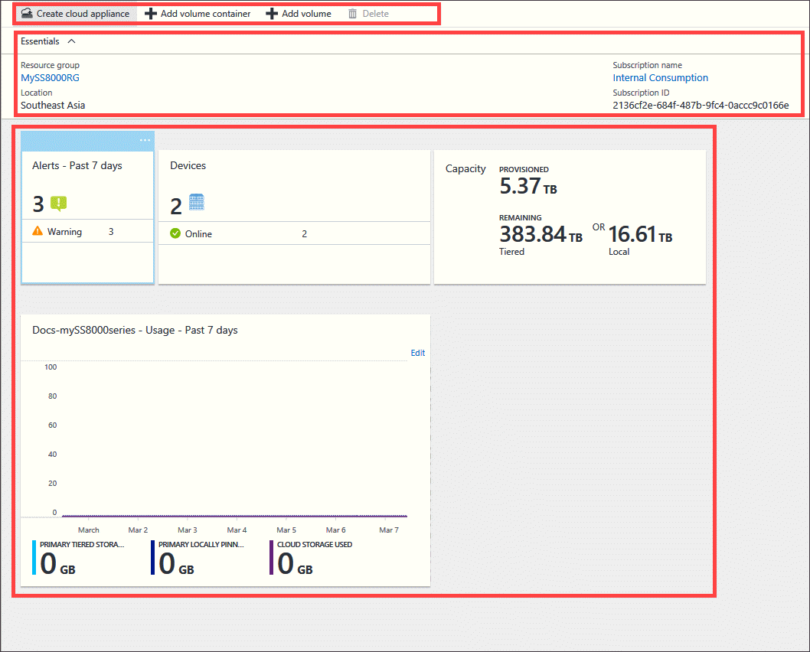
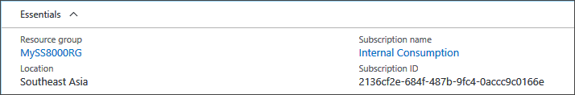
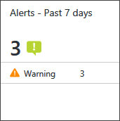
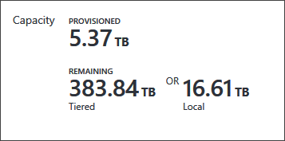
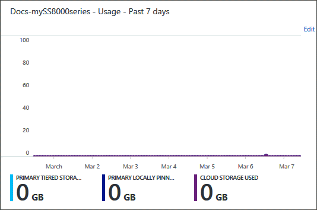
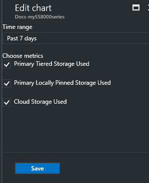
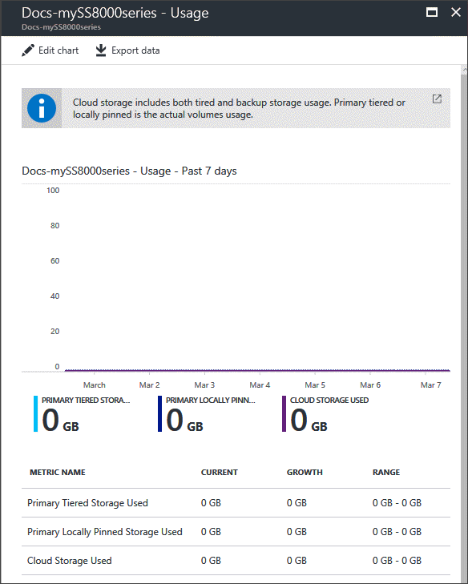
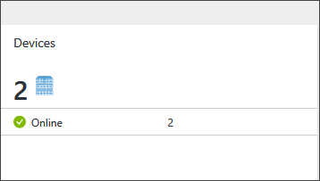
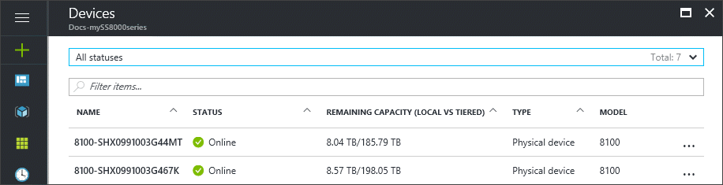
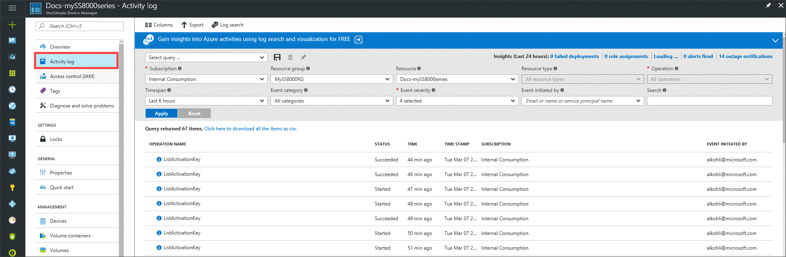

# Use the service summary blade for StorSimple 8000 series device

## Overview

The StorSimple Device Manager service summary blade provides a summary view of all the devices that are connected to the StorSimple Device Manager service, highlighting those devices that need a system administrator's attention. This tutorial introduces the service summary blade, explains the dashboard content and function, and describes the tasks that you can perform from this page.

## Management commands

In the StorSimple service summary blade, you see the options for managing your StorSimple Device Manager service and the StorSimple 8000 series devices registered to this service. You see the management commands across the top of the blade and on the left side.

Use these options to perform various operations such as add shares or volumes, or monitor the various jobs running on the StorSimple devices.

## Essentials

The essentials area captures some of the important properties such as, the resource group, location, and subscription in which your StorSimple Device Manager was created.

## StorSimple Device Manager service summary

* The **Alerts** tile provides a snapshot of all the active alerts across all devices, grouped by alert severity.

    

    Clicking the tile opens the **Alerts** blade, where you can click an individual alert to view additional details about that alert, including any recommended actions. You can also clear the alert if the issue has been resolved.

    

* The **Capacity** tile displays shows the primary storage that is provisioned and remaining across all devices relative to the total storage available across all devices. **Provisioned** refers to the amount of storage that is prepared and allocated for use, **Remaining** refers to the remaining capacity that can be provisioned across all devices.

    

    The **Remaining Tiered** capacity is the available capacity that can be provisioned including cloud, while the **Remaining Local** is the capacity remaining on the disks attached to the StorSimple 8000 series devices.

* In the **Usage** chart, you can see the relevant metrics for your devices. You can view the primary storage used across all devices, and the cloud storage consumed by devices over the past 7 days, the default time period. 

     

    To choose a different time scale, use the **Edit** option in the top-right corner of the chart.

     

     

* The **Devices** tile provides a summary of the number of StorSimple 8000 series devices in your StorSimple Device Manager grouped by device status. 

    

    Click this tile to open the **Devices** list blade and then click an individual device to drill into the device summary specific to the device. You can also perform device-specific actions from a given device summary blade. For more information about the device summary blade, go to [Device summary blade](storsimple-8000-device-dashboard.md).

    

## View the activity logs

To view the various operations carried out within your StorSimple Device Manager, click the **Activity logs** link on the left side of your StorSimple service summary blade. This takes you to the **Activity logs** blade, where you can see a summary of the recent operations carried out.

## Next steps

* Learn more about how to [use the StorSimple Device Manager service to administer your StorSimple device](storsimple-8000-manager-service-administration.md).

