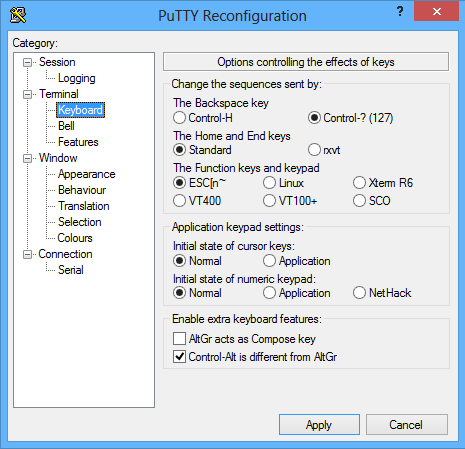
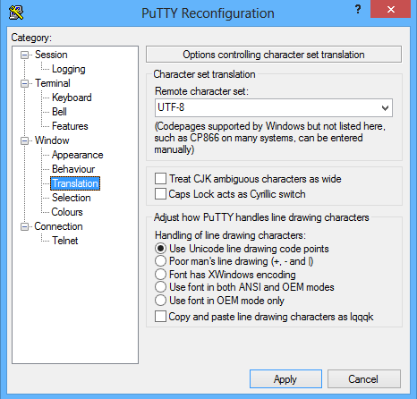
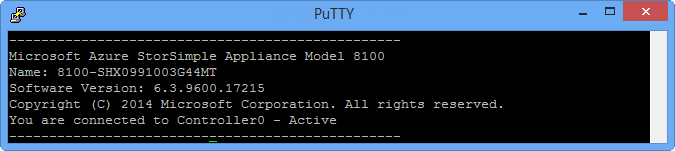
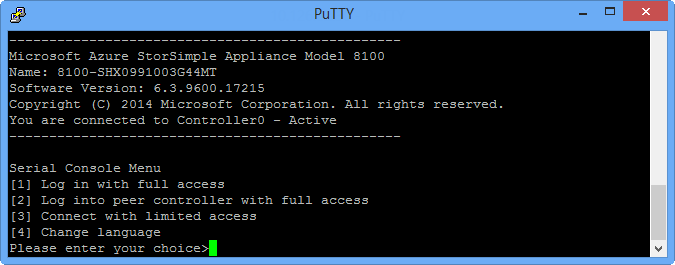

# Use Windows PowerShell for StorSimple to administer your device

## Overview

Windows PowerShell for StorSimple provides a command-line interface that you can use to manage your Microsoft Azure StorSimple device. As the name suggests, it is a Windows PowerShell-based, command-line interface that is built in a constrained runspace. From the perspective of the user at the command line, a constrained runspace appears as a restricted version of Windows PowerShell. While maintaining some of the basic capabilities of Windows PowerShell, this interface has additional dedicated cmdlets that are geared towards managing your Microsoft Azure StorSimple device.

This article describes the Windows PowerShell for StorSimple features, including how you can connect to this interface, and contains links to step-by-step procedures or workflows that you can perform using this interface. The workflows include how to register your device, configure the network interface on your device, install updates that require the device to be in maintenance mode, change the device state, and troubleshoot any issues that you may experience.

After reading this article, you will be able to:

* Connect to your StorSimple device using Windows PowerShell for StorSimple.
* Administer your StorSimple device using Windows PowerShell for StorSimple.
* Get help in Windows PowerShell for StorSimple.

> [!NOTE]
> * Windows PowerShell for StorSimple cmdlets allow you to manage your StorSimple device from a serial console or remotely via Windows PowerShell remoting. For more information about each of the individual cmdlets that can be used in this interface, go to [cmdlet reference for Windows PowerShell for StorSimple](https://technet.microsoft.com/library/dn688168.aspx).
> * The Azure PowerShell StorSimple cmdlets are a different collection of cmdlets that allow you to automate StorSimple service-level and migration tasks from the command line. For more information about the Azure PowerShell cmdlets for StorSimple, go to the [Azure StorSimple cmdlet reference](https://docs.microsoft.com/powershell/module/servicemanagement/azure/?view=azuresmps-4.0.0&viewFallbackFrom=azuresmps-3.7.0#azure).

You can access the Windows PowerShell for StorSimple using one of the following methods:

* [Connect to StorSimple device serial console](#connect-to-windows-powershell-for-storsimple-via-the-device-serial-console)
* [Connect remotely to StorSimple using Windows PowerShell](#connect-remotely-to-storsimple-using-windows-powershell-for-storsimple)

## Connect to Windows PowerShell for StorSimple via the device serial console

You can [download PuTTY](http://www.putty.org/) or similar terminal emulation software to connect to Windows PowerShell for StorSimple. You need to configure PuTTY specifically to access the Microsoft Azure StorSimple device. The following topics contain detailed steps about how to configure PuTTy and connect to the device. Various menu options in the serial console are also explained.

### PuTTY settings

Make sure that you use the following PuTTY settings to connect to the Windows PowerShell interface from the serial console.

#### To configure PuTTY

1. In the PuTTY **Reconfiguration** dialog box, in the **Category** pane, select **Keyboard**.
2. Make sure that the following options are selected (these are the default settings when you start a new session).
   
   | Keyboard item | Select |
   | --- | --- |
   | Backspace key |Control-? (127) |
   | Home and End keys |Standard |
   | Function keys and keypad |ESC[n~ |
   | Initial state of cursor keys |Normal |
   | Initial state of numeric keypad |Normal |
   | Enable extra keyboard features |Control-Alt is different from AltGr |
   
    
3. Click **Apply**.
4. In the **Category** pane, select **Translation**.
5. In the **Remote character set** list box, select **UTF-8**.
6. Under **Handling of line drawing characters**, select **Use Unicode line drawing code points**. The following screenshot shows the correct PuTTY selections.
   
    
7. Click **Apply**.

You can now use PuTTY to connect to the device serial console by doing the following steps.

[!INCLUDE [storsimple-use-putty](../../includes/storsimple-use-putty.md)]

### About the serial console

When you access the Windows PowerShell interface of your StorSimple device through the serial console, a banner message is presented, followed by menu options.

The banner message contains basic StorSimple device information such as the model, name, installed software version, and status of the controller you are accessing. The following image shows an example of a banner message.

> [!IMPORTANT]
> You can use the banner message to identify whether the controller you are connected to is _Active_ or _Passive_.

The following image shows the various runspace options that are available in the serial console menu.

You can choose from the following settings:

1. **Log in with full access**
   This option allows you to connect (with the proper credentials) to the **SSAdminConsole** runspace on the local controller. (The local controller is the controller that you are currently accessing through the serial console of your StorSimple device.)
   This option can also be used to allow Microsoft Support to access unrestricted runspace (a support session) to troubleshoot any possible device issues. After you use option 1 to log on, you can allow the Microsoft Support engineer to access unrestricted runspace by running a specific cmdlet. For details, refer to [Start a support session](storsimple-8000-contact-microsoft-support.md#start-a-support-session-in-windows-powershell-for-storsimple).
   
2. **Log in to peer controller with full access**
   This option is the same as option 1, except that you can connect (with the proper credentials) to the **SSAdminConsole** runspace on the peer controller. Because the StorSimple device is a high availability device with two controllers in an active-passive configuration, peer refers to the other controller in the device that you are accessing through the serial console).
   Similar to option 1, this option can also be used to allow Microsoft Support to access unrestricted runspace on a peer controller.

3. **Connect with limited access**
   This option is used to access Windows PowerShell interface in limited mode. You are not prompted for access credentials. This option connects to a more restricted runspace compared to options 1 and 2.  Some of the tasks that are available through option 1 that **cannot* be performed in this runspace are:
   
   * Reset to the factory settings
   * Change the password
   * Enable or disable support access
   * Apply updates
   * Install hotfixes

    > [!NOTE]
    > This is the preferred option if you have forgotten the device administrator password and cannot connect through option 1 or 2.

4. **Change language**
   This option allows you to change the display language on the Windows PowerShell interface. The languages supported are English, Japanese, Russian, French, South Korean, Spanish, Italian, German, Chinese, and Brazilian Portuguese.

## Connect remotely to StorSimple using Windows PowerShell for StorSimple

You can use Windows PowerShell remoting to connect to your StorSimple device. When you connect this way, you will not see a menu. (You see a menu only if you use the serial console on the device to connect. Connecting remotely takes you directly to the equivalent of "option 1 – full access” on the serial console.) With Windows PowerShell remoting, you connect to a specific runspace. You can also specify the display language.

The display language is independent of the language that you set by using the **Change Language** option in the serial console menu. Remote PowerShell will automatically pick up the locale of the device you are connecting from if none is specified.

> [!NOTE]
> If you are working with Microsoft Azure virtual hosts and StorSimple Cloud Appliances, you can use Windows PowerShell remoting and the virtual host to connect to the cloud appliance. If you have set up a share location on the host on which to save information from the Windows PowerShell session, you should be aware that the _Everyone_ principal includes only authenticated users. Therefore, if you have set up the share to allow access by _Everyone_ and you connect without specifying credentials, the unauthenticated Anonymous principal will be used and you will see an error. To fix this issue, on the share host you must enable the Guest account and then give the Guest account full access to the share or you must specify valid credentials along with the Windows PowerShell cmdlet.

You can use HTTP or HTTPS to connect via Windows PowerShell remoting. Use the instructions in the following tutorials:

* [Connect remotely using HTTP](storsimple-8000-remote-connect.md#connect-through-http)
* [Connect remotely using HTTPS](storsimple-8000-remote-connect.md#connect-through-https)

## Connection security considerations

When you are deciding how to connect to Windows PowerShell for StorSimple, consider the following:

* Connecting directly to the device serial console is secure, but connecting to the serial console over network switches is not. Be cautious of the security risk when connecting to device serial over network switches.
* Connecting through an HTTP session might offer more security than connecting through the serial console over network. Although this is not the most secure method, it is acceptable on trusted networks.
* Connecting through an HTTPS session is the most secure and the recommended option.

## Administer your StorSimple device using Windows PowerShell for StorSimple

The following table shows a summary of all the common management tasks and complex workflows that can be performed within the Windows PowerShell interface of your StorSimple device. For more information about each workflow, click the appropriate entry in the table.

#### Windows PowerShell for StorSimple workflows

| If you want to do this ... | Use this procedure. |
| --- | --- |
| Register your device |[Configure and register the device using Windows PowerShell for StorSimple](storsimple-8000-deployment-walkthrough-u2.md#step-3-configure-and-register-the-device-through-windows-powershell-for-storsimple) |
| Configure web proxy View web proxy settings |[Configure web proxy for your StorSimple device](storsimple-8000-configure-web-proxy.md) |
| Modify DATA 0 network interface settings on your device |[Modify DATA 0 network interface for your StorSimple device](storsimple-8000-modify-data-0.md) |
| Stop a controller   Restart or shut down a controller   Shut down a device Reset the device to factory default settings |[Manage device controllers](storsimple-8000-manage-device-controller.md) |
| Install maintenance mode updates and hotfixes |[Update your device](storsimple-update-device.md) |
| Enter maintenance mode  Exit maintenance mode |[StorSimple device modes](storsimple-8000-device-modes.md) |
| Create a Support package Decrypt and edit a support package |[Create and manage a Support package](storsimple-8000-create-manage-support-package.md) |
| Start a Support session  |[Start a support session in Windows PowerShell for StorSimple](storsimple-8000-create-manage-support-package.md#create-a-support-package) |

## Get Help in Windows PowerShell for StorSimple

In Windows PowerShell for StorSimple, cmdlet Help is available. An online, up-to-date version of this Help is also available, which you can use to update the Help on your system.

Getting Help in this interface is similar to that in Windows PowerShell, and most of the Help-related cmdlets will work. You can find Help for Windows PowerShell online in the TechNet Library: [Scripting with Windows PowerShell](http://go.microsoft.com/fwlink/?LinkID=108518).

The following is a brief description of the types of Help for this Windows PowerShell interface, including how to update the Help.

### To get help for a cmdlet

* To get Help for any cmdlet or function, use the following command: `Get-Help <cmdlet-name>`
* To get online Help for any cmdlet, use the previous cmdlet with the `-Online` parameter: `Get-Help <cmdlet-name> -Online`
* For full Help, you can use the `–Full` parameter, and for examples, use the `–Examples` parameter.

### To update Help

You can easily update the Help in the Windows PowerShell interface. Perform the following steps to update the Help on your system.

#### To update cmdlet Help
1. Start Windows PowerShell with the **Run as administrator** option.
2. At the command prompt, type:
    `Update-Help`
3. The updated Help files will be installed.
4. After the Help files are installed, type: `Get-Help Get-Command`. This will display a list of cmdlets for which Help is available.

> [!NOTE]
> To get a list of all the available cmdlets in a runspace, log in to the corresponding menu option and run the `Get-Command` cmdlet.

## Next steps

If you experience any issues with your StorSimple device when performing one of the above workflows, refer to [Tools for troubleshooting StorSimple deployments](storsimple-8000-troubleshoot-deployment.md#tools-for-troubleshooting-storsimple-deployments).

