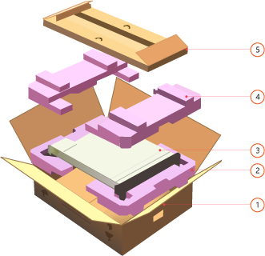
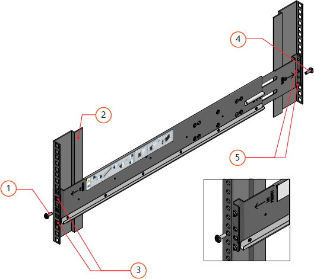
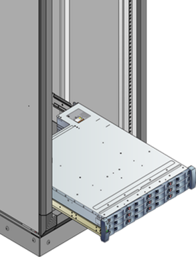
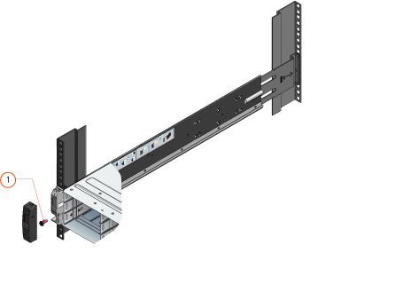
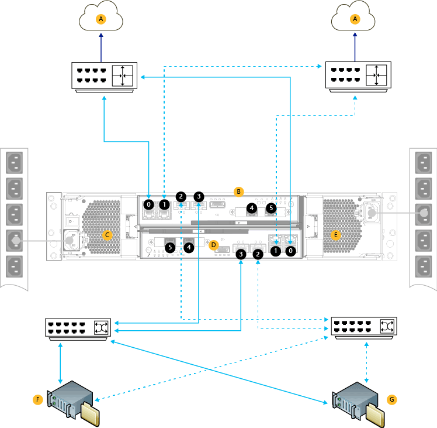

<properties
   pageTitle="Install your StorSimple 8100 device | Microsoft Azure"
   description="Describes how to unpack, rack mount, and cable your StorSimple 8100 device before you deploy and configure the software."
   services="storsimple"
   documentationCenter="NA"
   authors="alkohli"
   manager="carmonm"
   editor="" />
<tags
   ms.service="storsimple"
   ms.devlang="NA"
   ms.topic="article"
   ms.tgt_pltfrm="NA"
   ms.workload="TBD"
   ms.date="04/25/2016"
   ms.author="alkohli" />

# Unpack, rack-mount, and cable your StorSimple 8100 device

## Overview

Your Microsoft Azure StorSimple 8100 is a single enclosure, rack-mounted device. This tutorial explains how to unpack, rack-mount, and cable the StorSimple 8100 device hardware before you configure and deploy the StorSimple device.

## Unpack your StorSimple 8100 device

The following steps provide clear, detailed instructions about how to unpack your StorSimple 8100 storage device. This device is shipped in a single box.

### Prepare to unpack your device

Before you unpack your device, review the following information.

 **WARNING!**

1. Make sure that you have two people available to manage the weight of the enclosure if you are handling it manually. A fully configured enclosure can weigh up to 32 kg (70 lbs.).
1. Place the box on a flat, level surface.

Next, complete the following steps to unpack your device.

#### To unpack your device

1. Inspect the box and the packaging foam for crushes, cuts, water damage, or any other obvious damage. If the box or packaging is severely damaged, do not open the box. Please [contact Microsoft Support](storsimple-contact-microsoft-support.md) to help you assess whether the device is in good working order.

2. Unpack the box. The following image shows the unpacked view of your StorSimple device.

     

    **Unpacked view of your storage device**

     Label | Description
     ----- | -------------
     1     | Packing box
     2     | Bottom foam
     3     | Device
     4     | Top foam
     5     | Accessory box

3. After unpacking the box, make sure that you have:

   - 1 single enclosure device
   - 2 power cords
   - 1 crossover Ethernet cable
   - 2 serial console cables
   - 1 serial-USB converter for serial access
   - 1 tamper-proof T10 screwdriver
   - 4 QSFP-to-SFP+ adapters for use with 10 GbE network interfaces
   - 1 rack-mount kit (2 side rails with mounting hardware)
   - Getting Started documentation

    If you did not receive any of the items listed above, [contact Microsoft Support](storsimple-contact-microsoft-support.md).

The next step is to rack-mount your device.

## Rack-mount your StorSimple 8100 device

Follow the next steps to install your StorSimple 8100 storage device in a standard 19-inch rack with front and rear posts . The StorSimple 8100 device has a single primary enclosure.

The installation consists of multiple steps, each of which is discussed in the following procedures.

> [AZURE.IMPORTANT]
StorSimple devices must be rack-mounted for proper operation.

### Prepare the site

The device must be installed in a standard 19-inch rack that has both front and rear posts. Use the following procedure to prepare for rack installation.

#### To prepare the site for rack installation

1. Make sure that the device rests safely on a flat, stable, and level work surface (or similar).

2. Verify that the site where you intend to set up has standard AC power from an independent source or a rack power distribution unit (PDU) with an uninterruptible power supply (UPS).

3. Make sure that one 2U slot is available on the rack in which you intend to mount the device.

 **WARNING!**

Make sure that you have two people available to manage the weight if you are handling the device setup manually. A fully configured enclosure can weigh up to 32 kg (70 lbs.).

### Rack prerequisites

The 8100 enclosure is designed for installation in a standard 19-inch rack cabinet with:

- Minimum depth of 27.84 inches from rack post to post.
- Maximum weight of 32 kg for the device
- Maximum back pressure of 5 Pascal (0.5 mm water gauge).

### Rack-mounting rail kit

A set of mounting rails is provided for use with the 19-inch rack cabinet. The rails have been tested to handle the maximum enclosure weight. These rails will also allow installation of multiple enclosures without any loss of space within the rack.

#### To install the device on the rails

2. Perform this step only if inner rails are not installed on your device. Typically, the inner rails are installed at the factory. If rails are not installed, then install the left-rail and right-rail slides to the sides of the enclosure chassis. They attach using six metric screws on each side. To help with orientation, the rail slides are marked **LH – Front** and **RH – Front**, and the end that is affixed towards the rear of the enclosure has a tapered end. 

    
    **Attaching inner rail slides to the sides of the enclosure**

	   Label | Description
       ----- | -----------
       1     | M 3x4 button-head screws
       2     | Chassis slides

3. Attach the outer left rail and outer right rail assemblies to the rack cabinet vertical members. The brackets are marked **LH**, **RH**, and **This side up** to guide you through the correct orientation.

4. Locate the rail pins at the front and rear of the rail assembly. Extend the rail to fit between the rack posts and insert the pins into the front and rear rack post vertical member holes. Be sure that the rail assembly is level.

5. Use two of the provided metric screws to secure the rail assembly to the rack vertical members. Use one screw on the front and one on the rear.

6. Repeat these steps for the other rail assembly. 

     

    **Attaching outer rail assemblies to the rack**

     Label | Description
     ----- | -----------
     1     | Clamping screw
     2     | Square-hole front rack post screw
     3     | Left rail front location pins
     4     | Clamping screw
     5     | Left rail rear location pins

### Mounting the device in the rack

Using the rack rails that were just installed, perform the following steps to mount the device in the rack.

#### To mount the device

1. With an assistant, lift the enclosure and align it with the rack rails.

2. Carefully insert the device into the rails, and then push the device completely into the rack cabinet. 

    

    **Mounting the device in the rack**

3. Remove the left and right front flange caps by pulling the caps free. The flange caps simply snap onto the flanges.

5. Secure the enclosure in the rack by installing one provided Phillips-head screw through each flange, left and right.

4. Install the flange caps by pressing them into position and snapping them in place. 

     

    **Installing the flange caps**

     Label | Description
     ----- | -----------
     1     | Enclosure fastening screw

The next step is to cable your device for power, network, and serial access.

## Cable your StorSimple 8100 device

The following procedures explain how to cable your StorSimple 8100 device for power, network, and serial connections.

### Prerequisites

Before you begin the cabling of your device, you will need:

- Your storage device, completely unpacked and rack mounted.

- 2 power cables that came with your device

- Access to 2 Power Distribution Units (recommended).

- Network cables

- Provided serial cables

- Serial USB converter with the appropriate driver installed on your PC (if needed)

- Provided 4 QSFP-to-SFP+ adapters for use with 10 GbE network interfaces

- [Supported hardware for the 10 GbE network interfaces on your StorSimple device](storsimple-supported-hardware-for-10-gbe-network-interfaces.md)

### Power cabling

Your device includes redundant Power and Cooling Modules (PCMs). Both PCMs must be installed and connected to different power sources to ensure high availability.

Perform the following steps to cable your device for power.

[AZURE.INCLUDE [storsimple-cable-8100-for-power](../../includes/storsimple-cable-8100-for-power.md)]

### Network cabling

Your device is an active-standby configuration: at any given time, one controller module is active and processing all disk and network operations while the other controller module is on standby. If a controller fails, the standby controller is activated immediately and continues all the disk and networking operations.

To support this redundant controller failover, you need to cable your device network as described in the following steps.

#### To cable for network connection

1. Your device has six network interfaces on each controller: four 1 Gbps, and two 10 Gbps Ethernet ports. Identify the various data ports on the backplane of your device.

    

    **Back of the device showing data ports**

     Label   | Description
     ------- | -----------
     0,1,4,5 |  1 GbE network interfaces
     2,3     | 10 GbE network interfaces
     6       | Serial ports

2. See the following diagram for network cabling. (The minimum network configuration is shown by solid blue lines. Additional configuration required for high availability and performance is shown by dotted lines.)

    

    **Network cabling for your device**

	|Label | Description |
    |----- | ----------- |
    | A    | LAN with Internet access |
    | B    | Controller 0 |
    | C    | PCM 0 |
    | D    | Controller 1 |
    | E    | PCM 1 |
    | F, G | Hosts |
    | 0-5  | Network interfaces |

When cabling the device, the minimum configuration requires:

- At least two network interfaces connected on each controller with one for cloud access and one for iSCSI. The DATA 0 port is automatically enabled and configured via the serial console of the device. Apart from DATA 0, another data port also needs to be configured through the Azure classic portal. In this case, connect DATA 0 port to the primary LAN (network with Internet access). The other data ports can be connected to SAN/iSCSI LAN (VLAN) segment of the network, depending on the intended role.

- Identical interfaces on each controller connected to the same network to ensure availability if a controller failover occurs. For instance, if you choose to connect DATA 0 and DATA 3 for one of the controllers, you need to connect the corresponding DATA 0 and DATA 3 on the other controller.

Keep in mind for high availability and performance:

- When possible, configure a pair of network interface for cloud access (1 GbE) and another pair for iSCSI (10 GbE recommended) on each controller.

- When possible, connect network interfaces from each controller to two different switches to ensure availability against a switch failure. The figure illustrates the two 10 GbE network interfaces, DATA 2 and DATA 3, from each controller connected to two different switches.

For more information, refer to the **Network interfaces** under the [High availability requirements for your StorSimple device](storsimple-system-requirements.md#high-availability-requirements-for-storsimple).

>[AZURE.NOTE] If you are using SFP+ transceivers with your 10 GbE network interfaces, use the provided QSFP-SFP+ adapters. For more information, go to [Supported hardware for the 10 GbE network interfaces on your StorSimple device](storsimple-supported-hardware-for-10-gbe-network-interfaces.md).

### Serial port cabling

Perform the following steps to cable your serial port.

#### To cable for serial connection

1. Your device has a serial port on each controller that is identified by a wrench icon. Refer to the illustration in the [Network cabling](#network-cabling) section to locate the serial ports on the backplane of your device.

2. Identify the active controller on your device backplane. A blinking blue LED indicates that the controller is active.

3. Use the provided serial cables (if needed, the USB-serial converter for your laptop), and connect your console or computer (with terminal emulation to the device) to the serial port of the active controller.

4. Install the serial-USB drivers (shipped with the device) on your computer.

5. Set up the serial connection as follows: 115,200 baud, 8 data bits, 1 stop bit, no parity, and flow control set to None.

6. Verify that the connection is working by pressing Enter on the console. A serial console menu should appear.

>[AZURE.NOTE] **Lights-Out Management**: When the device is installed in a remote datacenter or in a computer room with limited access, ensure that the serial connections to both controllers are always connected to a serial console switch or similar equipment. This allows out-of-band remote control and support operations if there are network disruptions or unexpected failures.

Your device is now cabled for power, network access, and serial connectivity. The next step is to configure the software and deploy your device.

## Next steps

Learn how to [deploy and configure your on-premises StorSimple device](storsimple-deployment-walkthrough.md).
