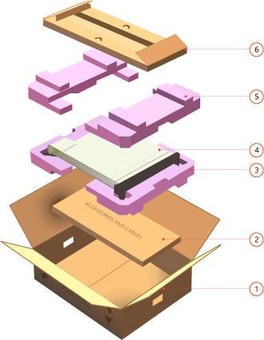
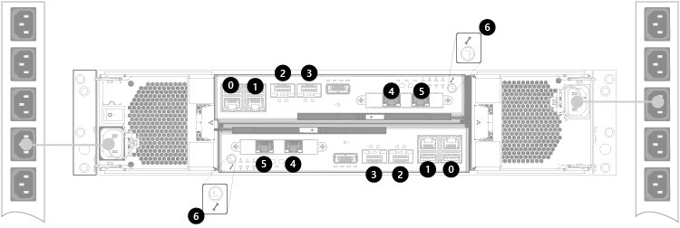
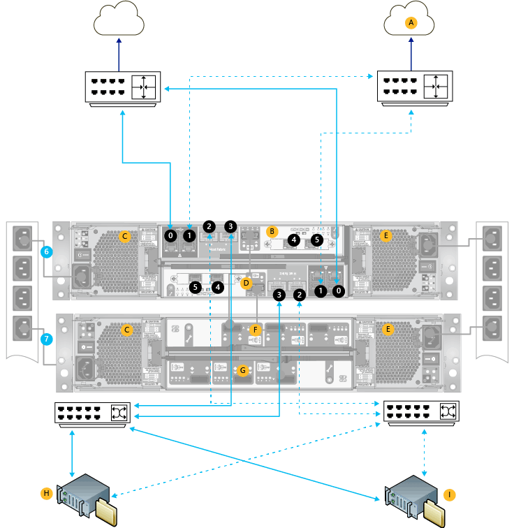

# Unpack, rack-mount, and cable your StorSimple 8600 device
## Overview
Your Microsoft Azure StorSimple 8600 is a dual enclosure device and consists of a primary and an EBOD enclosure. This tutorial explains how to unpack, rack-mount, and cable the StorSimple 8600 device hardware before you configure the StorSimple software.

## Unpack your StorSimple 8600 device
The following steps provide clear, detailed instructions on how to unpack your StorSimple 8600 storage device. This device is shipped in two boxes, one for the primary enclosure and another for the EBOD enclosure. These two boxes are then placed in a single box.

### Prepare to unpack your device
Before you unpack your device, review the following information.

 **WARNING!**

1. Make sure that you have two people available to manage the weight of the device if you are handling it manually. A fully configured enclosure can weigh up to 32 kg (70 lbs.).
2. Place the box on a flat, level surface.

Next, complete the following steps to unpack your device.

#### To unpack your device
1. Inspect the box and the packaging foam for crushes, cuts, water damage, or any other obvious damage. If the box or packaging is severely damaged, do not open the box. Please [contact Microsoft Support](storsimple-8000-contact-microsoft-support.md) to help you assess whether the device is in good working order.
2. Open the outer box and then take out the two boxes corresponding to primary and EBOD enclosures. You can now unpack the primary and EBOD enclosures. The following figure shows the unpacked view of one of the enclosures.
   
    
   
    **Unpacked view of your storage device**
   
   | Label | Description |
   | --- | --- |
   |   1 |Packing box |
   |   2 |SAS cables (in accessories and cables tray) |
   |   3 |Bottom foam |
   |   4 |Device |
   |   5 |Top foam |
   |   6 |Accessory box |
3. After unpacking the two boxes, make sure that you have:
   
   * 1 primary enclosure (the primary enclosure and EBOD enclosure are in two separate boxes)
   * 1 EBOD enclosure
   * 4 power cords, 2 in each box
   * 2 SAS cables (to connect the primary enclosure to EBOD enclosure)
   * 1 crossover Ethernet cable
   * 2 serial console cables
   * 1 serial-USB converter for serial access
   * 4 QSFP-to-SFP+ adapters for use with 10 GbE network interfaces
   * 2 rack mount kits (4 side rails with mounting hardware, 2 each for the primary enclosure and EBOD enclosure), 1 in each box
   * Getting started documentation
     
     If you did not receive any of the items listed above, [contact Microsoft Support](storsimple-8000-contact-microsoft-support.md).  

The next step is to rack-mount your device.

## Rack-mount your StorSimple 8600 device
Follow the next steps to install your StorSimple 8600 storage device in a standard 19-inch rack with front and rear posts. This device comes with two enclosures: a primary enclosure and an EBOD enclosure. Both of these need to be rack-mounted.

The installation consists of multiple steps, each of which is discussed in the following procedures.

> [!IMPORTANT]
> StorSimple devices must be rack-mounted for proper operation.
> 
> 

### Site preparation
The enclosures must be installed in a standard 19-inch rack that has both front and rear posts. Use the following procedure to prepare for rack installation.

#### To prepare the site for rack installation
1. Make sure that the primary and EBOD enclosures are resting safely on a flat, stable, and level work surface (or similar).
2. Verify that the site where you intend to set up has standard AC power from an independent source or a rack Power Distribution Unit (PDU) with an uninterruptible power supply (UPS).
3. Make sure that one 4U (2 X 2U) slot is available on the rack in which you intend to mount the enclosures.

 **WARNING!**

 Make sure that you have two people available to manage the weight if you are handling the device setup manually. A fully configured enclosure can weigh up to 32 kg (70 lbs.).

### Rack prerequisites
The enclosures are designed for installation in a standard 19-inch rack cabinet with:

* Minimum depth of 27.84 inches from rack post to post
* Maximum weight of 32 kg for the device
* Maximum back pressure of 5 Pascal (0.5 mm water gauge)

### Rack-mounting rail kit
A set of mounting rails will be provided for use with the 19-inch rack cabinet. The rails have been tested to handle the maximum enclosure weight. These rails will also allow installation of multiple enclosures without loss of space within the rack. Install the EBOD enclosure first.

#### To install the EBOD enclosure on the rails
1. Perform this step only if inner rails are not installed on your device. Typically, the inner rails are installed at the factory. If rails are not installed, then install the left-rail and right-rail slides to the sides of the enclosure chassis. They attach using six metric screws on each side. To help with orientation, the rail slides are marked **LH – Front** and **RH – Front**, and the end that is affixed towards the rear of the enclosure has a tapered end.
   
    
   
    **Attaching rail slides to the sides of the enclosure**
   
   | Label | Description |
   | --- | --- |
   |  1 |M 3x4 button-head screws |
   |  2 |Chassis slides |
2. Attach the left rail and right rail assemblies to the rack cabinet vertical members. The brackets are marked **LH**, **RH**, and **This side up** to guide you through correct orientation.
3. Locate the rail pins at the front and rear of the rail assembly. Extend the rail to fit between the rack posts and insert the pins into the front and rear-rack post vertical member holes. Be sure that the rail assembly is level.
4. Secure the rail assembly to the rack vertical members by using two of the metric screws provided. Use one screw on the front and one on the rear.
5. Repeat these steps for the other rail assembly.
   
     
   
    **Attaching rail assemblies to the rack**
   
   | Label | Description |
   | --- | --- |
   |   1 |Clamping screw |
   |   2 |Square-hole front rack post screw |
   |   3 |Left front rail location pins |
   |   4 |Clamping screw |
   |   5 |Left rear rail location pins |

### Mounting the EBOD enclosure in the rack
Using the rack rails that were just installed, perform the following steps to mount the EBOD enclosure in the rack.

#### To mount the EBOD enclosure
1. With an assistant, lift the enclosure and align it with the rack rails.
2. Carefully insert the enclosure into the rails, and then push it completely into the rack cabinet.
   
    
   
    **Mounting the enclosure in the rack**
3. Remove the left and right front flange caps by pulling the caps free. The flange caps simply snap onto the flanges.
4. Secure the enclosure into the rack by installing one provided Phillips-head screw through each flange, left and right.
5. Install the flange caps by pressing them into position and snapping them into place.
   
     
   
    **Installing the flange caps**
   
   | Label | Description |
   | --- | --- |
   |   1 |Enclosure fastening screw |

### Mounting the primary enclosure in the rack
After you have finished mounting the EBOD enclosure, you will need to mount the primary enclosure following the same steps.

> [!NOTE]
> * It is possible to have a few empty slots in the rack between the primary enclosure and the EBOD enclosure.
> * Use the provided 2m SAS cable to connect the primary enclosure to the EBOD enclosure.
> * There are no constraints on the relative placement of the head unit to the EBOD unit. Therefore, the primary enclosure can be placed in the top slot and the EBOD enclosure below — or vice versa.
> 
> 

The next step is to cable your device for power, network, and serial access.

## Cable your StorSimple 8600 device
The following procedures explain how to cable your StorSimple 8600 device for power, network, and serial connections.

### Prerequisites
Before you begin to cable your device, you will need:

* Your primary enclosure and the EBOD enclosure, completely unpacked
* 4 power cables (2 each for the primary and the EBOD enclosure) that came with your device
* 2 SAS cables supplied with the device to connect the EBOD enclosure to the primary enclosure
* Access to 2 Power Distribution Units (PDUs) (recommended)
* Network cables
* Provided serial cables
* Serial-USB converter with the appropriate driver installed on your PC (if needed)
* Provided 4 QSFP-to-SFP+ adapters for use with 10 GbE network interfaces
* [Supported hardware for the 10 GbE network interfaces on your StorSimple device](storsimple-supported-hardware-for-10-gbe-network-interfaces.md)

### SAS and Power cabling
Your device has both a primary enclosure and an EBOD enclosure. This requires the units to be cabled together for Serial Attached SCSI (SAS) connectivity and power.

When setting up this device for the first time, perform the steps for SAS cabling first and then complete the steps for power cabling.

[!INCLUDE [storsimple-cable-8600-for-SAS](../../includes/storsimple-sas-cable-8600.md)]

[!INCLUDE [storsimple-cable-8600-for-power](../../includes/storsimple-cable-8600-for-power.md)]

### Network cabling
Your device is in an active-standby configuration: at any given time, one controller module is active and processing all disk and network operations while the other controller module is on standby. If a controller failure occurs, the standby controller immediately activates and continues all the disk and networking operations.

To support this redundant controller failover, you need to cable your device network as shown in the following steps.

#### To cable for network connection
1. Your device has six network interfaces on each controller: four 1 Gbps and two 10 Gbps Ethernet ports. Refer to the following illustration to identify the data ports on the backplane of your device.
   
     
   
    **Back of your device showing the data ports**
   
   | Label | Description |
   | --- | --- |
   |   0,1,4,5 |1 GbE network interfaces |
   |   2,3 |10 GbE network interfaces |
   |   6 |Serial ports |
2. See the following diagram for network cabling. (The minimum network configuration is shown by solid blue lines. For high availability and performance, additional configuration required is shown by dotted lines.)

**Network cabling for your device**

| Label | Description |
| --- | --- |
| A |LAN with Internet access |
| B |Controller 0 |
| C |PCM 0 |
| D |Controller 1 |
| E |PCM 1 |
| F |EBOD controller 0 |
| G |EBOD controller 1 |
| H,I |Hosts (for example, file servers) |
| 0-5 |Network interfaces |
| 6 |Primary enclosure |
| 7 |EBOD enclosure |

When cabling the device, the minimum configuration requires:

* At least two network interfaces connected on each controller with one for cloud access and one for iSCSI. The DATA 0 port is automatically enabled and configured via the serial console of the device. Apart from DATA 0, another data port also needs to be configured through the Azure classic portal. In this case, connect DATA 0 port to the primary LAN (network with Internet access). The other data ports can be connected to SAN/iSCSI LAN (VLAN) segment of the network, depending on the intended role.
* Identical interfaces on each controller connected to the same network to ensure availability if a controller failover occurs. For instance, if you choose to connect DATA 0 and DATA 3 for one of the controllers, you need to connect the corresponding DATA 0 and DATA 3 on the other controller.

Keep in mind for high availability and performance:

* When possible, configure a pair of network interface for cloud access (1 GbE) and another pair for iSCSI (10 GbE recommended) on each controller.
* When possible, connect network interfaces from each controller to two different switches to ensure availability against a switch failure. The figure illustrates the two 10 GbE network interfaces, DATA 2 and DATA 3, from each controller connected to two different switches. For more information, refer to the **Network interfaces** under the [High availability requirements for your StorSimple device](storsimple-8000-system-requirements.md#high-availability-requirements-for-storsimple).

> [!NOTE]
> If using SFP+ transceivers with your 10 GbE network interfaces, use the provided QSFP-SFP+ adapters. For more information, go to [Supported hardware for the 10 GbE network interfaces on your StorSimple device](storsimple-supported-hardware-for-10-gbe-network-interfaces.md).
> 
> 

### Serial port cabling
Perform the following steps to cable your serial port.

#### To cable for serial connection
1. Your device has a serial port on each controller that is identified by a wrench icon. To locate the serial ports, refer to the illustration that shows the data ports on the back of your device.
2. Identify the active controller on your device backplane. A blinking blue LED indicates that the controller is active.
3. Use the provided serial cable (if needed, the USB-serial converter for your laptop), and connect your console or computer (with terminal emulation to the device) to the serial port of the active controller.
4. Install the serial-USB drivers (shipped with the device) on your computer.
5. Set up the serial connection as follows:
   
   * 115,200 baud
   * 8 data bits
   * 1 stop bit
   * No parity
   * Flow control set to **None**
6. Verify that the connection is working by pressing Enter on the console. A serial console menu should appear.

> [!NOTE]
> **Lights-Out Management:** When the device is installed in a remote datacenter or in a computer room with limited access, ensure that the serial connections to both controllers are always connected to a serial console switch or similar equipment. This allows out-of-band remote control and support operations in case of network disruption or unexpected failures.
> 
> 

You have completed cabling your device for power, network access, and serial connection.The next step is to configure the software on your device.

## Next steps
You are now ready to [deploy and configure your on-premises StorSimple device](storsimple-8000-deployment-walkthrough-u2.md).

