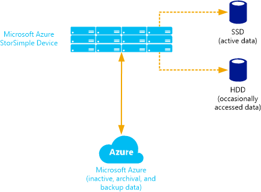

<properties 
   pageTitle="What are the StorSimple components? | Microsoft Azure" 
   description="Describes the StorSimple device, virtual device, services, and management technologies, and defines key terms used in the solution." 
   services="storsimple" 
   documentationCenter="NA" 
   authors="SharS" 
   manager="AdinaH" 
   editor=""/>

<tags
   ms.service="storsimple"
   ms.devlang="NA"
   ms.topic="article"
   ms.tgt_pltfrm="NA"
   ms.workload="TBD" 
   ms.date="08/26/2015"
   ms.author="v-sharos"/>

# What are the StorSimple components and how do they work? 

## Overview

Welcome to Microsoft Azure StorSimple, an integrated storage solution that manages storage tasks between on-premises devices and Microsoft Azure cloud storage. StorSimple is designed to reduce storage costs, simplify storage management, improve disaster recovery capability and efficiency, and provide data mobility.

The following sections describe the Microsoft Azure StorSimple components, and explain how the solution arranges data, allocates storage, and facilitates storage management and data protection. The last section provides definitions of some of the important terminology related to StorSimple components and their management.

> [AZURE.NOTE] The StorSimple deployment information published on the Microsoft Azure website applies to the StorSimple 8000 series devices only. For information about the 7000 series device, go to: [StorSimple Help](http://onlinehelp.storsimple.com/).

## StorSimple device

The Microsoft Azure StorSimple device is an on-premises hybrid storage array that provides primary storage and iSCSI access to data stored on it. It manages communication with cloud storage, and helps to ensure the security and confidentiality of all data that is stored on the Microsoft Azure StorSimple solution.

The StorSimple device includes solid state drives (SSDs) and hard disk drives (HDDs), as well as support for clustering and automatic failover. It contains a shared processor, shared storage, and two mirrored controllers. Each controller provides the following:

- Connection to a host computer
- Up to six network ports to connect to the local area network (LAN)
- Hardware monitoring
- Non-volatile random access memory (NVRAM), which retains information even if power is interrupted
- Cluster-aware updating to manage software updates on servers in a failover cluster so that the updates have minimal or no effect on service availability
- Cluster service, which functions like a back-end cluster, providing high availability and minimizing any adverse effects that might occur if an HDD or SSD fails or is taken offline

Only one controller is active at any point in time. If the active controller fails, the second controller becomes active automatically. 

For more information, see [StorSimple hardware components and status](storsimple-monitor-hardware-status.md).

## StorSimple virtual device

You can use StorSimple to create a virtual device that replicates the architecture and capabilities of the actual hybrid storage device. 

The StorSimple virtual device (also known as the StorSimple Virtual Appliance) runs on a single node in an Azure virtual machine. (A virtual device can only be created on an Azure virtual machine. You cannot create one on a StorSimple device or an on-premises server.) A StorSimple virtual device differs from a physical StorSimple device as follows: 

- The virtual device has only one interface, whereas the physical device has six network interfaces. 
- You register the virtual device during device configuration, rather than as a separate task.
- You cannot regenerate the service data encryption key from a virtual device. During key rollover, you regenerate the key on the physical device, and then update the virtual device with the new key.
- If you need to apply updates to the virtual device, you will experience some down time. This does not occur with a physical StorSimple device.

We recommend that you use the StorSimple virtual device for disaster recovery scenarios in which a physical device is not available, such as cloud development an test scenarios.

For more information, see [StorSimple virtual device](storsimple-virtual-device.md).

## Storage management technologies
 
In addition to the dedicated StorSimple device and virtual device, Microsoft Azure StorSimple uses the following software technologies to provide quick access to data and reduce storage consumption:

- Automatic storage tiering 
- Thin provisioning 
- Deduplication and compression 

### Automatic storage tiering

Microsoft Azure StorSimple automatically arranges data in logical tiers based on current usage, age, and relationship to other data. Data that is most active is stored locally, while less active and inactive data is automatically migrated to the cloud. The following diagram illustrates this storage approach.
 

To enable quick access, StorSimple stores very active data (hot data) on SSDs in the StorSimple device. It stores data that is used occasionally (warm data) on HDDs in the device or on servers at the datacenter. It moves inactive data, backup data, and data retained for archival or compliance purposes to the cloud. 

StorSimple adjusts and rearranges data and storage assignments as usage patterns change. For example, some information might become less active over time. As it becomes progressively less active, it is migrated from SSD to HDD and then to the cloud. If that same data becomes active again, it is migrated back to the storage device.

The storage tiering process occurs as follows:

1. A system administrator sets up a Microsoft Azure cloud storage account.
2. The administrator uses the serial console and the StorSimple Manager service (running in the Azure Management Portal) to configure the device and file server, creating volumes and data protection policies. The on-premises file server uses the Internet Small Computer System Interface (iSCSI) to access the StorSimple device.
3. Initially, StorSimple stores data on the fast SSD tier of the device.
4. As the SSD tier approaches capacity, StorSimple deduplicates and compresses the oldest data blocks, and moves them to the HDD tier.
5. As the HDD tier approaches capacity, StorSimple encrypts the oldest data blocks and sends them securely to the Microsoft Azure storage account via HTTPS.
6. Microsoft Azure creates multiple replicas of the data in its datacenter and in a remote datacenter, ensuring that the data can be recovered if a disaster occurs. 
7. When the file server requests data stored in the cloud, StorSimple returns it seamlessly and stores a copy on the SSD tier of the StorSimple device.

### Thin provisioning

Thin provisioning is a virtualization technology in which available storage appears to exceed physical resources. Instead of reserving sufficient storage in advance,  StorSimple uses thin provisioning to allocate just enough space to meet current requirements. The elastic nature of cloud storage facilitates this approach because  StorSimple can increase or decrease cloud storage to meet changing demands. 

### Deduplication and compression

Microsoft Azure StorSimple uses deduplication and data compression to further reduce storage requirements.

Deduplication reduces the overall amount of data stored by eliminating redundancy in the stored data set. As information changes, StorSimple ignores the unchanged data and captures only the changes. In addition, StorSimple reduces the amount of stored data by identifying and removing unnecessary information. 

## Windows PowerShell for StorSimple

Windows PowerShell for StorSimple provides a command-line interface that you can use to create and manage the Microsoft Azure StorSimple service and set up and monitor StorSimple devices. It is a Windows PowerShell–based, command-line interface that includes dedicated cmdlets for managing your StorSimple device. Windows PowerShell for StorSimple has features that allow you to:

- Register a device.
- Configure the network interface on a device.
- Install certain types of updates.
- Troubleshoot your device by accessing the support session.
- Change the device state.

You can access Windows PowerShell for StorSimple from a serial console (on a host computer connected directly to the device) or remotely by using Windows PowerShell remoting. Note that some Windows PowerShell for StorSimple tasks, such as initial device registration, can only be done on the serial console. 

For more information, see [Use Windows PowerShell for StorSimple to administer your device](storsimple-windows-powershell-administration.md).

## Azure PowerShell StorSimple cmdlets

The Azure PowerShell StorSimple cmdlets are a collection of Windows PowerShell cmdlets that allow you to automate service-level and migration tasks from the command line. For more information about the Azure PowerShell cmdlets for StorSimple, go to the [cmdlet reference](https://msdn.microsoft.com/library/dn920427.aspx).

## StorSimple Manager service

Microsoft Azure StorSimple provides a web-based user interface (the StorSimple Manager service) that enables you to centrally manage datacenter and cloud storage. You can use the StorSimple Manager service to perform the following tasks:

- Configure system settings for StorSimple devices.
- Configure and manage security settings for StorSimple devices.
- Configure cloud credentials and properties.
- Configure and manage volumes on a server.
- Configure volume groups.
- Back up and restore data.
- Monitor performance.
- Review system settings and identify possible problems.

You can use the StorSimple Manager service to perform all administration tasks except those that require system down time, such as initial setup and installation of updates.

For more information, see [Use StorSimple Manager service to administer your StorSimple device](storsimple-manager-service-administration.md).

## StorSimple Snapshot Manager

StorSimple Snapshot Manager is a Microsoft Management Console (MMC) snap-in that you can use to create consistent, point-in-time backup copies of local and cloud data. The snap-in runs on a Windows Server–based host. You can use StorSimple Snapshot Manager to:

- Configure, back up, and delete volumes.
- Configure volume groups to ensure that backed up data is application-consistent.
- Manage backup policies so that data is backed up on a predetermined schedule and stored in a designated location (locally or in the cloud).
- Restore volumes and individual files.

Backups are captured as snapshots, which record only the changes since the last snapshot was taken and require far less storage space than full backups. You can create backup schedules or take immediate backups as needed. Additionally, you can use StorSimple Snapshot Manager to establish retention policies that control how many snapshots will be saved. If you subsequently need to restore data from a backup, StorSimple Snapshot Manager lets you select from the catalog of local or cloud snapshots. 

If a disaster occurs or if you need to restore data for another reason, StorSimple Snapshot Manager restores it incrementally as it is needed. Data restoration does not require that you shut down the entire system while you restore a file, replace equipment, or move operations to another site.

For more information, see [What is StorSimple Snapshot Manager?](storsimple-what-is-snapshot-manager.md)

## StorSimple Adapter for SharePoint

Microsoft Azure StorSimple includes the StorSimple Adapter for SharePoint, an optional component that transparently extends StorSimple storage and data protection features to SharePoint server farms. The adapter works with a Remote Blob Storage (RBS) provider and the SQL Server RBS feature, allowing you to move BLOBs to a server backed up by the Microsoft Azure StorSimple system. Microsoft Azure StorSimple then stores the BLOB data locally or in the cloud, based on usage.

The StorSimple Adapter for SharePoint is managed from within the SharePoint Central Administration portal. Consequently, SharePoint management remains centralized, and all storage appears to be in the SharePoint farm.

For more information, see [StorSimple Adapter for SharePoint](storsimple-adapter-for-sharepoint.md). 

## StorSimple terminology 

Before deploying your Microsoft Azure StorSimple solution, we recommend that you review the following terms and definitions.

### Key terms and definitions

| Term (Acronym or abbreviation) | Description |
| ------------------------------ | ---------------- |
| access control record (ACR)    | A record associated with a volume on your Microsoft Azure StorSimple device that determines which hosts can connect to it. The determination is based on the iSCSI Qualified Name (IQN) of the hosts (contained in the ACR) that are connecting to your StorSimple device.|
| AES-256                        | A 256-bit Advanced Encryption Standard (AES) algorithm for encrypting data as it moves to and from the cloud. |
| allocation unit size (AUS)     | The smallest amount of disk space that can be allocated to hold a file in your Windows file systems. If a file size is not an even multiple of the cluster size, extra space must be used to hold the file (up to the next multiple of the cluster size) resulting in lost space and fragmentation of the hard disk.  The recommended AUS for Azure StorSimple volumes is 64 KB because it works well with the deduplication algorithms.|
| automated storage tiering      | Automatically moving less active data from SSDs to HDDs and then to a tier in the cloud, and then enabling management of all storage from a central user interface.|
| backup catalog | A collection of backups, usually related by the application type that was used. This collection is displayed in the Backup Catalog page of the StorSimple Manager service UI.|
| backup catalog file             | A file containing a list of available snapshots currently stored in the backup database of StorSimple Snapshot Manager. |
| backup policy                   | A selection of volumes, type of backup, and a timetable that allows you to create backups on a predefined schedule.|
| binary large objects (BLOBs)    | A collection of binary data stored as a single entity in a database management system. BLOBs are typically images, audio, or other multimedia objects, although sometimes binary executable code is stored as a BLOB.|
| Challenge Handshake Authentication Protocol (CHAP) | A protocol used to authenticate the peer of a connection, based on the peer sharing a password or secret. CHAP can be one-way or mutual. With one-way CHAP, the target authenticates an initiator. Mutual CHAP requires that the target authenticate the initiator and that the initiator authenticates the target. | 
| clone                          | A duplicate copy of a volume. |
|Cloud as a Tier (CaaT)          | Cloud storage integrated as a tier within the storage architecture so that all storage appears to be part of one enterprise storage network.|
| cloud service provider (CSP)   | A provider of cloud computing services.|
| cloud snapshot                 | A point-in-time copy of volume data that is stored in the cloud. A cloud snapshot is equivalent to a snapshot replicated on a different, off-site storage system. Cloud snapshots are particularly useful in disaster recovery scenarios.|
| cloud storage encryption key   | A password or a key used by your StorSimple device to access the encrypted data sent by your device to the cloud.|
| cluster-aware updating         | Managing software updates on servers in a failover cluster so that the updates have minimal or no effect on service availability.|
| datapath                       | A collection of functional units that perform inter-connected data processing operations.|
| deactivate                     | A permanent action that breaks the connection between the StorSimple device and the associated cloud service. Cloud snapshots of the device remain after this process and can be cloned or used for disaster recovery.|
| disk mirroring                 | Replication of logical disk volumes on separate hard drives in real time to ensure continuous availability.|
| dynamic disk mirroring         | Replication of logical disk volumes on dynamic disks.|
| dynamic disks                  | A disk volume format that uses the Logical Disk Manager (LDM) to store and manage data across multiple physical disks. Dynamic disks can be enlarged to provide more free space.|
| Extended Bunch of Disks (EBOD) enclosure | A secondary enclosure of your Microsoft Azure StorSimple device that contains extra hard drive disks for additional storage.|
| fat provisioning               | A conventional storage provisioning in which storage space is allocated based on anticipated needs (and is usually beyond the current need). See also *thin provisioning*.|
| hard disk drive (HDD)          | A drive that uses rotating platters to store data.|
| hybrid cloud storage           | A storage architecture that uses local and off-site resources, including cloud storage.|
| Internet Small Computer System Interface (iSCSI) | An Internet Protocol (IP)–based storage networking standard for linking data storage equipment or facilities.|
| iSCSI initiator                 | A software component that enables a host computer running Windows to connect to an external iSCSI-based storage network.|
| iSCSI Qualified Name (IQN)      | A unique name that identifies an iSCSI target or initiator.|
| iSCSI target                    | A software component that provides centralized iSCSI disk subsystems in storage area networks.|
| live archiving                  | A storage approach in which archival data is accessible all the time (it is not stored off-site on tape, for example). Microsoft Azure StorSimple uses live archiving.|
| local snapshot                  | A point-in-time copy of volume data that is stored on the Microsoft Azure StorSimple device.|
| Microsoft Azure StorSimple      | A powerful solution consisting of a datacenter storage appliance and software that enables IT organizations to leverage cloud storage as though it were datacenter storage, and simplify data protection and data management while reducing costs. This solution consolidates primary storage, archive, backup, and disaster recovery (DR) through seamless integration with the cloud. By combining SAN storage and cloud data management on an enterprise-class platform, StorSimple devices enable speed, simplicity, and reliability for all storage-related needs.|
| Power and Cooling Module (PCM)  | Hardware components of your StorSimple device consisting of the power supplies and the cooling fan, hence the name Power and Cooling module. The primary enclosure of the device has two 764W PCMs whereas the EBOD enclosure has two 580W PCMs.|
| primary enclosure               | Main enclosure of your StorSimple device that contains the application platform controllers.|
| recovery time objective (RTO)   | The maximum amount of time that should be expended before a business process or system is fully restored after a disaster.| 
|serial attached SCSI (SAS)       | A type of hard disk drive (HDD).|
| service data encryption key     | A key made available to any new StorSimple device that registers with the StorSimple Manager service. The configuration data transferred between the StorSimple Manager service and the device is encrypted using a public key and can then be decrypted only on the device using a private key. Service data encryption key allows the service to obtain this private key for decryption.|
| service registration key        | A key that helps register the StorSimple device with the StorSimple Manager service so that it appears in the Management Portal for further management actions.|
| Small Computer System Interface (SCSI) | A set of standards for physically connecting computers and passing data between them.|
| solid state drive (SSD)         | A disk that contains no moving parts; for example, a flash drive.|
| storage account                 | A set of access credentials linked to your storage account for a given cloud service provider.| 
| StorSimple Adapter for SharePoint| A Microsoft Azure StorSimple component that transparently extends StorSimple storage and data protection to SharePoint server farms.|
| StorSimple Manager service      | An extension of the Azure Management Portal that allows you to manage your Azure StorSimple on-premises and virtual devices.|
| StorSimple Snapshot Manager     | A Microsoft Management Console (MMC) snap-in for managing backup and restore operations in Microsoft Azure StorSimple.|
| take backup                     | A feature that allows the user to take an interactive backup of a volume. It is an alternate way of taking a manual backup of a volume as opposed to taking an automated backup via a defined policy.|
| thin provisioning               | A method of optimizing the efficiency with which the available storage space is used in storage systems. In thin provisioning, the storage is allocated amongst multiple users based on the minimum space required by each user at any given time. See also *fat provisioning*.|
| volume                          | Logical storage areas presented in the form of drives. StorSimple volumes correspond to the volumes mounted by the host, including those discovered through the use of iSCSI and a StorSimple device.|
 | volume container                | A grouping of volumes and the settings that apply to them. All volumes in your StorSimple device are grouped into volume containers. Volume container settings include storage accounts, encryption settings for data sent to cloud with associated encryption keys, and bandwidth consumed for operations involving the cloud.|
| volume group                    | In StorSimple Snapshot Manager, a volume group is a collection of volumes configured to facilitate backup processing.|
| Volume Shadow Copy Service (VSS)| A Windows Server operating system service that facilitates application consistency by communicating with VSS-aware applications to coordinate the creation of incremental snapshots. VSS ensures that the applications are temporarily inactive when snapshots are taken.|
| Windows PowerShell for StorSimple | A Windows PowerShell–based command-line interface used to operate and manage your StorSimple device. While maintaining some of the basic capabilities of Windows PowerShell, this interface has additional dedicated cmdlets that are geared towards managing a StorSimple device.|

## Next steps

Learn about [StorSimple security](storsimple-security.md).

 