# Configure StorSimple with Veeam

## Overview

Microsoft Azure StorSimple is a hybrid cloud storage solution that addresses the complexities of exponential data growth. This solution uses an Azure storage account as an extension of the on-premises solution and automatically tiers data across on-premises storage and the cloud storage.

This article discusses StorSimple integration with Veeam and the best practices for integrating both solutions. We also present recommendations on how to configure Veeam to best integrate with StorSimple. We defer to Veeam best practices, backup architects, and administrators on how to best configure Veeam to meet your backup requirements and SLAs.

This article illustrates configuration steps and key concepts but is by no means a step-by-step configuration or installation guide. The article assumes that the basic components and infrastructure are in working order and ready to support the concepts that we describe.

## Why StorSimple as a backup target?

StorSimple is a great backup target for the following reasons:

-   It provides standard local storage for backup applications to use without any changes to provide a fast backup destination. StorSimple is also available for quick restore of recent backups.

-   Its cloud tiering is seamlessly integrated with a cloud storage account to use cost-effective Microsoft Azure storage.

-   It automatically provides offsite storage for disaster recovery.


## Target audience

The audience for this paper includes backup administrators, storage administrators, and storage architects with knowledge of storage, Windows Server 2012 R2, Ethernet, cloud services, and Veeam.

## Supported versions

-   Veeam 9 and above.

-   [StorSimple Update 3 and above](/storsimple-overview#storsimple-workload-summary).


## Key concepts

As with any other storage solution, a careful assessment of the solution’s storage performance, SLAs, rate of change, and capacity growth needs is critical to success. The main idea is that by introducing a cloud tier, your access times and throughputs to the cloud play a fundamental role in the ability of StorSimple to do its job.

StorSimple is designed to provide storage to applications that operate on a well-defined working set of data (hot data). In this model, the working set of data is stored on the local tiers, and the remaining non-working/cold/archived set of data is tiered to the cloud. This model is represented in the following figure. The nearly flat green line represents the data stored on the local tiers of the StorSimple device. The red line represents the total amount of data stored on the StorSimple solution across all the tiers. The space between the flat green line and the exponential red curve represents the total amount of data stored in the cloud.

**StorSimple tiering**
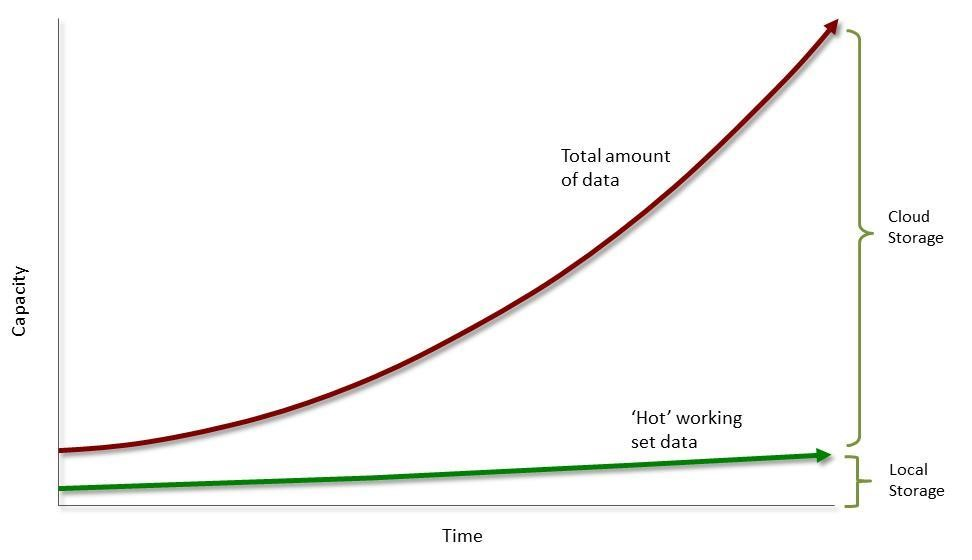

With this architecture in mind, you find that StorSimple is ideally suited to operate as a backup target. StorSimple lets you:

-   Perform most frequent restores from the local working set of data.

-   Use the cloud for offsite disaster recovery and older data where restores are less frequent.

## StorSimple benefits

StorSimple provides an on-premises solution that is seamlessly integrated with Microsoft Azure, by taking advantage of seamless access to on-premises and cloud storage.

StorSimple uses automatic tiering between the on-premises device, which contains solid-state device (SSD) and serial-attached SCSI (SAS) storage, and Azure Storage. Automatic tiering keeps frequently accessed data local, on the SSD and SAS tiers, and it moves infrequently accessed data to Azure Storage.

StorSimple offers the following benefits:

-   Unique deduplication and compression algorithms that use the cloud to achieve unprecedented deduplication levels

-   High availability

-   Geo-replication by using Azure geo-replication

-   Azure integration

-   Data encryption in the cloud

-   Improved disaster recovery and compliance

Although StorSimple presents two main deployment scenarios (primary and secondary backup target), keep in mind that it is fundamentally a plain block storage device. StorSimple does all the compression and deduplication, and it sends and retrieves data from the cloud seamlessly to both the application and the file system.

For more information about StorSimple, see [StorSimple 8000 series: hybrid cloud storage solution](storsimple-overview.md) and review the [technical StorSimple 8000 series specifications](storsimple-technical-specifications-and-compliance.md).

> [!IMPORTANT]
> StorSimple device as backup target is only supported with StorSimple 8000 Update 3 or later.

## Architecture overview

The following tables contain the device model-to-architecture initial guidance.

#### StorSimple capacities for local and cloud storage


| Storage capacity       | 8100       | 8600       |
|------------------------|---------------|-----------------|
| Local storage capacity | &lt; 10 TiB\*  | &lt; 20 TiB\*  |
| Cloud storage capacity | &gt; 200 TiB\* | &gt; 500 TiB\* |

\* Storage size assumes no deduplication or compression.

#### StorSimple capacities for primary and secondary backups


| Backup scenario  | Local storage capacity                                         | Cloud storage capacity                      |
|------------------|----------------------------------------------------------------|---------------------------------------------|
| Primary backup   | Recent backups stored on local storage for fast recovery (RPO) | Backup history (RPO) fits in cloud capacity |
| Secondary backup | Secondary copy of backup data can be stored in cloud capacity  |

## StorSimple as a primary backup target

In this scenario, the StorSimple volumes are presented to the backup application as the sole repository for backups. The following figure illustrates the solution architecture where all the backups use StorSimple tiered volumes for both backups and restores.


### Primary target backup logical steps

1.  Backup server contacts the target backup agent and backup agent transmits data to backup server.

2.  Backup server writes data to StorSimple tiered volumes.

3.  Backup server updates catalog database and completes the backup job.

4.  Snapshot script triggers the StorSimple cloud snapshot management.

5.  Based on a retention policy, the backup server deletes the expired backups.

### Primary target restore logical steps

1.  Backup server starts restoring the appropriate data from the storage repository.

2.  Backup agent receives the data from backup server.

3.  Backup server completes the restore job.

## StorSimple as a secondary backup target

In this scenario, the StorSimple volumes are primarily used for mostly long-term retention or archiving.

The following figure illustrates the architecture where the initial backups and restores target a high-performance volume. These backups are copied and archived to a StorSimple tiered volume at a given schedule.

It is important to size your high-performance volume with ample space and performance to handle the retention policy, capacity, and performance requirements.


### Secondary target backup logical steps

1.  Backup server contacts the target backup agent and backup agent transmits data to backup server.

2.  Backup server writes data to high-performance storage.

3.  Backup server updates catalog database and completes the backup job.

4.  Based on a retention policy, the backup server copies backups to StorSimple.

5.  Snapshot script triggers StorSimple cloud snapshot management.

6.  Based on a retention policy, the backup server deletes the expired backups.

### Secondary target restore logical steps

1.  Backup server starts restoring the appropriate data from the storage repository.

2.  Backup agent receives the data from backup server.

3.  Backup server completes the restore job.

## Deploy the solution

The deployment of this solution consists of three steps: preparing the network infrastructure, deploying your StorSimple device as a backup target, and finally deploying the Veeam software. Each of these steps is discussed in detail in the following sections.

### Configure the network

StorSimple as an integrated solution with the Azure cloud requires an active and working connection to the Azure cloud. This connection is used for operations such as cloud snapshots, management, metadata transfer, and to tier older, less accessed data to the Azure cloud storage.

For the solution to perform optimally, we recommend that you adhere to the following networking best practices:

-   The link that connects the StorSimple tiering to Azure must meet your bandwidth requirements by applying the proper the Quality of Service (QoS) to your infrastructure switches to match your RPO/RTO SLAs.

-   The maximum Azure Blob Storage access latencies should be in the 80 ms range.

### Deploy StorSimple

For a step-by-step StorSimple deployment guidance, go to [Deploy your on-premises StorSimple device](storsimple-deployment-walkthrough-u2.md).

### Deploy Veeam

For Veeam installation best practices, go to [Best practices for Veeam9](https://bp.veeam.expert/) and user guide at [Veeam Help Center (Technical Documentation)](https://www.veeam.com/documentation-guides-datasheets.html)

## Configure the solution

In this section, we demonstrate some configuration examples. The following examples/recommendations illustrate the most basic and fundamental implementation. This implementation may not apply directly to your specific backup requirements.

### Configure StorSimple

| StorSimple deployment tasks                                                                                                                 | Additional comments                                                                                                                                                                                                                                                                                      |
|---------------------------------------------------------------------------------------------------------------------------------------------|----------------------------------------------------------------------------------------------------------------------------------------------------------------------------------------------------------------------------------------------------------------------------------------------------------|
| Deploy your on-premises StorSimple device.                                                                                    | Supported version: Update 3 and   above.                                                                                                                                                                                                                                                                 |
| Enable backup target mode.                                                                                                                | Use  the following commands to enable/disable and get status. For more information, go to [connect remotely to a StorSimple](storsimple-remote-connect.md).</br> Enable backup mode:`Set-HCSBackupApplianceMode -enable`</br>  Disable backup mode:`Set-HCSBackupApplianceMode -disable`</br> Current state of backup mode settings`Get-HCSBackupApplianceMode` |
| Create a common volume container for your volume that stores the backup data. All data in a volume container is de-duplicated. | StorSimple volume containers define deduplication domains.                                                                                                                                                                                                                                             |
| Creating StorSimple volumes.                                                                                                                 | Create volumes with sizes as close to the anticipated usage as possible as volume size affects cloud snapshot duration time. For more information on how to size a volume, go to [Retention policies](#retention-policies).</br> </br> Use StorSimple tiered volumes and check **Use this volume for less frequently accessed archival data**. </br> Locally pinned volumes only are not supported.        |
| Create a unique StorSimple backup policy for all the backup target volumes.                                                               | A StorSimple backup policy defines the volume consistency group.                                                                                                                                                                                                                                       |
| Disable the schedule as the snapshots.                                                                                                    | Snapshots are triggered as a post-processing operation.                                                                                                                                                                                                                                                         |
|                                                                                                     |                                             |


### Configure host backup server storage

Ensure that the host backup server storage is configured as per the following guidelines:  

- Do not use spanned volumes (created by Windows Disk manager) as these volumes are not supported.
- Format your volumes using NTFS with 64 KB allocation unit size.
- Map the StorSimple volumes directly to the Veeam server. 
    - Use iSCSI for physical servers.


## Best practices for StorSimple and Veeam

Configure your solution as per the following guidelines.

### Operating system

-   Disable Windows Server encryption and deduplication for the NTFS file system.

-   Disable Windows Server defragmentation on the StorSimple volumes.

-   Disable Windows Server indexing on the StorSimple volumes.

-   Perform an antivirus scan at the source host (not against the StorSimple volumes).

-   Disable the default [Windows Server maintenance](https://msdn.microsoft.com/library/windows/desktop/hh848037.aspx) in task manager.

    - Disable Maintenance configurator in Windows Task Scheduler.

        Or

    - Download: [PSEXEC – Microsoft Sysinternals](https://technet.microsoft.com/sysinternals/bb897553.aspx)

      - After downloading PSEXEC, run Windows PowerShell as an administrator, and type:

            `psexec \\%computername% -s schtasks /change /tn “MicrosoftWindowsTaskSchedulerMaintenance Configurator" /disable`

### StorSimple

-   Ensure the StorSimple device is updated to [Update 3 or later](storsimple-install-update-3.md).

-   Isolate iSCSI and cloud traffic. Use dedicated iSCSI connections for traffic between StorSimple and backup server.

-   Ensure StorSimple device is a dedicated backup target. Mixed workloads are not supported as these workloads impact your RTO/RPO.

### Veeam

-   The Veeam database should be local to the server and not reside on a StorSimple volume.

-   For DR, back up your Veeam database on a StorSimple volume.

-   We support Veeam full and incremental backups for this solution. We recommend that you do not use synthetic and differential backups.

-   Backup data files should only contain data for a specific job. For example, no media appends across different jobs are allowed.

-   Disable job verification. If necessary, verification should be scheduled after the latest backup job. It is important to understand that this job affects your backup window.

-   Disable media pre-allocation.

-   Ensure parallel processing is enabled.

-   Disable compression.

-   Disable deduplication on the backup job.

-   Set optimization to **LAN Target**.

-   Enable **Create active full backup** (every 2 weeks).

-   On the backup repository, configure **Use per-VM backup files**.

-   Set **use multiple upload streams per job** to 8 (maximum of 16 is allowed). Adjust up or down based on the CPU utilization on StorSimple device.

## Retention policies

One of the most used backup retention policies is the Grandfather, Father, and Son (GFS). In this policy, an incremental backup is performed daily. The full backups are done weekly and monthly. This policy results in 6 StorSimple tiered volumes.

-   One volume contains the weekly, monthly, and yearly full backups.

-   The other 5 volumes store daily incremental backups.

In the following example, we are a GFS rotation. The following example assumes:

-   Non-deduped or compressed data is used.

-   Full backups are 1 TiB each.

-   Daily incremental backups are 500 GiB each.

-   4 weekly backups kept for a month.

-   12 monthly backups kept for a year.

-   1 yearly backup kept for 10 years.

Based on the preceding assumptions, create a 26 TiB StorSimple tiered volume for the monthly and yearly full backups. Create a 5 TiB StorSimple tiered volume for each of the incremental daily backups.

| Backup type retention | Size TiB | GFS multiplier\*                                       | Total capacity TiB          |
|-----------------------|----------|--------------------------------------------------------|-----------------------------|
| Weekly full           | 1        | 4                                                      | 4                           |
| Daily incremental     | 0.5      | 20 (cycles equal number of weeks per month) | 12 (2 for additional quota) |
| Monthly full          | 1        | 12                                                     | 12                          |
| Yearly full           | 1        | 10                                                     | 10                          |
| GFS requirement       |          |                                                        | 38                          |
| Additional quota      | 4        |                                                        | 42 total GFS requirement.   |

\*The GFS multiplier is the number of copies you need to protect and keep to meet your backup policies.

## Configuring Veeam storage

1.  Go to **Backup Infrastructure** settings. Select **Backup Repositories**, then right-click and select **Add Backup Repository**.

    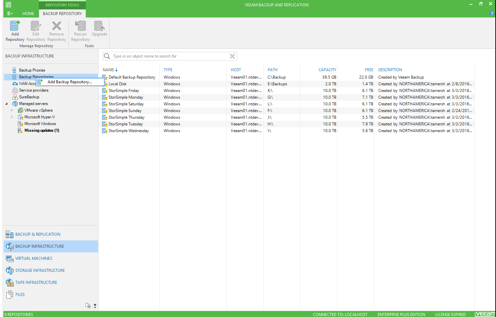

1.  Provide a **Name** and **Description** for the repository. Click **Next >**.

    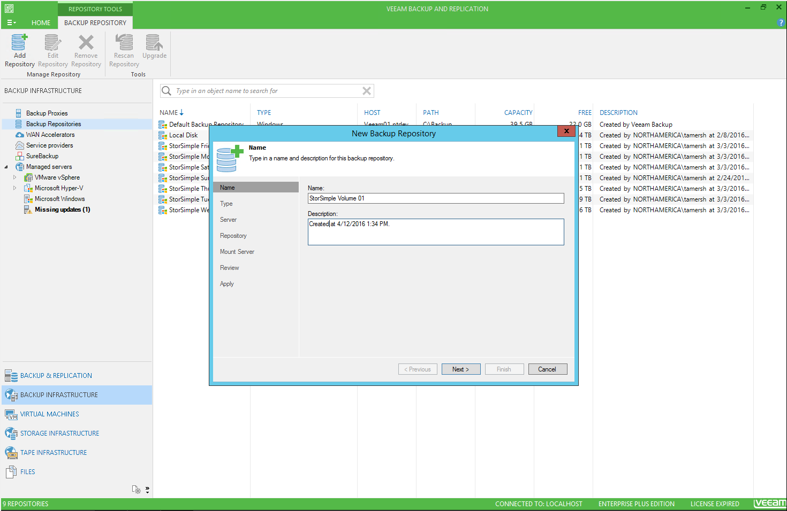

1.  Select backup repository as **Microsoft Windows Server**. Choose the Veeam Server. Click **Next >**.

    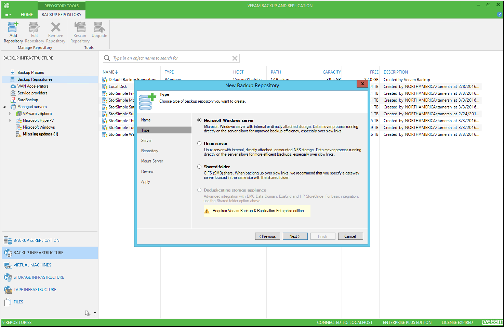

1.  To specify **Location**, browse and select the required volume. Set the **Limit maximum concurrent tasks to:** to 4. This ensures that only 4 virtual disks are being processed concurrently as each VM is processed.
Click **Advanced**.

    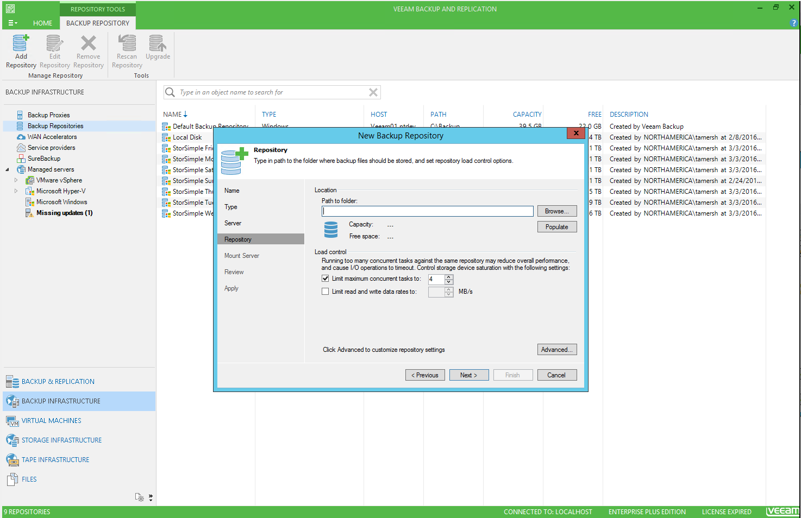


1.  Choose **Use per-VM backup files**.

    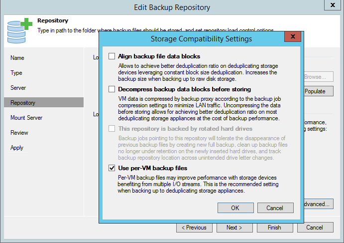

1.  Enable **vPower NFS service on the mount server (recommended)**.

    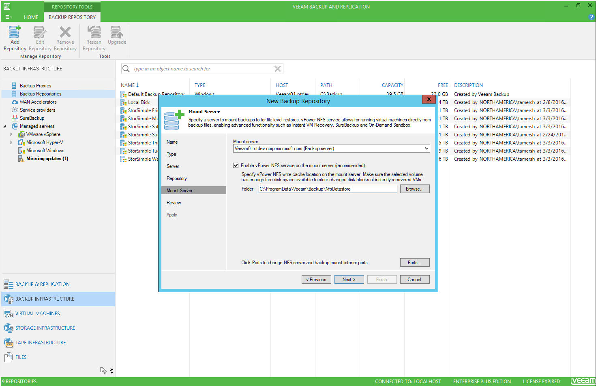

1.  Review the settings and proceed to the next page.

    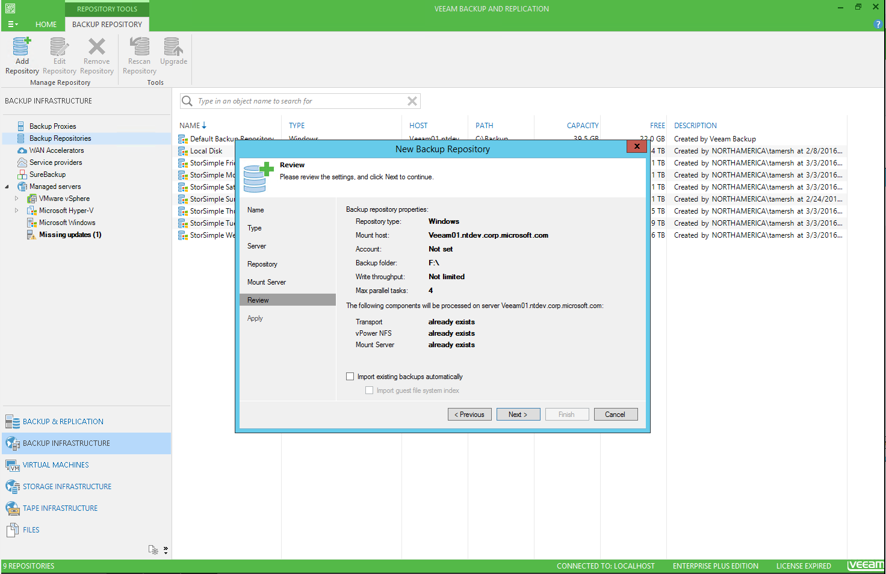

    A repository is added to the Veeam server.

## StorSimple as a primary backup target

> [!IMPORTANT]
> If you need to restore data from a backup that has been tiered to the cloud, the restore occurs at cloud speeds.

In the following figure, we illustrate mapping of a typical volume to a backup job. In this case, all the weekly backups map to Saturday full disk, and the incremental backups map to Monday-Friday incremental disks. All the backups and restores happen from a StorSimple tiered volume.

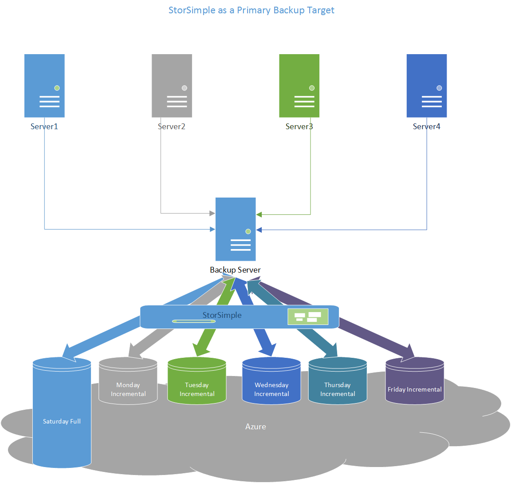

#### StorSimple as a primary backup target Grandfather, Father, and Son (GFS) schedule example

| GFS Rotation Schedule for 4 weeks, Monthly and Yearly |               |             |
|--------------------------------------------------------------------------|---------------|-------------|
| Frequency/Backup Type   | Full          | Incremental (Day 1 - 5)  |
| Weekly (week 1 - 4)    | Saturday | Monday - Friday |
| Monthly     | Saturday  |             |
| Yearly      | Saturday  |             |


### Assigning StorSimple volumes to a Veeam backup job

1.  Create a daily job with primary Veeam StorSimple in case of primary backup target scenario or DAS/NAS/JBOD in case of secondary backup target scenario as backup target. Go to **Backup 
&#38; Replication &gt; Backup**. Right-click and then select VMware or Hyper-V as per your environment.

    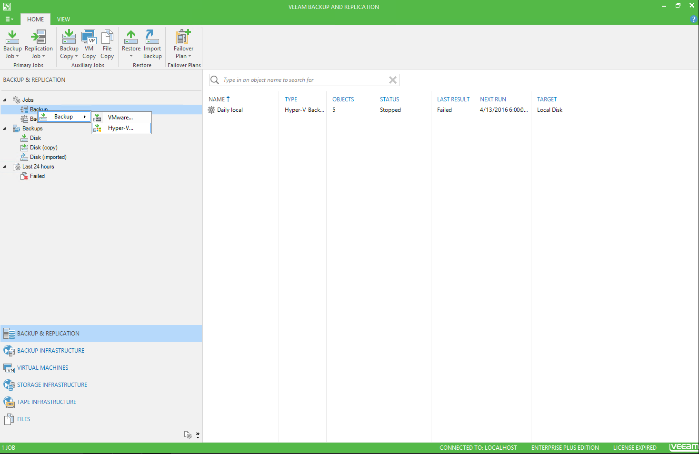

1.  Provide a **Name** and **Description** for the daily backup job.

    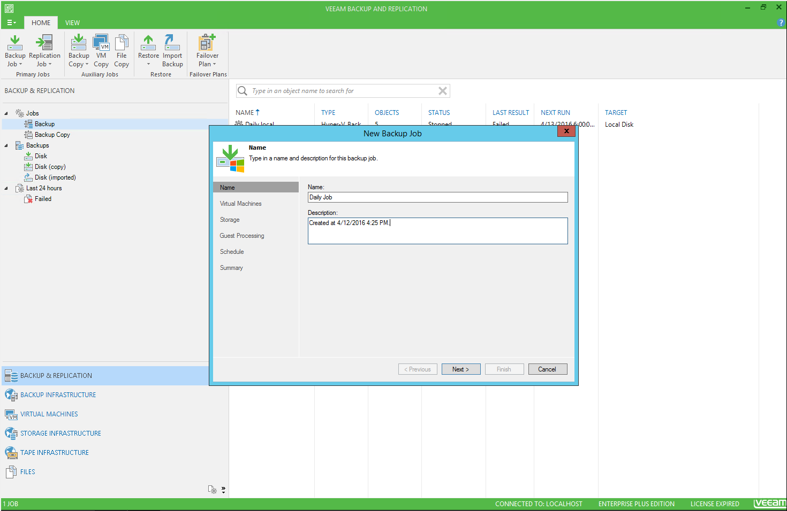

1.  Select a virtual machine to back up to.

    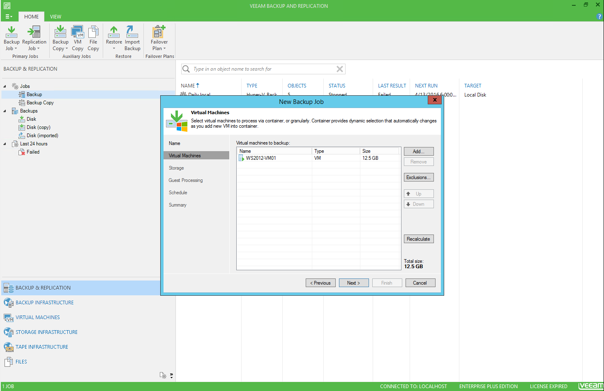

1.  Set appropriate **Backup proxy** and **Backup repository**. Set **Restore points to keep on disk** per the RPO/RTO definitions for your environment on locally attached storage. Click Advanced.

    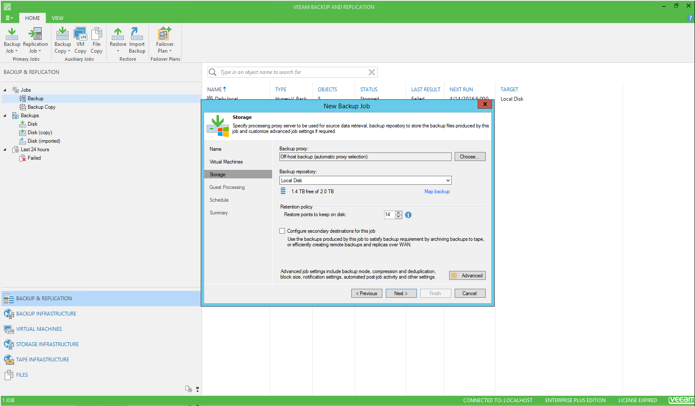

    In the **Backup** tab, choose **Incremental**. Ensure **Create synthetic full backups periodically** is unchecked. Enable **Create active full backups periodically** and choose Weekly on selected **Active full backups** are enabled on every Saturday.

    

    In the Storage tab, ensure that deduplication and compression are disabled, and file block swap and deletion is enabled. Set the **Storage optimization** to **LAN Target** for balanced performance and deduplication.

    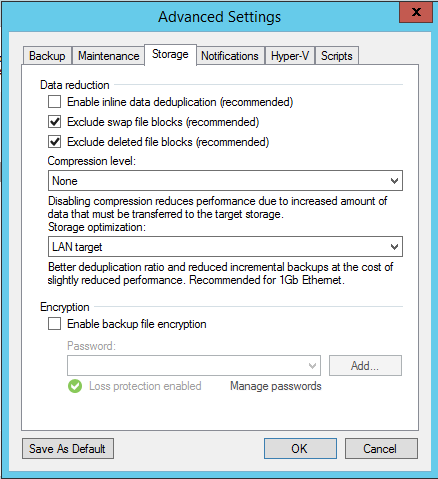

    For details on deduplication and compression settings, refer to [Data Compression and Deduplication](https://helpcenter.veeam.com/backup/vsphere/compression_deduplication.html)

1.  You can choose to **Enable Application Aware Processing**.

    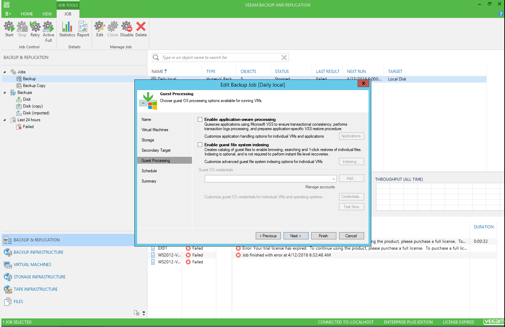

1.  Set the schedule to run once daily at a specified time of your choice.

    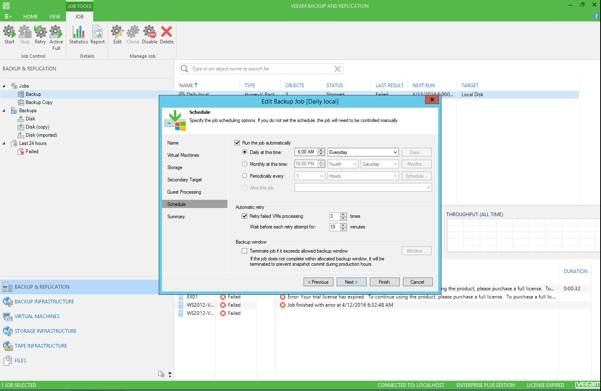

## StorSimple as a secondary backup target

> [!NOTE]
> The restore occurs at cloud speeds for the data from a backup that has been tiered to the cloud.

In this model, you must have a storage media (other than StorSimple) to serve as a temporary cache. For example, you could use a RAID volume to accommodate space, IOs, and bandwidth. We recommend using RAID 5, 50 and 10.

In the following figure, we illustrate typical short-term retention local (to the server) volumes and long-term retention archive volumes. In this case, all the backups run on the local (to the server) RAID volume. These backups are periodically duplicated and archived to an archive volume. It is important to size your local (to the server) RAID volume to handle the short-term retention capacity and performance requirements.


| Backup type and retention                    |Configured storage| Size (TiB) | GFS multiplier | Total capacity (TiB)        |
|----------------------------------------------|-----|----------|----------------|------------------------|
| Week 1 (full and incremental) |Local disk (short term)| 1        | 1              | 1           |
| StorSimple week 2-4           |StorSimple disk (long term) | 1        | 4              | 4                   |
| Monthly full                                 |StorSimple disk (long term) | 1        | 12             | 12                   |
| Yearly full                               |StorSimple disk (long term) | 1        | 1              | 1                   |
|GFS volumes size requirement | |          |                | 18*|

\* The total capacity includes 17 TiB of StorSimple disks and 1 TiB of local RAID volume.


#### GFS example schedule

| GFS rotation weekly, monthly, and yearly schedule|                    |                   |                   |                   |                   |                   |
|--------------------------------------------------------------------------|--------------------|-------------------|-------------------|-------------------|-------------------|-------------------|
| Week                                                                     | Full               | Incremental day 1        | Incremental day 2        | Incremental day 3        | Incremental day 4        | Incremental day 5        |
| Week 1                                                                   | Local RAID volume  | Local RAID volume | Local RAID volume | Local RAID volume | Local RAID volume | Local RAID volume |
| Week 2                                                                   | StorSimple week 2-4 |                   |                   |                   |                   |                   |
| Week 3                                                                   | StorSimple week 2-4 |                   |                   |                   |                   |                   |
| Week 4                                                                   | StorSimple week 2-4 |                   |                   |                   |                   |                   |
| Monthly                                                                  | StorSimple monthly |                   |                   |                   |                   |                   |
| Yearly                                                                   | StorSimple yearly  |                   |                   |                   |                   |                   |


### Assigning StorSimple volumes to a Veeam copy job

1.  Launch the New Backup Copy Job wizard. Go to **Jobs > Backup Copy**. Select VMware or Hyper-V as per your environment.

    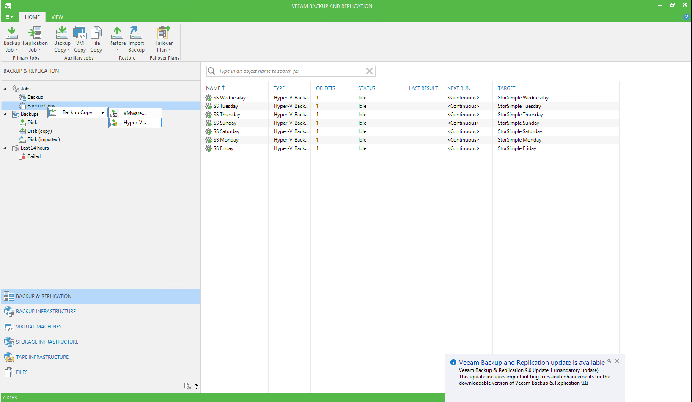

1.  Specify the job name and description.

    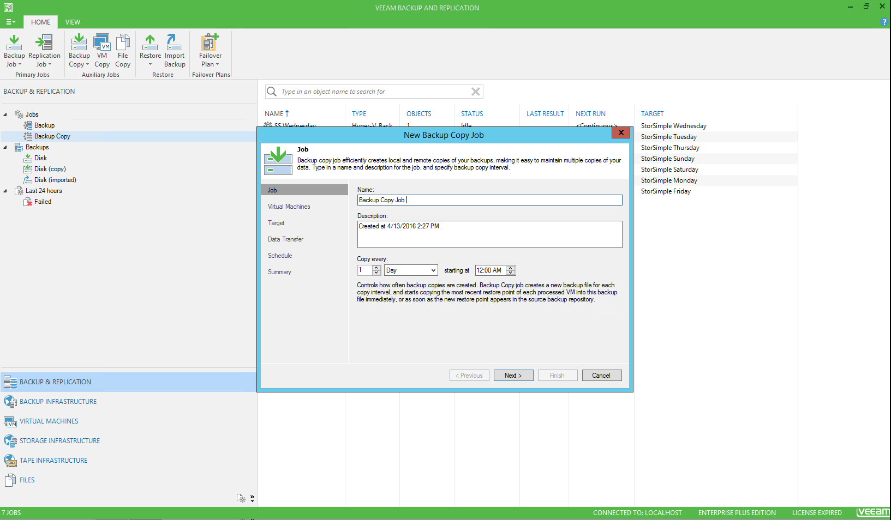

1.  Select VMs to process, select from backups and select the daily backup
    created earlier.

    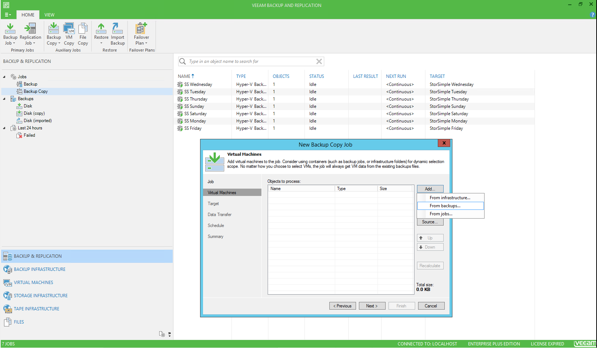

1.  Exclude objects from the backup copy job if needed.

1.  Select **Backup repository**, define **Restore points to keep** and make sure to
    enable **keep the following restore points for archival purposes**. Define the backup frequency and then click **Advanced**.

    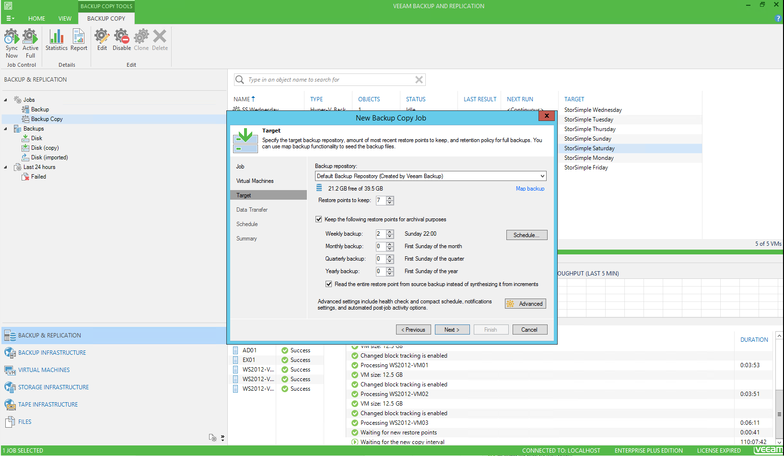

1.  Specify the following advanced settings:

    -   On **Maintenance** tab, disable storage level corruption guard.

    -   On **Storage** tab, ensure that deduplication and compression are disabled.

    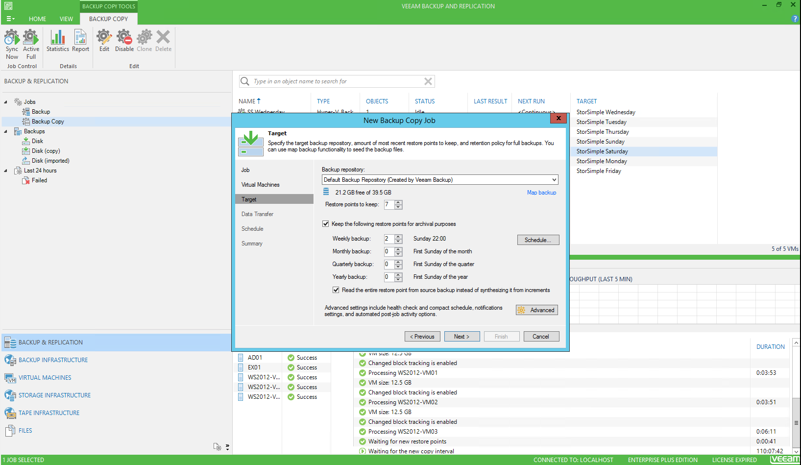

    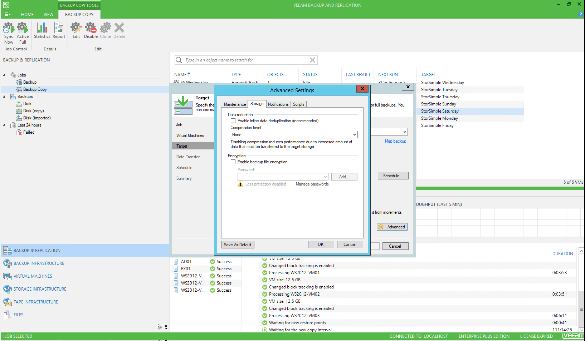

1.  Specify data transfer to be direct.

1.  Define the backup copy window schedule as per your needs and finish.


For more information, go to [Create backup copy jobs](https://helpcenter.veeam.com/backup/hyperv/backup_copy_create.html).

## StorSimple cloud snapshots

StorSimple cloud snapshots protect the data that resides in StorSimple device. This is equivalent to shipping tapes to an offsite facility. If using Azure geo-redundant storage (GRS), this is equivalent to shipping tapes to multiple sites. If a device restore is needed in a disaster, you could bring another StorSimple device online and do a failover. Following the failover, you can access the data (at cloud speeds) from the most recent cloud snapshot.


The following section illustrates how to create a short script to trigger and delete StorSimple cloud snapshots during the backup post-processing. 

> [!NOTE] 
> Snapshots that are manually or programmatically created do not follow the StorSimple snapshot expiration policy. These snapshots must be manually or programmatically deleted.

### Start and delete cloud snapshots with a script

> [!NOTE] 
> Carefully assess the compliance and data retention repercussions before you delete a StorSimple snapshot. For more information on how to run a post-backup script, see Veeam documentation.


#### Backup lifecycle


#### Requirements:

-   The server that runs the script must have access to Azure cloud.

-   The user account must have the necessary permissions.

-   A StorSimple backup policy with the associated StorSimple volumes configured but not enabled.

-   StorSimple Resource Name, Registration Key, Device Name, and Backup policy ID.

#### Steps:

1.  [Install Azure PowerShell](/powershell-install-configure/).

2.  [Download and import publish settings and subscription information.](https://msdn.microsoft.com/library/dn385850.aspx)

3.  In the Azure classic portal, get the resource name and [registration key for your StorSimple Manager service](storsimple-deployment-walkthrough-u2.md#step-2-get-the-service-registration-key).

4.  On the server that runs the script, run Windows PowerShell as Administrator. Type:

    -   `Get-AzureStorSimpleDeviceBackupPolicy –DeviceName <device name>`

    Make a note of the Backup Policy ID.

5.  In Notepad, create a Windows PowerShell Script and save it in the same location where you saved the Azure publish settings. For example, `C:\\CloudSnapshot\\StorSimpleCloudSnapshot.ps1`.

    Copy and paste the following code snippet:

    ```powershell
    Import-AzurePublishSettingsFile "c:\\CloudSnapshot Snapshot\\myAzureSettings.publishsettings"
    Disable-AzureDataCollection
    $ApplianceName = <myStorSimpleApplianceName>
    $RetentionInDays = 20
    $RetentionInDays = -$RetentionInDays
    $Today = Get-Date
    $ExpirationDate = $Today.AddDays($RetentionInDays)
    Select-AzureStorSimpleResource -ResourceName "myResource" –RegistrationKey
    Start-AzureStorSimpleDeviceBackupJob –DeviceName $ApplianceName -BackupType CloudSnapshot -BackupPolicyId <BackupId> -Verbose
    $CompletedSnapshots =@()
    $CompletedSnapshots = Get-AzureStorSimpleDeviceBackup -DeviceName $ApplianceName
    Write-Host "The Expiration date is " $ExpirationDate
    Write-Host

    ForEach ($SnapShot in $CompletedSnapshots)
    {
        $SnapshotStartTimeStamp = $Snapshot.CreatedOn
        if ($SnapshotStartTimeStamp -lt $ExpirationDate)

        {
            $SnapShotInstanceID = $SnapShot.InstanceId
            Write-Host "This snpashotdate was created on " $SnapshotStartTimeStamp.Date.ToShortDateString()
            Write-Host "Instance ID " $SnapShotInstanceID
            Write-Host "This snpashotdate is older and needs to be deleted"
            Write-host "\#\#\#\#\#\#\#\#\#\#\#\#\#\#\#\#\#\#\#\#\#"
            Remove-AzureStorSimpleDeviceBackup -DeviceName $ApplianceName -BackupId $SnapShotInstanceID -Force -Verbose
        }
    }
    ```

6.  To add the script to your backup job, edit your Veeam job
    advanced options. 

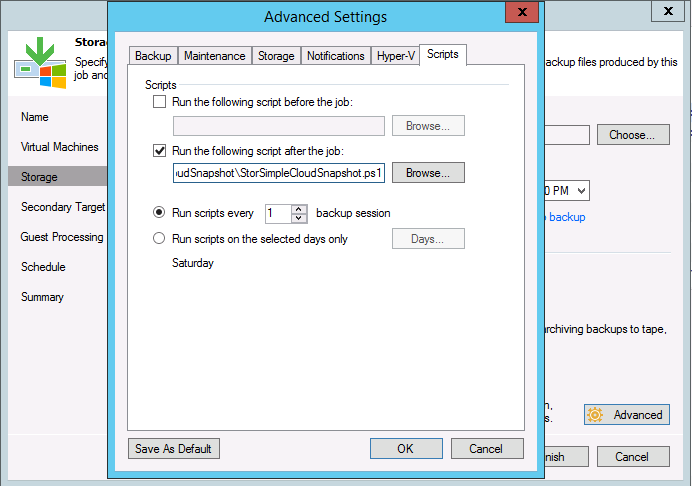

It is recommended that you run your StorSimple cloud snapshot backup policy at the end of your daily backup’s job as a post-processing script. For more information on how to back up and restore your backup application environment to meet your RPO/RTO, consult with your backup architect.

## StorSimple as a restore source
==============================

Restores from a StorSimple device work as restore from any block storage device. When restoring data that is tiered to the cloud, restores occur at cloud speeds. For local data, restores occur at local disk speed of the device.

Veeam enables fast granular file-level recovery through StorSimple using the built-in Explorers in the Veeam console. Use the Veeam Explorers to recover individual items such as email messages, Active Directory objects, or SharePoint items from the backups. The recovery can be done without on-premises VM disruption. You can also accomplish the point-in-time recovery for Microsoft SQL and Oracle Databases. Veeam and StorSimple make the process of item level recovery from Azure both fast and easy. For information on how to perform a restore, refer to Veeam documentation.


- [https://www.veeam.com/microsoft-exchange-recovery.html](https://www.veeam.com/microsoft-exchange-recovery.html)

- [https://www.veeam.com/microsoft-active-directory-explorer.html](https://www.veeam.com/microsoft-active-directory-explorer.html)

- [https://www.veeam.com/microsoft-sql-server-explorer.html](https://www.veeam.com/microsoft-sql-server-explorer.html)

- [https://www.veeam.com/microsoft-sharepoint-recovery-explorer.html](https://www.veeam.com/microsoft-sharepoint-recovery-explorer.html)

- [https://www.veeam.com/oracle-backup-recovery-explorer.html](https://www.veeam.com/oracle-backup-recovery-explorer.html)


## StorSimple failover and disaster recovery

> [!NOTE]
> For backup target scenarios, StorSimple Cloud Appliance is not supported as a restore target.

A disaster could occur due to various factors. The following table lists common disaster recovery (DR) scenarios.


| Scenario                                                                    | Impact                                             | How to recover                                                                                                                                                                               | Notes                                                                                                                                                                                                                                                                                                                                                                                                                                    |
|-----------------------------------------------------------------------------|----------------------------------------------------|----------------------------------------------------------------------------------------------------------------------------------------------------------------------------------------------|------------------------------------------------------------------------------------------------------------------------------------------------------------------------------------------------------------------------------------------------------------------------------------------------------------------------------------------------------------------------------------------------------------------------------------------|
| StorSimple device failure.                                               | Backup and restore operations are interrupted. | Replace the failed device and perform [StorSimple failover and disaster recovery](storsimple-device-failover-disaster-recovery.md) | If a restore is performed immediately after the device recovery, the full working sets are being retrieved from the cloud to the new device. As a result, all operations are at cloud speeds. Additionally, the index and catalog rescanning could cause all the backup sets to be scanned and pulled from cloud tier to the local tier of the device. This makes it further time-intensive.                                 |
| Veeam Server failure.                                                     | Backup and restore operations are interrupted. | Rebuild the backup server and perform database restore as detailed in [Veeam Help Center (Technical Documentation)](https://www.veeam.com/documentation-guides-datasheets.html)     | The Veeam server needs to be rebuilt or restored in DR site. Restore the database to the most recent point. If the restored Veeam database is not in sync with your latest backup jobs, indexing and cataloging is required. This index and catalog rescanning could cause all backup sets to be scanned and pulled from cloud tier to local device tier. This makes it further time-intensive. |
| Site failure that results in the loss of both Backup server and StorSimple. | Backup and restore operations are interrupted. | Restore StorSimple first and then Veeam.                                                                                                                                                  | Restore StorSimple first and then Veeam. If there is a need to perform a restore after device recovery, the full data working sets are retrieved from the cloud to the new device. As a result, all operations are at cloud speed rate.                                                                                                                                                                            |


## References

The following documents have been referenced in this article:

- [StorSimple MPIO setup](storsimple-configure-mpio-windows-server.md)

- [Storage scenarios: Thin provisioning](http://msdn.microsoft.com/library/windows/hardware/dn265487.aspx)

- [Using GPT drives](http://msdn.microsoft.com/windows/hardware/gg463524.aspx#EHD)

- [Enable and configure shadow copies for shared folders](http://technet.microsoft.com/library/cc771893.aspx)
