# StorSimple as a backup target with NetBackup

## Overview

Azure StorSimple is a hybrid cloud storage solution from Microsoft. StorSimple addresses the complexities of exponential data growth by using an Azure storage account as an extension of the on-premises solution, and automatically tiering data across on-premises storage and cloud storage.

In this article, we discuss StorSimple integration with Veritas NetBackup, and best practices for integrating both solutions. We also make recommendations on how to set up Veritas NetBackup to best integrate with StorSimple. We defer to Veritas best practices, backup architects, and administrators for the best way to set up Veritas NetBackup to meet individual backup requirements and service-level agreements (SLAs).

Although we illustrate configuration steps and key concepts, this article is by no means a step-by-step configuration or installation guide. We assume that the basic components and infrastructure are in working order and ready to support the concepts that we describe.

### Who should read this?

The information in this article will be most helpful to backup administrators, storage administrators, and storage architects who have knowledge of storage, Windows Server 2012 R2, Ethernet, cloud services, and Veritas NetBackup.

### Supported versions

-   NetBackup 7.7.x and later versions
-   [StorSimple Update 3 and later versions](storsimple-overview.md#storsimple-workload-summary)


## Why StorSimple as a backup target?

StorSimple is a good choice for a backup target because:

-   It provides standard, local storage for backup applications to use as a fast backup destination, without any changes. You also can use StorSimple for a quick restore of recent backups.
-   Its cloud tiering is seamlessly integrated with an Azure cloud storage account to use cost-effective Azure Storage.
-   It automatically provides offsite storage for disaster recovery.

## Key concepts

As with any storage solution, a careful assessment of the solution’s storage performance, SLAs, rate of change, and capacity growth needs is critical to success. The main idea is that by introducing a cloud tier, your access times and throughputs to the cloud play a fundamental role in the ability of StorSimple to do its job.

StorSimple is designed to provide storage to applications that operate on a well-defined working set of data (hot data). In this model, the working set of data is stored on the local tiers, and the remaining nonworking/cold/archived set of data is tiered to the cloud. This model is represented in the following figure. The nearly flat green line represents the data stored on the local tiers of the StorSimple device. The red line represents the total amount of data stored on the StorSimple solution across all tiers. The space between the flat green line and the exponential red curve represents the total amount of data stored in the cloud.

**StorSimple tiering**


With this architecture in mind, you will find that StorSimple is ideally suited to operate as a backup target. You can use StorSimple to:
-   Perform your most frequent restores from the local working set of data.
-   Use the cloud for offsite disaster recovery and older data, where restores are less frequent.

## StorSimple benefits

StorSimple provides an on-premises solution that is seamlessly integrated with Microsoft Azure, by taking advantage of seamless access to on-premises and cloud storage.

StorSimple uses automatic tiering between the on-premises device, which has solid-state device (SSD) and serial-attached SCSI (SAS) storage, and Azure Storage. Automatic tiering keeps frequently accessed data local, on the SSD and SAS tiers. It moves infrequently accessed data to Azure Storage.

StorSimple offers these benefits:

-   Unique deduplication and compression algorithms that use the cloud to achieve unprecedented deduplication levels
-   High availability
-   Geo-replication by using Azure geo-replication
-   Azure integration
-   Data encryption in the cloud
-   Improved disaster recovery and compliance

Although StorSimple presents two main deployment scenarios (primary backup target and secondary backup target), fundamentally, it's a plain, block storage device. StorSimple does all the compression and deduplication. It seamlessly sends and retrieves data between the cloud and the application and file system.

For more information about StorSimple, see [StorSimple 8000 series: Hybrid cloud storage solution](storsimple-overview.md). Also, you can review the [technical StorSimple 8000 series specifications](storsimple-technical-specifications-and-compliance.md).

> [!IMPORTANT]
> Using a StorSimple device as a backup target is supported only for StorSimple 8000 Update 3 and later versions.

## Architecture overview

The following tables show the device model-to-architecture initial guidance.

**StorSimple capacities for local and cloud storage**

| Storage capacity       | 8100          | 8600            |
|------------------------|---------------|-----------------|
| Local storage capacity | &lt; 10 TiB\*  | &lt; 20 TiB\*  |
| Cloud storage capacity | &gt; 200 TiB\* | &gt; 500 TiB\* |

\* Storage size assumes no deduplication or compression.

**StorSimple capacities for primary and secondary backups**

| Backup scenario  | Local storage capacity  | Cloud storage capacity  |
|---|---|---|
| Primary backup  | Recent backups stored on local storage for fast recovery to meet recovery point objective (RPO) | Backup history (RPO) fits in cloud capacity |
| Secondary backup | Secondary copy of backup data can be stored in cloud capacity  | N/A  |

## StorSimple as a primary backup target

In this scenario, StorSimple volumes are presented to the backup application as the sole repository for backups. The following figure shows a solution architecture in which all backups use StorSimple tiered volumes for backups and restores.

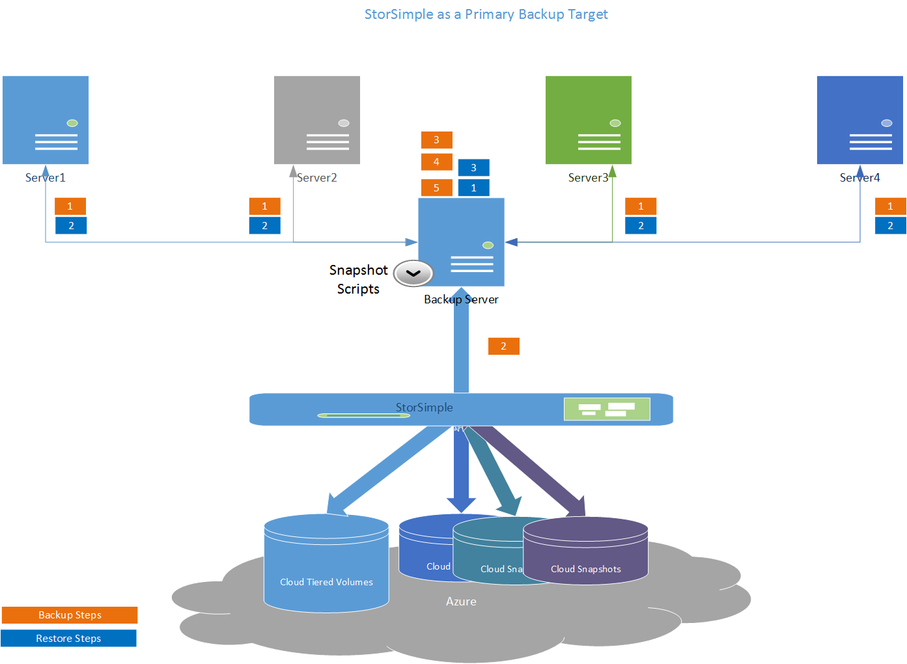

### Primary target backup logical steps

1.  The backup server contacts the target backup agent, and the backup agent transmits data to the backup server.
2.  The backup server writes data to the StorSimple tiered volumes.
3.  The backup server updates the catalog database, and then finishes the backup job.
4.  A snapshot script triggers the StorSimple snapshot manager (start or delete).
5.  The backup server deletes expired backups based on a retention policy.

### Primary target restore logical steps

1.  The backup server starts restoring the appropriate data from the storage repository.
2.  The backup agent receives the data from the backup server.
3.  The backup server finishes the restore job.

## StorSimple as a secondary backup target

In this scenario, StorSimple volumes primarily are used for long-term retention or archiving.

The following figure shows an architecture in which initial backups and restores target a high-performance volume. These backups are copied and archived to a StorSimple tiered volume on a set schedule.

It's important to size your high-performance volume so that it can handle your retention policy capacity and performance requirements.

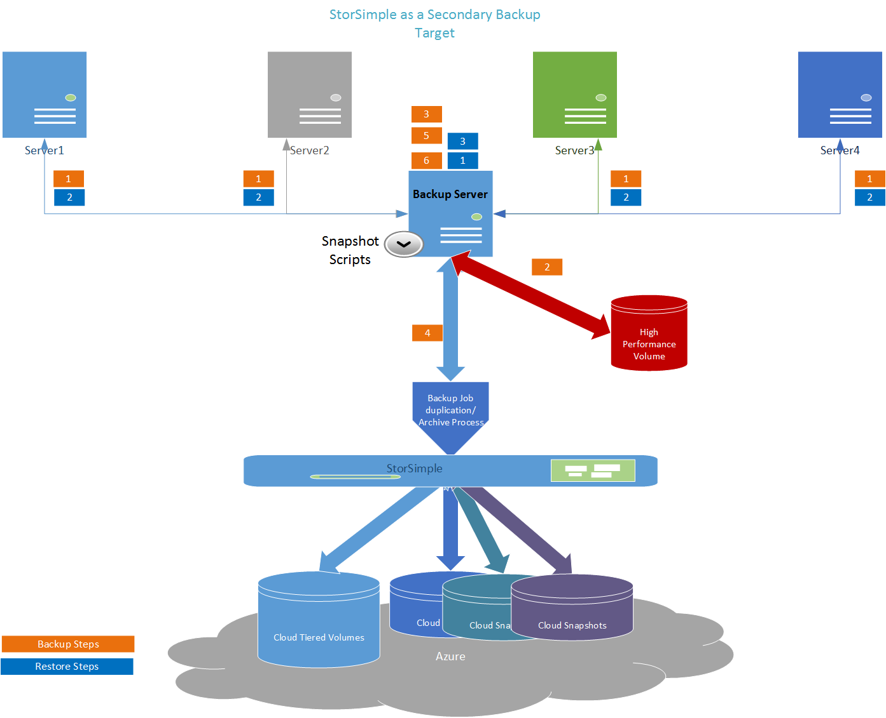

### Secondary target backup logical steps

1.  The backup server contacts the target backup agent, and the backup agent transmits data to the backup server.
2.  The backup server writes data to high-performance storage.
3.  The backup server updates the catalog database, and then finishes the backup job.
4.  The backup server copies backups to StorSimple based on a retention policy.
5.  A snapshot script triggers the StorSimple snapshot manager (start or delete).
6.  The backup server deletes the expired backups based on a retention policy.

### Secondary target restore logical steps

1.  The backup server starts restoring the appropriate data from the storage repository.
2.  The backup agent receives the data from the backup server.
3.  The backup server finishes the restore job.

## Deploy the solution

Deploying this solution requires three steps:
1. Prepare the network infrastructure.
2. Deploy your StorSimple device as a backup target.
3. Deploy Veritas NetBackup.

Each step is discussed in detail in the following sections.

### Set up the network

Because StorSimple is a solution that's integrated with the Azure cloud, StorSimple requires an active and working connection to the Azure cloud. This connection is used for operations like cloud snapshots, data management, and metadata transfer, and to tier older, less accessed data to Azure cloud storage.

For the solution to perform optimally, we recommend that you follow these networking best practices:

-   The link that connects the StorSimple tiering to Azure must meet your bandwidth requirements. To achieve this, apply the proper Quality of Service (QoS) level to your infrastructure switches to match your RPO and recovery time objective (RTO) SLAs.

-   Maximum Azure Blob storage access latencies should be around 80 ms.

### Deploy StorSimple

For step-by-step StorSimple deployment guidance, see [Deploy your on-premises StorSimple device](storsimple-deployment-walkthrough-u2.md).

### Deploy NetBackup

For step-by-step NetBackup 7.7.x deployment guidance, see the [NetBackup 7.7.x documentation](http://www.veritas.com/docs/000094423).

## Set up the solution

In this section, we demonstrate some configuration examples. The following examples and recommendations illustrate the most basic and fundamental implementation. This implementation might not apply directly to your specific backup requirements.

### Set up StorSimple

| StorSimple deployment tasks  | Additional comments |
|---|---|
| Deploy your on-premises StorSimple device. | Supported versions: Update 3 and later versions. |
| Turn on the backup target. | Use these commands to turn on or turn off backup target mode, and to get status. For more information, see [Connect remotely to a StorSimple device](storsimple-remote-connect.md).</br> To turn on backup mode: `Set-HCSBackupApplianceMode -enable`. </br> To turn off backup mode: `Set-HCSBackupApplianceMode -disable`. </br> To get the current state of backup mode settings: `Get-HCSBackupApplianceMode`. |
| Create a common volume container for your volume that stores the backup data. All data in a volume container is deduplicated. | StorSimple volume containers define deduplication domains.  |
| Create StorSimple volumes. | Create volumes with sizes as close to the anticipated usage as possible, because volume size affects cloud snapshot duration time. For information about how to size a volume, read about [retention policies](#retention-policies).</br> </br> Use StorSimple tiered volumes, and select the **Use this volume for less frequently accessed archival data** check box. </br> Using only locally pinned volumes is not supported. |
| Create a unique StorSimple backup policy for all the backup target volumes. | A StorSimple backup policy defines the volume consistency group. |
| Disable the schedule as the snapshots expire. | Snapshots are triggered as a post-processing operation. |

### Set up the host backup server storage

Set up the host backup server storage according to these guidelines:  

- Don't use spanned volumes (created by Windows Disk Management); spanned volumes are not supported.
- Format your volumes using NTFS with 64-KB allocation size.
- Map the StorSimple volumes directly to the NetBackup server.
    - Use iSCSI for physical servers.
    - Use pass-through disks for virtual servers.


## Best practices for StorSimple and NetBackup

Set up your solution according to the guidelines in the following few sections.

### Operating system best practices

- Disable Windows Server encryption and deduplication for the NTFS file system.
- Disable Windows Server defragmentation on the StorSimple volumes.
- Disable Windows Server indexing on the StorSimple volumes.
- Run an antivirus scan at the source host (not against the StorSimple volumes).
- Turn off the default [Windows Server maintenance](https://msdn.microsoft.com/library/windows/desktop/hh848037.aspx) in Task Manager. Do this in one of the following ways:
  - Turn off the Maintenance configurator in Windows Task Scheduler.
  - Download [PsExec](https://technet.microsoft.com/sysinternals/bb897553.aspx) from Windows Sysinternals. After you download PsExec, run Windows PowerShell as an administrator, and type:
    ```powershell
    psexec \\%computername% -s schtasks /change /tn “MicrosoftWindowsTaskSchedulerMaintenance Configurator" /disable
    ```

### StorSimple best practices

-   Be sure that the StorSimple device is updated to [Update 3 or later](storsimple-install-update-3.md).
-   Isolate iSCSI and cloud traffic. Use dedicated iSCSI connections for traffic between StorSimple and the backup server.
-   Be sure that your StorSimple device is a dedicated backup target. Mixed workloads are not supported because they affect your RTO and RPO.

### NetBackup best practices

-   The NetBackup database should be local to the server and not reside on a StorSimple volume.
-   For disaster recovery, back up the NetBackup database on a StorSimple volume.
-   We support NetBackup full and incremental backups (also referred to as differential incremental backups in NetBackup) for this solution. We recommend that you do not use synthetic and cumulative incremental backups.
-   Backup data files should contain only the data for a specific job. For example, no media appends across different jobs are allowed.

For the latest NetBackup settings and best practices for implementing these requirements, see the NetBackup documentation at [www.veritas.com](https://www.veritas.com).


## Retention policies

One of the most common backup retention policy types is a Grandfather, Father, and Son (GFS) policy. In a GFS policy, an incremental backup is performed daily and full backups are done weekly and monthly. This policy results in six StorSimple tiered volumes: one volume contains the weekly, monthly, and yearly full backups; the other five volumes store daily incremental backups.

In the following example, we use a GFS rotation. The example assumes the following:

-   Non-deduped or compressed data is used.
-   Full backups are 1 TiB each.
-   Daily incremental backups are 500 GiB each.
-   Four weekly backups are kept for a month.
-   Twelve monthly backups are kept for a year.
-   One yearly backup is kept for 10 years.

Based on the preceding assumptions, create a 26-TiB StorSimple tiered volume for the monthly and yearly full backups. Create a 5-TiB StorSimple tiered volume for each of the incremental daily backups.

| Backup type retention | Size (TiB) | GFS multiplier\* | Total capacity (TiB)  |
|---|---|---|---|
| Weekly full | 1 | 4  | 4 |
| Daily incremental | 0.5 | 20 (cycles equal number of weeks per month) | 12 (2 for additional quota) |
| Monthly full | 1 | 12 | 12 |
| Yearly full | 1  | 10 | 10 |
| GFS requirement |   | 38 |   |
| Additional quota  | 4  |   | 42 total GFS requirement  |

\* The GFS multiplier is the number of copies you need to protect and retain to meet your backup policy requirements.

## Set up NetBackup storage

### To set up NetBackup storage

1.  In the NetBackup Administration Console, select **Media and Device Management** > **Devices** > **Disk Pools**. In the Disk Pool Configuration Wizard, select the storage server type **AdvancedDisk**, and then select **Next**.

    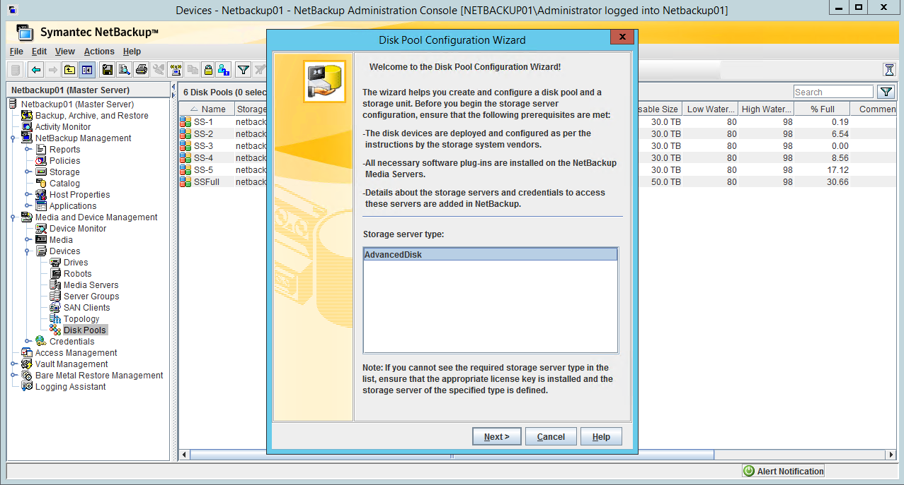

2.  Select your server, and then select **Next**.

    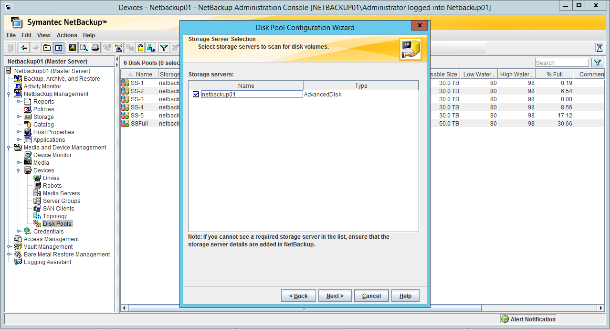

3.  Select your StorSimple volume.

    

4.  Enter a name for the backup target, and then select **Next** > **Next** to finish the wizard.

5.  Review the settings, and then select **Finish**.

6.  At the end of each volume assignment, change the storage device settings to match those recommended in [Best practices for StorSimple and NetBackup](#best-practices-for-storsimple-and-netbackup).

7. Repeat steps 1-6 until you are finished assigning your StorSimple volumes.

    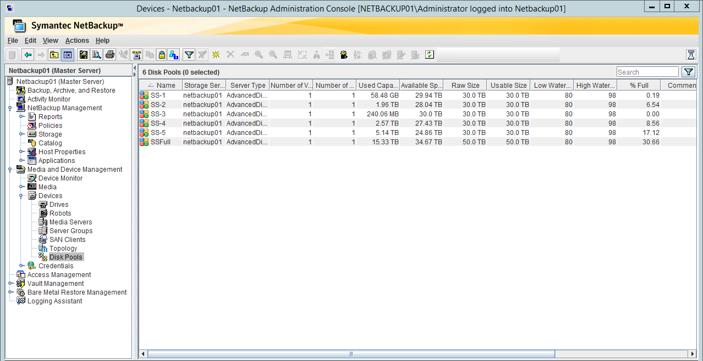

## Set up StorSimple as a primary backup target

> [!NOTE]
> Data restores from a backup that has been tiered to the cloud occur at cloud speeds.

The following figure shows the mapping of a typical volume to a backup job. In this case, all the weekly backups map to the Saturday full disk, and the incremental backups map to Monday-Friday incremental disks. All the backups and restores are from a StorSimple tiered volume.


### StorSimple as a primary backup target GFS schedule example

Here's an example of a GFS rotation schedule for four weeks, monthly, and yearly:

| Frequency/backup type | Full | Incremental (days 1-5)  |   
|---|---|---|
| Weekly (weeks 1-4) | Saturday | Monday-Friday |
| Monthly  | Saturday  |   |
| Yearly | Saturday  |   |

## Assigning StorSimple volumes to a NetBackup backup job

The following sequence assumes that NetBackup and the target host are configured in accordance with the NetBackup agent guidelines.

### To assign StorSimple volumes to a NetBackup backup job

1. In the NetBackup Administration Console, select **NetBackup Management**, right-click **Policies**, and then select **New Policy**.

   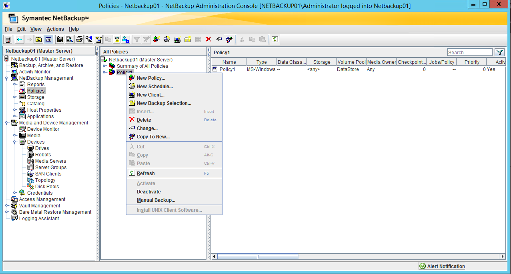

2. In the **Add a New Policy** dialog box, enter a name for the policy, and then select the **Use Policy Configuration Wizard** check box. Select **OK**.

   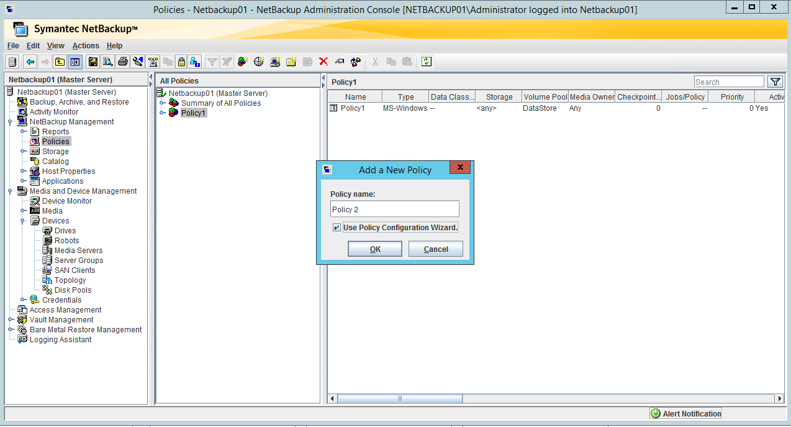

3. In the Backup Policy Configuration Wizard, elect the backup type you want, and then select **Next**.

   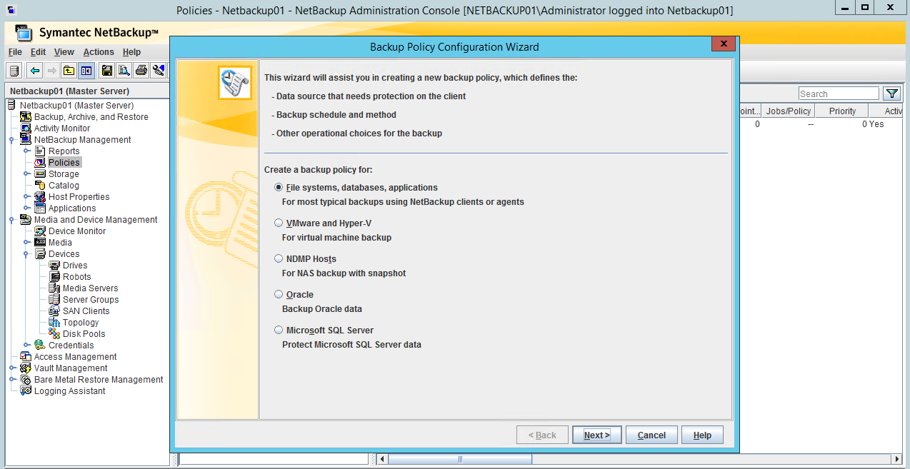

4. To set the policy type, select **Standard**, and then select **Next**.

   

5. Select your host, select the **Detect client operating system** check box, and then select **Add**. Select **Next**.

   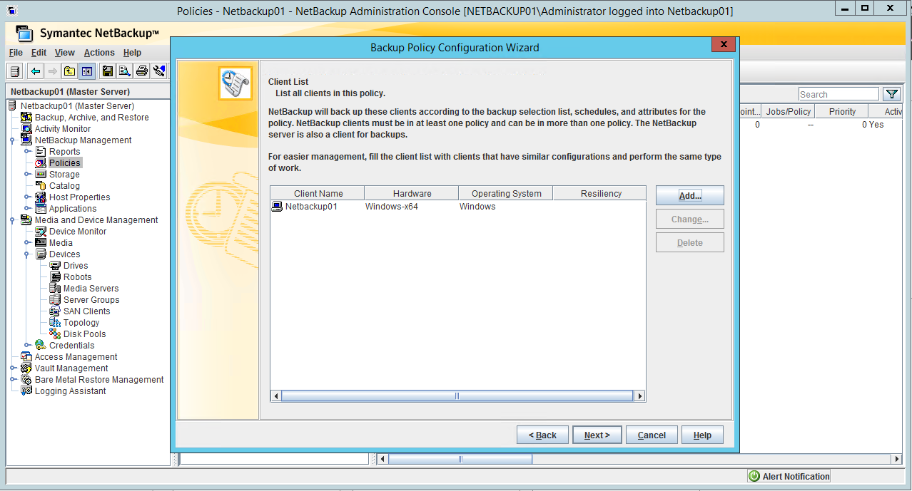

6. Select the drives you want to back up.

   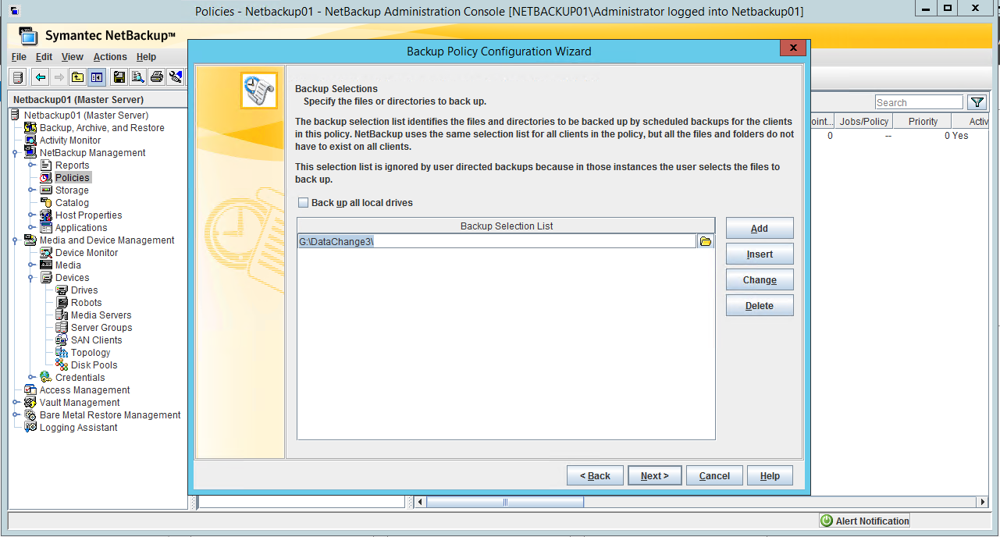

7. Select the frequency and retention values that meet your backup rotation requirements.

   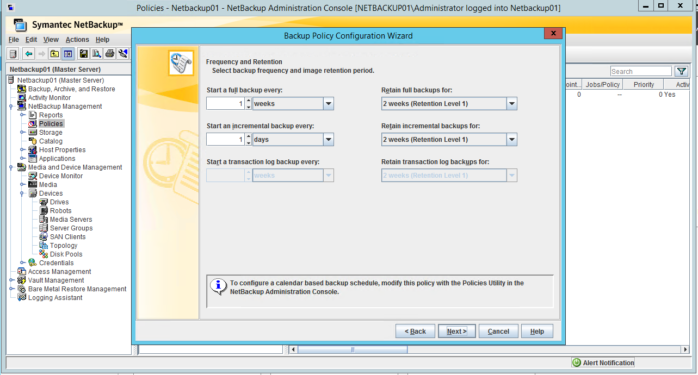

8. Select **Next** > **Next** > **Finish**.  You can modify the schedule after the policy is created.

9. Select to expand the policy you just created, and then select **Schedules**.

   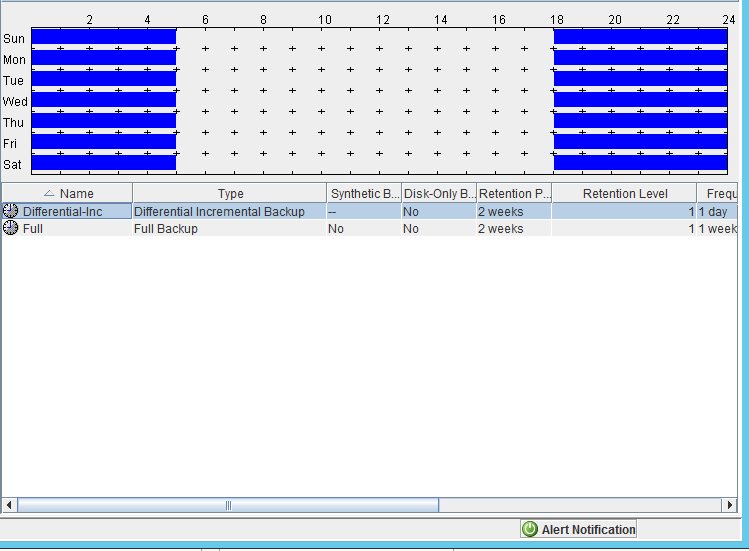

10. Right-click **Differential-Inc**, select **Copy to new**, and then select **OK**.

    

11. Right-click the newly created schedule, and then select **Change**.

12. On the **Attributes** tab, select the **Override policy storage selection** check box, and then select the volume where Monday incremental backups go.

    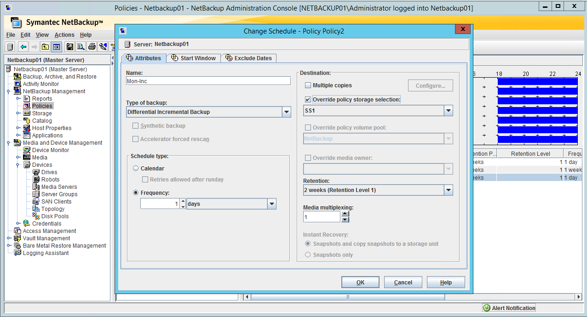

13. On the **Start Window** tab, select the time window for your backups.

    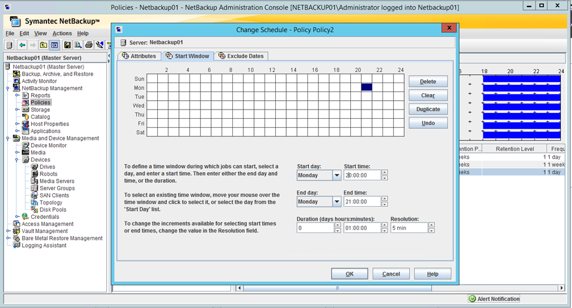

14. Select **OK**.

15. Repeat steps 10-14 for each incremental backup. Select the appropriate volume and schedule for each backup you create.

16. Right-click the **Differential-Inc** schedule, and then delete it.

17. Modify your Full schedule to meet your backup needs.

    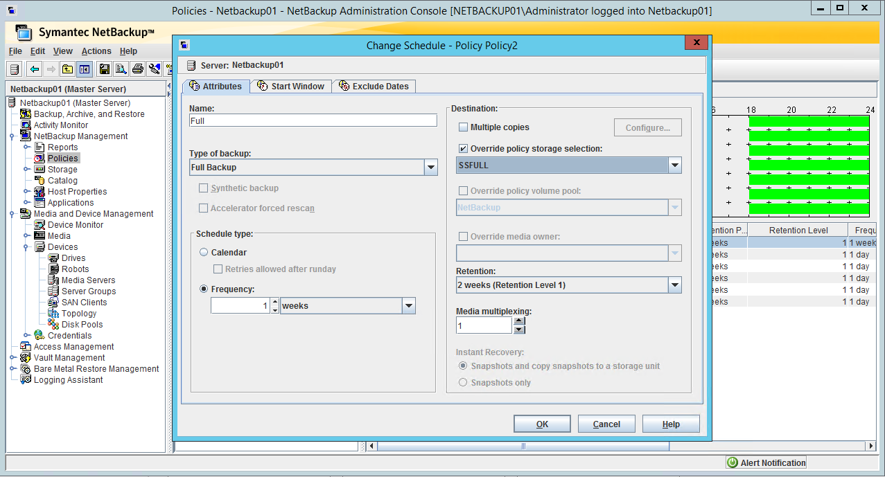

18. Change the start window.

    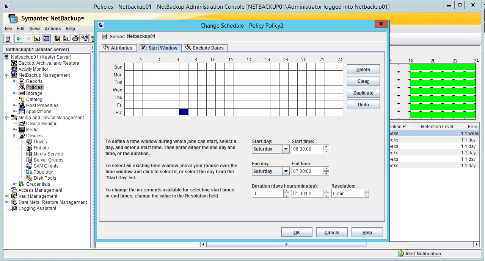

19. The final schedule looks like this:

    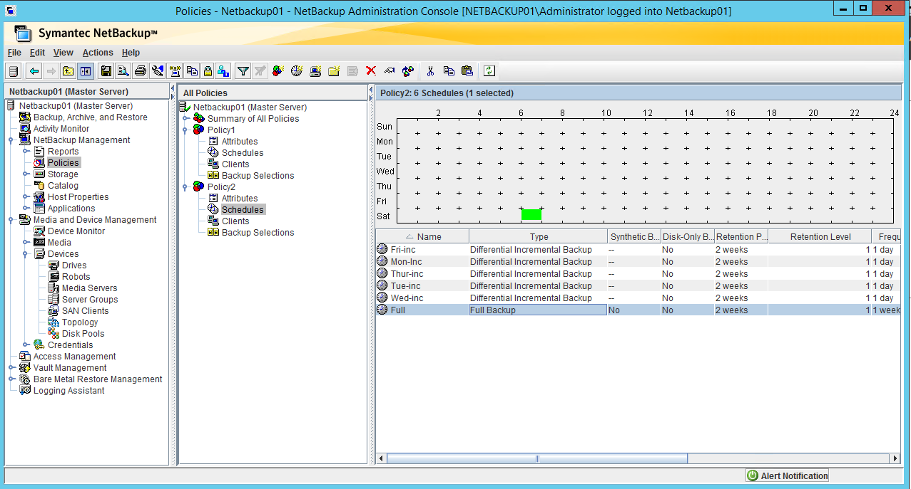

## Set up StorSimple as a secondary backup target

> [!NOTE]
>Data restores from a backup that has been tiered to the cloud occur at cloud speeds.

In this model, you must have a storage media (other than StorSimple) to serve as a temporary cache. For example, you can use a redundant array of independent disks (RAID) volume to accommodate space, input/output (I/O), and bandwidth. We recommend using RAID 5, 50, and 10.

The following figure shows typical short-term retention local (to the server) volumes and long-term retention archives volumes. In this scenario, all backups run on the local (to the server) RAID volume. These backups are periodically duplicated and archived to an archives volume. It is important to size your local (to the server) RAID volume so that it can handle your short-term retention capacity and performance requirements.

### StorSimple as a secondary backup target GFS example


The following table shows how to set up backups to run on the local and StorSimple disks. It includes individual and total capacity requirements.

### Backup configuration and capacity requirements

| Backup type and retention | Configured storage | Size (TiB) | GFS multiplier | Total capacity\* (TiB) |
|---|---|---|---|---|
| Week 1 (full and incremental) |Local disk (short-term)| 1 | 1 | 1 |
| StorSimple weeks 2-4 |StorSimple disk (long-term) | 1 | 4 | 4 |
| Monthly full |StorSimple disk (long-term) | 1 | 12 | 12 |
| Yearly full |StorSimple disk (long-term) | 1 | 1 | 1 |
|GFS volumes size requirement |  |  |  | 18*|

\* Total capacity includes 17 TiB of StorSimple disks and 1 TiB of local RAID volume.


### GFS example schedule: GFS rotation weekly, monthly, and yearly schedule

| Week | Full | Incremental day 1 | Incremental day 2 | Incremental day 3 | Incremental day 4 | Incremental day 5 |
|---|---|---|---|---|---|---|
| Week 1 | Local RAID volume  | Local RAID volume | Local RAID volume | Local RAID volume | Local RAID volume | Local RAID volume |
| Week 2 | StorSimple weeks 2-4 |   |   |   |   |   |
| Week 3 | StorSimple weeks 2-4 |   |   |   |   |   |
| Week 4 | StorSimple weeks 2-4 |   |   |   |   |   |
| Monthly | StorSimple monthly |   |   |   |   |   |
| Yearly | StorSimple yearly  |   |   |   |   |   |


## Assign StorSimple volumes to a NetBackup archive and duplication job

Because NetBackup offers a wide range of options for storage and media management, we recommend that you consult with Veritas or your NetBackup architect to properly assess your storage lifecycle policy (SLP) requirements.

After you've defined the initial disk pools, you need to define three additional storage lifecycle policies, for a total of four policies:
* LocalRAIDVolume
* StorSimpleWeek2-4
* StorSimpleMonthlyFulls
* StorSimpleYearlyFulls

### To assign StorSimple volumes to a NetBackup archive and duplication job

1. In the NetBackup Administration Console, select **Storage** > **Storage Lifecycle Policies** > **New Storage Lifecycle Policy**.

   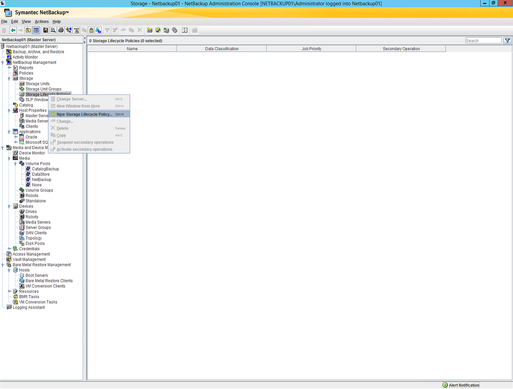

2. Enter a name for the snapshot, and then select **Add**.

3. In the **New Operation** dialog box, on the **Properties** tab, for **Operation**, select **Backup**. Select the values you want for **Destination storage**, **Retention type**, and **Retention period**. Select **OK**.

   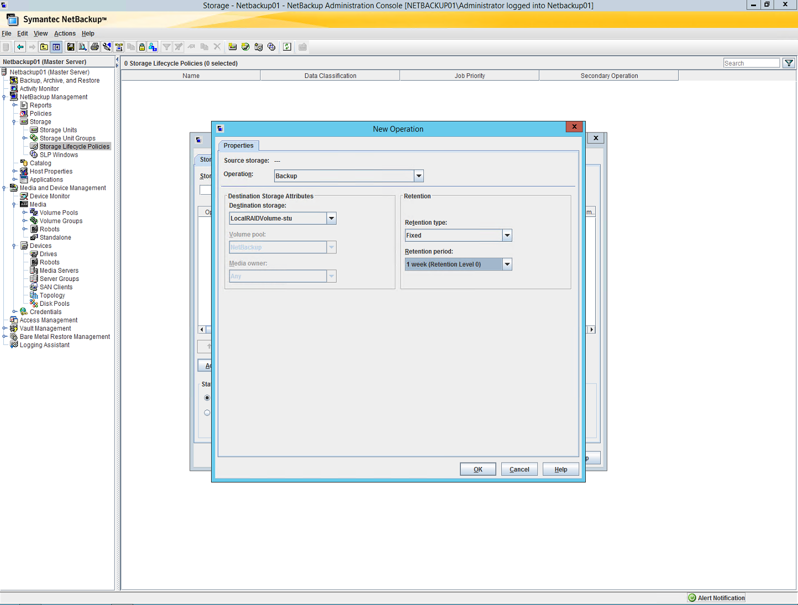

   This defines the first backup operation and repository.

4. Select to highlight the previous operation, and then select **Add**. In the **Change Storage Operation** dialog box, select the values you want for **Destination storage**, **Retention type**, and **Retention period**.

   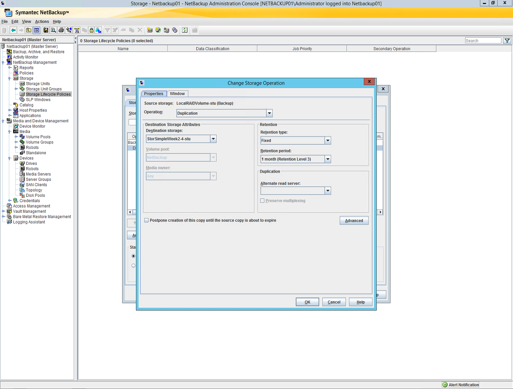

5. Select to highlight the previous operation, and then select **Add**. In the **New Storage Lifecycle Policy** dialog box, add monthly backups for a year.

   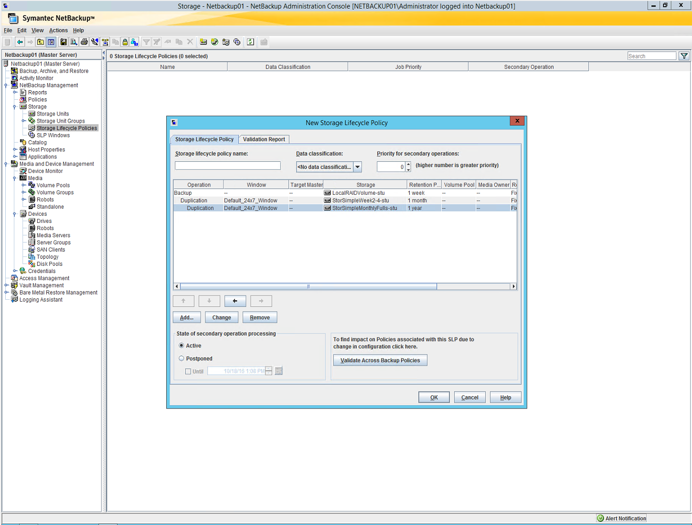

6. Repeat steps 4-5 until you've created the comprehensive SLP retention policy that you need.

   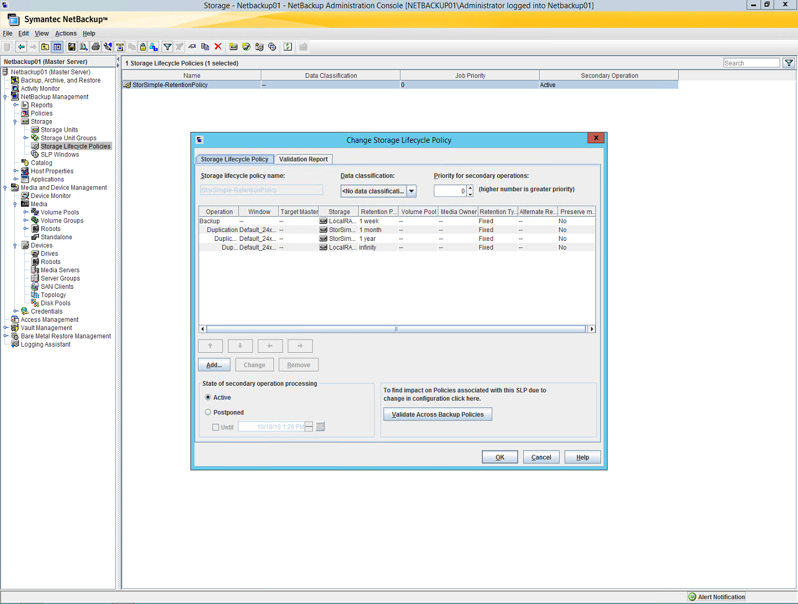

7. When you are finished defining your SLP retention policy, under **Policy**, define a backup policy by following the steps detailed in [Assigning StorSimple volumes to a NetBackup backup job](#assigning-storsimple-volumes-to-a-netbackup-backup-job).

8. Under **Schedules**, in the **Change Schedule** dialog box, right-click **Full**, and then select **Change**.

   

9. Select the **Override policy storage selection** check box, and then select the SLP retention policy that you created in steps 1-6.

   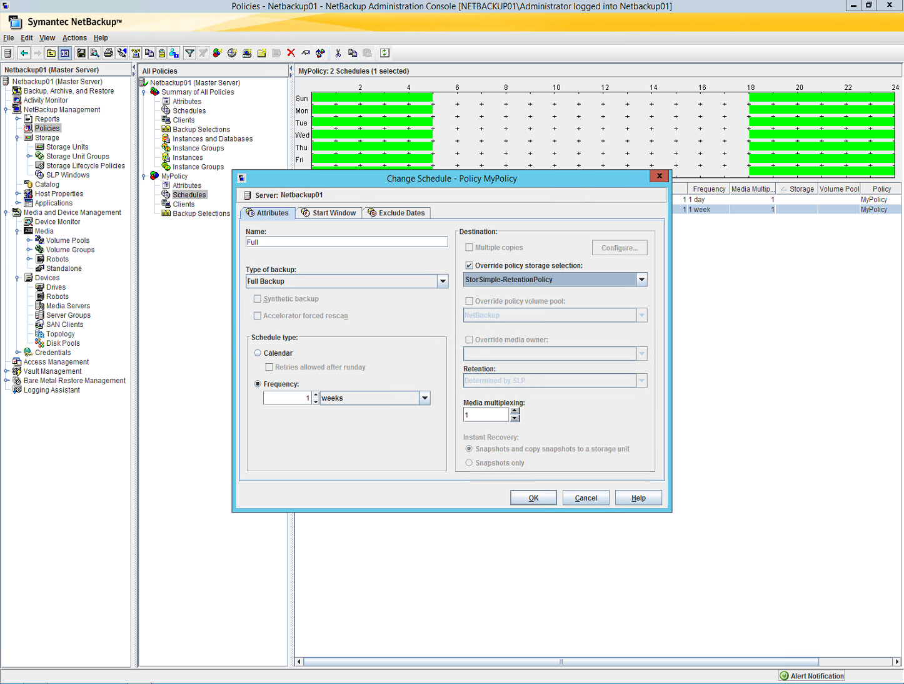

10. Select **OK**, and then repeat for the incremental backup schedule.

    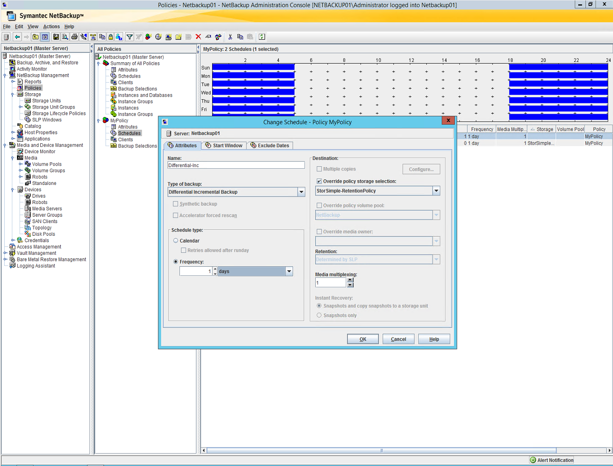


| Backup type retention | Size (TiB) | GFS multiplier\* | Total capacity (TiB)  |
|---|---|---|---|
| Weekly full |  1  |  4 | 4  |
| Daily incremental  | 0.5  | 20 (cycles are equal to the number of weeks per month) | 12 (2 for additional quota) |
| Monthly full  | 1 | 12 | 12 |
| Yearly full | 1  | 10 | 10 |
| GFS requirement  |     |     | 38 |
| Additional quota  | 4  |    | 42 total GFS requirement |

\* The GFS multiplier is the number of copies you need to protect and retain to meet your backup policy requirements.

## StorSimple cloud snapshots

StorSimple cloud snapshots protect the data that resides in your StorSimple device. Creating a cloud snapshot is equivalent to shipping local backup tapes to an offsite facility. If you use Azure geo-redundant storage, creating a cloud snapshot is equivalent to shipping backup tapes to multiple sites. If you need to restore a device after a disaster, you might bring another StorSimple device online and do a failover. After the failover, you would be able to access the data (at cloud speeds) from the most recent cloud snapshot.

The following section describes how to create a short script to start and delete StorSimple cloud snapshots during backup post-processing.

> [!NOTE]
> Snapshots that are manually or programmatically created do not follow the StorSimple snapshot expiration policy. These snapshots must be manually or programmatically deleted.

### Start and delete cloud snapshots by using a script

> [!NOTE]
> Carefully assess the compliance and data retention repercussions before you delete a StorSimple snapshot. For more information about how to run a post-backup script, see the [NetBackup documentation](http://www.veritas.com/docs/000094423).

### Backup lifecycle

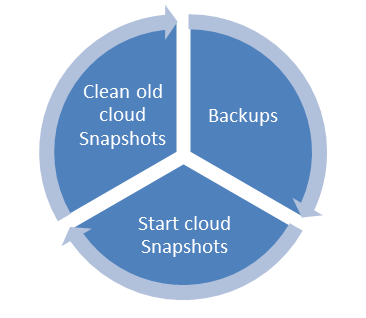

### Requirements

-   The server that runs the script must have access to Azure cloud resources.
-   The user account must have the necessary permissions.
-   A StorSimple backup policy with the associated StorSimple volumes must be set up but not turned on.
-   You'll need the StorSimple resource name, registration key, device name, and backup policy ID.

### To start or delete a cloud snapshot

1. [Install Azure PowerShell](/powershell/azure/overview).
2. Download and setup [Manage-CloudSnapshots.ps1](https://github.com/anoobbacker/storsimpledevicemgmttools/blob/master/Manage-CloudSnapshots.ps1) PowerShell script.
3. On the server that runs the script, run PowerShell as an administrator. Ensure that you run the script with `-WhatIf $true` to see what changes the script will make. Once the validation is complete, pass `-WhatIf $false`. Run the below command:
   ```powershell
   .\Manage-CloudSnapshots.ps1 -SubscriptionId [Subscription Id] -TenantId [Tenant ID] -ResourceGroupName [Resource Group Name] -ManagerName [StorSimple Device Manager Name] -DeviceName [device name] -BackupPolicyName [backup policyname] -RetentionInDays [Retention days] -WhatIf [$true or $false]
   ```
4. Add the script to your backup job in NetBackup. To do this, edit your NetBackup job options' pre-processing and post-processing commands.

> [!NOTE]
> We recommend that you run your StorSimple cloud snapshot backup policy as a post-processing script at the end of your daily backup job. For more information about how to back up and restore your backup application environment to help you meet your RPO and RTO, please consult with your backup architect.

## StorSimple as a restore source

Restores from a StorSimple device work like restores from any block storage device. Restores of data that is tiered to the cloud occurs at cloud speeds. For local data, restores occur at the local disk speed of the device. For information about how to perform a restore, see the [NetBackup documentation](http://www.veritas.com/docs/000094423). We recommend that you conform to NetBackup restore best practices.

## StorSimple failover and disaster recovery

> [!NOTE]
> For backup target scenarios, StorSimple Cloud Appliance is not supported as a restore target.

A disaster can be caused by a variety of factors. The following table lists common disaster recovery scenarios.

| Scenario | Impact | How to recover | Notes |
|---|---|---|---|
| StorSimple device failure | Backup and restore operations are interrupted. | Replace the failed device and perform [StorSimple failover and disaster recovery](storsimple-device-failover-disaster-recovery.md). | If you need to perform a restore after device recovery, full data working sets are retrieved from the cloud to the new device. All operations are at cloud speeds. The index and catalog rescanning process might cause all backup sets to be scanned and pulled from the cloud tier to the local device tier, which might be a time-consuming process. |
| NetBackup server failure | Backup and restore operations are interrupted. | Rebuild the backup server and perform database restore. | You must rebuild or restore the NetBackup server at the disaster recovery site. Restore the database to the most recent point. If the restored NetBackup database is not in sync with your latest backup jobs, indexing and cataloging is required. This index and catalog rescanning process might cause all backup sets to be scanned and pulled from the cloud tier to the local device tier. This makes it further time-intensive. |
| Site failure that results in the loss of both the backup server and StorSimple | Backup and restore operations are interrupted. | Restore StorSimple first, and then restore NetBackup. | Restore StorSimple first, and then restore NetBackup. If you need to perform a restore after device recovery, the full data working sets are retrieved from the cloud to the new device. All operations are at cloud speeds. |

## References

The following documents were referenced for this article:

- [StorSimple multipath I/O setup](storsimple-configure-mpio-windows-server.md)
- [Storage scenarios: Thin provisioning](https://msdn.microsoft.com/library/windows/hardware/dn265487.aspx)
- [Using GPT drives](https://msdn.microsoft.com/windows/hardware/gg463524.aspx#EHD)
- [Set up shadow copies for shared folders](https://technet.microsoft.com/library/cc771893.aspx)

## Next steps

- Learn more about how to [restore from a backup set](storsimple-restore-from-backup-set-u2.md).
- Learn more about how to perform [device failover and disaster recovery](storsimple-device-failover-disaster-recovery.md).
