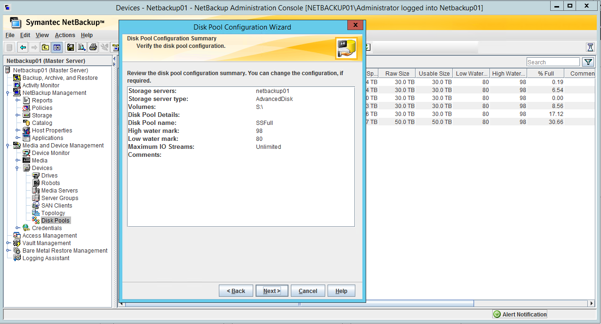
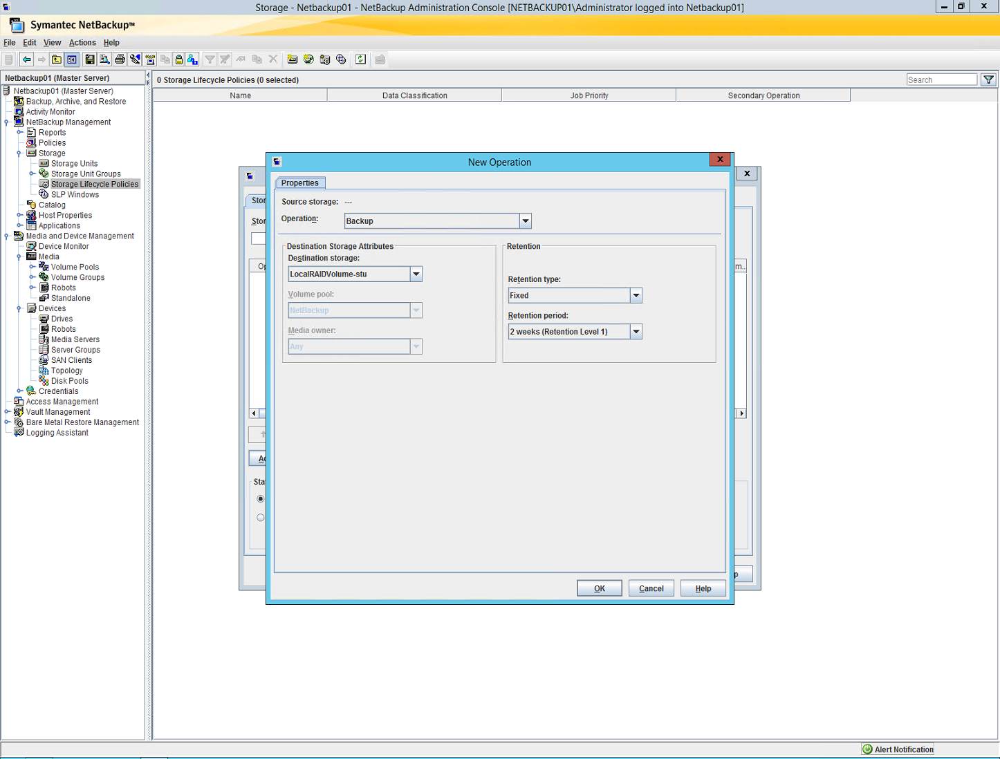

# Set up StorSimple with Veritas NetBackup

## Overview

Azure StorSimple is a hybrid cloud storage solution from Microsoft. StorSimple addresses the complexities of exponential data growth by using an Azure storage account as an extension of the on-premises solution, and automatically tiering data across on-premises storage and cloud storage.

In this article, we discuss StorSimple integration with Veritas NetBackup, and best practices for integrating both solutions. We also make recommendations on how to set up Veritas NetBackup to best integrate with StorSimple. We defer to Veritas best practices, backup architects, and administrators for the best way to set up Veritas NetBackup to meet individual backup requirements and service-level agreements (SLAs).

Although we illustrate configuration steps and key concepts, this article is by no means a step-by-step configuration or installation guide. We assume that the basic components and infrastructure are in working order and ready to support the concepts that we describe.

### Who should read this?

The information in this article will be most helpful to backup administrators, storage administrators, and storage architects who have knowledge of storage, Windows Server 2012 R2, Ethernet, cloud services, and Veritas NetBackup.

### Supported versions

-   NetBackup 7.7.x and later versions

-   [StorSimple Update 3 and later versions](storsimple-overview.md#storsimple-workload-summary)


## Why StorSimple as a backup target?

StorSimple is a good choice for a backup target because:

-   it provides standard, local storage for backup applications to use as a fast backup destination, without any changes. You also can use StorSimple for a quick restore of recent backups.

-   its cloud tiering is seamlessly integrated with an Azure cloud storage account to use cost-effective Azure storage.

-   it automatically provides offsite storage for disaster recovery.

## Key concepts

As with any storage solution, a careful assessment of the solution’s storage performance, SLAs, rate of change, and capacity growth needs is critical to success. The main idea is that by introducing a cloud tier, your access times and throughputs to the cloud play a fundamental role in the ability of StorSimple to do its job.

StorSimple is designed to provide storage to applications that operate on a well-defined working set of data (hot data). In this model, the working set of data is stored on the local tiers, and the remaining nonworking/cold/archived set of data is tiered to the cloud. This model is represented in the following figure. The nearly flat green line represents the data stored on the local tiers of the StorSimple device. The red line represents the total amount of data stored on the StorSimple solution across all tiers. The space between the flat green line and the exponential red curve represents the total amount of data stored in the cloud.

**StorSimple tiering**


With this architecture in mind, you will find that StorSimple is ideally suited to operate as a backup target. You can use StorSimple to:
-   perform your most frequent restores from the local working set of data.
-   use the cloud for offsite disaster recovery and older data, where restores are less frequent.

## StorSimple benefits

StorSimple provides an on-premises solution that is seamlessly integrated with Microsoft Azure, by taking advantage of seamless access to on-premises and cloud storage.

StorSimple uses automatic tiering between the on-premises device, which has solid-state device (SSD) and serial-attached SCSI (SAS) storage, and Azure Storage. Automatic tiering keeps frequently accessed data local, on the SSD and SAS tiers. It moves infrequently accessed data to Azure Storage.

StorSimple offers these benefits:

-   Unique deduplication and compression algorithms that use the cloud to achieve unprecedented deduplication levels
-   High availability
-   Geo-replication by leveraging Azure geo-replication
-   Azure integration
-   Data encryption in the cloud
-   Improved disaster recovery and compliance

Although StorSimple presents two main deployment scenarios (primary and secondary backup target), fundamentally, it's a plain block storage device. StorSimple does all the compression and deduplication, and it sends and retrieves data from the cloud seamlessly to both the application and the file system.

For more information about StorSimple, see [StorSimple 8000 series: Hybrid cloud storage solution](storsimple-overview.md) and review the [technical StorSimple 8000 series specifications](storsimple-technical-specifications-and-compliance.md).

> [!IMPORTANT]
> Using a StorSimple device as a backup target is supported only for StorSimple 8000 Update 3 or later versions.

## Architecture overview

The following tables show the appliance model-to-architecture initial guidance.

**StorSimple capacities for local and cloud storage**


| Storage capacity       | 8100          | 8600            |
|------------------------|---------------|-----------------|
| Local storage capacity | &lt; 10 TiB\*  | &lt; 20 TiB\*  |
| Cloud storage capacity | &gt; 200 TiB\* | &gt; 500 TiB\* |

\* Storage size assumes no deduplication or compression.

**StorSimple capacities for primary and secondary backups**


| Backup scenario  | Local storage capacity                                         | Cloud storage capacity                      |
|------------------|----------------------------------------------------------------|---------------------------------------------|
| Primary backup   | Recent backups stored on local storage for fast recovery (RPO) | Backup history (RPO) fits in cloud capacity |
| Secondary backup | Secondary copy of backup data can be stored in cloud capacity  | N/A  |

## StorSimple as a primary backup target

In this scenario, StorSimple volumes are presented to the backup application as the sole repository for backups. The following figure shows a solution architecture in which all backups use StorSimple tiered volumes for backups and restores.


### Primary target backup logical steps

1.  The backup server contacts the target backup agent, and then the backup agent transmits data to the backup server.

2.  The backup server writes data to the StorSimple tiered volumes.

3.  The backup server updates the catalog database, and then finishes the backup job.

4.  A snapshot script triggers the StorSimple Snapshot Manager (Start-Delete).

5.  Based on a retention policy, the backup server deletes expired backups.

###  Primary target restore logical steps

1.  The backup server starts restoring the appropriate data from the storage repository.

2.  The backup agent receives the data from the backup server.

3.  The backup server finishes the restore job.

## StorSimple as a secondary backup target

In this scenario, StorSimple volumes primarily are used for long-term retention or archiving.

The following figure shows an architecture in which initial backups and restores target a high-performance volume. These backups are copied and archived to a StorSimple tiered volume on a set schedule.

It is important to size your high-performance volume to be able to handle the retention policy capacity and performance requirements.


### Secondary target backup logical steps

1.  The backup server contacts the target backup agent, and then the backup agent transmits data to the backup server.

2.  The backup server writes data to high-performance storage.

3.  The backup server updates the catalog database, and then finishes the backup job.

4.  Based on a retention policy, the backup server copies backups to StorSimple.

5.  A snapshot script triggers StorSimple Snapshot Manager (Start-Delete).

6.  Based on a retention policy, the backup server deletes the expired backups.

### Secondary target restore logical steps

1.  The backup server starts restoring the appropriate data from the storage repository.

2.  The backup agent receives the data from the backup server.

3.  The backup server finishes the restore job.

## Deploy the solution

To deploy this solution, complete these three steps: prepare the network infrastructure, deploy your StorSimple device as a backup target, and deploy Veritas NetBackup. Each step is discussed in detail in the following sections.

### Configure the network

StorSimple as an integrated solution with the Azure cloud requires an active and working connection to the Azure cloud. This connection is used for operations like cloud snapshots, management, and metadata transfer, and to tier older, less accessed data to Azure cloud storage.

For the solution to perform optimally, we recommend that you follow these networking best practices:

-   The link that connects the StorSimple tiering to Azure must meet your bandwidth requirements by applying the proper the Quality of Service (QoS) level to your infrastructure switches to match your recovery point objective (RPO) and recovery time objective (RTO) SLAs.

-   Maximum Azure Blob storage access latencies should be around 80 ms.

### Deploy StorSimple

For step-by-step StorSimple deployment guidance, see [Deploy your on-premises StorSimple device](storsimple-deployment-walkthrough-u2.md).

### Deploy NetBackup

You'll find a step-by-step NetBackup 7.7.x deployment guidance at [NetBackup 7.7.x Documentation](https://www.veritas.com/support/article.000094423).

## Set up the solution

In this section, we demonstrate some configuration examples. The following examples and recommendations illustrate the most basic and fundamental implementation. This implementation might not apply directly to your specific backup requirements.

### Set up StorSimple

| StorSimple deployment tasks  | Additional comments |
|---|---|
| Deploy your on-premises StorSimple device. | Supported versions: Update 3 and later versions. |
| Turn on the backup target. | Use these commands to turn on or turn off backup target mode, and to get status. For more information, see [connect remotely to a StorSimple](storsimple-remote-connect.md).</br> To turn on backup mode: `Set-HCSBackupApplianceMode -enable`. </br>  To turn off backup mode: `Set-HCSBackupApplianceMode -disable`. </br> To get the current state of backup mode settings: `Get-HCSBackupApplianceMode`. |
| Create a common volume container for your volume that stores the backup data. All data in a volume container is deduplicated. | StorSimple volume containers define deduplication domains.  |
| Create StorSimple volumes | Create volumes with sizes as close to the anticipated usage as possible, because volume size affects cloud snapshot duration time. For more information about how to size a volume, see [Retention policies](#retention-policies).</br> </br> Use StorSimple tiered volumes and select the **Use this volume for less frequently accessed archival data** check box. </br> Using locally pinned volumes only is not supported.|
| Create a unique StorSimple backup policy for all the backup target volumes. | A StorSimple backup policy defines the volume consistency group. |
| Disable the schedule as the snapshots. | Snapshots are triggered as a post-processing operation. |

### Set up the host backup server storage

Set up the host backup server storage by using these guidelines:  

- Don't use spanned volumes (created by Windows Disk manager); they are not supported.
- Format your volumes using NTFS with 64 KB allocation size.
- Map the StorSimple volumes directly to the “Veeam” server.
    - Use iSCSI for physical servers.
    - Use pass-through disks for virtual servers.


## Best practices for StorSimple and NetBackup

Configure your solution per the guidelines in the next few sections.

### Operating system

-   Disable Windows Server encryption and deduplication for the NTFS file system.

-   Disable Windows Server defragmentation on the StorSimple volumes.

-   Disable Windows Server indexing on the StorSimple volumes.

-   Run an antivirus scan at the source host (not against the StorSimple volumes).

-   Turn off the default [Windows Server maintenance](https://msdn.microsoft.com/library/windows/desktop/hh848037.aspx) in Task Manager.

    - Turn off the Maintenance configurator in Windows Task Scheduler.

        Or

    - Download [PSEXEC – Microsoft Sysinternals](https://technet.microsoft.com/sysinternals/bb897553.aspx).

      - After you download PSEXEC, run Windows PowerShell as an administrator, and type:
      ```psexec \\%computername% -s schtasks /change /tn “MicrosoftWindowsTaskSchedulerMaintenance Configurator" /disable
      ```

### StorSimple

-   Be sure that the StorSimple device is updated to [Update 3 or later](storsimple-install-update-3.md).

-   Isolate iSCSI and cloud traffic. Use dedicated iSCSI connections for traffic between StorSimple and backup server.

-   Be sure that your StorSimple device is a dedicated backup target. Mixed workloads are not supported because they affect your RTO and RPO.

### NetBackup

-   NetBackup database should be local to the server and not reside on a StorSimple volume.

-   For disaster recovery, back up the NetBackup database on a StorSimple volume.

-   We support NetBackup full and incremental backups for this solution. We recommend that you do not use synthetic and differential backups.

-   Backup data files should contain only the data for a specific job. For example, no media appends across different jobs are allowed.

For the latest NetBackup settings and best practices on implementing these requirements, refer to NetBackup’s documentation at [www.veritas.com](https://www.veritas.com).


## Retention policies

One of the most used backup retention policies is the Grandfather, Father, and Son (GFS) policy. In this policy, an incremental backup is performed daily. The full backups are done weekly and monthly. This policy results in six StorSimple tiered volumes:

-   One volume contains the weekly, monthly, and yearly full backups.

-   The other five volumes store daily incremental backups.

In the following example, we use a GFS rotation. The example assumes the following:

-   Non-deduped or compressed data is used.

-   Full backups are 1 TiB each.

-   Daily incremental backups are 500 GiB each.

-   Four weekly backups are kept for a month.

-   Twelve monthly backups are kept for a year.

-   One yearly backup is kept for 10 years.

Based on the preceding assumptions, create a 26 TiB StorSimple tiered volume for the monthly and yearly full backups. Create a 5 TiB StorSimple tiered volume for each of the incremental daily backups.

| Backup type retention | Size in TiB | GFS multiplier\*                                       | Total capacity in TiB          |
|---|---|---|---|
| Weekly full | 1 | 4  | 4 |
| Daily incremental | 0.5 | 20 (cycles equal number of weeks per month) | 12 (2 for additional quota) |
| Monthly full | 1 | 12 | 12 |
| Yearly full | 1  | 10 | 10 |
| GFS requirement |   | 38 |   |
| Additional quota  | 4  |   | 42 total GFS requirement  |

\*The GFS multiplier is the number of copies you need to protect and keep to meet your backup policies.

## Configure NetBackup storage


1.  In the NetBackup Administration Console, in the tree view in the left pane, select **Devices**. In the Disk Pool Configuration Wizard, select the storage server type **AdvancedDisk**, and then click **Next**.

    

2.  Select your server, and then select **Next**.

    

3.  Select your StorSimple volume.

    

4.  Enter a name for your backup target, and then select **Next** > **Next** to finish the wizard.

    

5.  Review the settings, and then select **Finish**.

    a.  At the end of each assignment, change the storage device settings to match those recommended in the best practices list.

    b.  Repeat steps 1-4 until you are finished assigning your StorSimple volumes.

    

## StorSimple as a primary backup target

> [!NOTE]
> Be aware that if you need to restore data from a backup that has been tiered to the cloud, the restore occurs at cloud speeds.

The following figure shows the mapping of a typical volume to a backup job. In this case, all the weekly backups map to the Saturday Full disk, and the incremental backups map to Monday-Friday Incremental disks. All the backups and restores happen from a StorSimple tiered volume.


#### StorSimple as a primary backup target Grandfather, Father, and Son (GFS) schedule example

| GFS rotation schedule for four weeks, monthly, and yearly |  |  |   
|---|---|---|
| Frequency/backup type | Full | Incremental (day 1 - 5)  |
| Weekly (week 1 - 4) | Saturday | Monday - Friday |
| Monthly  | Saturday  |   |
| Yearly | Saturday  |   |   |


### Assigning StorSimple volumes to a NetBackup backup job

The following sequence assumes that NetBackup and the target host are configured in accordance with the NetBackup agent guidelines.

1.  In the NetBackup Administration Console, right-click **Policies**, and then select **New Policy**.

    

2.  In the **Add a New Policy** dialog box, enter a name for your policy, and then select the **Use Policy Configuration Wizard" check box. Select **OK**.

    

3.  Select the appropriate backup type (for example, **File Systems**), and then select **Next**.

    

4.  To select the policy type, select **Standard**.

    

5.  Select your host, select the **Detect client operating system** check box, and then select Add. Select **Next**.

    

6.  Select the drive(s) you want to back up (for example, **G:\\DataChange3\\**).

    

8.  Select the frequency and retention values that meets your backup rotation requirements.

    

9.  Select **Next** > **Next** > **Finish**.  You can modify the schedule after the policy is created.

10.  Click to expand the policy you just created, and then select **Schedules**.

    

11.  Right-click Differential-Inc, select **Copy to new** (for example, Mon-inc), and then click **OK**.

    

12.  Right-click the newly created schedule, and then select **Change**.

13.  On the **Attributes** tab,  check **Override policy storage selection**, and then select the volume where Monday incremental backups go. (In our example, **SS1**.)

    

14.  On the **Start Window** tab, select the window for your backups. (For example, Mondays from 8 PM to 9 PM.)

    

15.  Select **OK**.

16.  Repeat steps 11-15 for each of the incremental backups. Select the appropriate volume and schedule.

17.  Right-click the Differential-Inc schedule, and then delete it.

18.  Modify your Full schedule to meet your backup needs.

    

19.  Change the start window. (For example, Saturday 6 AM.)

    

20.  The final schedule looks like this:

    

## StorSimple as a secondary backup target

> [!NOTE]
> Be aware that if you need to restore data from a backup that has been tiered to the cloud, the restore occurs at cloud speeds.

In this model, you must have a storage media (other than StorSimple) to serve as a temporary cache. For example, you could use a RAID volume to accommodate space, IOs, and bandwidth. We recommend using RAID 5, 50, and 10.

In the following figure, we illustrate typical short retention local (to the server) volumes and long-term retention archive volumes. In this case, all the backups run on the local (to the server) RAID volume. These backups are periodically duplicated and archived to an archive volume. It is important to size your local (to the server) RAID volume to handle the short-term retention capacity and performance requirements.

#### StorSimple as a secondary backup target GFS example


The following table illustrates how the backups should be configured to run on the local and StorSimple disks including the individual and the total capacity requirements.

#### Backup configuration and capacity requirements

| Backup type and retention | Configured storage | Size (TiB) | GFS multiplier | Total capacity (TiB) |
|---|---|---|---|---|
| Week 1 (full and incremental) |Local disk (short term)| 1 | 1 | 1 |
| StorSimple weeks 2-4 |StorSimple disk (long term) | 1 | 4 | 4 |
| Monthly full |StorSimple disk (long term) | 1 | 12 | 12 |
| Yearly full |StorSimple disk (long term) | 1 | 1 | 1 |
|GFS volumes size requirement |  |  |  | 18*|

\* the total capacity includes 17 TiB of StorSimple disks and 1 TiB of local RAID volume


#### GFS example schedule

|GFS rotation Weekly, Monthly, and Yearly schedule|   |    |    |   |   |   |
|---|---|---|---|---|---|---|
| Week | Full | Incremental day 1 | Incremental day 2 | Incremental day 3 | Incremental day 4 | Incremental Day 5 |
| Week 1 | Local RAID volume  | Local RAID volume | Local RAID volume | Local RAID volume | Local RAID volume | Local RAID volume |
| Week 2 | StorSimple Week 2-4 |   |   |   |   |   |
| Week 3 | StorSimple Week 2-4 |   |   |   |   |   |
| Week 4 | StorSimple Week 2-4 |   |   |   |   |   |
| Monthly | StorSimple Monthly |   |   |   |   |   |
| Yearly | StorSimple Yearly  |   |   |   |   |   |   |


### Assign StorSimple volumes to a NetBackup archive/duplication job

Because of the broad range of options for storage and media management that NetBackup offers, we recommend that you consult with Veritas or your NetBackup architect to properly assess the SLP requirements.

After you've defined the initial disk pools, you need to define three additional storage lifecycle policies:
* LocalRAIDVolume
* StorSimpleWeek2-4
* StorSimpleMonthlyFulls
* StorSimpleYearlyFulls


1.  In the Administration Console, under **Storage**, select **Storage Lifecycle Policies**, and then select **New Storage Lifecycle Policy**.

    

2.  Select a name, and then click **Add**.

    

3.  On the **Properties** tab, select **Backup**, **Destination Storage**, and the  retention you want. Click **OK**. In our case LocalRAIDVolume and one week retention.

    

4.  This defined the first backup operation/repository

5.  While highlighting the previous operation, click Add, and select the Destination Storage, and proper retention. In our case from LocalRAIDVolume to StorSimpleWeek2-4, and a 1 month retention

    

6.  While Highlighting the previous Operation select Add, now adding the monthly backups for a year

    

7.  Repeat steps 5-6 until you have the appropriate SLP-retention policy.

    

8.  Once you are done defining the appropriate SLP-Retention Policy, under Policy define a backup policy as illustrated on StorSimple as a Primary Target section.

9.  Under the Schedules select the Full and right-click, and select Change.

    

10.  The select Overwrite policy storage selection, and select the SLP you created on steps 1-8

    

11.  Click **OK**. Repeat for the Incremental backup schedule.

    

12.  Click **OK**, and then repeat for the incremental backup schedule.

| Backup type retention | Size (TiB) | GFS multiplier\* | Total capacity (TiB)  |
|---|---|---|---|
| Weekly full |  1  |  4 | 4  |
| Daily incremental  | 0.5  | 20 “cycles are equal to the number of weeks per month” | 12 (2 for additional quota) |
| Monthly full  | 1 | 12 | 12 |
| Yearly full | 1  | 10 | 10 |
| GFS requirement  |     |     | 38 |
| Additional quota  | 4  |    | 42 total GFS requirement |
\*The GFS multiplier is the number of copies you need to protect and keep to meet your backup policy requirements.

### StorSimple cloud snapshots

StorSimple cloud snapshots protect the data that resides in your StorSimple device. This is equivalent to shipping tapes to an offsite facility. If you use Azure geo-redundant storage, this is equivalent to shipping tapes to multiple sites. If a device restore was needed after a disaster, you could bring another StorSimple device online and do a failover. After the failover, you would be able to access the data (at cloud speeds) from the most recent cloud snapshot.

The following section describes how to create a short script to trigger and delete StorSimple cloud snapshots during backup post-processing.

> [!NOTE]
> Snapshots that are manually or programmatically created do not follow the StorSimple snapshot expiration policy. These must be manually or programmatically deleted.

### Start or delete cloud snapshots by using a script

> [!NOTE]
> Carefully assess the compliance and data retention repercussions before you delete a StorSimple snapshot. For more information about how to run a post-backup script, see [NetBackup documentation](https://www.veritas.com/support/article.000094423).

#### Backup lifecycle


#### Requirements

-   The server that runs the script must have access to Azure cloud resources.

-   The user account must have the necessary permissions.

-   A StorSimple backup policy with the associated StorSimple volumes must be set up but not turned on.

-   You'll need the StorSimple resource name, registration key, device name, and backup policy ID.

#### Steps

1.  [Install Azure PowerShell](/powershell-install-configure/).

2.  [Download and import publish Settings and subscription information.](https://msdn.microsoft.com/library/dn385850.aspx)

3.  In the Azure classic portal, get the resource name and [registration key for your StorSimple Manager service](storsimple-deployment-walkthrough-u2.md#step-2-get-the-service-registration-key).

4.  On the server that runs the script, run Windows PowerShell as Administrator. Type this command:

 `Get-AzureStorSimpleDeviceBackupPolicy –DeviceName <device name>`

    Make a note of the Backup Policy ID.

5.  In Notepad, create a new Windows PowerShell script by using the following code.

    Copy and paste this code snippet:
      ```
      Import-AzurePublishSettingsFile "c:\\CloudSnapshot Snapshot\\myAzureSettings.publishsettings"
      Disable-AzureDataCollection
      $ApplianceName = <myStorSimpleApplianceName>
      $RetentionInDays = 20
      $RetentionInDays = -$RetentionInDays
      $Today = Get-Date
      $ExpirationDate = $Today.AddDays($RetentionInDays)
      Select-AzureStorSimpleResource -ResourceName "myResource" –RegistrationKey
      Start-AzureStorSimpleDeviceBackupJob –DeviceName $ApplianceName -BackupType CloudSnapshot -BackupPolicyId <BackupId> -Verbose
      $CompletedSnapshots =@()
      $CompletedSnapshots = Get-AzureStorSimpleDeviceBackup -DeviceName $ApplianceName
      Write-Host "The Expiration date is " $ExpirationDate
      Write-Host

      ForEach ($SnapShot in $CompletedSnapshots)
      {
          $SnapshotStartTimeStamp = $Snapshot.CreatedOn
          if ($SnapshotStartTimeStamp -lt $ExpirationDate)

          {
              $SnapShotInstanceID = $SnapShot.InstanceId
              Write-Host "This snpashotdate was created on " $SnapshotStartTimeStamp.Date.ToShortDateString()
              Write-Host "Instance ID " $SnapShotInstanceID
              Write-Host "This snpashotdate is older and needs to be deleted"
              Write-host "\#\#\#\#\#\#\#\#\#\#\#\#\#\#\#\#\#\#\#\#\#"
              Remove-AzureStorSimpleDeviceBackup -DeviceName $ApplianceName -BackupId $SnapShotInstanceID -Force -Verbose
          }
      }

      ```
      Save the PowerShell script in the same location where you saved your Azure publish settings. For example, save as  C:\CloudSnapshot\StorSimpleCloudSnapshot.ps1.
6.  Add the script to your backup job in NetBackup. To do this, edit your NetBackup job options pre-post commands.

> [!NOTE]
> We recommend that you run your StorSimple cloud snapshot backup policy at the end of your daily backup’s job as a post-process script. For more information about how to back up and restore your backup application environment to meet your RPO and RTO, please consult with your backup architect.

## StorSimple as a restore source

Restores from a StorSimple work like restores from any block storage device. When restoring data that is tiered to the cloud, restores occur at cloud speeds. For local date, restores occur at the local disk speed of the device. For information about how to perform a restore, see [NetBackup documentation](https://www.veritas.com/support/article.000094423). Conform to NetBackup restore best practices.

## StorSimple failover and disaster recovery

> [!NOTE]
> For backup target scenarios, StorSimple Cloud Appliance is not supported as a restore target.

A disaster could be caused by a variety of factors. The following table lists common disaster recovery scenarios.

| Scenario | Impact | How to recover | Notes |
|---|---|---|---|
| StorSimple appliance failure  | Backup and restore operations will be interrupted. | Replace the failed appliance and perform [StorSimple failover and disaster recovery](storsimple-device-failover-disaster-recovery.md). | If there’s a need to perform a restore after appliance recovery, the full data working sets are being retrieved from the cloud to the new appliance, which will result in all operations to be at cloud speed rate. This indexing and cataloging rescanning process could cause all backup sets to be scanned and pulled from the cloud tier to local appliance tier, which might be a time-consuming process. |
| NetBackup server failure | Backup and restore operations are interrupted. | Rebuild the backup server and perform database restore. | The NetBackup server will need to be rebuilt or restored at the disaster recovery site. The database needs to be restored to the most recent point. If the restored NetBackup database is not in sync with your latest backup jobs, indexing and cataloging is required. This index and catalog rescanning process could cause all backup sets to be scanned and pulled from the cloud tier to the local device tier. This makes it further time-sensitive. |
| Site failure that results in the loss of both the backup server and StorSimple. | Backup and restore operations are interrupted. | First, restore StorSimple, and then restore NetBackup. | First, restore StorSimple, and then restore NetBackup. If there is a need to perform a restore after device recovery, the full data working sets are retrieved from the cloud to the new device. As a result, all operations are at cloud speed rate.|

## References

The following documents have been referenced in this article:

- [StorSimple MPIO setup](storsimple-configure-mpio-windows-server.md)

- [Storage scenarios: Thin provisioning](http://msdn.microsoft.com/library/windows/hardware/dn265487.aspx)

- [Using GPT drives](http://msdn.microsoft.com/windows/hardware/gg463524.aspx#EHD)

- [Enable and configure shadow copies for shared folders](http://technet.microsoft.com/library/cc771893.aspx)
