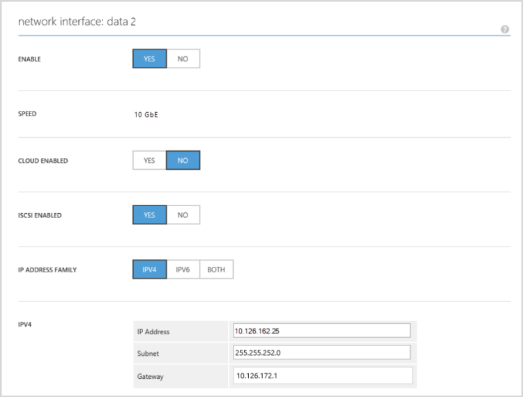
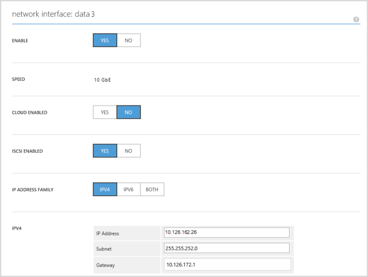
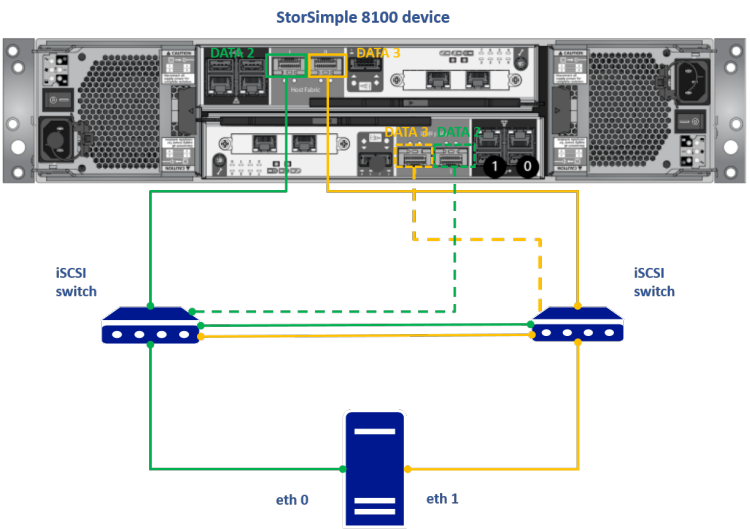

# Configure MPIO on a StorSimple host running CentOS
This article explains the steps required to configure Multipathing IO (MPIO) on your Centos 6.6 host server. The host server is connected to your Microsoft Azure StorSimple device for high availability via iSCSI initiators. It describes in detail the automatic discovery of multipath devices and the specific setup only for StorSimple volumes.

This procedure is applicable to all the models of StorSimple 8000 series devices.

> [!NOTE]
> This procedure cannot be used for a StorSimple Cloud Appliance. For more information, see how to configure host servers for your cloud appliance.


## About multipathing
The multipathing feature allows you to configure multiple I/O paths between a host server and a storage device. These I/O paths are physical SAN connections that can include separate cables, switches, network interfaces, and controllers. Multipathing aggregates the I/O paths, to configure a new device that is associated with all of the aggregated paths.

The purpose of multipathing is two-fold:

* **High availability**: It provides an alternate path if any element of the I/O path (such as a cable, switch, network interface, or controller) fails.
* **Load balancing**: Depending on the configuration of your storage device, it can improve the performance by detecting loads on the I/O paths and dynamically rebalancing those loads.

### About multipathing components
Multipathing in Linux consists of kernel components and user-space components as tabulated below.

* **Kernel**: The main component is the *device-mapper* that reroutes I/O and supports failover for paths and path groups.

* **User-space**: These are *multipath-tools* that manage multipathed devices by instructing the device-mapper multipath module what to do. The tools consist of:
   
   * **Multipath**: lists and configures multipathed devices.
   * **Multipathd**: daemon that executes multipath and monitors the paths.
   * **Devmap-name**: provides a meaningful device-name to udev for devmaps.
   * **Kpartx**: maps linear devmaps to device partitions to make multipath maps partitionable.
   * **Multipath.conf**: configuration file for multipath daemon that is used to overwrite the built-in configuration table.

### About the multipath.conf configuration file
The configuration file `/etc/multipath.conf` makes many of the multipathing features user-configurable. The `multipath` command and the kernel daemon `multipathd` use information found in this file. The file is consulted only during the configuration of the multipath devices. Make sure that all changes are made before you run the `multipath` command. If you modify the file afterwards, you will need to stop and start multipathd again for the changes to take effect.

The multipath.conf has five sections:

- **System level defaults** *(defaults)*: You can override system level defaults.
- **Blacklisted devices** *(blacklist)*: You can specify the list of devices that should not be controlled by device-mapper.
- **Blacklist exceptions** *(blacklist_exceptions)*: You can identify specific devices to be treated as multipath devices even if listed in the blacklist.
- **Storage controller specific settings** *(devices)*: You can specify configuration settings that will be applied to devices that have Vendor and Product information.
- **Device specific settings** *(multipaths)*: You can use this section to fine-tune the configuration settings for individual LUNs.

## Configure multipathing on StorSimple connected to Linux host
A StorSimple device connected to a Linux host can be configured for high availability and load balancing. For example, if the Linux host has two interfaces connected to the SAN and the device has two interfaces connected to the SAN such that these interfaces are on the same subnet, then there will be 4 paths available. However, if each DATA interface on the device and host interface are on a different IP subnet (and not routable), then only 2 paths will be available. You can configure multipathing to automatically discover all the available paths, choose a load-balancing algorithm for those paths, apply specific configuration settings for StorSimple-only volumes, and then enable and verify multipathing.

The following procedure describes how to configure multipathing when a StorSimple device with two network interfaces is connected to a host with two network interfaces.

## Prerequisites
This section details the configuration prerequisites for CentOS server and your StorSimple device.

### On CentOS host
1. Make sure that your CentOS host has 2 network interfaces enabled. Type:
   
    `ifconfig`
   
    The following example shows the output when two network interfaces (`eth0` and `eth1`) are present on the host.
   
        [root@centosSS ~]# ifconfig
        eth0  Link encap:Ethernet  HWaddr 00:15:5D:A2:33:41  
          inet addr:10.126.162.65  Bcast:10.126.163.255  Mask:255.255.252.0
          inet6 addr: 2001:4898:4010:3012:215:5dff:fea2:3341/64 Scope:Global
          inet6 addr: fe80::215:5dff:fea2:3341/64 Scope:Link
          UP BROADCAST RUNNING MULTICAST  MTU:1500  Metric:1
         RX packets:36536 errors:0 dropped:0 overruns:0 frame:0
          TX packets:6312 errors:0 dropped:0 overruns:0 carrier:0
          collisions:0 txqueuelen:1000
          RX bytes:13994127 (13.3 MiB)  TX bytes:645654 (630.5 KiB)
   
        eth1  Link encap:Ethernet  HWaddr 00:15:5D:A2:33:42  
          inet addr:10.126.162.66  Bcast:10.126.163.255  Mask:255.255.252.0
          inet6 addr: 2001:4898:4010:3012:215:5dff:fea2:3342/64 Scope:Global
          inet6 addr: fe80::215:5dff:fea2:3342/64 Scope:Link
          UP BROADCAST RUNNING MULTICAST  MTU:1500  Metric:1
          RX packets:25962 errors:0 dropped:0 overruns:0 frame:0
          TX packets:11 errors:0 dropped:0 overruns:0 carrier:0
          collisions:0 txqueuelen:1000
          RX bytes:2597350 (2.4 MiB)  TX bytes:754 (754.0 b)
   
        loLink encap:Local Loopback  
          inet addr:127.0.0.1  Mask:255.0.0.0
          inet6 addr: ::1/128 Scope:Host
          UP LOOPBACK RUNNING  MTU:65536  Metric:1
          RX packets:12 errors:0 dropped:0 overruns:0 frame:0
          TX packets:12 errors:0 dropped:0 overruns:0 carrier:0
          collisions:0 txqueuelen:0
          RX bytes:720 (720.0 b)  TX bytes:720 (720.0 b)
1. Install *iSCSI-initiator-utils* on your CentOS server. Perform the following steps to install *iSCSI-initiator-utils*.
   
   1. Log on as `root` into your CentOS host.
   1. Install the *iSCSI-initiator-utils*. Type:
      
       `yum install iscsi-initiator-utils`
   1. After the *iSCSI-Initiator-utils* is successfully installed, start the iSCSI service. Type:
      
       `service iscsid start`
      
       On occasions, `iscsid` may not actually start and the `--force` option may be needed
   1. To ensure that your iSCSI initiator is enabled during boot time, use the `chkconfig` command to enable the service.
      
       `chkconfig iscsi on`
   1. To verify that it was properly setup, run the command:
      
       `chkconfig --list | grep iscsi`
      
       A sample output is shown below.
      
           iscsi   0:off   1:off   2:on3:on4:on5:on6:off
           iscsid  0:off   1:off   2:on3:on4:on5:on6:off
      
       From the above example, you can see that your iSCSI environment will run on boot time on run levels 2, 3, 4, and 5.
1. Install *device-mapper-multipath*. Type:
   
    `yum install device-mapper-multipath`
   
    The installation will start. Type **Y** to continue when prompted for confirmation.

### On StorSimple device
Your StorSimple device should have:

* A minimum of two interfaces enabled for iSCSI. To verify that two interfaces are iSCSI-enabled on your StorSimple device, perform the following steps in the Azure classic portal for your StorSimple device:
  
  1. Log into the classic portal for your StorSimple device.
  1. Select your StorSimple Manager service, click **Devices** and choose the specific StorSimple device. Click **Configure** and verify the network interface settings. A screenshot with two iSCSI-enabled network interfaces is shown below. Here DATA 2 and DATA 3, both 10 GbE interfaces are enabled for iSCSI.
     
      
     
      
     
      In the **Configure** page
     
     1. Ensure that both network interfaces are iSCSI-enabled. The **iSCSI enabled** field should be set to **Yes**.
     1. Ensure that the network interfaces have the same speed, both should be 1 GbE or 10 GbE.
     1. Note the IPv4 addresses of the iSCSI-enabled interfaces and save for later use on the host.
* The iSCSI interfaces on your StorSimple device should be reachable from the CentOS server.
      To verify this, you need to provide the IP addresses of your StorSimple iSCSI-enabled network interfaces on your host server. The commands used and the corresponding output with DATA2 (10.126.162.25) and DATA3 (10.126.162.26) is shown below:
  
        [root@centosSS ~]# iscsiadm -m discovery -t sendtargets -p 10.126.162.25:3260
        10.126.162.25:3260,1 iqn.1991-05.com.microsoft:storsimple8100-shx0991003g44mt-target
        10.126.162.26:3260,1 iqn.1991-05.com.microsoft:storsimple8100-shx0991003g44mt-target

### Hardware configuration
We recommend that you connect the two iSCSI network interfaces on separate paths for redundancy. The figure below shows the recommended hardware configuration for high availability and load-balancing multipathing for your CentOS server and StorSimple device.



As shown in the preceding figure:

* Your StorSimple device is in an active-passive configuration with two controllers.
* Two SAN switches are connected to your device controllers.
* Two iSCSI initiators are enabled on your StorSimple device.
* Two network interfaces are enabled on your CentOS host.

The above configuration will yield 4 separate paths between your device and the host if the host and data interfaces are routable.

> [!IMPORTANT]
> * We recommend that you do not mix 1 GbE and 10 GbE network interfaces for multipathing. When using two network interfaces, both the interfaces should be the identical type.
> * On your StorSimple device, DATA0, DATA1, DATA4 and DATA5 are 1 GbE interfaces whereas DATA2 and DATA3 are 10 GbE network interfaces.|
> 
> 

## Configuration steps
The configuration steps for multipathing involve configuring the available paths for automatic discovery, specifying the load-balancing algorithm to use, enabling multipathing and finally verifying the configuration. Each of these steps is discussed in detail in the following sections.

### Step 1: Configure multipathing for automatic discovery
The multipath-supported devices can be automatically discovered and configured.

1. Initialize `/etc/multipath.conf` file. Type:
   
     `mpathconf --enable`
   
    The above command will create a `sample/etc/multipath.conf` file.
1. Start multipath service. Type:
   
    `service multipathd start`
   
    You will see the following output:
   
    `Starting multipathd daemon:`
1. Enable automatic discovery of multipaths. Type:
   
    `mpathconf --find_multipaths y`
   
    This will modify the defaults section of your `multipath.conf` as shown below:
   
        defaults {
        find_multipaths yes
        user_friendly_names yes
        path_grouping_policy multibus
        }

### Step 2: Configure multipathing for StorSimple volumes
By default, all devices are black listed in the multipath.conf file and will be bypassed. You will need to create blacklist exceptions to allow multipathing for volumes from StorSimple devices.

1. Edit the `/etc/mulitpath.conf` file. Type:
   
    `vi /etc/multipath.conf`
1. Locate the blacklist_exceptions section in the multipath.conf file. Your StorSimple device needs to be listed as a blacklist exception in this section. You can uncomment relevant lines in this file to modify it as shown below (use only the specific model of the device you are using):
   
        blacklist_exceptions {
            device {
                       vendor  "MSFT"
                       product "STORSIMPLE 8100*"
            }
            device {
                       vendor  "MSFT"
                       product "STORSIMPLE 8600*"
            }
           }

### Step 3: Configure round-robin multipathing
This load-balancing algorithm uses all the available multipaths to the active controller in a balanced, round-robin fashion.

1. Edit the `/etc/multipath.conf` file. Type:
   
    `vi /etc/multipath.conf`
1. Under the `defaults` section, set the `path_grouping_policy` to `multibus`. The `path_grouping_policy` specifies the default path grouping policy to apply to unspecified multipaths. The defaults section will look as shown below.
   
        defaults {
                user_friendly_names yes
                path_grouping_policy multibus
        }

> [!NOTE]
> The most common values of `path_grouping_policy` include:
> 
> * failover = 1 path per priority group
> * multibus = all valid paths in 1 priority group
> 
> 

### Step 4: Enable multipathing
1. Restart the `multipathd` daemon. Type:
   
    `service multipathd restart`
1. The output will be as shown below:
   
        [root@centosSS ~]# service multipathd start
        Starting multipathd daemon:  [OK]

### Step 5: Verify multipathing
1. First make sure that iSCSI connection is established with the StorSimple device as follows:
   
   a. Discover your StorSimple device. Type:
      
    ```
    iscsiadm -m discovery -t sendtargets -p  <IP address of network interface on the device>:<iSCSI port on StorSimple device>
    ```
    
    The output when IP address for DATA0 is 10.126.162.25 and port 3260 is opened on the StorSimple device for outbound iSCSI traffic is as shown below:
    
    ```
    10.126.162.25:3260,1 iqn.1991-05.com.microsoft:storsimple8100-shx0991003g00dv-target
    10.126.162.26:3260,1 iqn.1991-05.com.microsoft:storsimple8100-shx0991003g00dv-target
    ```

    Copy the IQN of your StorSimple device, `iqn.1991-05.com.microsoft:storsimple8100-shx0991003g00dv-target`, from the preceding output.

   b. Connect to the device using target IQN. The StorSimple device is the iSCSI target here. Type:

    ```
    iscsiadm -m node --login -T <IQN of iSCSI target>
    ```

    The following example shows output with a target IQN of `iqn.1991-05.com.microsoft:storsimple8100-shx0991003g00dv-target`. The output indicates that you have successfully connected to the two iSCSI-enabled network interfaces on your device.

    ```
    Logging in to [iface: eth0, target: iqn.1991-05.com.microsoft:storsimple8100-shx0991003g00dv-target, portal: 10.126.162.25,3260] (multiple)
    Logging in to [iface: eth1, target: iqn.1991-05.com.microsoft:storsimple8100-shx0991003g00dv-target, portal: 10.126.162.25,3260] (multiple)
    Logging in to [iface: eth0, target: iqn.1991-05.com.microsoft:storsimple8100-shx0991003g00dv-target, portal: 10.126.162.26,3260] (multiple)
    Logging in to [iface: eth1, target: iqn.1991-05.com.microsoft:storsimple8100-shx0991003g00dv-target, portal: 10.126.162.26,3260] (multiple)
    Login to [iface: eth0, target: iqn.1991-05.com.microsoft:storsimple8100-shx0991003g00dv-target, portal: 10.126.162.25,3260] successful.
    Login to [iface: eth1, target: iqn.1991-05.com.microsoft:storsimple8100-shx0991003g00dv-target, portal: 10.126.162.25,3260] successful.
    Login to [iface: eth0, target: iqn.1991-05.com.microsoft:storsimple8100-shx0991003g00dv-target, portal: 10.126.162.26,3260] successful.
    Login to [iface: eth1, target: iqn.1991-05.com.microsoft:storsimple8100-shx0991003g00dv-target, portal: 10.126.162.26,3260] successful.
    ```

    If you see only one host interface and two paths here, then you need to enable both the interfaces on host for iSCSI. You can follow the [detailed instructions in Linux documentation](https://access.redhat.com/documentation/Red_Hat_Enterprise_Linux/5/html/Online_Storage_Reconfiguration_Guide/iscsioffloadmain.html).

1. A volume is exposed to the CentOS server from the StorSimple device. For more information, see [Step 6: Create a volume](storsimple-8000-deployment-walkthrough-u2.md#step-6-create-a-volume) via the Azure portal on your StorSimple device.

1. Verify the available paths. Type:

      ```
      multipath -l
      ```

      The following example shows the output for two network interfaces on a StorSimple device connected to a single host network interface with two available paths.

        ```
        mpathb (36486fd20cc081f8dcd3fccb992d45a68) dm-3 MSFT,STORSIMPLE 8100
        size=100G features='0' hwhandler='0' wp=rw
        `-+- policy='round-robin 0' prio=0 status=active
        |- 7:0:0:1 sdc 8:32 active undef running
        `- 6:0:0:1 sdd 8:48 active undef running
        ```

        The following example shows the output for two network interfaces on a StorSimple device connected to two host network interfaces with four available paths.

        ```
        mpathb (36486fd27a23feba1b096226f11420f6b) dm-2 MSFT,STORSIMPLE 8100
        size=100G features='0' hwhandler='0' wp=rw
        `-+- policy='round-robin 0' prio=0 status=active
        |- 17:0:0:0 sdb 8:16 active undef running
        |- 15:0:0:0 sdd 8:48 active undef running
        |- 14:0:0:0 sdc 8:32 active undef running
        `- 16:0:0:0 sde 8:64 active undef running
        ```

        After the paths are configured, refer to the specific instructions on your host operating system (Centos 6.6) to mount and format this volume.

## Troubleshoot multipathing
This section provides some helpful tips if you run into any issues during multipathing configuration.

Q. I do not see the changes in `multipath.conf` file taking effect.

A. If you have made any changes to the `multipath.conf` file, you will need to restart the multipathing service. Type the following command:

    service multipathd restart

Q. I have enabled two network interfaces on the StorSimple device and two network interfaces on the host. When I list the available paths, I see only two paths. I expected to see four available paths.

A. Make sure that the two paths are on the same subnet and routable. If the network interfaces are on different vLANs and not routable, you will see only two paths. One way to verify this is to make sure that you can reach both the host interfaces from a network interface on the StorSimple device. You will need to [contact Microsoft Support](storsimple-8000-contact-microsoft-support.md) as this verification can only be done via a support session.

Q. When I list available paths, I do not see any output.

A. Typically, not seeing any multipathed paths suggests a problem with the multipathing daemon, and it's most likely that any problem here lies in the `multipath.conf` file.

It would also be worth checking that you can actually see some disks after connecting to the target, as no response from the multipath listings could also mean you don't have any disks.

* Use the following command to rescan the SCSI bus:
  
    `$ rescan-scsi-bus.sh` (part of sg3_utils package)
* Type the following commands:
  
    `$ dmesg | grep sd*`
     
     Or
  
    `$ fdisk -l`
  
    These will return details of recently added disks.
* To determine whether it is a StorSimple disk, use the following commands:
  
    `cat /sys/block/<DISK>/device/model`
  
    This will return a string, which will determine if it's a StorSimple disk.

A less likely but possible cause could also be stale iscsid pid. Use the following command to log off from the iSCSI sessions:

    iscsiadm -m node --logout -p <Target_IP>

Repeat this command for all the connected network interfaces on the iSCSI target, which is your StorSimple device. Once you have logged off from all the iSCSI sessions, use the iSCSI target IQN to reestablish the iSCSI session. Type the following command:

    iscsiadm -m node --login -T <TARGET_IQN>


Q. I am not sure if my device is whitelisted.

A. To verify whether your device is whitelisted, use the following troubleshooting interactive command:

    multipathd -k
    multipathd> show devices
    available block devices:
    ram0 devnode blacklisted, unmonitored
    ram1 devnode blacklisted, unmonitored
    ram2 devnode blacklisted, unmonitored
    ram3 devnode blacklisted, unmonitored
    ram4 devnode blacklisted, unmonitored
    ram5 devnode blacklisted, unmonitored
    ram6 devnode blacklisted, unmonitored
    ram7 devnode blacklisted, unmonitored
    ram8 devnode blacklisted, unmonitored
    ram9 devnode blacklisted, unmonitored
    ram10 devnode blacklisted, unmonitored
    ram11 devnode blacklisted, unmonitored
    ram12 devnode blacklisted, unmonitored
    ram13 devnode blacklisted, unmonitored
    ram14 devnode blacklisted, unmonitored
    ram15 devnode blacklisted, unmonitored
    loop0 devnode blacklisted, unmonitored
    loop1 devnode blacklisted, unmonitored
    loop2 devnode blacklisted, unmonitored
    loop3 devnode blacklisted, unmonitored
    loop4 devnode blacklisted, unmonitored
    loop5 devnode blacklisted, unmonitored
    loop6 devnode blacklisted, unmonitored
    loop7 devnode blacklisted, unmonitored
    sr0 devnode blacklisted, unmonitored
    sda devnode whitelisted, monitored
    dm-0 devnode blacklisted, unmonitored
    dm-1 devnode blacklisted, unmonitored
    dm-2 devnode blacklisted, unmonitored
    sdb devnode whitelisted, monitored
    sdc devnode whitelisted, monitored
    dm-3 devnode blacklisted, unmonitored


For more information, go to [troubleshooting for multipathing](https://access.redhat.com/documentation/en-us/red_hat_enterprise_linux/6/html/dm_multipath/mpio_admin-troubleshoot).

## List of useful commands
| Type | Command | Description |
| --- | --- | --- |
| **iSCSI** |`service iscsid start` |Start iSCSI service |
| &nbsp; |`service iscsid stop` |Stop iSCSI service |
| &nbsp; |`service iscsid restart` |Restart iSCSI service |
| &nbsp; |`iscsiadm -m discovery -t sendtargets -p <TARGET_IP>` |Discover available targets on the specified address |
| &nbsp; |`iscsiadm -m node --login -T <TARGET_IQN>` |Log in to the iSCSI target |
| &nbsp; |`iscsiadm -m node --logout -p <Target_IP>` |Log out from the iSCSI target |
| &nbsp; |`cat /etc/iscsi/initiatorname.iscsi` |Print iSCSI initiator name |
| &nbsp; |`iscsiadm -m session -s <sessionid> -P 3` |Check the state of the iSCSI session and volume discovered on the host |
| &nbsp; |`iscsi -m session` |Shows all the iSCSI sessions established between the host and the StorSimple device |
|  | | |
| **Multipathing** |`service multipathd start` |Start multipath daemon |
| &nbsp; |`service multipathd stop` |Stop multipath daemon |
| &nbsp; |`service multipathd restart` |Restart multipath daemon |
| &nbsp; |`chkconfig multipathd on` </br> OR </br> `mpathconf -with_chkconfig y` |Enable multipath daemon to start at boot time |
| &nbsp; |`multipathd -k` |Start the interactive console for troubleshooting |
| &nbsp; |`multipath -l` |List multipath connections and devices |
| &nbsp; |`mpathconf --enable` |Create a sample mulitpath.conf file in `/etc/mulitpath.conf` |
|  | | |

## Next steps
As you are configuring MPIO on Linux host, you may also need to refer to the following CentoS 6.6 documents:

* [Setting up MPIO on CentOS](https://access.redhat.com/documentation/en-us/red_hat_enterprise_linux/6/html/dm_multipath/index)
* [Linux Training Guide](http://linux-training.be/linuxsys.pdf)

