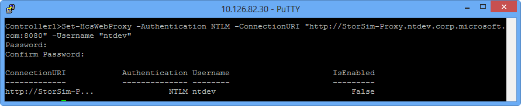
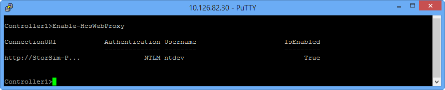
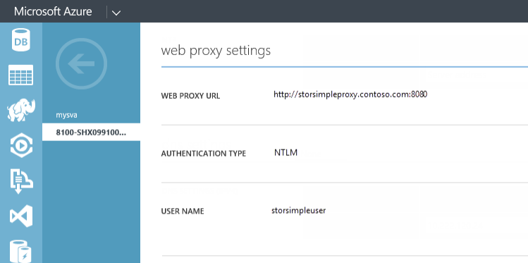

<properties 
   pageTitle="Set up web proxy for a StorSimple device | Microsoft Azure"
   description="Learn how to use Windows PowerShell for StorSimple to configure web proxy settings for your StorSimple device."
   services="storsimple"
   documentationCenter=""
   authors="alkohli"
   manager="carolz"
   editor="" />
<tags 
   ms.service="storsimple"
   ms.devlang="na"
   ms.topic="article"
   ms.tgt_pltfrm="na"
   ms.workload="na"
   ms.date="08/31/2015"
   ms.author="alkohli" />

# Configure web proxy for your StorSimple device

## Overview

This tutorial describes how to use Windows PowerShell for StorSimple to configure and view web proxy settings for your StorSimple device. The web proxy settings are used by the StorSimple device when communicating with the cloud. A web proxy server is used to add another layer of security, filter content, cache to ease bandwidth requirements or even help with analytics.

Web proxy is an optional configuration for your StorSimple device. You can configure web proxy only via Windows PowerShell for StorSimple. The configuration is a two-step process as follows:

1. You first configure web proxy settings through the setup wizard or Windows PowerShell for StorSimple cmdlets.

2. You then enable the configured web proxy settings via Windows PowerShell for StorSimple cmdlets.

After the web proxy configuration is complete, you can view the configured web proxy settings in both the Microsoft Azure StorSimple Manager service and the Windows PowerShell for StorSimple. 

After reading this tutorial, you will be able to:

- Configure web proxy by using setup wizard and cmdlets
- Enable web proxy by using cmdlets
- View web proxy settings in the Management Portal
- Troubleshoot errors during web proxy configuration

## Configure web proxy via Windows PowerShell for StorSimple

You use either of the following to configure web proxy settings:

- Setup wizard to guide you through the configuration steps.

- Cmdlets in Windows PowerShell for StorSimple.

Each of these methods are discussed in the following sections.

## Configure web proxy via the setup wizard

You can use the setup wizard to guide you through the steps for web proxy configuration. Perform the following steps to configure web proxy on your device.

#### To configure web proxy via the setup wizard

1. In the serial console menu, choose option 1, **Log in with full access** and provide the **device administrator password**. Type the following command to start a setup wizard session:

    `Invoke-HcsSetupWizard`

2. If this is the first time that you have used the setup wizard for device registration, you will need to configure all the required network settings until you reach the web proxy configuration. If your device is already registered, you can accept all the configured network settings until you reach the web proxy configuration.In the setup wizard, when prompted to configure web proxy settings, type **Yes**.

3. For the **Web Proxy URL**, specify the IP address or the fully qualified domain name (FQDN) of your web proxy server and the TCP port number that you would like your device to use when communicating with the cloud. Use the following format:

	`http://<IP address or FQDN of the web proxy server>:<TCP port number>`

	By default, TCP port number 8080 is specified.

4. Choose the authentication type as **NTLM**, **Basic**, or **None**. Basic is the least secure authentication for the proxy server configuration. NT LAN Manager (NTLM) is a highly secure and complex authentication protocol that uses a three-way messaging system (sometimes four if additional integrity is required) to authenticate a user. The default authentication is NTLM. For more information, see [Basic](http://hc.apache.org/httpclient-3.x/authentication.html) and [NTLM authentication](http://hc.apache.org/httpclient-3.x/authentication.html). 

	> [AZURE.IMPORTANT] **In the StorSimple Manager service, the device monitoring charts do not work when Basic or NTLM authentication is enabled in the proxy server configuration for the device. For the monitoring charts to work, you will need to ensure that authentication is set to NONE.**

5. If you are using authentication, supply a **Web Proxy Username** and a **Web Proxy Password**. You will also need to confirm the password.

	

If you are registering your device for the first time, continue with the registration. If your device was already registered, the wizard will exit. The configured settings will be saved.

Web proxy will now also be enabled. You can skip the [Enable web proxy](#enable-web-proxy) step and go directly to [View the web proxy settings in the Management Portal](#view-web-proxy-settings-in-the-management-portal).

## Configure web proxy via Windows PowerShell for StorSimple cmdlets

An alternate way to configure web proxy settings is via the Windows PowerShell for StorSimple cmdlets. Perform the following steps to configure web proxy.

#### To configure web proxy via cmdlets

1. In the serial console menu, choose option 1, **Log in with full access**. When prompted, provide the **device administrator password**. The default password is  `Password1`.

2. At the command prompt, type:

	`Set-HcsWebProxy -Authentication NTLM -ConnectionURI "<http://<IP address or FQDN of web proxy server>:<TCP port number>" -Username "<Username for web proxy server>"`

	Provide and confirm the password when prompted, as shown below.

	

The web proxy is now configured and needs to be enabled.

## Enable web proxy

Web proxy is disabled by default. After you configure the web proxy settings on your StorSimple device, you need to use the Windows PowerShell for StorSimple to enable the web proxy settings.

> [AZURE.NOTE] **This step will not be required if you used the setup wizard to configure web proxy. Web proxy is automatically enabled by default after a setup wizard session.**

Perform the following steps in Windows PowerShell for StorSimple to enable web proxy on your device:

#### To enable web proxy

1. In the serial console menu, choose option 1, **Log in with full access**. When prompted, provide the **device administrator password**. The default password is  `Password1`.

2. At the command prompt, type:

	`Enable-HcsWebProxy`

	You have now enabled the web proxy configuration on your StorSimple device.

	

## View web proxy settings in the Management Portal

The web proxy settings are configured through the Windows PowerShell interface and cannot be changed from within the Management Portal. You can, however, view these configured settings in the Management Portal. Perform the following steps to view web proxy.

#### To view web proxy settings
1. Navigate to **StorSimple Manager service > Devices**. Select and click a device and then go to **Configure**.
1. Scroll down on the **Configure** page to **Web proxy settings** section. You can view the configured web proxy settings on your StorSimple device as shown below.

	
 
## Errors during web proxy configuration

If the web proxy settings have been configured incorrectly, error messages will be displayed to the user in Windows PowerShell for StorSimple. The following table explains some of these error messages, their probable causes, and recommended actions.

|Serial no.|HRESULT error Code|Possible root cause|Recommended action|
|:---|:---|:---|:---|
|1.|0x80070001|Command is run from the passive controller and it is not able to communicate with the active controller.|Run the command on the active controller. To run the command from the passive controller, you will need to fix the connectivity from passive to active controller. You will need to engage Microsoft Support if this connectivity is broken.|
|2.|0x800710dd - The operation identifier is not valid|Proxy settings are not supported on StorSimple virtual device.|Proxy settings are not supported on StorSimple virtual device. These can only be configured on a StorSimple physical device.|
|3.|0x80070057 - Invalid parameter|One of the parameters provided for the proxy settings is not valid.|The URI is not provided in correct format. Use the following format: `http://<IP address or FQDN of the web proxy server>:<TCP port number>`|
|4.|0x800706ba - RPC server not available|The root cause is one of the following:  Cluster is not up.  Datapath service is not running.  The command is run from passive controller and it is not able to communicate with the active controller.|Please engage Microsoft Support to ensure that the cluster is up and datapath service is running.  Run the command from the active controller. If you want to run the command from the passive controller, you will need to ensure the passive controller can communicate with the active controller. You will need to engage Microsoft Support if this connectivity is broken.|
|5.|0x800706be - RPC call failed|Cluster is down.|Please engage Microsoft Support to ensure that the cluster is up.|
|6.|0x8007138f - Cluster resource not found|Platform service cluster resource is not found. This can happen when the installation was not proper.|You may need to perform a factory reset on your device.You may need to create a platform resource. Please contact Microsoft Support for next steps.|
|7.|0x8007138c - Cluster resource not online|Platform or datapath cluster resources are not online.|Please contact Microsoft Support to help ensure that the datapath and platform service resource are online.|

> [AZURE.NOTE] 
> 
> -  The above list of error messages is not exhaustive. 
> - Errors related to web proxy settings will not be displayed in the Management Portal in your StorSimple Manager service. If there is an issue with web proxy after the configuration is completed, the device status will change to **Offline** in the Management Portal.|

## Next Steps
If you experience any issues while deploying your device or configuring web proxy settings, refer to [Troubleshoot your StorSimple device deployment](storsimple-troubleshoot-deployment.md).

