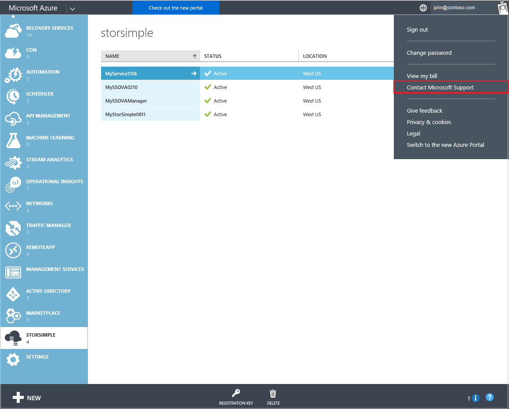
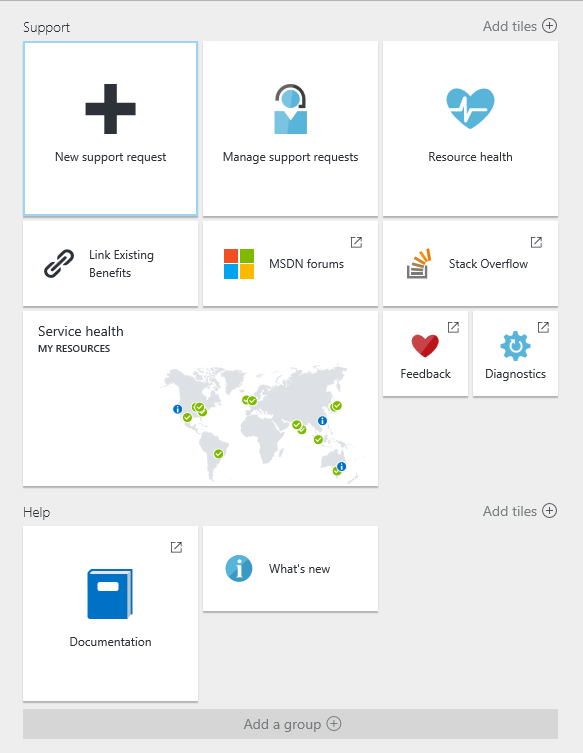
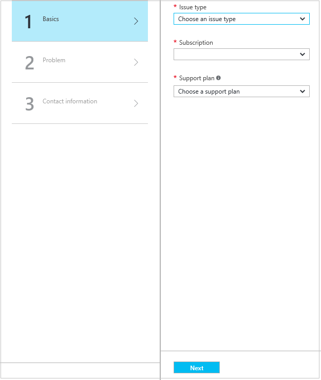
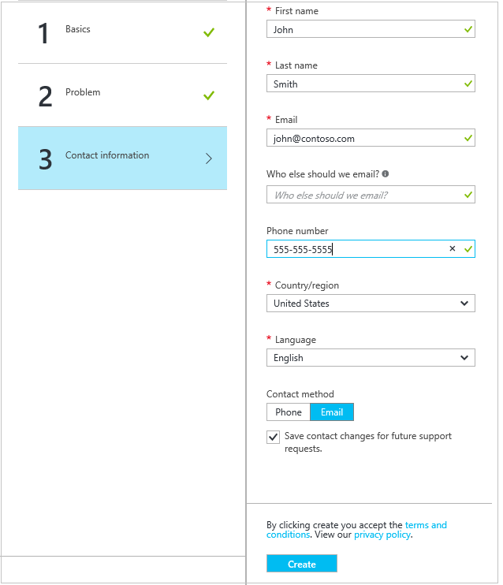

<properties 
   pageTitle="Contact Microsoft Support | Microsoft Azure"
   description="Learn how to create a support request and start a support session on your StorSimple device."
   services="storsimple"
   documentationCenter=""
   authors="alkohli"
   manager="carmonm"
   editor="" />
<tags 
   ms.service="storsimple"
   ms.devlang="na"
   ms.topic="article"
   ms.tgt_pltfrm="na"
   ms.workload="na"
   ms.date="06/20/2016"
   ms.author="alkohli" />

# Contact Microsoft Support

If you encounter any issues with your Microsoft Azure StorSimple solution, you can create a service request for technical support. In an online session with your support engineer, you may also need to start a support session on your StorSimple device. This article walks you through:

- How to create a support request.
- How to start a support session in the Windows PowerShell interface of your StorSimple device.

Review the [StorSimple 8000 Series Support SLAs and information](https://msdn.microsoft.com/library/mt433077.aspx) before you create a Support request.

## Create a support request

Perform the following steps to create a support request:

#### To create a support request

1. In the [Azure classic portal](https://manage.windowsazure.com/), in the upper right corner, click your account name and then click **Contact Microsoft Support**.

	

2. You will be redirected to the new Azure portal (portal.azure.com). Click the **New support request** tile.

	

    On the right side of the screen, the **New support request** pane appears. 

	

3. In the **Basics** dialog box, complete the following:								
	1. From the **Issue type** drop-down list , select **Technical**.
	2. Select a **Subscription** from the drop-down list.
	3. From the **Service** drop-down list, select **StorSimple**. 
	4. Select a **Support plan** from the drop-down list. You need a paid support plan to enable Technical Support.

4. Click **Next**. The **Problem** dialog box appears.

	 

5. In the **Problem** dialog box, complete the following:

    1.  Select a **Severity** level from the drop-down list.
    2.  Select a **Problem type** from the drop-down list.
    3.  Select a **Category** from the drop-down list. 
    4.  In the **Details** box, briefly describe your issue.
    5.  In the **Time frame** box, indicate the date, time, and time zone that corresponds to the most recent occurrence of your issue.
    6.  Under **File upload**, click the folder icon to browse to your support package.
    7.  Select the **Share diagnostic information** check box.

6. Click **Next**. The **Contact information** dialog box appears.

	 

7. Enter your contact information and select a contact method (phone or email). 

8. Select the **Save contact changes for future support requests** check box.

9. Click **Create**.

After you have submitted your request, a Support engineer will contact you as soon as possible to proceed with your request.

## Start a support session in Windows PowerShell for StorSimple

To troubleshoot any issues that you might experience with the StorSimple device, you will need to engage with the Microsoft Support team. Microsoft Support may need to use a support session to log on to your device. 

Perform the following steps to start a support session:

#### To start a support session

1. Access the device directly by using the serial console or through a telnet session from a remote computer. To do this, follow the steps in [Use PuTTY to connect to the device serial console](storsimple-deployment-walkthrough.md#use-putty-to-connect-to-the-device-serial-console).

2. In the session that opens, press the **Enter** key to get a command prompt.

3. In the serial console menu, select option 1, **Log in with full access**.

4. At the prompt, type the following password: 

	`Password1`

5. At the prompt, type the following command:

	`Enable-HcsSupportAccess`

6. An encrypted string will be presented to you. Copy this string into a text editor such as Notepad.

7. Save this string and send it in an email message to Microsoft Support. 

> [AZURE.IMPORTANT] You can disable support access by running `Disable-HcsSupportAccess`. The StorSimple device will also attempt to disable support access 8 hours after the session was initiated. It is a best practice to change your StorSimple device credentials after initiating a support session.
