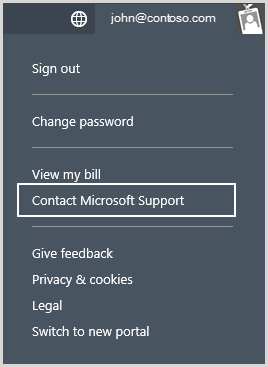
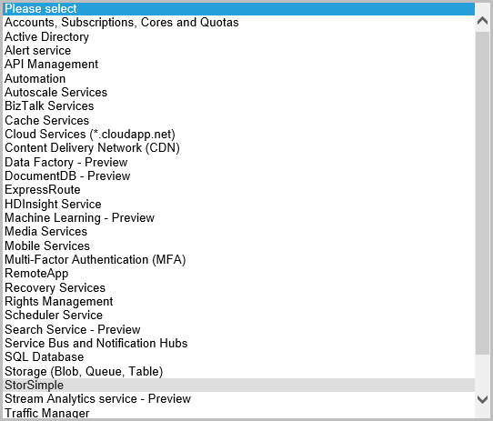

<properties 
   pageTitle="Contact Microsoft Support | Microsoft Azure"
   description="Learn how to create a support request and start a support session on your StorSimple device."
   services="storsimple"
   documentationCenter=""
   authors="alkohli"
   manager="carolz"
   editor="" />
<tags 
   ms.service="storsimple"
   ms.devlang="na"
   ms.topic="article"
   ms.tgt_pltfrm="na"
   ms.workload="na"
   ms.date="08/31/2015"
   ms.author="alkohli" />

# Contact Microsoft Support

If you encounter any issues with your Microsoft Azure StorSimple solution, you can create a service request for technical support. In an online session with your support engineer, you may also need to start a support session on your StorSimple device. This article walks you through the process of creating a support request and also starting a support session in the Windows PowerShell interface of your StorSimple device.

## Create a support request

Perform the following steps to create a support request:

#### To create a support request

1. A support request can be created through the [Management Portal](http://manage.windowsazure.com/). In the [Management Portal](http://manage.windowsazure.com/), click your **Account Name** and then click **Contact Microsoft Support**.

	

2. In the **Contact Microsoft Support** dialog:								

	1. From the drop-down list, select the target **Subscription** associated with your StorSimple Manager service. Specify **Support Type** as **Technical**. You need a paid support plan to enable Technical Support.

	2. Click the check icon  to **Create Ticket**.

3. In the **Microsoft Support** window, from the **Product** drop-down list, choose **StorSimple**.

	

4. Follow the on-screen instructions to properly classify your request and provide a clear and specific description of your problem.

After you have submitted your request, a Support engineer will contact you as soon as possible to proceed with your request.

## Start a support session in Windows PowerShell for StorSimple

To troubleshoot any issues that you might experience with the StorSimple device, you will need to engage with the Microsoft Support team. Microsoft Support may need to use a support session to log on to your device. 

Perform the following steps to start a support session:

#### To start a support session

1. Access the device directly by using the serial console or through a telnet session from a remote computer. To do this, follow the steps in [Use PuTTY to connect to the device serial console](storsimple-deployment-walkthrough.md#use-putty-to-connect-to-the-device-serial-console).

2. In the session that opens, press the **Enter** key to get a command prompt.

3. In the serial console menu, select option 1, **Log in with full access**.

4. At the prompt, type the following password: 

	`Password1`

5. At the prompt, type the following command:

	`Enable-HcsSupportAccess`

6. An encrypted string will be presented to you. Copy this string into a text editor such as Notepad.

7. Save this string and send it in an email message to Microsoft Support. 

> [AZURE.IMPORTANT] You can disable support access by running `Disable-HcsSupportAccess`. The StorSimple device will also attempt to disable support access 8 hours after the session was initiated. It is a best practice to change your StorSimple device credentials after initiating a support session.