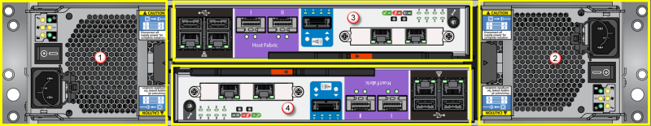
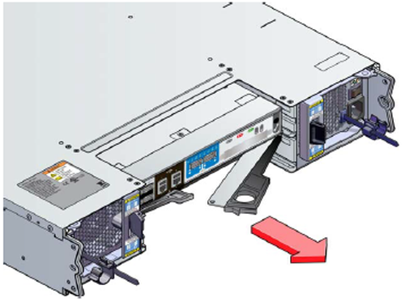
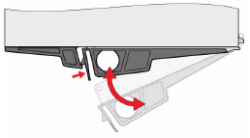
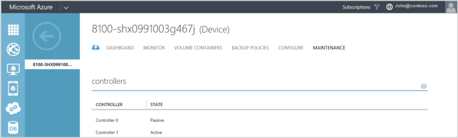
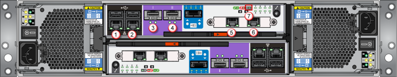

<properties 
   pageTitle="Replace a StorSimple device controller | Microsoft Azure"
   description="Explains how to remove and replace one or both controller modules on your StorSimple device."
   services="storsimple"
   documentationCenter=""
   authors="alkohli"
   manager="carmonm"
   editor="" />
<tags 
   ms.service="storsimple"
   ms.devlang="NA"
   ms.topic="article"
   ms.tgt_pltfrm="NA"
   ms.workload="TBD"
   ms.date="05/31/2016"
   ms.author="alkohli" />

# Replace a controller module on your StorSimple device

## Overview

This tutorial explains how to remove and replace one or both controller modules in a StorSimple device. It also discusses the underlying logic for the single and dual controller replacement scenarios.

>[AZURE.NOTE] Prior to performing a controller replacement, we recommend that you always update your controller firmware to the latest version.
>
>To prevent damage to your StorSimple device, do not eject the controller until the LEDs are showing as one of the following:
>
>- All lights are OFF.
>- LED 3, , and  are flashing, and LED 0 and LED 7 are **ON**.

The following table shows the supported controller replacement scenarios.

|Case|Replacement scenario|Applicable procedure|
|:---|:-------------------|:-------------------|
|1|One controller is in a failed state, the other controller is healthy and active.|[Single controller replacement](#replace-a-single-controller), which describes the [logic behind a single controller replacement](#single-controller-replacement-logic), as well as the [replacement steps](#single-controller-replacement-steps).|
|2|Both the controllers have failed and require replacement. The chassis, disks, and.disk enclosure are healthy.|[Dual controller replacement](#replace-both-controllers), which describes the [logic behind a dual controller replacement](#dual-controller-replacement-logic), as well as the [replacement steps](#dual-controller-replacement-steps). |
|3|Controllers from the same device or from different devices are swapped. The chassis, disks, and disk enclosures are healthy.|A slot mismatch alert message will appear.|
|4|One controller is missing and the other controller fails.|[Dual controller replacement](#replace-both-controllers), which describes the [logic behind a dual controller replacement](#dual-controller-replacement-logic), as well as the [replacement steps](#dual-controller-replacement-steps).|
|5|One or both controllers have failed. You cannot access the device through the serial console or Windows PowerShell remoting.|[Contact Microsoft Support](storsimple-contact-microsoft-support.md) for a manual controller replacement procedure.|
|6|The controllers have a different build version, which may be due to:<ul><li>Controllers have a different software version.</li><li>Controllers have a different firmware version.</li></ul>|If the controller software versions are different, the replacement logic detects that and updates the software version on the replacement controller.  If the controller firmware versions are different and the old firmware version is **not** automatically upgradeable, an alert message will appear in the Azure classic portal. You should scan for updates and install the firmware updates.  If the controller firmware versions are different and the old firmware version is automatically upgradeable, the controller replacement logic will detect this, and after the controller starts, the firmware will be automatically updated.|

You need to remove a controller module if it has failed. One or both the controller modules can fail, which can result in a single controller replacement or dual controller replacement. For replacement procedures and the logic behind them, see the following:

- [Replace a single controller](#replace-a-single-controller)
- [Replace both controllers](#replace-both-controllers)
- [Remove a controller](#remove-a-controller)
- [Insert a controller](#insert-a-controller)
- [Identify the active controller on your device](#identify-the-active-controller-on-your-device)

>[AZURE.IMPORTANT] Before removing and replacing a controller, review the safety information in [StorSimple hardware component replacement](storsimple-hardware-component-replacement.md).

## Replace a single controller

When one of the two controllers on the  Microsoft Azure StorSimple device has failed, is malfunctioning, or is missing, you need to replace a single controller. 

### Single controller replacement logic

In a single controller replacement, you should first remove the failed controller. (The remaining controller in the device is the active controller.) When you insert the replacement controller, the following actions occur:

1. The replacement controller immediately starts communicating with the StorSimple device.

2. A snapshot of the virtual hard disk (VHD) for the active controller is copied on the replacement controller.

3. The snapshot is modified so that when the replacement controller starts from this VHD, it will be recognized as a standby controller.

4. When the modifications are complete, the replacement controller will start as the standby controller.

5. When both the controllers are running, the cluster comes online.

### Single controller replacement steps

Complete the following steps if one of the controllers in your Microsoft Azure StorSimple device fails. (The other controller must be active and running. If both controllers fail or malfunction, go to [dual controller replacement steps](#dual-controller-replacement-steps).)

>[AZURE.NOTE] It can take 30 – 45 minutes for the controller to restart and completely recover from the single controller replacement procedure. The total time for the entire procedure, including attaching the cables, is approximately 2 hours.

#### To remove a single failed controller module

1. In the Azure classic portal, go to the StorSimple Manager service, click the **Devices** tab, and then click the name of the device that you want to monitor.

2. Go to **Maintenance > Hardware Status**. The status of either Controller 0 or Controller 1 should be red, which indicates a failure.

    >[AZURE.NOTE] The failed controller in a single controller replacement is always a standby controller.

3. Use Figure 1 and the following table to locate the failed controller module.  

    

    **Figure 1** Back of StorSimple device

    |Label|Description|
    |:----|:----------|
    |1|PCM 0|
    |2|PCM 1|
    |3|Controller 0|
    |4|Controller 1|

4. On the failed controller, remove all the connected network cables from the data ports. If you are using an 8600 model, also remove the SAS cables that connect the controller to the EBOD controller.

5. Follow the steps in [remove a controller](#remove-a-controller) to remove the failed controller. 

6. Install the factory replacement in the same slot from which the failed controller was removed. This triggers the single controller replacement logic. For more information, see [single controller replacement logic](#single-controller-replacement-logic).

7. While the single controller replacement logic progresses in the background, reconnect the cables. Take care to connect all the cables exactly the same way that they were connected before the replacement.

8. After the controller restarts, check the **Controller status** and the **Cluster status** in the Azure classic portal to verify that the controller is back to a healthy state and is in standby mode.

>[AZURE.NOTE] If you are monitoring the device through the serial console, you may see multiple restarts while the controller is recovering from the replacement procedure. When the serial console menu is presented, then you know that the replacement is complete. If the menu does not appear within two hours of starting the controller replacement, please [contact Microsoft Support](storsimple-contact-microsoft-support.md).

## Replace both controllers

When both controllers on the  Microsoft Azure StorSimple device have failed, are malfunctioning, or are missing, you need to replace both controllers. 

### Dual controller replacement logic

In a dual controller replacement, you first remove both failed controllers and then insert replacements. When the two replacement controllers are inserted, the following actions occur:

1. The replacement controller in slot 0 checks the following:
 
   1. Is it using current versions of the firmware and software?

   2. Is it a part of the cluster?

   3. Is the peer controller running and is it clustered?
							
    If none of these conditions are true, the controller looks for the latest daily backup (located in the **nonDOMstorage** on drive S). The controller copies the latest snapshot of the VHD from the backup.

2. The controller in slot 0 uses the snapshot to image itself.

3. Meanwhile, the controller in slot 1 waits for controller 0 to complete the imaging and start.

4. After controller 0 starts, controller 1 detects the cluster created by controller 0, which triggers the single controller replacement logic. For more information, see [single controller replacement logic](#single-controller-replacement-logic).

5. Afterwards, both controllers will be running and the cluster will come online.

>[AZURE.IMPORTANT] Following a dual controller replacement, after the StorSimple device is configured, it is essential that you take a manual backup of the device. Daily device configuration backups are not triggered until after 24 hours have elapsed. Work with [Microsoft Support](storsimple-contact-microsoft-support.md) to make a manual backup of your device.

### Dual controller replacement steps

This workflow is required when both of the controllers in your Microsoft Azure StorSimple device have failed. This could happen in a datacenter in which the cooling system stops working, and as a result, both the controllers fail within a short period of time. Depending on whether the StorSimple device is turned off or on, and whether you are using a 8600 or a 8100 model, a different set of steps is required.

>[AZURE.IMPORTANT] It can take 45 minutes to 1 hour for the controller to restart and completely recover from a dual controller replacement procedure. The total time for the entire procedure, including attaching the cables, is approximately 2.5 hours.

#### To replace both controller modules

1. If the device is turned off, skip this step and proceed to the next step. If the device is turned on, turn off the device.
										
    1. If you are using a 8600 model, turn off the primary enclosure first, and then turn off the EBOD enclosure.

    2. Wait until the device has shut down completely. All the LEDs in the back of the device will be off.

2. Remove all the network cables that are connected to the data ports. If you are using a 8600 model, also remove the SAS cables that connect the primary enclosure to the EBOD enclosure.

3. Remove both controllers from the StorSimple device. For more information, see [remove a controller](#remove-a-controller).

4. Insert the factory replacement for Controller 0 first, and then insert Controller 1. For more information, see [insert a controller](#insert-a-controller). This triggers the dual controller replacement logic. For more information, see [dual controller replacement logic](#dual-controller-replacement-logic).

5. While the controller replacement logic progresses in the background, reconnect the cables. Take care to connect all the cables exactly the same way that they were connected before the replacement. See the detailed instructions for your model in the Cable your device section of [install your StorSimple 8100 device](storsimple-8100-hardware-installation.md) or [install your StorSimple 8600 device](storsimple-8600-hardware-installation.md).

6. Turn on the StorSimple device. If you are using a 8600 model:

    1. Make sure that the EBOD enclosure is turned on first.

    2. Wait until the EBOD enclosure is running.

    3. Turn on the primary enclosure.

    4. After the first controller restarts and is in a healthy state, the system will be running.

    >[AZURE.NOTE] If you are monitoring the device through the serial console, you may see multiple restarts while the controller is recovering from the replacement procedure. When the serial console menu appears, then you know that the replacement is complete. If the menu does not appear within 2.5 hours of starting the controller replacement, please [contact Microsoft Support](storsimple-contact-microsoft-support.md).

## Remove a controller

Use the following procedure to remove a faulty controller module from your StorSimple device.

>[AZURE.NOTE] The following illustrations are for controller 0. For controller 1, these would be reversed.

#### To remove a controller module

1. Grasp the module latch between your thumb and forefinger.

2. Gently squeeze your thumb and forefinger together to release the controller latch.

    

    **Figure 2** Releasing controller latch

2. Use the latch as a handle to slide the controller out of the chassis.

    

    **Figure 3** Sliding the controller out of the chassis

## Insert a controller

Use the following procedure to install a factory-supplied controller module after you remove a faulty module from your StorSimple device.

#### To install a controller module

1. Check to see if there is any damage to the interface connectors. Do not install the module if any of the connector pins are damaged or bent.

2. Slide the controller module into the chassis while the latch is fully released. 

    

    **Figure 4** Sliding controller into the chassis

3. With the controller module inserted, begin closing the latch while continuing to push the controller module into the chassis. The latch will engage to guide the controller into place.

    

    **Figure 5** Closing the controller latch

4. You're done when the latch snaps into place. The **OK** LED should now be on.  

    >[AZURE.NOTE] It can take up to 5 minutes for the controller and the LED to activate.

5. To verify that the replacement is successful, in the Azure classic portal, go to **Devices** > **Maintenance** > **Hardware Status**, and make sure that both controller 0 and controller 1 are healthy (status is green).

## Identify the active controller on your device

There are many situations, such as first-time device registration or controller replacement, that require you to locate the active controller on a StorSimple device. The active controller processes all the disk firmware and networking operations. You can use any of the following methods to identify the active controller:

- [Use the Azure classic portal to identify the active controller](#use-the-azure-classic-portal-to-identify-the-active-controller)

- [Use Windows PowerShell for StorSimple to identify the active controller](#use-windows-powershell-for-storsimple-to-identify-the-active-controller)

- [Check the physical device to identify the active controller](#check-the-physical-device-to-identify-the-active-controller)

Each of these procedures is described next.

### Use the Azure classic portal to identify the active controller

In the Azure classic portal, navigate to **Devices** > **Maintenance**, and scroll to the **Controllers** section. Here you can verify which controller is active.

**Figure 6** Azure classic portal showing the active controller

### Use Windows PowerShell for StorSimple to identify the active controller

When you access your device through the serial console, a banner message is presented. The banner message contains basic device information such as the model, name, installed software version, and status of the controller you are accessing. The following image shows an example of a banner message:

**Figure 7** Banner message showing controller 0 as Active

You can use the banner message to determine whether the controller you are connected to is active or passive.

### Check the physical device to identify the active controller

To identify the active controller on your device, locate the blue LED above the DATA 5 port on the back of the primary enclosure.

If this LED is blinking, the controller is active and the other controller is in standby mode. Use the following diagram and table as an aid.

**Figure 8** Back of primary enclosure with data ports and monitoring LEDs

|Label|Description|
|:----|:----------|
|1-6|DATA 0 – 5 network ports|
|7|Blue LED|

## Next steps

Learn more about [StorSimple hardware component replacement](storsimple-hardware-component-replacement.md).
