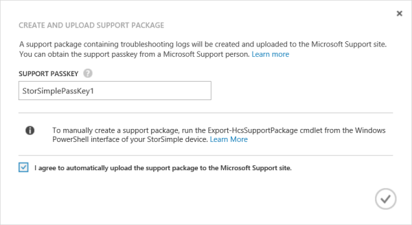
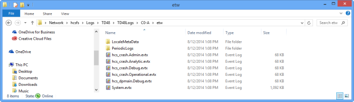
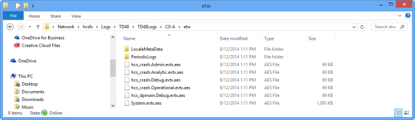
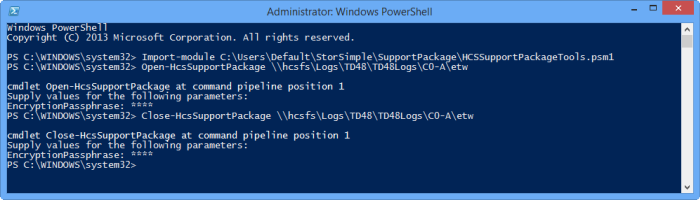

<properties 
   pageTitle="Create a StorSimple support package | Microsoft Azure"
   description="Learn how to create, decrypt, and edit a support package for your StorSimple device."
   services="storsimple"
   documentationCenter=""
   authors="alkohli"
   manager="carmonm"
   editor="" />
<tags 
   ms.service="storsimple"
   ms.devlang="na"
   ms.topic="article"
   ms.tgt_pltfrm="na"
   ms.workload="na"
   ms.date="04/26/2015"
   ms.author="alkohli" />

# Create and manage a StorSimple support package

## Overview

StorSimple support package is an easy to use mechanism which collects all relevant logs to assist Microsoft Support team with troubleshooting any StorSimple device issues. The collected logs are encrypted and compressed. 

This tutorial includes step-by-step instructions to create and manage the support package.

## Create and upload support package in the Azure classic portal

You can create and upload a support package to the Microsoft Support site through the **Maintenance** page of the service in  the Azure classic portal. 

> [AZURE.NOTE] You will need to provide a support passkey to allow the upload. The support pass key should be provided to you by your Support Engineer in an email. 

An encrypted and compressed support package is created (.cab file) and uploaded to Support site. This package can then be retrieved by the Support Engineer from the Support site for troubleshooting the issue.

Perform the following steps in the classic portal to create a support package:

#### To create a support package in the Azure classic portal

1. Navigate to **Devices > Maintenance**.

2. In the **Support package** section, click **Create and upload support package**.

3. In the **Create and upload support package** dialog box, do the following:

	
											
	- Provide the **Support Passkey**. This key should be sent to you by your Microsoft Support Engineer in an email.
 	
	- Check the combo box to provide consent to **automatically upload the support package to the Microsoft Support site**.
 	
	- Click the check icon .

## Manually create a support package

For the following scenerios, you will need to manually create the support package through the Windows PowerShell for StorSimple. 

- Remove sensitive information from your log files prior to sharing with Microsoft Support 

- Device is facing internet connectivity issues to upload the package.
 
Generated support package can then be shared with Microsoft Support over email. Perform the following steps to create a support package in Windows PowerShell for StorSimple:

#### To create a support package in Windows PowerShell for StorSimple

1. Type the following command to start a Windows PowerShell session as an administrator on the remote computer used to connect to your StorSimple device:

	`Start PowerShell`

2. In the Windows PowerShell session, connect to the SSAdmin Console runspace of your device: 

	- At the command prompt, type: 
			
		`$MS = New-PSSession -ComputerName <IP address for DATA 0> -Credential SSAdmin -ConfigurationName "SSAdminConsole"`
		
		
	1. In the dialog box that opens, type your device administrator password. The default password is:
	 
		`Password1`

		

	2. Click **OK**.
	1. At the command prompt, type: 
		
		`Enter-PSSession $MS`

3. In the session that opens, type the appropriate command. 

	- For network shares that are password protected, type:

		`Export-HcsSupportPackage –PackageTag "MySupportPackage" –Credential "Username" -Force`

		You will be prompted for a password, a path to the network shared folder, and an encryption passphrase (because the support package is encrypted). When these are provided, a support package will be created in the specified folder.
											

	- For shares that are not password protected, you do not need the `-Credential` parameter. Type the following: 

		`Export-HcsSupportPackage –PackageTag "MySupportPackage" -Force`

		The support package will be created for both controllers in the specified network shared folder. It is an encrypted, compressed file that can be sent to Microsoft Support for troubleshooting. For more information, see [Contact Microsoft Support](storsimple-contact-microsoft-support.md).

### More information about the Export-HcsSupportPackage cmdlet
The different parameters that can be used with the Export-HcsSupportPackage cmdlet are tabulated below.

| Parameter            | Required/Optional | Description                                                                                                                                                             |
|----------------------|-------------------|-------------------------------------------------------------------------------------------------------------------------------------------------------------------------|
| `-Path`                 | Required          | Use to provide the location of the network shared folder in which the support package will be placed.                                                                 |
| `-EncryptionPassphrase` | Required          | Use to provide a passphrase to help encrypt the support package.                                                                                                        |
| `-Credential`           | Optional          | Use this parameter to supply access credentials for the network shared folder.                                                                                        |
| `-Force`                | Optional          | Use to skip the encryption passphrase confirmation step.                                                                                                                |
| `-PackageTag`           | Optional          | Use to specify a directory under Path in which the support package will be placed. The default is [device name]-[ current date and time:yyyy-MM-dd-HH-mm-ss].       |
| `-Scope`                | Optional          | Specify as **Cluster** (default) to create a support package for both controllers. If you want to create a package only for the current controller, specify **Controller**. |

## Edit a support package

After you have generated a support package, you may need to edit the package to remove sensitive information such as volume names, device IP addresses, and backup names from the log files. 

> [AZURE.IMPORTANT] You can only edit a support package that was generated through Windows PowerShell for StorSimple. You cannot edit a package created in the Azure classic portal with StorSimple Manager service. 

To edit a support package before uploading it on the Microsoft Support site, you will need to decrypt the support package, edit the files and then encrypt it again. Perform the following steps to edit a support package:

#### To edit a support package in Windows PowerShell for StorSimple

1. Generate a support package as described in [Create a support package in Windows PowerShell for StorSimple](#create-a-support-package-in-windows-powershell-for-storsimple).

2. [Download the script](http://gallery.technet.microsoft.com/scriptcenter/Script-to-decrypt-a-a8d1ed65) locally on your client.

3. Import the Windows PowerShell module. You will need to specify the path to the local folder in which you downloaded the script. To import the module, type:
 
	`Import-module <Path to the folder that contains the Windows PowerShell script>`

4. All the files are *.aes* files that are compressed and encrypted. To decompress and decrypt files, type:

	`Open-HcsSupportPackage <Path to the folder that contains support package files>`

	This will decompress and decrypt the files. You will note that the actual file extensions are now displayed for all the files.
	
	

5. When prompted for the encryption passphrase, type the passphrase used when the support package was created.

    	cmdlet Open-HcsSupportPackage at command pipeline position 1
    
    	Supply values for the following parameters:EncryptionPassphrase: ****
	
6. Navigate to the folder that contains the log files. As the log files are now decompressed and decrypted, these will have original file extensions. Modify these files to remove any customer-specific information such as volume names and device IP addresses and save the files.

7. Compress and encrypt: Closing the files will compress them with Gzip and then encrypt them with AES-256. This is for speed and security when transferring the support package over a network. To compress and encrypt files, type:

	`Close-HcsSupportPackage <Path to the folder that contains support package files>`

	

8. When prompted, provide an encryption passphrase for the modified support package.

	    cmdlet Close-HcsSupportPackage at command pipeline position 1
    	Supply values for the following parameters:EncryptionPassphrase: ****

9. Write down the new passphrase so that you can share it with Microsoft Support when requested.

### Example: Editing files in a support package on a password-protected share

An example demonstrating how to decrypt, edit and re-encrypt a support package is shown below.

    	PS C:\WINDOWS\system32> Import-module C:\Users\Default\StorSimple\SupportPackage\HCSSupportPackageTools.psm1
    
    	PS C:\WINDOWS\system32> Open-HcsSupportPackage \\hcsfs\Logs\TD48\TD48Logs\C0-A\etw
    
    	cmdlet Open-HcsSupportPackage at command pipeline position 1
    
    	Supply values for the following parameters:
    
    	EncryptionPassphrase: ****
    
    	PS C:\WINDOWS\system32> Close-HcsSupportPackage \\hcsfs\Logs\TD48\TD48Logs\C0-A\etw
    
    	cmdlet Close-HcsSupportPackage at command pipeline position 1
    
    	Supply values for the following parameters:
    
    	EncryptionPassphrase: ****
    
    	PS C:\WINDOWS\system32>

## Next steps

- Learn how to [use support packages and device logs to troubleshoot your device deployment](storsimple-troubleshoot-deployment.md#support-packages-and-device-logs-available-for-troubleshooting).

- Learn how to [use the StorSimple Manager service to administer your StorSimple device](storsimple-manager-service-administration.md).

