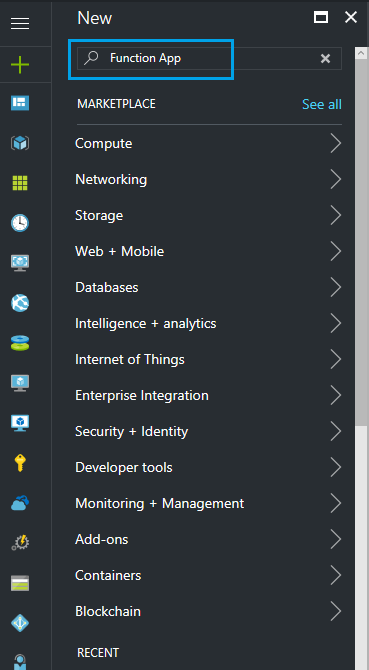
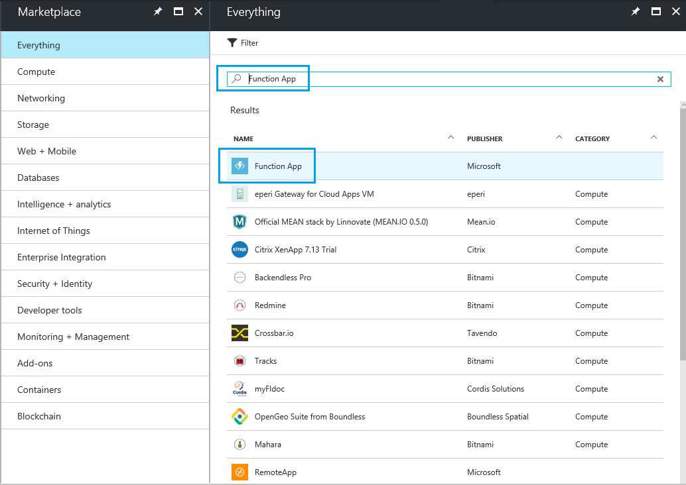
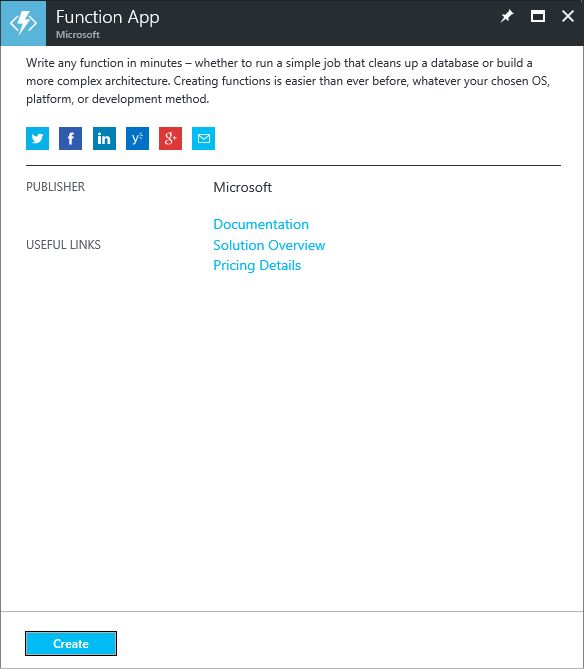
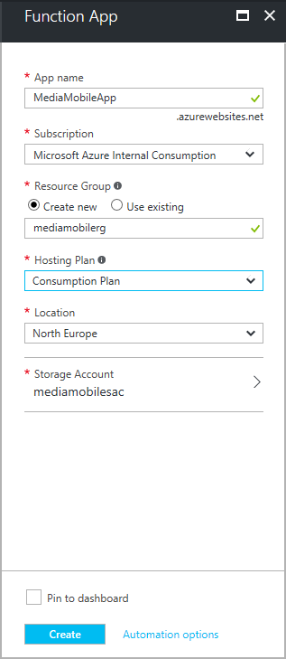
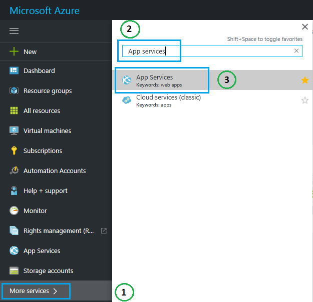
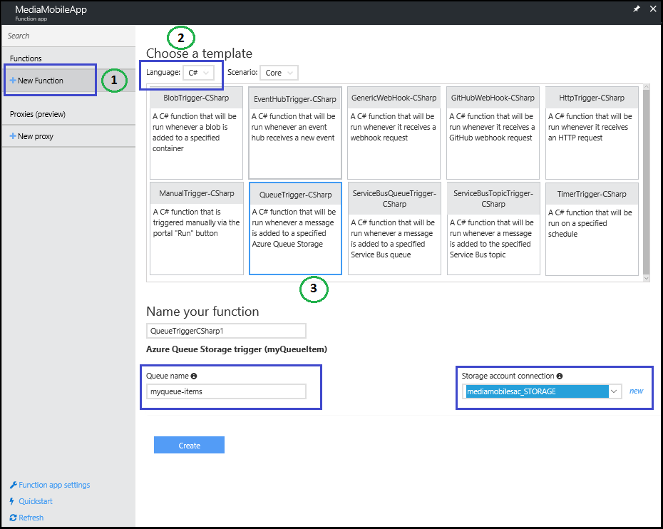

# Change a blob path from the default path (private preview)

This article describes how to set up an Azure function to rename a default blob file path. 

## Prerequisites

Ensure that you have a job definition that has been correctly configured in a hybrid data resource within a resource group.

## Create an Azure function

To create an Azure function, do the following:

1. Go to the [Azure portal](http://portal.azure.com/).

2. At the top of the left pane, click **New**. 

3. In the **Search** box, type **Function App**, and then press Enter.

    

4. In the **Results** list, click **Function App**.

    

    The **Function App** window opens.

5. Click **Create**.

    

6. On the **Function App** configuration blade, do the following:

    a. In the **App name** box, type the app name.
    
    b. In the **Subscription** box, type the name of the subscription.

    c. Under **Resource Group**, click **Create new**, and then type the name of the resource group.

    d. In the **Hosting Plan** box, type **Consumption Plan**.

    e. In the **Location** box, type the location.

    f. Under **Storage account**, select an existing storage account or create a new storage account. A storage account is used internally for the function.

    

7. Click **Create**.  
    The function app is created.

8. In the left pane, click **More services**, and then do the following:
    
    a. In the **Filter** box, type **App services**.
    
    b. Click **App Services**. 

    

9. In the list of app services, click the name of the function app.  
    The function app page opens.

10. In the left pane, click **New Function**, and then do the following: 

    a. In the **Language** list, select **C#**.
    
    b. In the array of template tiles, select **QueueTrigger-CSharp**.

    c. In the **Name your function** box, type a name for your function.

    d. In the **Queue name** box, type your data-transformation job definition name.

    e. Under **Storage account connection**, click **new**, and then select the account that corresponds to the data-transformation job.  
        Make a note of the connection name. The name is required later in the Azure function.

       

    f. Click **Create**.  
    The **Function** window opens.

11. In the **Function** window, run _.csx_ file, and then do the following:

    a. Paste the following code:

    ```
    using System;
    using System.Configuration;
    using Microsoft.WindowsAzure.Storage.Blob;
    using Microsoft.WindowsAzure.Storage.Queue;
    using Microsoft.WindowsAzure.Storage;
    using System.Collections.Generic;
    using System.Linq;

    public static void Run(QueueItem myQueueItem, TraceWriter log)
    {
        CloudStorageAccount storageAccount = CloudStorageAccount.Parse(ConfigurationManager.AppSettings["STORAGE_CONNECTIONNAME"]);

        string storageAccUriEndswith = "windows.net/";
        string uri = myQueueItem.TargetLocation.Replace("%20", " ");
        log.Info($"Blob Uri: {uri}");

        // Remove storage account uri string
        uri = uri.Substring(uri.IndexOf(storageAccUriEndswith) + storageAccUriEndswith.Length);

        string containerName = uri.Substring(0, uri.IndexOf("/")); 

        // Remove container name string
        uri = uri.Substring(containerName.Length + 1);

        // Current blob path
        string blobName = uri; 

        string volumeName = uri.Substring(containerName.Length + 1);
        volumeName = uri.Substring(0, uri.IndexOf("/"));

        // Remove volume name string
        uri = uri.Substring(volumeName.Length + 1);

        string newContainerName = uri.Substring(0, uri.IndexOf("/")).ToLower();
        string newBlobName = uri.Substring(newContainerName.Length + 1);

        log.Info($"Container name: {containerName}");
        log.Info($"Volume name: {volumeName}");
        log.Info($"New container name: {newContainerName}");

        log.Info($"Blob name: {blobName}");
        log.Info($"New blob name: {newBlobName}");

        // Create the blob client.
        CloudBlobClient blobClient = storageAccount.CreateCloudBlobClient();

        // Container reference
        CloudBlobContainer container = blobClient.GetContainerReference(containerName);
        CloudBlobContainer newContainer = blobClient.GetContainerReference(newContainerName);
        newContainer.CreateIfNotExists();

        if(!container.Exists())
        {
            log.Info($"Container - {containerName} not exists");
            return;
        }

        if(!newContainer.Exists())
        {
            log.Info($"Container - {newContainerName} not exists");
            return;
        }

        CloudBlockBlob blob = container.GetBlockBlobReference(blobName);
        if (!blob.Exists())
        {
            // Skip to copy the blob to new container, if source blob doesn't exist
            log.Info($"The specified blob does not exist.");
            log.Info($"Blob Uri: {blob.Uri}");
            return;
        }

        CloudBlockBlob blobCopy = newContainer.GetBlockBlobReference(newBlobName);
        if (!blobCopy.Exists())
        {
            blobCopy.StartCopy(blob);
            // Delete old blob, after copy to new container
            blob.DeleteIfExists();
            log.Info($"Blob file path renamed completed successfully");
        }
        else
        {
            log.Info($"Blob file path renamed already done");
            // Delete old blob, if already exists.
            blob.DeleteIfExists();
        }
    }

    public class QueueItem
    {
        public string SourceLocation {get;set;}
        public long SizeInBytes {get;set;}
        public string Status {get;set;}
        public string JobID {get;set;}
        public string TargetLocation {get; set;}
    }

    ```

    b. Replace **STORAGE_CONNECTIONNAME** on line 11 with your storage account connection (refer point 8c).

    c. At the top left, click **Save**.

    

12. To complete the function, add one more file by doing the following:

    a. Click **View files**.

       

    b. Click **Add**.
    
    c. Type **project.json**, and then press Enter.
    
    d. In the **project.json** file, paste the following code:

    ```
    {
    "frameworks": {
        "net46":{
        "dependencies": {
            "windowsazure.storage": "8.1.1"
        }
        }
    }
    }

    ```

    e. Click **Save**.

You have created an Azure function. This function is triggered each time a new blob is generated by the data-transformation job.

## Next steps

[Use StorSimple Data Manager UI to transform your data](storsimple-data-manager-ui.md)
