# Change a blob path from the default path

When the StorSimple Data Manager service transforms the data, by default it places the transformed blobs in a storage container as specified during the creation of the target repository. As the blobs arrive at this location, you may want to move these blobs to an alternate location. This article describes how to set up an Azure function to rename a default blob file path and hence move the blobs to a different location.

## Prerequisites

Ensure that you have a correctly configured job definition in your StorSimple Data Manager service.

## Create an Azure function

To create an Azure function, perform the following steps:

1. Go to the [Azure portal](https://portal.azure.com/).

2. Click **+ Create a resource**. In the **Search** box, type **Function App** and press **Enter**. Select and click **Function app** in the list of apps displayed.

    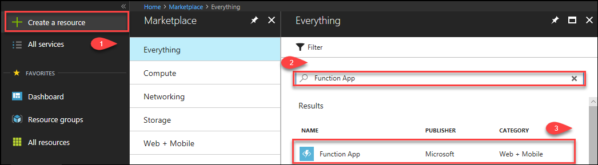

3. Click **Create**.

    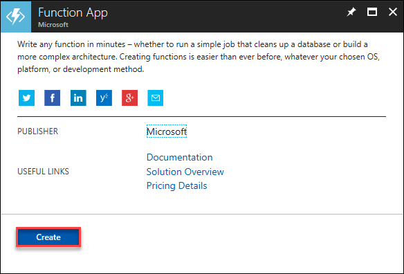

4. On the **Function App** configuration blade, perform the following steps:

    1. Provide a unique **App name**.
    2. From the dropdown list, select the **Subscription**. This subscription should be the same as the one associated with your StorSimple Data Manager service.
    3. Select **Create new** resource group.
    4. For the **Hosting Plan** dropdown list, select **Consumption Plan**.
    5. Specify a location where your function runs. You want the same region where the StorSimple Data Manager service and the storage account associated with the job definition, are located.
    6. Select an existing storage account or create a new storage account. A storage account is used internally for the function.

        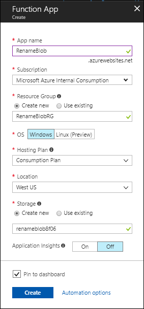

    7. Click **Create**. The function app is created.
     
        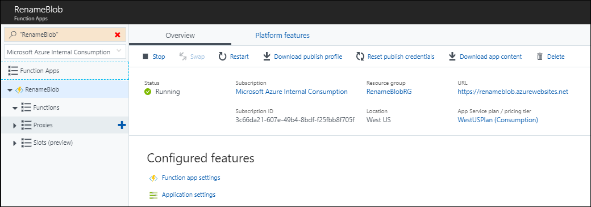

5. Select **Functions**, and click **+ New function**.

    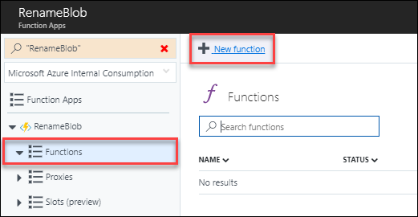

6. Select **C#** for the language. In the array of template tiles, select **C#** in the **QueueTrigger-CSharp** tile.

7. In the **Queue trigger**:

    1. Enter a **Name** for your function.
    2. In the **Queue name** box, type your data transformation job definition name.
    3. Under **Storage account connection**, click **new**. From the list of storage accounts, select the account associated with your job definition. Make a note of the connection name (highlighted). The name is required later in the Azure function.

        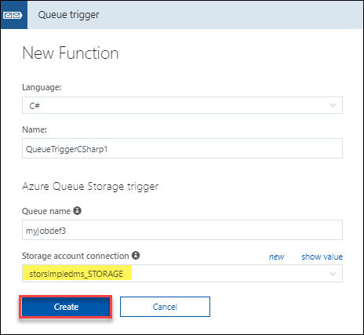

    4. Click **Create**. The **Function** is created.

     
10. In the Function window, run _.csx_ file.

    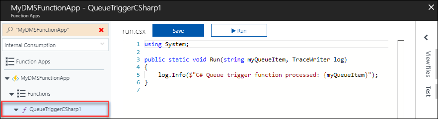
    
    Perform the following steps.

    1. Paste the following code:

        ```
        using System;
        using System.Configuration;
        using Microsoft.WindowsAzure.Storage.Blob;
        using Microsoft.WindowsAzure.Storage.Queue;
        using Microsoft.WindowsAzure.Storage;
        using System.Collections.Generic;
        using System.Linq;

        public static void Run(QueueItem myQueueItem, TraceWriter log)
        {
            CloudStorageAccount storageAccount = CloudStorageAccount.Parse(ConfigurationManager.AppSettings["STORAGE_CONNECTIONNAME"]);

            string storageAccUriEndswith = "windows.net/";
            string uri = myQueueItem.TargetLocation.Replace("%20", " ");
            log.Info($"Blob Uri: {uri}");

            // Remove storage account uri string
            uri = uri.Substring(uri.IndexOf(storageAccUriEndswith) + storageAccUriEndswith.Length);

            string containerName = uri.Substring(0, uri.IndexOf("/")); 

            // Remove container name string
            uri = uri.Substring(containerName.Length + 1);

            // Current blob path
            string blobName = uri; 

            string volumeName = uri.Substring(containerName.Length + 1);
            volumeName = uri.Substring(0, uri.IndexOf("/"));

            // Remove volume name string
            uri = uri.Substring(volumeName.Length + 1);

            string newContainerName = uri.Substring(0, uri.IndexOf("/")).ToLower();
            string newBlobName = uri.Substring(newContainerName.Length + 1);

            log.Info($"Container name: {containerName}");
            log.Info($"Volume name: {volumeName}");
            log.Info($"New container name: {newContainerName}");

            log.Info($"Blob name: {blobName}");
            log.Info($"New blob name: {newBlobName}");

            // Create the blob client.
            CloudBlobClient blobClient = storageAccount.CreateCloudBlobClient();

            // Container reference
            CloudBlobContainer container = blobClient.GetContainerReference(containerName);
            CloudBlobContainer newContainer = blobClient.GetContainerReference(newContainerName);
            newContainer.CreateIfNotExists();

            if(!container.Exists())
            {
                log.Info($"Container - {containerName} not exists");
                return;
            }

            if(!newContainer.Exists())
            {
                log.Info($"Container - {newContainerName} not exists");
                return;
            }

            CloudBlockBlob blob = container.GetBlockBlobReference(blobName);
            if (!blob.Exists())
            {
                // Skip to copy the blob to new container, if source blob doesn't exist
                log.Info($"The specified blob does not exist.");
                log.Info($"Blob Uri: {blob.Uri}");
                return;
            }

            CloudBlockBlob blobCopy = newContainer.GetBlockBlobReference(newBlobName);
            if (!blobCopy.Exists())
            {
                blobCopy.StartCopy(blob);
                // Delete old blob, after copy to new container
                blob.DeleteIfExists();
                log.Info($"Blob file path renamed completed successfully");
            }
            else
            {
                log.Info($"Blob file path renamed already done");
                // Delete old blob, if already exists.
                blob.DeleteIfExists();
            }
        }

        public class QueueItem
        {
            public string SourceLocation {get;set;}
            public long SizeInBytes {get;set;}
            public string Status {get;set;}
            public string JobID {get;set;}
            public string TargetLocation {get; set;}
        }

        ```

    2. Replace **STORAGE_CONNECTIONNAME** on line 11 with your storage account connection (refer step 7c).

        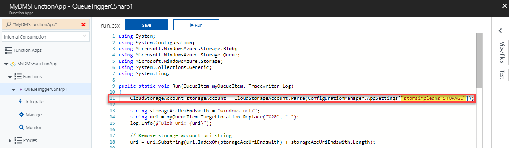

    3. **Save** the function.

        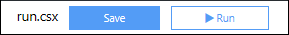

12. To complete the function, add one more file by doing the following steps:

    1. Click **View files**.

       

    2. Click **+ Add**.
        
        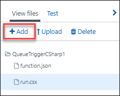
    
    3. Type **project.json**, and then press **Enter**. In the **project.json** file, paste the following code:

        ```
        {
        "frameworks": {
            "net46":{
            "dependencies": {
                "windowsazure.storage": "8.1.1"
            }
            }
        }
        }

        ```

    
    4. Click **Save**.

        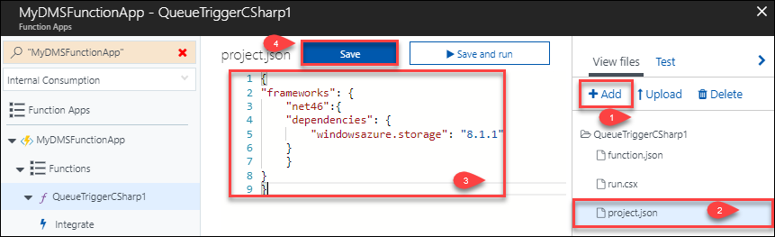

You have created an Azure function. This function is triggered each time a new blob is generated by the data transformation job.

## Next steps

[Use StorSimple Data Manager UI to transform your data](storsimple-data-manager-ui.md)
