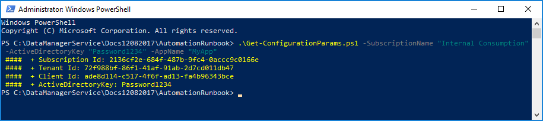
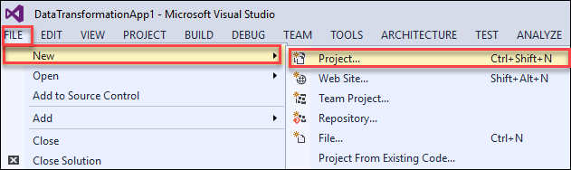
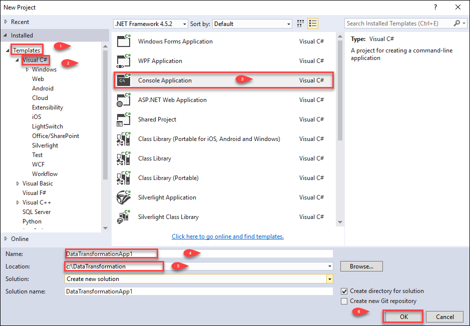
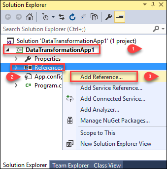
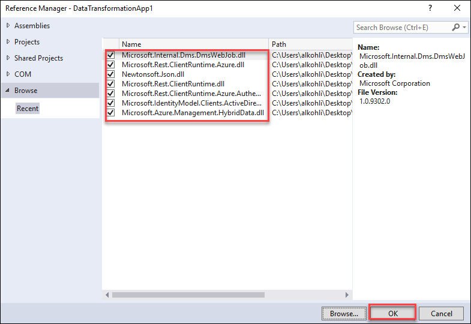
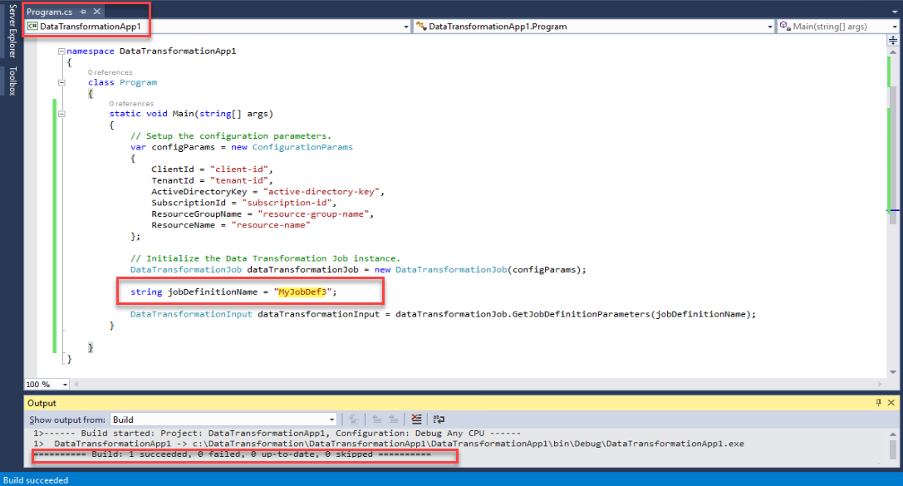
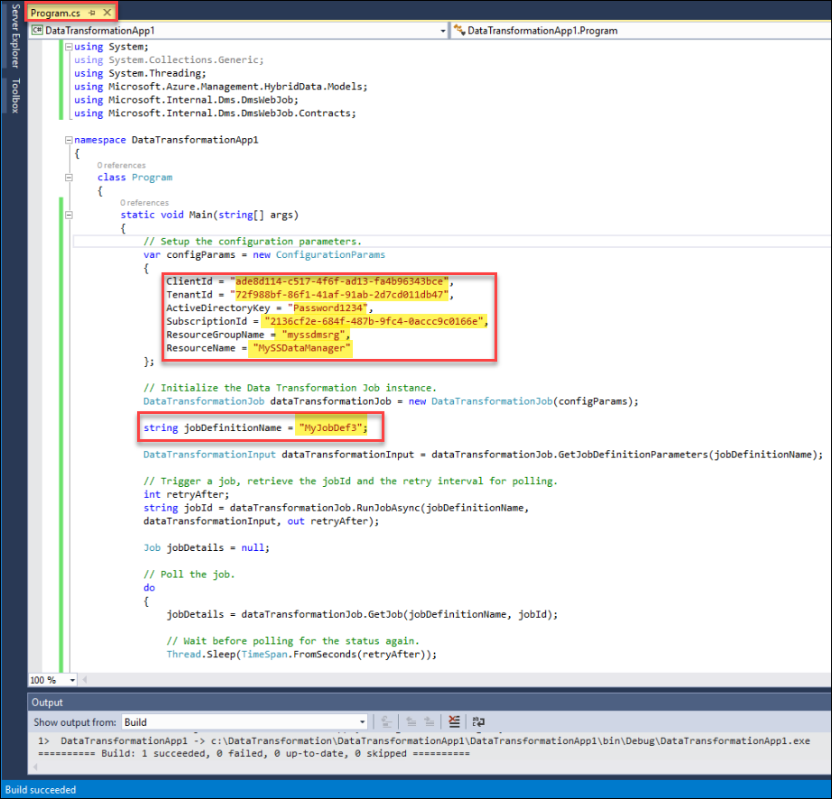

# Use the .NET SDK to initiate data transformation

## Overview

This article explains how you can use the data transformation feature within the StorSimple Data Manager service to transform StorSimple device data. The transformed data is then consumed by other Azure services in the cloud.

You can launch a data transformation job in two ways:

- Use the .NET SDK
- Use Azure Automation runbook
 
  This article details how to create a sample .NET console application to initiate a data transformation job and then track it for completion. To learn more about how to initiate data transformation via Automation, go to [Use Azure Automation runbook to trigger data transformation jobs](storsimple-data-manager-job-using-automation.md).

## Prerequisites

Before you begin, ensure that you have:
*	A computer running:

    - Visual Studio 2012, 2013, 2015, or 2017.

    - Azure Powershell. [Download Azure Powershell](https://azure.microsoft.com/documentation/articles/powershell-install-configure/).
*	A correctly configured job definition in StorSimple Data Manager within a resource group.
*	All the required dlls. Download these dlls from the [GitHub repository](https://github.com/Azure-Samples/storsimple-dotnet-data-manager-get-started/tree/master/Data_Manager_Job_Run/dlls).
*	[`Get-ConfigurationParams.ps1`](https://github.com/Azure-Samples/storsimple-dotnet-data-manager-get-started/blob/master/Data_Manager_Job_Run/Get-ConfigurationParams.ps1) script from the GitHub repository.

## Step-by-step procedure

Perform the following steps to use .NET to launch a data transformation job.

1. To retrieve the configuration parameters, do the following steps:
    1. Download the `Get-ConfigurationParams.ps1` from the GitHub repository script in `C:\DataTransformation` location.
    1. Run the `Get-ConfigurationParams.ps1` script from the GitHub repository. Type the following command:

        ```
        C:\DataTransformation\Get-ConfigurationParams.ps1 -SubscriptionName "AzureSubscriptionName" -ActiveDirectoryKey "AnyRandomPassword" -AppName "ApplicationName"
         ```
        You can pass in any values for the ActiveDirectoryKey and AppName.

2. This script outputs the following values:
    * Client ID
    * Tenant ID
    * Active Directory key (same as the one entered above)
    * Subscription ID

        

3. Using Visual Studio 2012, 2013 or 2015, create a C# .NET console application.

    1. Launch **Visual Studio 2012/2013/2015**.
    1. Select **File > New > Project**.

                
    2. Select **Installed > Templates > Visual C# > Console Application**.
    3. Enter **DataTransformationApp** for the **Name**.
    4. Select **C:\DataTransformation** for the **Location**.
    6. Click **OK** to create the project.

        

4. Now, add all dlls present in the [dlls folder](https://github.com/Azure-Samples/storsimple-dotnet-data-manager-get-started/tree/master/Data_Manager_Job_Run/dlls) as **References** in the project that you created. To add the dll files, perform the following:

   1. In Visual Studio, go to **View > Solution Explorer**.
   2. Click the arrow to the left of Data Transformation App project. Click **References** and then right-click to **Add Reference**.
    
       

   3. Browse to the location of the packages folder, select all the dlls and click **Add**, and then click **OK**.

       

5. Add the following **using** statements to the source file (Program.cs) in the project.

    ```
    using System;
    using System.Collections.Generic;
    using System.Threading;
    using Microsoft.Azure.Management.HybridData.Models;
    using Microsoft.Internal.Dms.DmsWebJob;
    using Microsoft.Internal.Dms.DmsWebJob.Contracts;
    ```
    
6. The following code initializes the data transformation job instance. Add this in the **Main method**. Replace the values of configuration parameters as obtained earlier. Plug in the values of **Resource Group Name** and **ResourceName**. The **ResourceGroupName** is the associated with the StorSimple Data Manager on which the job definition was configured. The **ResourceName** is the name of your StorSimple Data Manager service.

    ```
    // Setup the configuration parameters.
    var configParams = new ConfigurationParams
    {
        ClientId = "client-id",
        TenantId = "tenant-id",
        ActiveDirectoryKey = "active-directory-key",
        SubscriptionId = "subscription-id",
        ResourceGroupName = "resource-group-name",
        ResourceName = "resource-name"
    };

    // Initialize the Data Transformation Job instance.
    DataTransformationJob dataTransformationJob = new DataTransformationJob(configParams);
    ```
   
7. Specify the parameters with which the job definition needs to be run

    ```
    string jobDefinitionName = "job-definition-name";

    DataTransformationInput dataTransformationInput = dataTransformationJob.GetJobDefinitionParameters(jobDefinitionName);
    ```

    (OR)

    If you want to change the job definition parameters during run time, then add the following code:

    ```
    string jobDefinitionName = "job-definition-name";
    // Must start with a '\'
    var rootDirectories = new List<string> {@"\root"};

    // Name of the volume on the StorSimple device.
    var volumeNames = new List<string> {"volume-name"};

    var dataTransformationInput = new DataTransformationInput
    {
        // If you require the latest existing backup to be picked else use TakeNow to trigger a new backup.
        BackupChoice = BackupChoice.UseExistingLatest.ToString(),
        // Name of the StorSimple device.
        DeviceName = "device-name",
        // Name of the container in Azure storage where the files will be placed after execution.
        ContainerName = "container-name",
        // File name filter (search pattern) to be applied on files under the root directory. * - Match all files.
        FileNameFilter = "*",
        // List of root directories.
        RootDirectories = rootDirectories,
        // Name of the volume on StorSimple device on which the relevant data is present. 
        VolumeNames = volumeNames
    };
    ```

8. After the initialization, add the following code to trigger a data transformation job on the job definition. Plug in the appropriate **Job Definition Name**.

    ```
    // Trigger a job, retrieve the jobId and the retry interval for polling.
    int retryAfter;
    string jobId = dataTransformationJob.RunJobAsync(jobDefinitionName, 
    dataTransformationInput, out retryAfter);
    Console.WriteLine("jobid: ", jobId);
    Console.ReadLine();

    ```
    Once the code is pasted, build the solution. Here is a screenshot of the code snippet to initialize the data transformation job instance.

   

9. This job transforms the data that matches the root directory and file filters within the StorSimple volume and puts it into the specified container/file share. When a file is transformed, a message is added to a storage queue (in the same storage account as the container/file share) with the same name as the job definition. This message can be used as a trigger to initiate any further processing of the file.

10. Once the job has been triggered, you can use the following code to track the job for completion. It is not mandatory to add this code for the job run.

    ```
    Job jobDetails = null;

    // Poll the job.
    do
    {
        jobDetails = dataTransformationJob.GetJob(jobDefinitionName, jobId);

        // Wait before polling for the status again.
        Thread.Sleep(TimeSpan.FromSeconds(retryAfter));

    } while (jobDetails.Status == JobStatus.InProgress);

    // Completion status of the job.
    Console.WriteLine("JobStatus: {0}", jobDetails.Status);
    
    // To hold the console before exiting.
    Console.Read();

    ```
    Here is a screenshot of the entire code sample used to trigger the job using .NET.

    

## Next steps

[Use StorSimple Data Manager UI to transform your data](storsimple-data-manager-ui.md).
