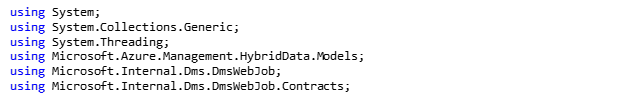
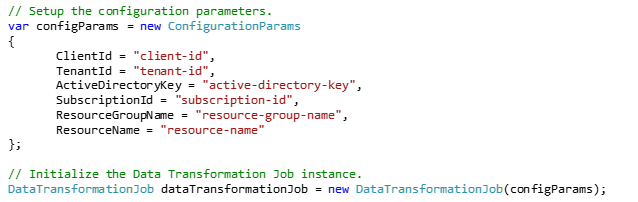
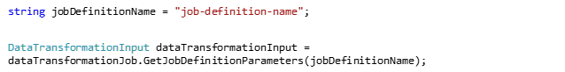
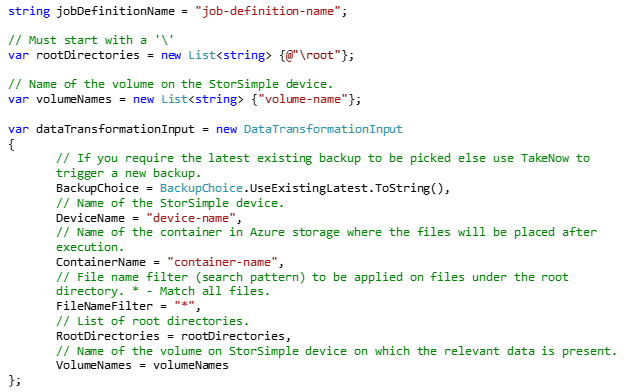
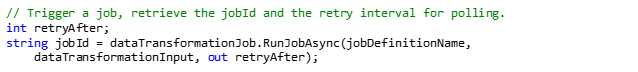
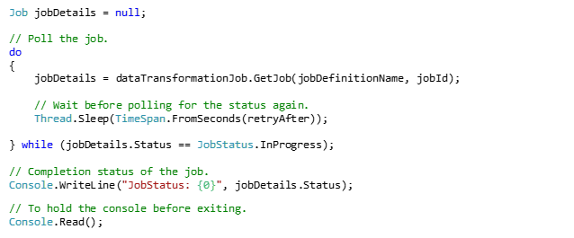

# Use the .Net SDK to initiate data transformation (Private Preview)

## Overview

This article explains how you can use the data transformation feature within the StorSimple Data Manager service to transform StorSimple device data. The transformed data is then consumed by other Azure services in the cloud. The article also has a walkthrough to help create a sample .NET console application to initiate a data transformation job and then track it for completion.

## Prerequisites

Before you begin, ensure that you have:
*	A system with Visual Studio 2012, 2013, or 2015 installed.
*	[Azure Powershell] is also installed. [Download Azure Powershell](https://azure.microsoft.com/documentation/articles/powershell-install-configure/).
*	Configuration settings to initialize the Data Transformation job (instructions to obtain these settings are included here).
*	A job definition that has been correctly configured in a Hybrid Data Resource within a Resource Group.
*	All the required dlls. Download these dlls from the [GitHub repository](https://github.com/Azure-Samples/storsimple-dotnet-data-manager-get-started/tree/master/Data_Manager_Job_Run/dlls).
*	`Get-ConfigurationParams.ps1` [script](https://github.com/Azure-Samples/storsimple-dotnet-data-manager-get-started/blob/master/Data_Manager_Job_Run/Get-ConfigurationParams.ps1) from the github repository.

## Step-by-step

Perform the following steps to use .NET to launch a data transformation job.

1. To retrieve the configuration parameters, do the following steps:
    1. Download the `Get-ConfigurationParams.ps1` from the github repository script in `C:\DataTransformation` location.
    1. Run the `Get-ConfigurationParams.ps1` script from the github repository. Type the following command:

        ```
        C:\DataTransformation\Get-ConfigurationParams.ps1 -SubscriptionName "AzureSubscriptionName" -ActiveDirectoryKey "AnyRandomPassword" -AppName "ApplicationName"
         ```
        You can pass in any values for the ActiveDirectoryKey and AppName.


2. This script outputs the following values:
        - Client ID
        - Tenant ID
        - Active Directory key (same as the one entered above)
        - Subscription ID

3. Using Visual Studio 2012, 2013 or 2015, create a C# .NET console application.

    1. Launch **Visual Studio 2012/2013/2015**.
    1. Click **File**, point to **New**, and click **Project**.
    2. Expand **Templates**, and select **Visual C#**.
    3. Select **Console Application** from the list of project types on the right.
    4. Enter **DataTransformationApp** for the **Name**.
    5. Select **C:\DataTransformation** for the **Location**.
    6. Click **OK** to create the project.

3.	Now, add all DLLs present in the [dlls](https://github.com/Azure-Samples/storsimple-dotnet-data-manager-get-started/tree/master/Data_Manager_Job_Run/dlls) folder as **References** in the project that you created. To download the dll files, do the following:

    1. In Visual Studio, go to **View > Solution Explorer**.
    1. Click the arrow to the left of Data Transformation App project. Click **References** and then right-click to **Add Reference**.
    2. Browse to the location of the packages folder, select all the DLLs and click **Add**, and then click **OK**.

4. Add the following **using** statements to the source file (Program.cs) in the project.

    

5. The following code initializes the data transformation job instance. Add this in the **Main method**. Replace the values of configuration parameters as obtained earlier. Plug in the values of **Resource Group Name** and **Hybrid Data Resource name**. The **Resource Group Name** is the one that hosts the Hybrid Data Resource on which the job definition was configured.

    

6. Specify the parameters with which the job definition needs to be run

    

    (OR)

    If you want to change the job definition parameters during run time, then add the following code:

    

7. After the initialization, add the following code to trigger a data transformation job on the job definition. Plug in the appropriate **Job Definition Name**.

    

8. This job uploads the matched files present under the root directory on the StorSimple volume to the specified container. When a file is uploaded, a message is dropped in the queue (in the same storage account as the container) with the same name as the job definition. This message can be used as a trigger to initiate any further processing of the file.

9. Once the job has been triggered, add the following code to track the job for completion.

    


## Next steps

[Use StorSimple Data Manager UI to transform your data](storsimple-data-manager-ui.md).