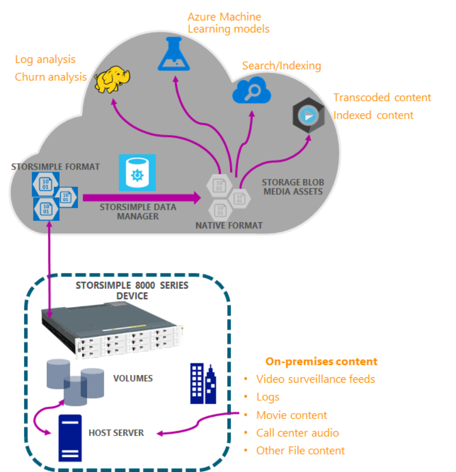
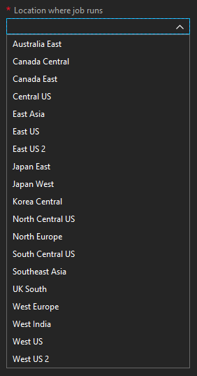
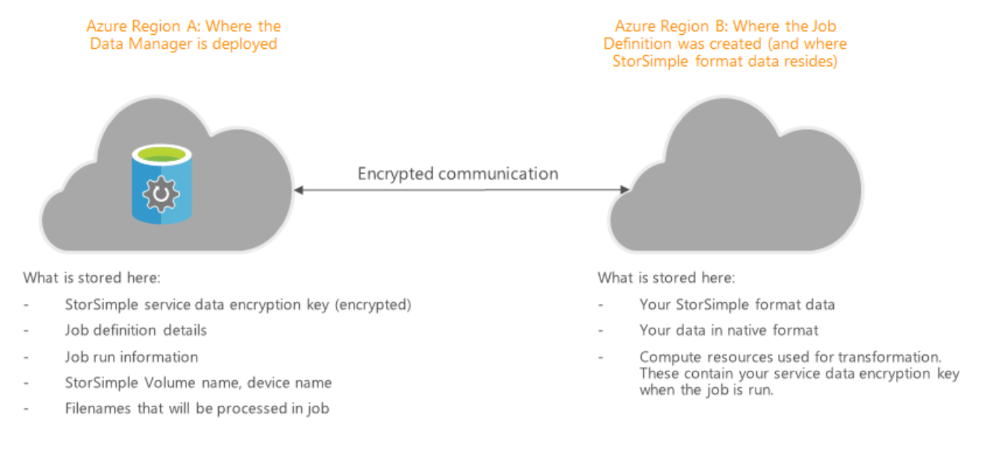

# StorSimple Data Manager solution overview

## Overview

Microsoft Azure StorSimple uses cloud storage as an extension of the on-premises solution and automatically tiers data across on-premises storage and the cloud. Data is stored in the cloud in a deduped and compressed format for maximum efficiency and to lower costs. As the data is stored in StorSimple format, it is not readily consumable by other cloud applications that you may want to use.

The StorSimple Data Manager enables you to seamlessly access and use the StorSimple format data in the cloud. It does this by transforming StorSimple format into native blobs and files, which you can use with other services such as Azure Media Services, Azure HDInsights, and Azure Machine Learning.

This article provides an overview of the StorSimple Data Manager solution. It also explains how you can use this service to write applications that use StorSimple data and other Azure services in the cloud.

## How it works?

The StorSimple Data Manager service identifies StorSimple data in the cloud from a StorSimple 8000 series on-premises device. The StorSimple data in the cloud is deduped, compressed StorSimple format. The Data Manager service provides APIs to extract the StorSimple format data and transform it into other formats such as Azure blobs and Azure Files. This transformed data is then readily consumed by Azure HDInsight and Azure Media services. The data transformation thus enables these services to operate upon the transformed StorSimple data from StorSimple 8000 series on-premises device. This flow is illustrated in the following diagram.

## Data Manager use cases

You can use the Data Manager with Azure Functions, Azure Automation, and Azure Data Factory to have workflows running on your data as it comes into StorSimple. You might want to process your media content that you store on StorSimple with Azure Media Services, or run a Machine Learning algorithm on that data, or bring up a Hadoop cluster to analyze the data that you store on StorSimple. With the vast array of services available on Azure combined with the data on StorSimple, you can unlock the power of your data.

## Region availability

The StorSimple Data Manager is available in the following 7 regions:

 - Southeast Asia
 - East US
 - West US
 - West US 2
 - West Central US
 - North Europe
 - West Europe

However, the StorSimple Data Manager can be used to transform data in the following regions. 

This set is larger because the resource deployment in any of the above regions is capable of bringing up the transformation process in the below regions. So, as long as your data resides in any one of the 19 regions, you can transform your data using this service.

## Choosing a region

We recommend that:
 - Your source storage account (the one associated with your StorSimple device) and target storage account (where you want the data in native format) be in the same Azure region.
 - You bring up your Data Manager and job definition in the region that contains the StorSimple storage account. If this is not possible, bring up the Data Manager in the nearest Azure region and then create the Job Definition in the same region as your StorSimple storage account. 

    If your StorSimple storage account is not in the 26 regions that support job definition creation, we recommend that you do not run StorSimple Data Manager as you see long latencies and potential egress charges.
    
Microsoft strives to ensure that Azure services are always available in all regions. However, unplanned service outages may occur for short periods in a certain region. In such cases, you can bring up a Data Manager and job definition in a region that is not affected by the outage, and run the transformation job. You might encounter some additional latency in such a scenario, but this can be your recovery strategy in the rare event of a regional outage.

## Security considerations

The StorSimple Data Manager needs the service data encryption key to transform from StorSimple format to native format. The service data encryption key is generated when the first device registers with the StorSimple service. For more information on this key, go to [StorSimple security](storsimple-8000-security.md).

The service data encryption key provided as an input is stored in a key vault that is created when you create a Data Manager. The vault resides in the same Azure region as your StorSimple Data Manager. This key is deleted when you delete your Data Manager service.

This key is used by the compute resources to perform the transformation. These compute resources are located in the same Azure region as your job definition. This region may, or may not be the same as the region where you bring up your Data Manager.

If your Data Manager region is different from your job definition region, it is important that you understand what data/metadata resides in each of these regions. The following diagram illustrates the effect of having different regions for Data Manager and job definition.

## Managing personal information

The StorSimple Data Manager does not collect or display any personal information. For more information, review the Microsoft Privacy policy at [Trust Center](https://www.microsoft.com/trustcenter).

## Known Limitations

The service currently has the following limitations:
- The StorSimple Data Manager currently does not work with volumes that are bitlocker encrypted. You will see job failures if you try to run the service with an encrypted drive.
- Some metadata of files (including ACLs) will not be retained in the transformed data.
- This service works only with NTFS volumes.
- File path lengths need to be less than 256 characters else the job will fail.

## Next steps

[Use StorSimple Data Manager UI to transform your data](storsimple-data-manager-ui.md).
